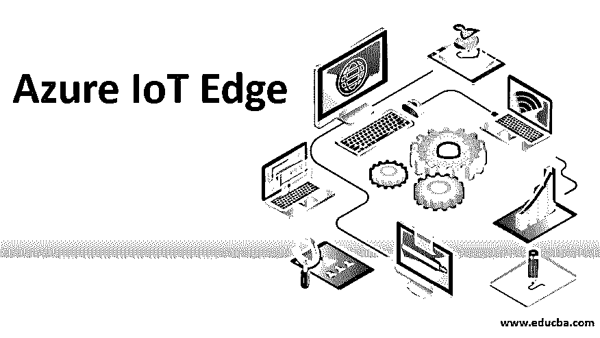

# 蔚蓝物联网边缘

> 原文：<https://www.educba.com/azure-iot-edge/>

## Azure IoT Edge 简介

在当今世界，IT 行业出现了许多时髦词汇。Azure、Cloud、IoT 都是其中的一部分。每个企业和组织都想成倍增长。在这个过程中对他们有很大帮助的技术在市场早期得到了繁荣。技术日新月异。一切都变得很快。从管理的角度来说，为了给顾客提供一个快速的解决方案，我们需要一些成本更低并且对组织有益的东西。现在，你知道 Azure 和 IoT 的概念了。现在是了解 Azure 物联网优势的时候了。

### 什么是 Azure IoT Edge？

这是两种技术的结合。Azure IoT Edge 是一个完全集成的平台。它提供由 Azure 物联网中心组成的服务。通过整合云平台和物联网，我们可以非常容易地在现实中实现人工智能。

<small>Hadoop、数据科学、统计学&其他</small>

#### Azure IoT Edge 的特性

*   整个世界将与物联网互联。
*   我们的决策能力会增强。在更短的时间内，我们可以实现许多事情
*   我们可以降低云管理的成本
*   与设备有限的个人丁分离，因此需要更少的带宽。
*   艾清楚地进入了画面
*   这就保证了微软的高安全性。
*   通过使用这项新兴技术，你可以离线获得许多东西。

### Azure 物联网边缘的需求

我们可以利用云做很多事情。比如远程监控、管理、合并远程存储在多个物联网设备上的。数以百万计的设备部署在那里，我们可以很容易地管理它们。我们可以在云的帮助下集中管理它们。

我到底是如何进入这个世界的？物联网离我们的机器很近。对于在物联网上相互通信的设备，我们需要紧密绑定实时环路的东西。在 AI 和 ML Azure IoT 的帮助下训练这些模型帮助不大。

正如我们已经说过的，离线是这里的另一个用例。假设你在船上或采矿平台上工作，这个场景就会出现。你没有连接到互联网。你的方法是什么？在这里，Azure IoT 允许您在不连接到云的情况下成功执行所有活动。有了这个神奇的东西，猜猜它还能给你带来什么安全。

因此，这里的主要功能是让您的处理尽可能接近您的机器。Azure IoT edge 可以做到这一点。这一切都是为了保持我们的云平台和物联网设备之间的一致性。

**举例:**

假设我们有一个运行在云上的应用程序。与此同时，我们需要物联网边缘应用的一部分，反之亦然。如果我们在云和边缘之间有一致性，我们实际上可以做到这一点。

### 为此我们需要哪些技能？

这项技术的目的非常明确。首先，你要了解云平台。与云相关的技能。它是如何工作的。在开发领域工作的人可以通过云提升他们的知识。

### 那么云是什么呢？

在这里，我们得到了实际云的概念。云是一种东西，我们走到哪里，它就跟到哪里。到处都是如此。

当我们感觉到数据访问限制时，这个概念就出现了。我们需要远程使用我们的数据。无论我们去哪里，我们都可以访问我们的数据，这样我们的工作就不会停滞不前。因为我们都在努力让客户满意，所以按时完成工作非常重要。

在云计算场景中，云只不过是服务器。每个人都负担不起服务器的成本和维护。为了解决这个问题并使一个系统在全世界都可用，这个服务器把它们的空间租给不同的客户机。和管理他们的数据。这种服务对很多 IT 行业都是很有帮助的。这种方法被大公司采用。它们进化而来，拥有不同的云平台。

现在来说说 Azure 和 IoT。

### 什么是 Azure？

Azure 的意思是明亮的蓝色。这完美地定义了云的概念。Azure 就是云平台。这项服务由微软提供。Microsoft Azure 是一种基于云的在线服务，提供了一个平台来帮助组织测试、部署、构建和管理微软数据中心的应用程序。从高可用性和管理的角度来看，微软 Azure 已经成为一个非常受欢迎的云服务平台。

现在，我们有了蓝色的概念。先说新兴技术物联网。

### IoT 是什么？

IoT 代表[物联网](https://www.educba.com/what-is-iot/)。正是这种技术更有效地扩展了互联网的使用。在一个时间点有许多设备与互联网连接。物联网意味着这些设备可以相互交谈，并向用户提供所需的输出。

让我进一步澄清这一点。

*   假设，我们家里有一些智能设备，比如手机。冰箱、空调、洗衣机等。如果我们可以通过手机处理所有这些设备会怎么样。只需一个命令，所有这些设备都可以启动和停止，还可以指示这些设备上是否存在一些问题。我们可以节省时间，早期故障检测有助于我们摆脱困境。
*   这样，我们就可以在人工智能的帮助下建立一个智能的混合模型。
*   Edge 为您提供系统的本地视图。为了将系统的所有部分相互连接起来，云就扮演了这个角色。这是连接所有边缘的云的最重要的部分。
*   之后，我们可以通过互联云架构获得所有应用的董事会视图。这有助于管理层实现更好的功能。

实现 Azure 物联网边缘有一些设计原则:

1.  安全性
2.  云管理/云中心
3.  跨平台能力
4.  它应该是便携的
5.  可扩张的

### 结论

Azure IoT Edge 是技术的未来。一切都将在几秒钟内发生，世界也将变得更加紧密。从云计算的概念开始。在这个瞬息万变的科技世界里，这一小步肯定会在未来拯救你。

### 推荐文章

这是 Azure 物联网边缘指南。这里我们讨论一下什么是 azure IoT edge？以及 azure 物联网边缘的功能和需求。您也可以阅读以下文章，了解更多信息——

1.  在 Azure 工作所需的教育背景
2.  [如何在 Azure 中管理表格？](https://www.educba.com/tables-in-azure/)
3.  [Azure 备份完整指南](https://www.educba.com/azure-backup/)
4.  [软件设计原则指南](https://www.educba.com/software-design-principles/)

