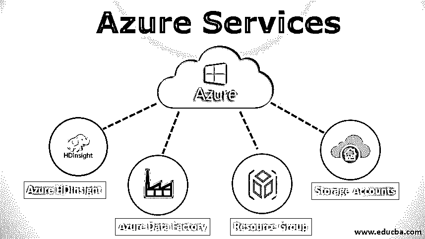

# Azure 服务

> 原文：<https://www.educba.com/azure-services/>

## Azure 服务简介

在这篇文章中，我们将看到 Azure 服务的概要。在当今世界，每天都会产生大量数据，用于存储和更快地处理数据，以获得业务洞察力，并通过应用机器学习和统计算法来改进业务战略。为了存储如此大量的数据，组织需要创建和维护本地数据中心，这将产生巨大的成本。为了降低成本和便于维护，任务组织正在将他们的数据转移到云中。

### 前 3 名 Azure 服务

微软 azure 在云计算领域处于领先地位。Azure 提供各种服务，分为 3 种类型:

<small>Hadoop、数据科学、统计学&其他</small>

1.  IAAS(基础设施即服务)
2.  PAAS(平台即服务)
3.  SAAS(软件即服务)

#### 1.IAAS(基础设施即服务)

在 IAAS，计算平台、虚拟网络、存储等基础设施将由微软提供。客户端将完全控制基础架构，并且可以根据需求增加或减少存储容量和计算能力。这有助于组织节省本地群集维护成本，并提供顺畅的处理。

**示例:**虚拟机或存储帐户等。

#### 2.PAAS(平台即服务)

在 PAAS，根据客户要求的平台通过网络交付。所有软件维护活动，如操作系统更新、软件更新、基础设施和存储都由微软维护。客户不需要担心平台维护，只需要专注于软件开发部分。它允许在平台之上开发应用程序，并使其具有可伸缩性和高可用性。这种类型的服务还有助于将应用从传统平台迁移到云平台。

**例子:** HDInsight 集群、操作系统等。

#### 3.SaaS(软件即服务)

在 SaaS，有一些应用程序作为服务提供，通常用于商业目的。应用服务通过互联网提供，这有助于减少维护、下载、安装等工作。这些类型的应用程序通常由一个中心位置托管，并可通过互联网访问。

**举例:** MS Outlook 和 MS Office 是最常用的软件即服务。

### 常用的 Azure 服务

微软 Azure 云为你可能需要的几乎任何场景提供了大量工具。下面列出了最常用的 Azure 服务:

#### 1.Azure 高清洞察

*   它是微软提供的基于云的服务[，是基于 Hortonworks 数据平台之上的托管集群，包括 Spark、Oozie、Sqoop、Hive、Pig、Ambari、HBase 等 Hadoop 工具的实现。HDInsight 默认使用 blob 作为存储服务，但也可以配置为使用 ADLS 和 ADLS gen2。它高度可用，并支持可伸缩性、自动伸缩、基于角色的访问控制、身份验证等特性。](https://www.educba.com/cloud-computing-service-providers/)
*   它还可以很好地集成报告工具，如 PowerBi、Zeppelin、Tableau、Apache DBeaver 等。它还支持趋势技术，如机器学习和物联网等，允许企业开发大数据应用程序并处理海量数据，而无需任何技术人员来管理本地集群等。它允许组织只需要专注于应用程序开发，而不是维护集群。

#### 2.Azure 数据工厂(ADF)

*   Azure data factory 是一种用于以管道形式部署端到端工作流的服务。开发者可以通过整合 azure cloud 提供的独立服务，如 storage、HDInsight cluster、SQL server 等，创建一个管道。数据工厂中提供了各种拖放活动来连接 hive、spark 等。它们的活动可以配置为以不同的类型清理、转换或屏蔽数据。他们的管道支持有条件的、非理性的和查找服务，这些服务有助于构建管道。
*   管道可以基于事件触发，也可以按时调度。Data Factory 提供了 azure preview canvas，您可以在其中看到管道布局，并可以跨管道分别建立源和接收器之间的关系和依赖关系。它可以与 Azure SQL Server、用于 MySQL 的 Azure 数据库、blob 和 ADLS 等存储进行交互，这有助于非常平稳地将应用程序从遗留系统迁移到云。数据工厂还允许在运行时创建计算集群 HDInsight 或数据块，以避免不必要的旋转成本。

#### 3.资源组

Azure resource group 是一项服务，有助于将部署 Azure 解决方案所需的所有资源保留在一个组中。在资源组中，存储帐户、集群、逻辑应用、功能应用、SQL 服务器等资源被分组，以便从一个位置维护和部署它们。

#### 4.存储帐户

谈到云上的数据存储，Azure storage account 是一个关键的参与者。它提供了一种随用随付的功能，只需支付用于数据的资源成本。它的容量可以无限扩大。用于以 blob、表、文件或队列的形式存储数据的存储帐户。

*   Blob 存储可用于存储非结构化数据，如图片、原始数据或半结构化数据，如 CSV 或 XML 文件。他们的文件存储在一个类似目录的结构中，叫做容器。
*   Azure tables，顾名思义，就是以表格的形式存储数据。这些表是 NoSQL 表，即遵循无模式类型的结构。这些表可以非常容易地创建，并且可以在提供的 URL 的帮助下用代码访问。它在后端以键、值的形式存储数据。
*   Azure 文件存储主要用于遗留系统的文件服务器需要迁移的时候。它将数据存储在一个文件共享上，该文件共享可以作为 azure VM 上的本地目录安装，并且可以由使用 Rest-API 的本地应用程序访问。
*   Azure queues，顾名思义，用于对消息进行排队，在应用程序内传输消息。该流程可以与队列进行交互，提取消息，执行所需的操作，并可能将结果保存在存储或数据库中。

### 结论

因此，Azure Services 通过在大量数据上开发大规模大数据解决方案，以更快的处理速度并在机器学习、人工智能和统计算法的支持下，帮助企业改善其业务战略。

### 推荐文章

这是 Azure 服务指南。在这里，我们讨论了基本概念，我们还看了 Azure，它提供了广泛的服务，如 IAAS、PAAS、SAAS。您也可以浏览我们推荐的其他文章，了解更多信息——

1.  [微软 Azure vs 亚马逊网络服务](https://www.educba.com/microsoft-azure-vs-amazon-web-services/)
2.  [Azure 优势介绍](https://www.educba.com/advantages-of-azure/)
3.  [Azure 的 8 大替代方案](https://www.educba.com/alternatives-to-azure/)
4.  [微软 Azure 十大面试问题](https://www.educba.com/microsoft-azure-interview-questions/)

