# Azure 存储帐户

> 原文：<https://www.educba.com/azure-storage-account/>

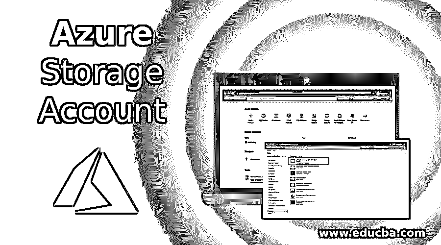

## Azure 存储帐户简介

微软 Azure 允许开发人员将数据存储在云中，因为它为存储在 Azure 存储中的数据提供了安全性、持久性和可扩展性。azure 存储帐户是一个存储库，它将一组 Microsoft azure 存储服务结合在一起，用户可以一起管理这些服务。azure 存储帐户可以存储所有类型的数据，如 blobs、文件、队列、表和磁盘。由于存储是可扩展的，其容量可以根据需要增加，并且由于采用了按需购买模式，因此可以灵活地为您使用的资源付费。通过使用 HTTP 或 HTTPS，可以从任何地方远程访问此存储，并且存储帐户拥有自己唯一的 azure 存储数据命名空间。

### 为什么我们需要 Azure 存储帐户？

Azure storage 提供了一个基于云的存储系统，我们需要这些存储帐户:

<small>Hadoop、数据科学、统计学&其他</small>

*   **弹性和高可用性:** Azure storage 可应对任何硬件故障事件。此外，还有一个跨数据中心进行数据复制的选项，作为对任何系统故障的保护。随着数据在数据中心的复制，数据高度可用。
*   **安全性:**azure 存储中的数据也非常安全，因为数据是以加密形式写入的。为了控制谁可以访问数据，azure 为用户提供了细粒度的控制。
*   **可扩展性:**在当今时代，数据是在不同的来源中创建的，为了存储这些数据，存储系统需要具有高度的可扩展性，而 Azure storage 提供了可扩展性，因此用户存储系统的容量可以按需增加。
*   **管理和维护:**微软 Azure 自我更新，处理维护和修复关键问题。因此，维护期间不会出现停机。
*   **可访问性:**通过使用 HTTP 或 HTTPS，可以在世界任何地方访问 Azure 存储帐户的数据。

除了上面提到的，微软 azure storage 还有很多语言的库，比如。NET、Java、Node.js、Python、PHP、Ruby、Go 等。它还支持 Azure CLI 或 Powershell 进行脚本编写。

### 如何创建 Azure 存储帐户？

在这里，我们将逐步学习如何使用 azure 门户创建 Azure 存储帐户。

**步骤 1:** 使用您的电子邮件 id 和密码登录 azure 门户。

网址:https://portal.azure.com/learn.docs.microsoft.com

**第二步:**下面 Azure 门户主页将被打开。

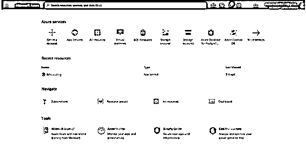

**步骤 3:** 从 Azure 门户的 Azure 服务面板中选择创建资源。

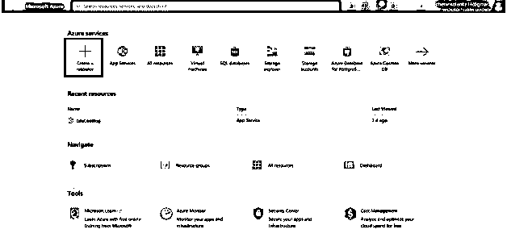

**步骤 4:** 从 Azure Marketplace 页面右侧选择存储，如下图所示。
T3】

**第五步:**通过选择左侧存储页面，将打开特色服务，从页面中选择存储帐户。

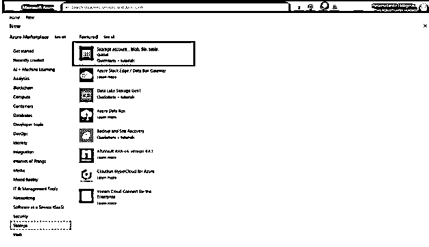

**步骤 6:** 将打开 Microsoft StorageAccount-ARM 页面，其中包含用于创建存储帐户的配置选项。

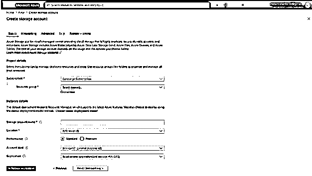

**第 7 步:**输入项目详细信息，创建存储帐户，如下所示:

*   **存储帐户名:**输入要生成访问的公共 URL 的名称，名称必须是 3 到 24 个字符。
*   **位置:**输入您的位置，如美国中部、印度中部等。
*   **性能:**从标准和高级选项中选择标准。
*   **帐户种类:**选择 StorageV2(通用 V2)帐户种类，以访问最新功能和价格。
*   **复制:**选择复制作为本地冗余存储(LRS)以确保高可用性
*   **接入层:**接入层有热和冷两个选项。选择热访问纽带，因为它是频繁访问数据的理想选择。

在“基本”选项卡中输入上述详细信息:

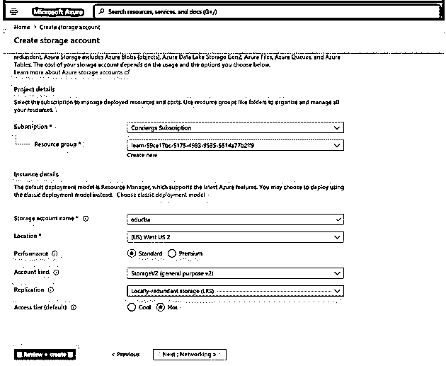

**步骤 8:** 配置网络选项卡选项如下。

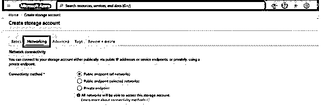

选择连接方法作为公共端点(所有网络)这允许用户隔离 azure 虚拟网络上的存储帐户。

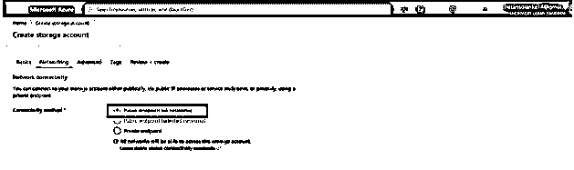

**步骤 9** :现在进入高级选项选项卡，配置高级选项，如下图所示。

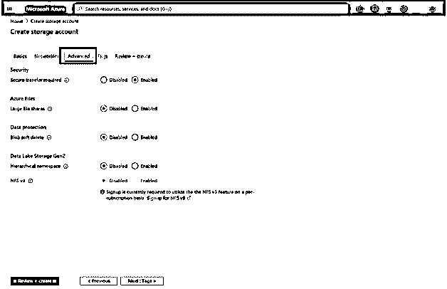

在高级选项卡中设置以下参数:

*   **需要安全传输:**选择此选项启用。这将允许所有客户端使用 SSL (HTTPS)来访问存储帐户中的数据。
*   **大文件共享:**将此选项设置为禁用。与 Azure 存储一样，用户可以共享高达 100TB 的数据。
*   **Blob 软删除:**将此选项设置为禁用。软删除允许用户恢复数据。
*   **数据湖存储 Gen2:** 将此选项设置为禁用*。*该选项提供给[处理大数据](https://www.educba.com/what-is-big-data/)应用。

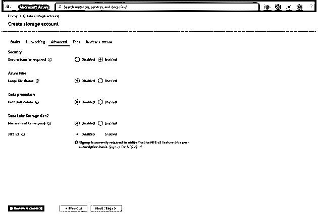

**第十步:**选择查看+创建选项，查看设置。进行验证并检查所有必填字段是否已填写。它将消息显示为通过验证的标题。

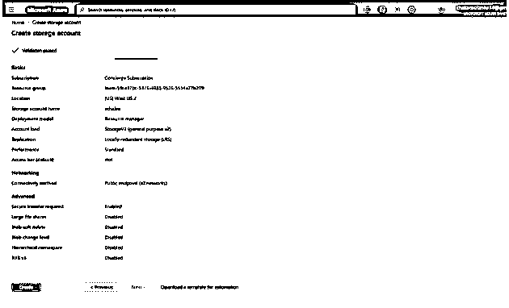

**第 11 步:**点击创建按钮，创建存储账户。它将显示以下屏幕，因为部署模型需要几分钟时间:

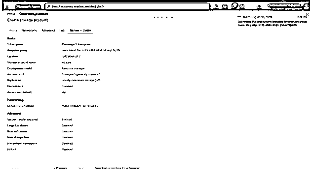

成功创建帐户并完成部署后，用户将看到以下屏幕。

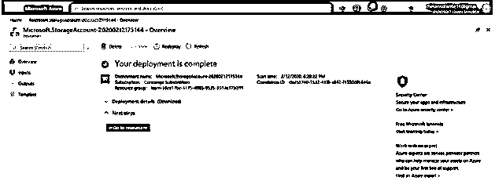

单击“转至资源”按钮，您可以验证存储帐户是否已创建，如下所示。

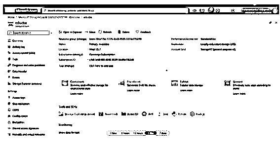

### Azure 存储帐户的类型

Azure storage 在云中存储数据，为此，它根据功能和价格提供了几种类型的存储帐户。要创建存储帐户，用户需要考虑与每个帐户相关的因素。

**1。通用 v2 帐户:**这是一种基本的帐户类型，支持 Blob、文件、队列、表、磁盘和第二代数据湖等服务。它支持性能层，即标准和高级。它提供最低的每千兆字节存储价格。

**2。通用 v1 帐户:**这是一种遗留帐户类型，支持 Blob、文件、队列、表和磁盘等服务。它没有最新的功能或最低的价格。此类型仅支持 Azure 资源管理器部署模式，这是一种经典的部署模型。它还支持性能层标准和高级。

**3。BlockBlobStorage accounts:** 这是一个高级性能，只为块 blob 和附加 blob 的非结构化对象数据提供服务支持。它用于高事务率或低存储延迟的情况。此帐户类型不支持分层到热、冷或归档访问层。

**4。文件存储帐户:**这是一个具有高级性能层的专用文件存储帐户。它主要用于高性能规模应用。

**5。BlobStorage accounts:** 这种类型只支持 Blob 帐户的服务，它有时使用通用的 v2 帐户，并具有标准的性能特征。

### 结论

总之，我们在这里学习了如何创建存储帐户。根据需求，我们可以配置存储帐户，也有不同类型的 Azure 存储帐户来满足用户的需求。我们还创建了一个 Azure 存储帐户，并验证该帐户是否创建成功。Azure storage 在一个帐户中提供不同的服务，可以从世界上任何地方远程访问。

### 推荐文章

这是 Azure 存储帐户指南。这里我们讨论一下简介，类型，为什么我们需要 azure 存储帐户，以及如何创建 Azure 存储帐户？您也可以看看以下文章，了解更多信息–

1.  [Azure 组件](https://www.educba.com/azure-components/)
2.  [什么是缓冲区溢出？](https://www.educba.com/what-is-buffer-overflow/)
3.  [Azure 中的表格](https://www.educba.com/tables-in-azure/)
4.  [Azure 备份完整指南](https://www.educba.com/azure-backup/)

