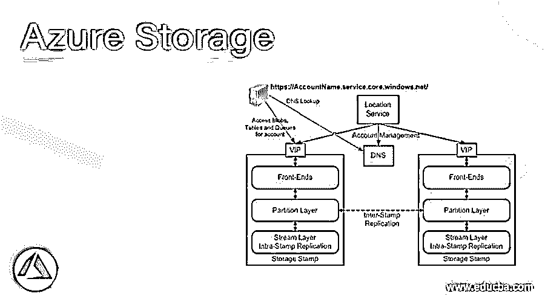
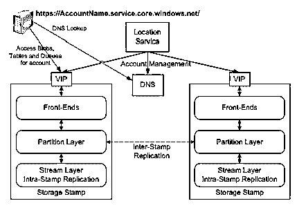
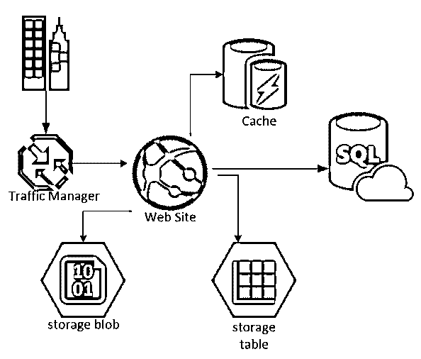

# Azure 存储

> 原文：<https://www.educba.com/azure-storage/>

## Azure 存储架构

Azure 存储有两个主要组成部分，它们是——存储戳和位置服务。每个存储印记由一组存储节点机架组成。每个机架都有自己的故障域，机架的数量会因各种因素而异。在使用定位服务将数据重新定位到不同的戳记后，存储戳记的利用率可以达到 70%。

位置服务通常分布在全球各地，这些服务负责存储戳记管理。该服务包括将存储帐户映射到存储戳记、命名空间管理以及添加新的存储戳记。创建新的存储帐户后，此定位服务会将存储帐户映射到主存储标记，并更新 DNS，以便它可以指向虚拟 IP。除此之外，元数据存储也由位置服务处理。

<small>Hadoop、数据科学、统计学&其他</small>

存储戳记可以是以下类型:

1.  前端层
2.  分隔层
3.  河流层

**1。前端层**

这包括无状态的服务器。这些服务器的主要职责是通过查找帐户名和授权请求来服务传入的请求。它的职责还包括将请求转发给相关的服务器。除了这些任务之外，这一层还有助于缓存数据。

**2。分隔层**

分区层管理抽象并跟踪对象表中的存储对象。隔离层主要有三个组成部分，它们是

*   **分区管理器**

这负责将对象表分成范围分区，并且它还跟踪映射表。

*   **分区服务器**

它负责在分区管理器的口述下满足范围分区的请求。

*   **锁服务**

该组件选择分区管理器并将租约分配给服务于特定范围分区的分区服务器。

**3。河流层**

这一层将数据存储在磁盘中，并为分区层提供接口。这些数据可以分布以平衡负载，也可以跨服务器复制以实现冗余。

流层主要由两部分组成，分别称为扩展节点和流管理器。

*   **极端节点**

这些是具有扩展副本及其块的节点。然而，极端节点不知道抽象，而是通过将每个范围视为单独的文件来管理范围。它还跟踪数据块和索引，将数据偏移与文件位置一起映射到相应的数据块。范围节点跟踪范围和对等副本。

*   **流管理器**

它是一个标准的集群，跟踪流名称空间。它还跟踪盘区到流的映射以及盘区的分布。流管理器轮询极端节点并相应地检查符合性。

如果流管理器检测到扩展区存储在更少的极端节点中，则到极端节点的惰性复制开始跨容错域传播。河流层的最小单位是范围，范围由小块组成。另一方面，块是读写数据的最小单位。

### Azure 存储复制

Azure 中有两种复制——时间戳内复制和时间戳间复制。

*   **时间戳间复制:**由分区层处理的异步复制，如果发生任何灾难或灾难，它有助于地理冗余。整个增量更改被复制到不同的标记，这有助于灾难恢复。
*   **Stamp 内复制:**Stamp 层处理的异步复制。它确保磁盘、服务器或机架故障期间的数据冗余。块是复制的单位，构成存储对象。

除此之外，还有一些其他重要的组件，它们有助于 Azure 存储的容错的出色性能，它们如下:

*   读取负载平衡
*   日志
*   纺锤体抗饥饿

由于后端有这么多东西，Azure 确保系统不仅容错，而且在性能和可维护性方面也是一致的。

### 什么是 Blob 存储？

在进入 Azure BLOB 存储的定义之前，我们首先需要了解什么是 BLOB 存储。BLOB 代表二进制大对象，这种类型的存储通常用于存储图像、视频等媒体。微软提供了三种 BLOB 存储；它们如下:

*   块斑点
*   附加斑点
*   页面 BLOBS

### BLOB 存储正在工作

Block BLOB 用于上传和存储大量数据。附加 BLOB 用于优化任何操作，因此 lot 提高了系统效率。页面 BLOB 用于分页和上下文切换目的，这允许随机读写操作加速。

### 为什么使用 Blob 存储？

使用 BLOB 存储有多种原因，包括减轻网站负担或与其他用户共享文件。在 Azure BLOB 中，它提供持久的数据存储，这是非常关键的。有了 Azure 云服务，用户可以轻松地在虚拟机中执行他们的代码，而不必担心自己管理这些虚拟机。Azure 虚拟机中的硬盘不是持久的。由于这个原因，任何文件的长期使用都需要放在持久存储中，这就是 BLOB 在这个上下文中很重要的原因。

让我们从微软 Azure 存储服务开始，它是 BLOB 存储，以及 Windows Azure 表和 Windows Azure 队列。Azure Table 以键值格式存储数据，Azure Queue 服务提供消息传递功能。然而，Azure 服务帐户需要使用任何这些服务。你可以参考 Azure 官方网站，了解如何创建 Azure 帐户以便使用这些服务的详细信息。

简言之，BLOB 存储用于以下情况:

*   向浏览器提供图像或视频等媒体
*   用于分布式访问的文件存储
*   日志管理
*   用于灾难管理的数据存储

但是，普通文件存储用于以下情况:

*   将图像文件上的普通文档存储在本地存储器中
*   所有提升和移动应用
*   简单云开发

### 推荐文章

这是 Azure 存储指南。这里我们讨论一个 Azure 存储架构，工作，什么是 blob 存储？为什么使用 BLOB 存储？.您也可以浏览我们的其他相关文章，了解更多信息——

1.  [天蓝色钥匙金库](https://www.educba.com/azure-key-vault/)
2.  [Azure 数据块](https://www.educba.com/azure-databricks/)
3.  [Azure 队列存储](https://www.educba.com/azure-queue-storage/)
4.  [Azure 桌面储物](https://www.educba.com/azure-table-storage/)

