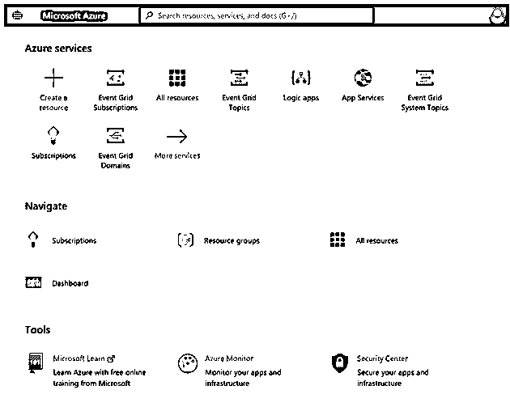
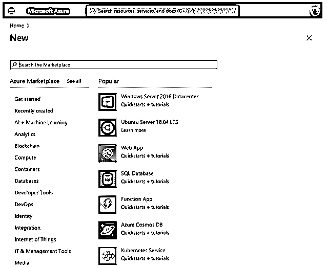
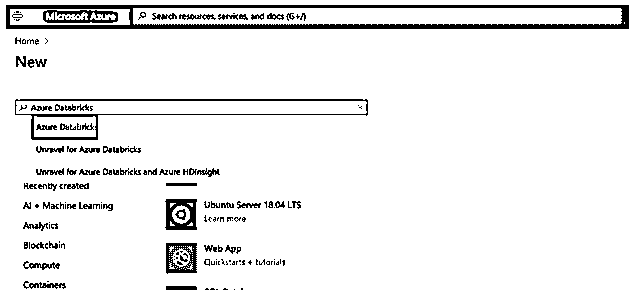
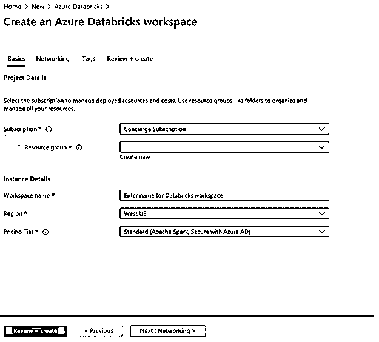
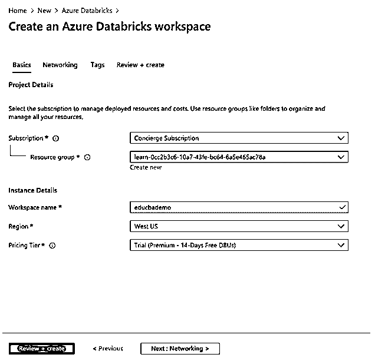
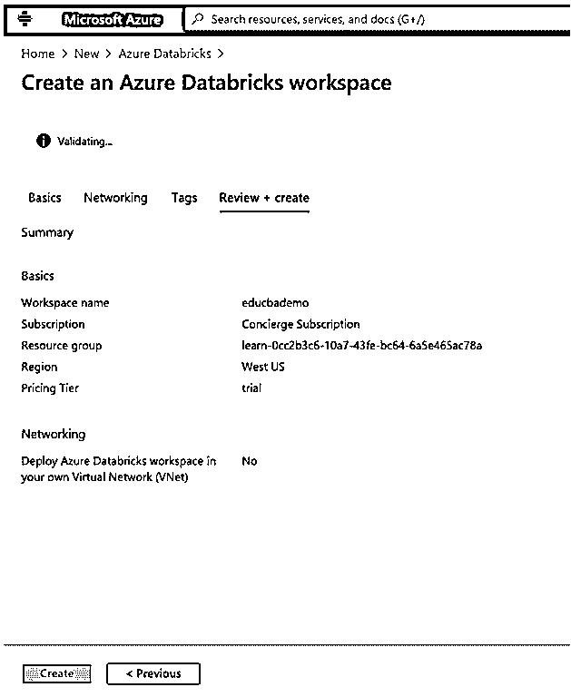
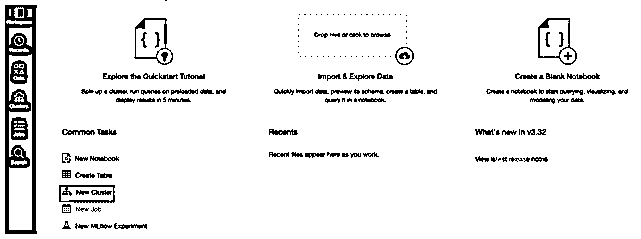
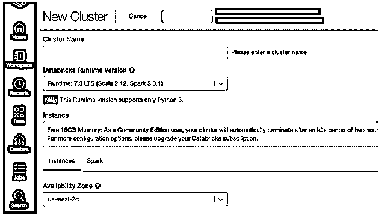
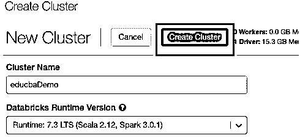
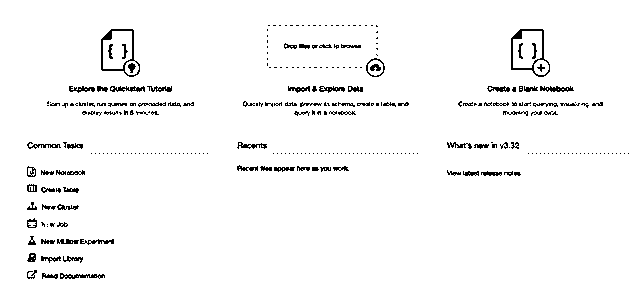

# Azure 数据块

> 原文：<https://www.educba.com/azure-databricks/>

## 什么是微软 Azure Databricks？

微软 Azure databricks 是一个全平台托管服务，它是一个基于 apache spark 的分析平台，被用作微软 Azure 云服务。Databricks 使用 apache-spark，因此它快速而简单，可用于生成大数据管道，以将数据接收到 Azure 数据工厂中。Azure databricks 与其他 Azure 云服务集成，使用 azure 门户网站进行一键式设置，azure databricks 还支持简化的工作流和交互式工作区，帮助开发人员、数据工程师、数据分析师和数据科学家进行协作。

### 微软 Azure Databricks 是如何工作的？

Azure databricks platform 是第一方微软服务，因为它与 Azure 进行了本机集成，为工程和数据科学家团队提供了最佳平台。Azure databricks 与 apache spark 相结合，为数据分析提供快速简便的云服务。为了生成端到端的数据管道，使用 azure 数据工厂服务将数据(原始数据或结构化数据)批量摄取到 azure 中，或者使用 Kafka、event hub 或 IoT hub 进行流式传输，这些数据主要来自不同的来源，如 SFTP、MySQL 或 CSV/JSON 格式文件等。这些数据在持久存储或 azure blob 或 azure 数据湖存储中无限期地被接收和加载到数据湖中。

<small>Hadoop、数据科学、统计学&其他</small>

Azure databricks 可以从 azure blob、azure data lake、cosmos DB 或 Azure SQL 数据仓库等来源读取数据，用户、开发人员或数据科学家可以通过使用 apache spark 进行处理来对这些数据进行业务洞察。

下面是 Azure Databricks 中使用的组件的简要说明:

*   **data bricks 中的 Apache Spark:**它提供了一个零管理的云平台，具有用于数据可视化和分析的交互式工作区。
*   Databrick 运行时:它是为基于 apache spark 的 azure 云构建的。databricks 有一个“无服务器”选项，消除了根据数据设置和配置 databricks 的基础架构复杂性，这有助于数据科学家。作为支持数据工程师管理工作表现的一部分。Databricks 有一个 spark 引擎，它在 I/O 层和处理层进行了多项优化，也称为“Databricks I/O”。
*   **协作工作区:**使用协作环境 azure databricks 可以设置探索数据和运行 spark 应用程序的流程。工作区中使用的文档或笔记本可以是 r、python、scala 或 SQL，它们使用 spark 引擎与数据进行交互。
*   **Databricks 企业安全性:** Azure databricks 拥有企业级安全性，如 Azure 目录集成、基于角色的控制以及保护定义的业务。

### 如何在 Azure 中创建和使用 Databricks？

**先决条件:**在学习创建 azure databricks workspace 之前，用户必须拥有 azure 订阅，以便您可以使用有效的凭据登录 Azure 门户并创建 azure databricks workspace。

#### 使用 Azure 门户的步骤

这里我们讨论使用 Azure portal 的步骤:

##### 1.创建 Azure Databricks 工作区

**步骤 1:** 使用以下 URL 登录 Azure 门户:

[https://portal.azure.com/learn.docs.microsoft.com](https://portal.azure.com/learn.docs.microsoft.com)

**步骤 2:** 从 azure 门户主页选择+创建资源。

**步骤 3:** 在 azure marketplace 的搜索字段中搜索 azure databricks，然后点击 enter 打开 azure databricks 创建页面:

**步骤 4:** 从 azure 数据块页面选择创建:

**T2】**

 ****步骤 5:** 在创建 azure databricks 工作区时，用户需要输入项目详细信息:

**步骤 6:** 输入新堡垒的详细信息，如下所示:

*   **订购**:从下拉列表中选择您订购的计划。
*   **资源** **组**:选择要创建堡垒的资源组。
*   **工作区名称**:输入数据块工作区实例的唯一名称。
*   **地点:**从下拉列表中选择地区/地点。
*   **定价等级:**从下面的下拉列表中选择定价等级，这是三个定价等级(出于演示目的，我选择了 14 天免费)。

**第 7 步**:选择 review+create，然后在页面中点击 create，部署工作区:

#### 2.创建一个集群

**步骤 8:** 从 Azure 门户创建工作空间后，选择您创建的 databricks 工作空间，然后单击启动工作空间。

**步骤 9:** 启动完成后，azure databricks 门户将打开，并从门户中选择一个新集群:

**步骤 10:** 现在，在 new cluster 页面上输入值以创建一个集群:

在创建新集群时，将提示用户一些其他值:

*   输入集群的名称。
*   提供工人类型和司机类型用户可以选择运行时版本。

**步骤 11:** 点击 create cluster 创建一个新的集群:

**第 12 步:**一旦集群运行，用户就可以通过点击 azure 数据块在集群中附加笔记本或创建新笔记本。

*   用户可以选择新笔记本来创建新笔记本
*   导入或导出数据。

### Azure 数据块的使用

azure 数据块的使用如下所示:

*   **快速数据处理:** azure databricks 使用 apache spark 引擎，与其他数据处理引擎相比速度非常快，而且它支持各种语言，如 r、python、scala 和 SQL。
*   **优化的环境:**它经过优化以提高性能，因为它在云中具有高级查询优化和成本效率，因为它在 azure 上运行时将成本降低了 10-100 倍。
*   **与其他 azure 服务的集成:**它与诸如 blob、cosmos DB 等 Azure 数据库和存储无缝且深度集成。
*   **企业安全:** azure databricks 使用 azure active directory 和 Azure cloud 基于角色的访问控制系统，具有企业级的安全性。

### 结论

总之，用户可以使用 Azure databricks 服务来获得更多的业务和数据洞察力，因为使用 apache spark 将减少安全和管理方面的麻烦，并且数据处理将快速而低延迟。

### 推荐文章

这是 Azure Databricks 的指南。在这里，我们还讨论了微软 azure databricks 的介绍和工作原理。以及使用 Azure portal 的步骤。您也可以看看以下文章，了解更多信息–

1.  [Azure 队列存储](https://www.educba.com/azure-queue-storage/)
2.  [Azure 事件网格](https://www.educba.com/azure-event-grid/)
3.  [Azure ExpressRoute](https://www.educba.com/azure-expressroute/)
4.  [Azure 数据库服务](https://www.educba.com/azure-database-services/)

**