# Azure 队列存储

> 原文：<https://www.educba.com/azure-queue-storage/>

## Azure 队列存储简介

Microsoft Azure Queue storage 是一项用于存储各种大量消息的服务，这些消息需要从世界上的任何地区进行访问，因为它在世界各地使用 Azure 数据中心。这些调用应该通过使用 HTTP 或 HTTPS 的认证调用来进行。Azure 队列存储还可以用来创建工作积压，以便异步处理。Azure 队列存储可以存储数百万条传入消息，最多可达存储帐户的总容量，每条消息的大小最多可达 64 KB。它也是一种经济高效的存储，可以将所有来电排队，并在不同的应用程序之间发送消息。

### Azure 队列存储的架构

下面是 Azure 架构:

<small>Hadoop、数据科学、统计学&其他</small>

Microsoft Azure 队列存储支持管理异步任务和构建工作流的过程。这里我们将讨论其中使用的不同概念:

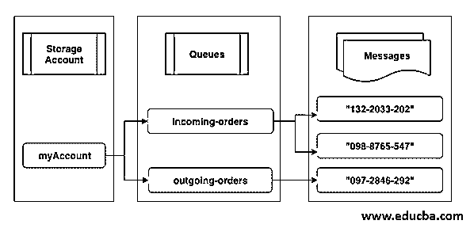

**图片参考:**https://docs . Microsoft . com/en-in/azure/includes/media/storage-queue-concepts-include/

#### 1.**网址格式**

在此帐户中，使用唯一的命名空间创建队列，并使用此存储帐户的 URL 格式进行寻址，如下所示。

**Azure 存储格式:**

`http://<storage_account_name>.queue.core.windows.net/<queue_name>`

#### 2.存储帐户

这用于提供和管理与存储帐户相关的所有访问，它是 Azure 服务的基本构建块。要将收到的订单从一个应用程序转移或迁移到存储中的另一个应用程序，用户需要有一个存储帐户，因为它提供了一个唯一的名称空间。它包含 Azure 中使用的所有数据对象，如 Blob 存储、文件存储、队列存储、磁盘和 Azure 表存储。因此，要访问 Azure Table 存储服务，用户需要创建一个存储帐户。

#### 3.长队

这是队列中的一组消息，队列名称必须是小写的，并且具有唯一的有效 DNS 名称，长度为 3 到 63 个字符。

#### 4.消息

这可以以任何格式存储高达 64 KB 的单个消息。旧版本的队列存储容量(最长生存时间)在 2017-07-29 之前为 7 天。最新版本出现在 2017-07-29 之后。最长生存时间是任何正数或-1，以便消息不会过期。如果在最新版本中未设置上述最长生存时间参数，则默认情况下，消息排队容量为 7 天。

### 如何在 Azure 中使用队列存储

以下是使用队列存储的步骤:

**先决条件**:拥有有效 azure 凭证的用户可以通过 Azure 门户使用 Azure 队列存储服务来创建 Azure 表。对于首次用户来说，这是一个两步过程，第一个用户需要创建一个 Azure 存储帐户，然后添加新的队列存储或将应用程序数据移动到 Azure。在这里，我们将学习创建一个存储帐户，创建一个新队列并在其中添加一条新消息。

#### 1.创建存储帐户

**步骤 1:** 使用下面的 URL 登录 Azure 门户。

`https://portal.azure.com/#home`

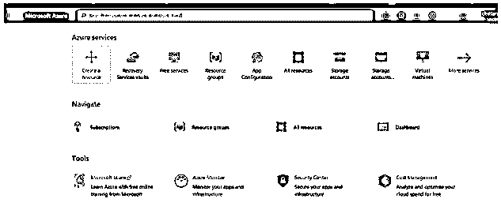

**步骤 2:** 从 Azure 门户点击所有服务，并从列表中选择存储帐户。

**步骤 3:** 现在从存储账户页面选择并点击添加按钮。

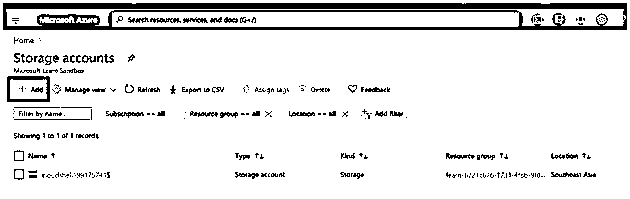

**步骤 4:** 输入订阅所需的所有详细信息，以创建存储帐户。

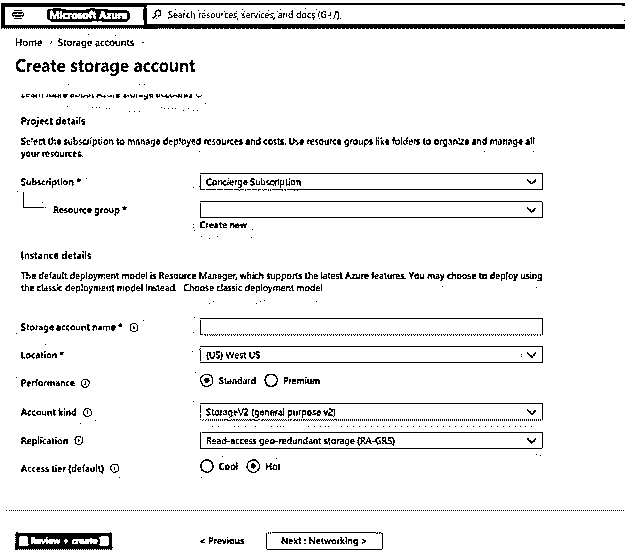

**第 5 步:**现在，我们已经输入了所有的详细信息，单击 Review+Create 按钮。

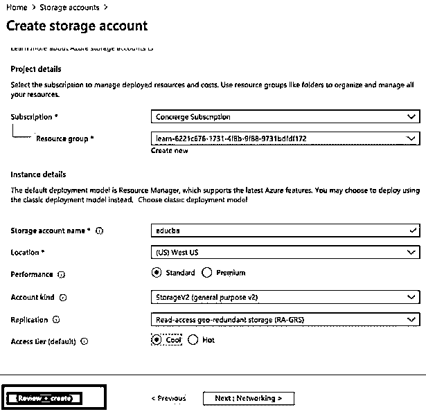

**步骤 6:** 验证将开始检查所有输入的详细信息，并单击页面中的创建按钮。

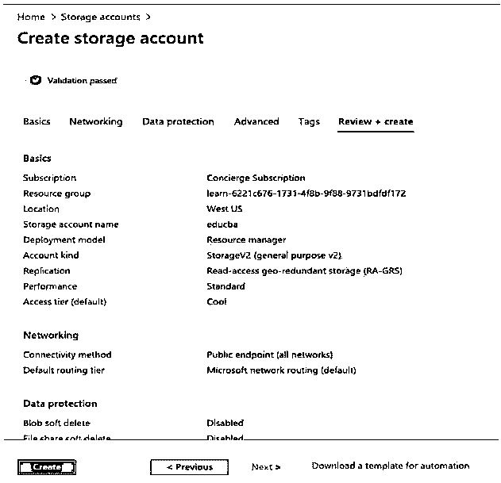

**步骤 7:** 创建新存储帐户的过程将在 5-10 分钟内开始并完成。

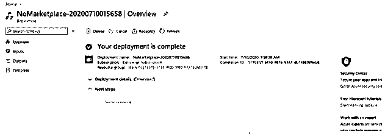

#### 2.在 Azure 存储中创建队列并添加消息

**步骤 1:** 转到新创建的资源，形成 Azure 门户:

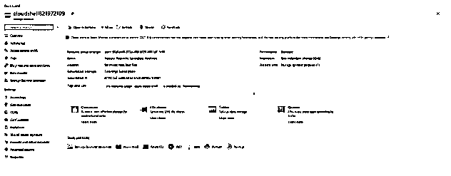

**步骤 2:** 在 Azure 存储帐户的左侧窗格中，从队列服务中选择队列:

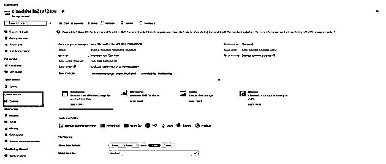

**步骤 3:** 在“队列服务”页面中单击“队列”按钮，添加一个新队列:

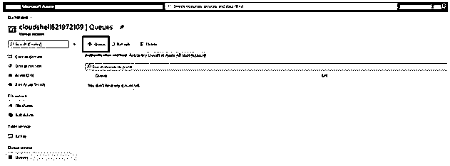

**第四步:**输入新队列名称:

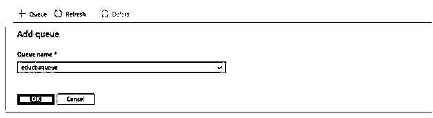

**步骤 5:** 新队列被添加到队列服务中:

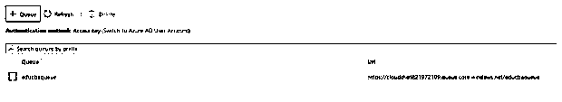

**第六步:**从页面中选择新创建的新队列:

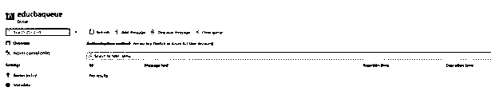

**第七步:**点击添加消息来自:

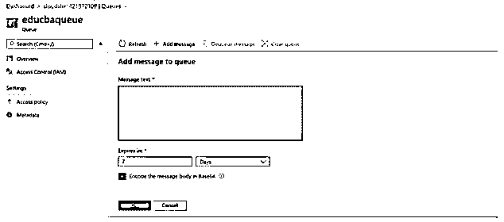

**步骤 8:** 在字段中输入新消息，用户也可以选择过期收件箱中允许的时间:

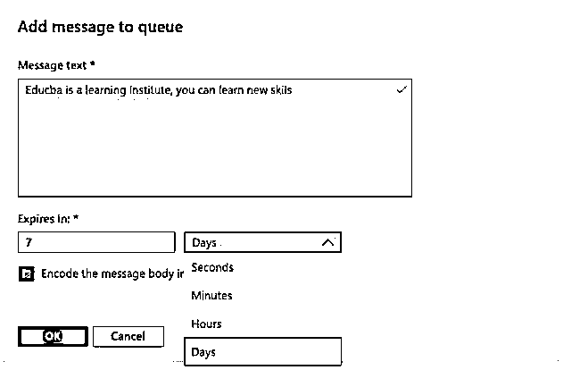

**第 9 步:**点击 OK 按钮，向队列中添加一条新消息:

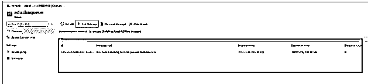

### 结论

Microsoft Azure 队列存储可用于轻松存储大型消息，并在不同的应用程序之间传输消息。此外，数据队列存储的管理和维护由微软完成，因此客户可以只为使用的资源付费，并专注于从存储在存储中的数据获得更全面的洞察力，以及传输数据和将消息存储在队列中。

### 推荐文章

这是 Azure 队列存储指南。在这里，我们讨论 Azure 队列存储的介绍，架构，如何使用它的步骤。您也可以浏览我们的其他相关文章，了解更多信息——

1.  [Azure 功能](https://www.educba.com/azure-functions/)
2.  [Azure 存储帐户](https://www.educba.com/azure-storage-account/)
3.  [Azure 组件](https://www.educba.com/azure-components/)
4.  [什么是 Azure？](https://www.educba.com/what-is-azure/)

