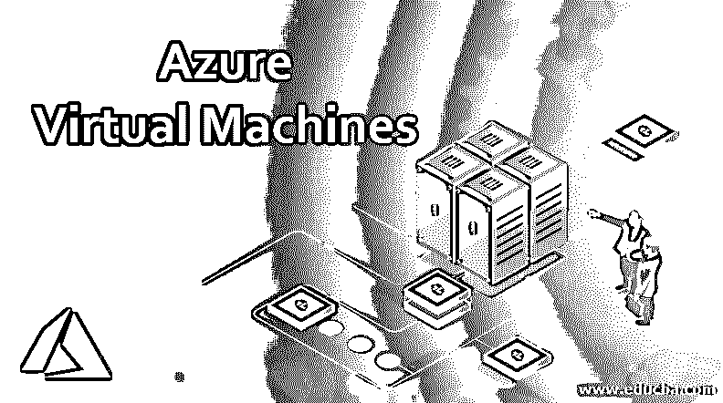

# Azure 虚拟机

> 原文：<https://www.educba.com/azure-virtual-machines/>

## Azure 虚拟机简介

在进入 azure 虚拟机的概念之前，首先，我们要知道什么是虚拟机。虚拟机只不过是模拟计算机系统的模拟器。基于现有的架构，一个虚拟机与其硬件和软件会有所不同。Azure 虚拟机是 Windows 平台上可用的计算服务。使用这个平台，任何企业/个人都可以在云上托管他们的应用程序或系统。这基本上就是基础设施即服务或 IaaS。使用 Azure 虚拟机平台，用户可以做很多事情，比如:

*   用户可以创建自己的虚拟机
*   每个 Azure 虚拟计算机平台都装载了包括数据库在内的各种软件。因此，用户可以方便地在环境中工作，而不必担心软件和其他后勤工作。
*   根据客户端的要求，可以增加虚拟机的容量。
*   关心数据隐私的客户也可以选择他们希望数据服务器驻留在哪个区域。

### Azure 虚拟机的基本优势

通常，所有遗留系统基础设施的服务器都分散在各处。有时要访问任何特定的服务器，用户需要通过 VPN 连接。有时情况非常糟糕，以至于只需要在前提下访问任何系统。在 Azure 平台中，通过互联网连接，可以从世界上的任何地方访问相同的服务。以下是一些优势:

<small>Hadoop、数据科学、统计学&其他</small>

1.  **可扩展性:**随着需求的增加，系统容量可以相应增加。因此，可伸缩性是这里的一个主要优势。
2.  **存储:**根据数据的敏感性，用户可以共享各种存储选项，如私有存储、公共存储或两者兼有。
3.  **控件定制:**企业可以根据数据的敏感程度和数据量定制控件选项。
4.  **工具:**用户和开发人员可以使用预先构建的现成工具，这不仅可以优化流程，还可以节省大量时间。
5.  **安全性:**该系统配备了[各种加密](https://www.educba.com/what-is-encryption/)选项以及可定制的措施来提高数据的安全性。
6.  **可访问性:**可从任何联网设备访问。
7.  **快速的市场引入:**由于开箱即用的规定，使用 Azure 导致服务和平台的快速市场引入。
8.  **定期更新:**定期系统升级是 Azure 相对于遗留系统的一大优势。

### Azure 基础架构

让我们来看看 azure 虚拟机架构。Azure 最初被微软命名为 Project Red Dog。“红狗计划”的幕后策划者是大卫·卡特勒先生。最初，它是 windows 的定制版本，目标是从虚拟硬盘启动。让我们试着理解 Azure 的主要组件，它们如下:

#### 1.结构控制器

Azure 架构中最重要的组件之一。这是架构运作的支柱之一。结构控制器基本上拥有所有的资源。节点的放置、负载平衡、根据需求的可伸缩性、更新、补丁管理—一切都归这个部门所有。当用户创建自己的虚拟机实例时，所有任务(如配置或取消配置以及所有节点的监管)都由结构控制器负责。简而言之，我们可以说这是 Azure 系统的主干。

#### 2.补丁管理

补丁管理工作流是 Azure 系统的一个主要优势，因为这个模块使 Azure 易于管理并在所有节点上保持更新。在 Azure 系统中，主机是基于映像的，因此不需要像遗留系统那样逐个更新所有节点。在这里，Azure 基本上在一个地方提供更新的 VHD，整个节点系统得到更新。典型的更新每 4-6 周进行一次，以确保安全性和系统稳定性。微软在这里确保更新在被推广到节点之前经过测试和验证。

#### 3.划分

Azure Fabric Controller 有几种分区类型，它们是更新域和容错域。这些分区帮助 Azure 虚拟机维护其可用性和弹性。这种分区有助于保持零停机时间、最少故障和持续可用性。

*   **更新域:**这是确保服务器升级而不停机的策略。Microsoft Azure system 将实例分布到几个更新域中。这里每个更新域作为一个逻辑单元工作。一次升级一个更新域。处理完所有更新域后，升级过程就完成了。Azure 确保升级在对正在运行的服务影响最小的情况下完成。
*   **故障域:**故障域只不过是单一故障点。结构控制器通过将实例分布到多个容错域来确保不会发生孤立的硬件故障。这将防止由于任何单个部件故障而导致系统故障。

#### 4.天蓝色计算机邮票

Azure 将事物分成多个 stamp，每个 stamp 都有自己的 fabric 控制器。Azure 有两种邮票——计算邮票和存储邮票。结构控制器也分布在多个分支中。Azure 通常有一个结构控制器的 5 个副本，它们都同步复制状态。在这 5 个实例中，一个是主节点，所有信息都通过控制面板传递给主节点。现在，主实例确保相同的指令已经传递给了辅助实例。

#### 5.其他虚拟机组件

除此之外，Azure VM 还有其他三个重要组件，它们是计算机、存储和网络。Microsoft Azure 还能够监控虚拟机的运行状况，如果发现任何问题，可以选择自动恢复。这种服务被称为服务修复。由于结构控制器具有检测故障的能力，因此该任务由结构控制器执行，以检测故障并触发自动恢复。

### 结论

总之，我们可以说，Azure 虚拟机不仅彻底改变了服务行业，而且凭借其容错和零停机架构，它确保了 Azure 中托管的应用程序将帮助其客户从他们购买的这些服务中获得最大价值。

### 推荐文章

这是 Azure 虚拟机指南。这里我们讨论 azure 虚拟机的基本优势以及架构。您也可以看看以下文章，了解更多信息–

1.  [Azure 组件](https://www.educba.com/azure-components/)
2.  [Azure 服务](https://www.educba.com/azure-services/)
3.  [Azure 的优势](https://www.educba.com/advantages-of-azure/)
4.  [在蔚蓝的职业生涯](https://www.educba.com/career-in-azure/)

