# Azure 移动应用程序

> 原文：<https://www.educba.com/azure-mobile-app/>

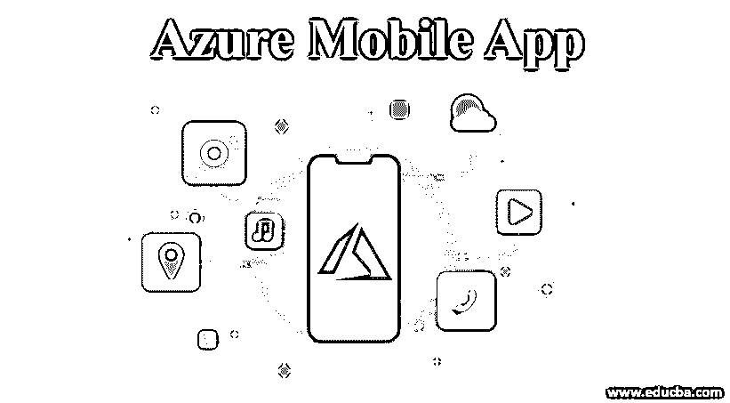

## Azure 移动应用简介

微软 Azure services 提供移动应用服务，以在其基于云的平台即服务平台中构建移动应用。在移动应用服务方面，微软 Azure 向开发者提供高度可扩展和全球可用的移动应用开发平台，以便他们可以构建 iOS、Android 等原生应用或 Xamarin 或 Cordova (PhoneGap)等跨平台应用。该服务为开发人员提供了对后端存储和 API 的访问，以便开发人员可以轻松集成其他 azure 服务，因此移动应用服务也可以称为“移动后端即服务”(MBaaS)。

### 如何创建一个 Azure 移动应用？

下一步是如何以清晰简单的方式构建 Azure 移动应用:

<small>Hadoop、数据科学、统计学&其他</small>

**步骤 1:** 使用下面的 URL 转到 Azure 门户。

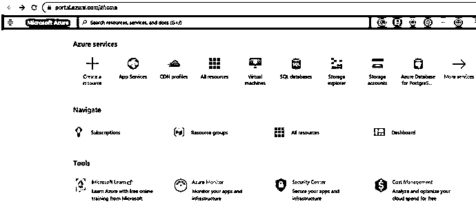

**第二步:**在 Azure 门户首页选择所有服务。

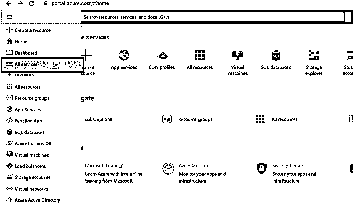

**第三步:**从“所有服务”页面中选择“手机”。

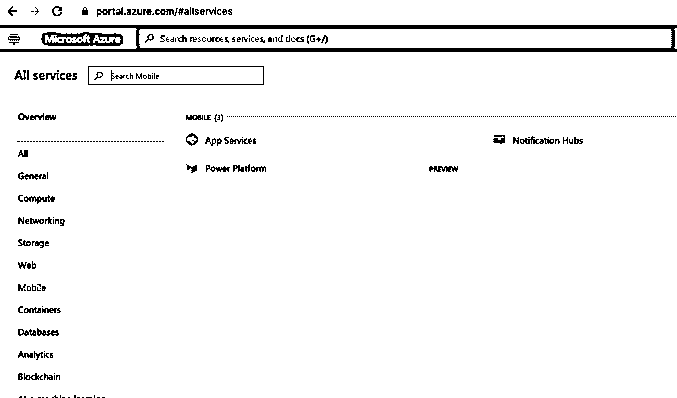

**步骤 4:** 从左侧的移动部分选择 App Services，它将打开一个页面，从 Azure 门户构建和部署移动应用。

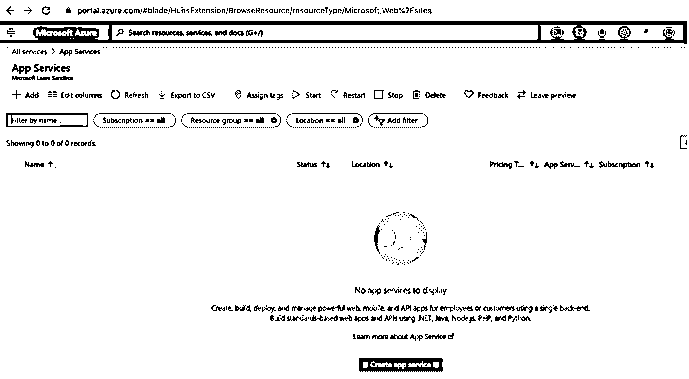

**第五步:**选择+添加，新建一个手机 App。

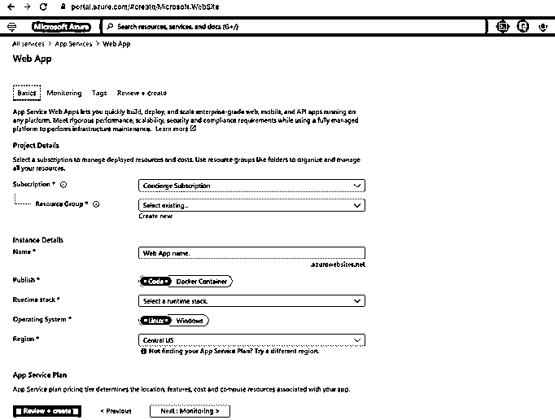

**步骤 6:** 在应用程序创建页面中提供项目详细信息:

*   **名称:**我已经添加了 app 名称为“educbamobileapp”。应该是小写字母。
*   **Subscription** :从下拉列表中选择您想要的订阅，无论所有资源应该一起计费还是分开计费。
*   **资源组:**用户可以选择现有的组，也可以根据需要创建新的组。
*   **发布**:选择一个 app 应该发布为代码还是 Docker。
*   **操作系统:**有两种选择【Linux 或者 Windows 。
*   **地区**:在下拉列表中为用户提供了几个地区选项，如美国中部、美国东部、美国西部、美国东部 2，用户可以根据自己的地区进行选择。
*   **Sku 和大小:**应用内服务计划用户可以选择生产、开发/测试和隔离计划。根据要求，用户可以选择一个，这里是不同计划的截图，我从开发/测试中选择了:

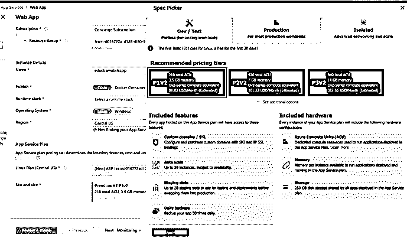

以下是所有细节:

**第 7 步:**点击 Review+Create 按钮，验证在 Basic 选项卡中输入的所有信息是否正确。

**第 8 步:**验证完成后，创建按钮将激活，如下所示:

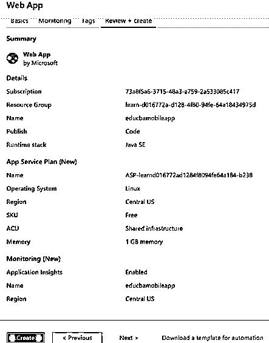

**步骤 9:** 选择“创建”按钮创建一个新的应用程序，它将在屏幕上的进度消息下填充部署。

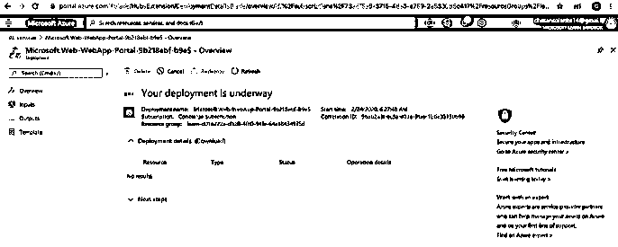

**步骤 10:** 现在转到最近创建的应用程序，您可以检查您的应用程序是否是在 Azure 中创建的:

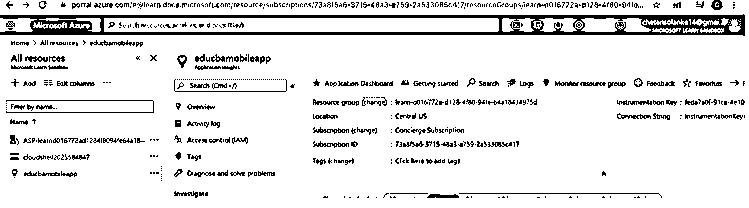

**步骤 11:** 现在转到下面的部署详细信息，检查我们是否已选择代码作为 java 代码。在这里，用户可以添加他的 Java 网站代码，或者与此类似，在项目详细信息选项中，用户可以选择代码作为 ASP.NET 或节点，这将提供添加网站应用程序的选项。

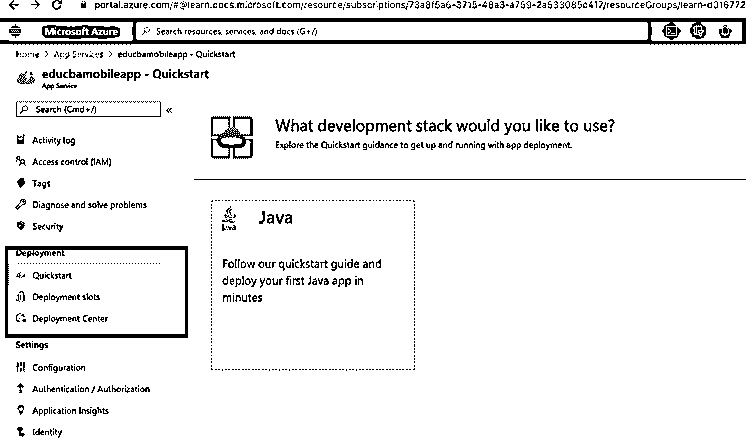

**第十二步:**从部署选项中，用户可以从 Visual Studio、GitHub 或 Dropbox 等将他的代码添加到 Azure 中。添加到最近创建的 web 应用程序并进行部署。

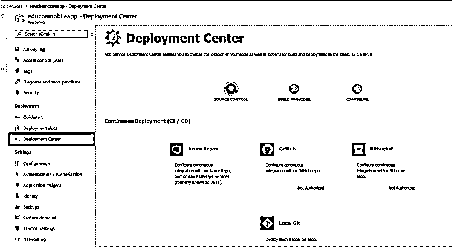

### 特征

以下是移动应用服务在 Microsoft Azure 中作为应用服务提供的功能:

*   它有助于在客户端 SDK 与 Azure 通知中心无缝集成的同时向数百万人发送推送通知。
*   移动应用数据源与 Azure SQL 或本地 SQL server 链接，以便用户可以轻松访问数据。此外，移动应用程序的数据源可以很容易地与微软 Azure 中的 NoSQL 和 SQL 数据提供者集成。
*   移动应用服务拥有一套丰富的客户端 SDK，可以在 iOS、Android 等原生开发平台或 xamarin.ios 等跨平台开发移动应用。
*   移动应用程序具有离线数据同步功能，用于创建无需网络连接即可运行的应用程序。
*   在使用应用服务后端开发原生应用时使用身份验证和授权功能，以便移动应用可以在不更改应用内服务代码的情况下登录用户。它有助于保护应用程序中的每用户数据。

### 使用 Azure 移动应用的优势

*   这有助于构建本地和跨平台的客户端 SDK，以支持两种平台的开发。
*   用户可以使用公司登录随时远程或异地连接到他的企业网络。
*   用户可以离线构建应用，然后在连接到系统时同步数据，这可以提高移动工作人员的工作效率。
*   我们可以在任何设备上在一秒钟内向数百万客户推送通知。

### 结论

这里我们探讨了微软 Azure 云平台提供的移动应用服务。我们学会了从 Azure 门户网站创建一个移动应用程序，它的优点和功能帮助我们理解为什么移动应用程序功能在 Azure 服务平台中是有用的。

### 推荐文章

这是一个 Azure 移动应用程序的指南。在这里，我们讨论基本概念，如何创建一个移动应用程序以及功能和优势。您也可以浏览我们的其他相关文章，了解更多信息——

1.  [Azure 服务](https://www.educba.com/azure-services/)
2.  [Azure 功能](https://www.educba.com/azure-functions/)
3.  [Azure 物联网边缘](https://www.educba.com/azure-iot-edge/)
4.  [在蔚蓝的职业生涯](https://www.educba.com/career-in-azure/)
5.  [在 Azure 中创建和管理表格](https://www.educba.com/tables-in-azure/)
6.  [Azure 备份指南](https://www.educba.com/azure-backup/)
7.  [Azure SQL 数据库|如何创建？](https://www.educba.com/azure-sql-database/)

