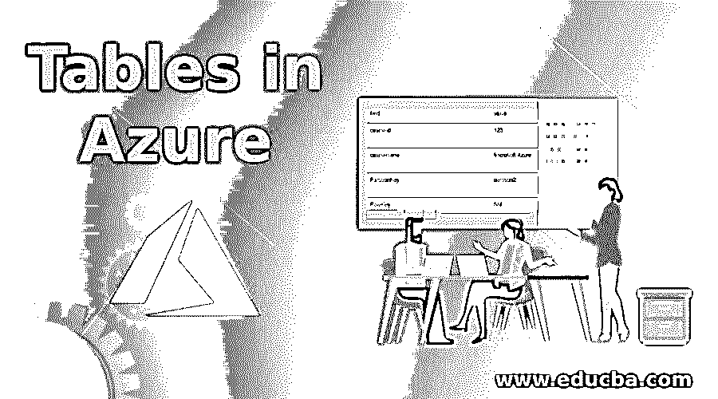
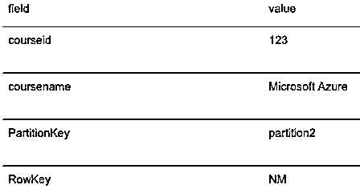
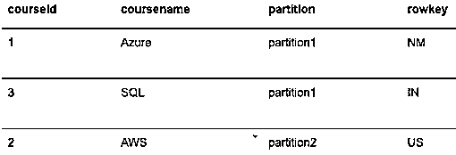
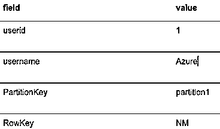
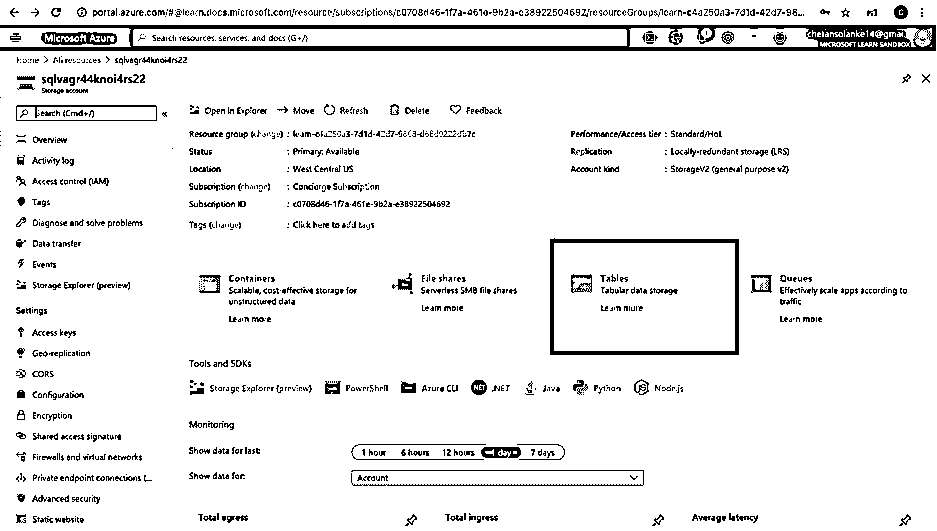
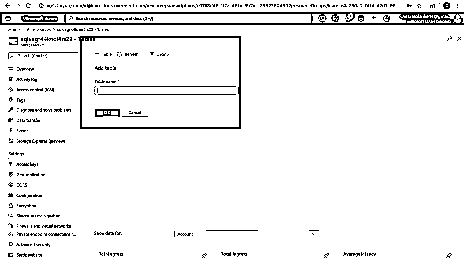
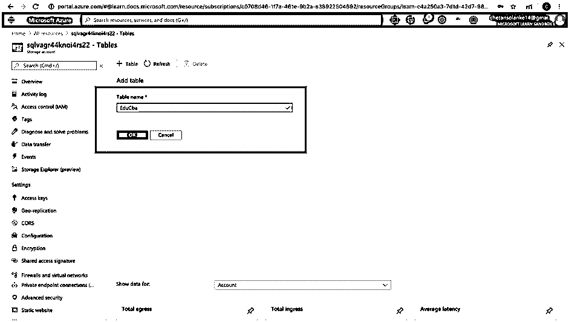
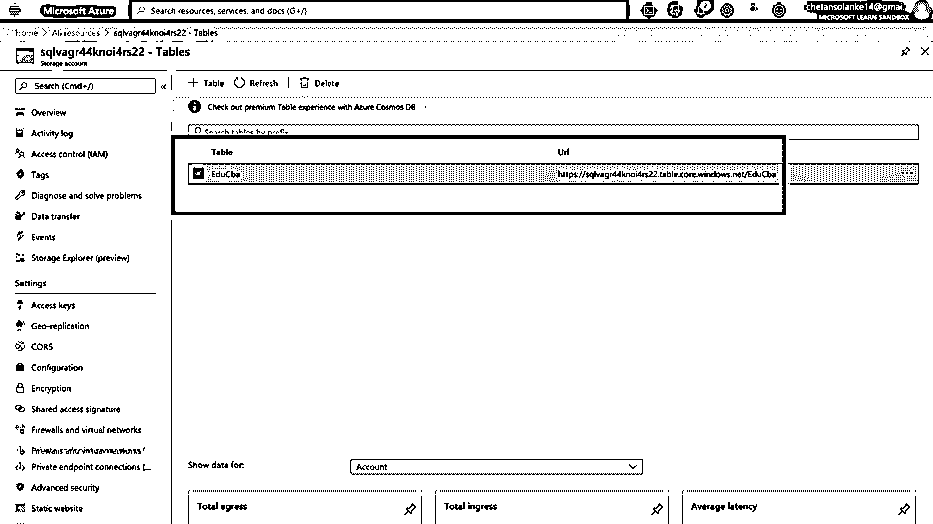

# 天蓝色的桌子

> 原文：<https://www.educba.com/tables-in-azure/>

## Azure 中的表格简介

Azure Table 是微软 Azure 提供的服务，用于在云中存储结构化的 NoSQL 数据，数据没有模式，提供键或属性来存储数据。这个表是无模式的，它提供了处理 web 应用程序数据、地址簿等数据集的灵活性和可伸缩性。根据服务需要。表非常适合非关系数据和大量数据(万亿字节数据),因为用户可以使用聚集索引快速查询数据，也可以基于易于扩展的按需表。

### Azure 桌面储物

Azure 表存储具有以下组件

<small>Hadoop、数据科学、统计学&其他</small>

**URL 格式:**存储账户的格式如下:

`http://<storage account>.table.core.windows.net/<table>`

*   **账户**:存储账户提供对 Azure 存储的访问。
*   **表**:它是实体的集合，表不对实体强制任何模式。
*   **实体**:类似于 RDBMS 数据库中的行，实体是一个实体集合，在存储中的大小可以是 1 MB，在 cosmo DB 中可以达到 2MB。
*   **属性**:是名值对。Azure 存储中的每个实体都可以有一个分区键、一个行键和一个时间戳。实体中的行键是它在分区中的唯一标识符。

### 如何在 Azure 中创建表格？

在这里，我们将在 Azure Studio 中创建表格，要使用这些表格，请下载并在您的系统上安装 Powershell ISE。

**步骤 1:** 在 Powershell 中登录您的帐户。

**第 2 步:**使用以下方式创建 AzureStorage 帐户:

`$storageAccountName = "@_StorageAccountName"
$storageAccount = New-AzStorageAccount -ResourceGroupName $resourceGroup `
-Name $storageAccountName `
-Location $location `
-SkuName Standard_LRS `
-Kind Storage
$ctx = $storageAccount.Context`

**步骤 3:** 使用下面的命令创建一个新表:

`$tableName = "educba"
New-AzStorageTable –Name $tableName –Context $ctx`

这里的表名是“educba ”, New-az storage 表用于创建通用存储帐户

### 如何检索表格？

要检索表，请在存储中使用 Get-AzureStorageTable 关键字:

`$tabName = "educba"
Get-AzureStorageTable –Name $tabName –Context $Ctx`

### 如何在 Azure 中删除和更新表格？

下面我们可以看到如何删除和更新表格:

#### 删除

若要从 Azure 存储中删除该表，请使用 Remove-AzureStorageTable

`$tabName = "educba"
Remove-AzureStorageTable –Name $tabName –Context $Ctx`

#### 更新

更新 azure 表中的实体

**1。**要更新表格中的特定实体，请使用以下方式创建过滤器:

**代码:**

`[string]$filter = `
[Microsoft.Azure.Cosmos.Table.TableQuery]::GenerateFilterCondition("coursename",`
[Microsoft.Azure.Cosmos.Table.QueryComparisons]::Equal,"Azure")
$user = Get-AzTableRow `
-table $cloudTable `
-customFilter $filter`

**2。**现在将“coursename”实体从 Azure 更改为 Microsoft Azure

**代码:**

`$user.coursename = "Microsoft Azure"`

**3。**使用 Update-AzTableRow 命令提交更改，并将更新的记录通过管道传输到 cmdlet:

**代码:**

`$user | Update-AzTableRow -table $cloudTable`

**4。**要查看新记录，请查询该表。

**代码:**

`Get-AzTableRow -table $cloudTable `
-customFilter "(coursename eq 'Microsoft Azure')"`

**输出:**

### Azure 中对表的操作

表中的行也称为实体，它最多可以有 255 个属性，有 3 个系统属性，如 PartitionKey、RowKey 和 Timestamp。从 Azure 存储获取引用表名称:

**代码:**

`$TableName = "educba"
#Get a reference to a table.
$table = Get-AzureStorageTable –Name $TableName -Context $Ctx`

**1。**使用命令 Add-AzTableRow 向表格实体添加/插入值:

**代码:**

`$partitionKey1 = "partition1"
$partitionKey2 = "partition2"
# add three rows
Add-AzTableRow `
-table $table `
-partitionKey $partitionKey2 `
-rowKey ("NM") -property @{"coursename"="Azure";"courseid"=123}
Add-AzTableRow `
-table $table `
-partitionKey $partitionKey1 `
-rowKey ("IN") -property @{"coursename"="SQL";"courseid"=222}
Add-AzTableRow `
-table $table `
-partitionKey $partitionKey2 `
-rowKey ("US") -property @{"coursename"="AWS";"courseid"=333}`

**2。**使用 Get-AzTableRow 查询表以检索表的数据:

**代码:**

`Get-AzTableRow -table $table | ft`

**输出:**

**3。**从表中检索特定列中特定值的实体

**代码:**

`Get-AzTableRow -table $table `
-columnName "coursename" `
-value "Azure" `
-operator Equal`

**输出:**

**4。**使用命令 Remove-AzTableRow 删除表中的所有实体:

`Get-AzTableRow `-table $table | Remove-AzTableRow -table $cloudTable`

**5。**使用 Remove-AzStorageTable 命令从 Azure 存储中删除一个表

`Remove-AzStorageTable –Name $tableName –Context $ctx`

**6。**要验证上述命令是否删除了表格，请使用以下命令检索表格列表:

`Get-AzStorageTable –Context $Ctx | select Name`

上述命令将给出一个空结果。

### 管理 Azure 存储表的 Azure 门户

用户还可以使用 storage explorer 通过门户创建和管理该表，如下所示:

**步骤 1:** 点击概述，然后点击如下表格:

**步骤 2:** 要添加表格，请点击+表格符号

**步骤 3:** 在“表格名称”框中输入用户想要创建的“EduCba”表格名称，然后点击“确定”。

**步骤 4:** 检查 azure 存储中创建的表:

### 结论

在本文中，我们学习了如何使用 Azure 存储表和执行创建、删除、插入等操作。在带有 PowerShell 编辑器的表上，用户还可以使用 Azure Storage Explorer 来创建和管理表。总之，存储对于有效管理 NoSQL 表非常有用，并且有 DDL 和 DML 命令来处理操作。

### 推荐文章

这是 Azure 中的表格指南。这里我们讨论语法，如何检索、更新、删除表，以及创建和管理表。您也可以浏览我们的其他相关文章，了解更多信息——

1.  [什么是 Raid 存储？](https://www.educba.com/what-is-raid-storage/)
2.  [Azure 功能](https://www.educba.com/azure-functions/)
3.  [数据仓库模式](https://www.educba.com/data-warehouse-schema/)
4.  MySQL 中的[表](https://www.educba.com/table-in-mysql/)
5.  [Azure SQL 数据库|如何创建？](https://www.educba.com/azure-sql-database/)

