# Azure 事件网格

> 原文：<https://www.educba.com/azure-event-grid/>

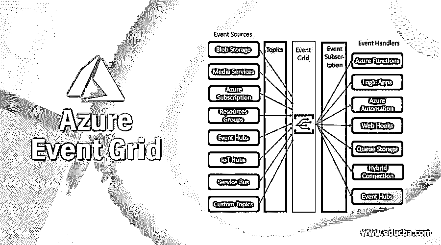

## 什么是 Azure 事件网格？

Microsoft Azure Event Grid 是一项服务，用户可以使用它通过基于事件的架构轻松构建无服务器应用程序。它是一个事件路由服务，从 Blob 存储、媒体服务到 Azure 函数和 Webhooks 等来源分发事件。事件网格可以作为第三方服务使用，并作为发布者或订阅者支持 Azure 服务。它支持使用自定义主题创建自己的事件。

### Azure 事件网格是如何工作的？

Azure event grid 从多个来源接收消息，并基于事件网格订阅使用事件处理程序分发这些消息。事件源将事件的详细信息发送到事件网格，然后网格中的相关事件被发送到订阅者。主题用于隔离相关事件，并决定将哪些事件发送给事件处理程序。来自源的每个事件被标记为多个主题，事件处理程序从事件中订阅预期的主题。

<small>Hadoop、数据科学、统计学&其他</small>

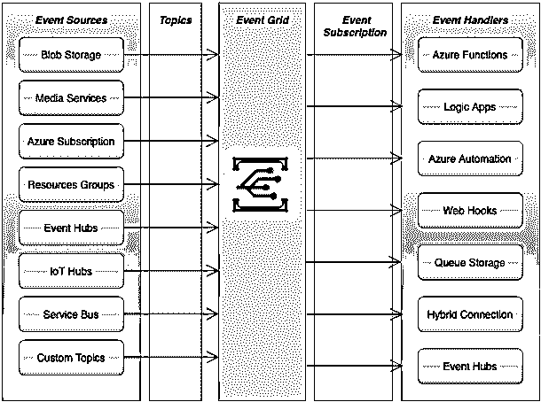

figure _ Reference:[https://docs . Microsoft . com/en-GB/learn/modules/choose-a-messaging-model-in-azure-to-connect-your-services/media/4-event-grid . png](https://docs.microsoft.com/en-gb/learn/modules/choose-a-messaging-model-in-azure-to-connect-your-services/media/4-event-grid.png)

如上图所示，Azure event grid 使用以下组件连接到源和订阅者:

*   **事件:**是对应用中发生的某些情况或状态变化的通知。
*   **事件源:**事件正在运行或执行的源。使用的事件源有事件中心、物联网中心、Blob 存储等。
*   **主题:**它是从发布者接收事件的端点。
*   **事件订阅:**它是端点使用的内置机制，用于将事件路由到单个或多个事件处理程序。订阅基本上从传入事件中决定相关事件。
*   **事件处理程序:**是事件中枢、队列存储、WebHooks 等服务或 app。对事件做出反应。

### 如何创建和使用 Azure 事件网格？

在学习创建 Azure 事件网格之前，用户必须拥有 Azure 订阅，以便他们可以使用有效的凭据登录 Azure 门户并创建 Azure 事件网格。

*   #### Create a custom theme

**步骤 1:** 使用有效凭证登录 Azure 门户:

[打开 Azure 门户](https://portal.azure.com/#home)

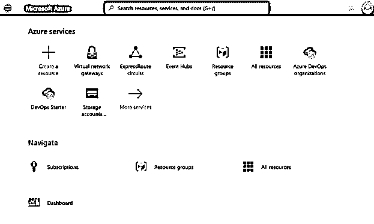

**步骤 2:** 选择**搜索**栏，输入**事件网格主题**，从下拉列表中点击事件网格主题:

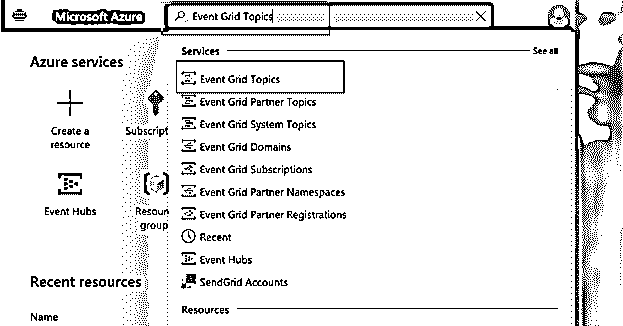

**步骤 3:** 从事件网格主题页面工具栏选择**+添加**选项创建添加新主题:

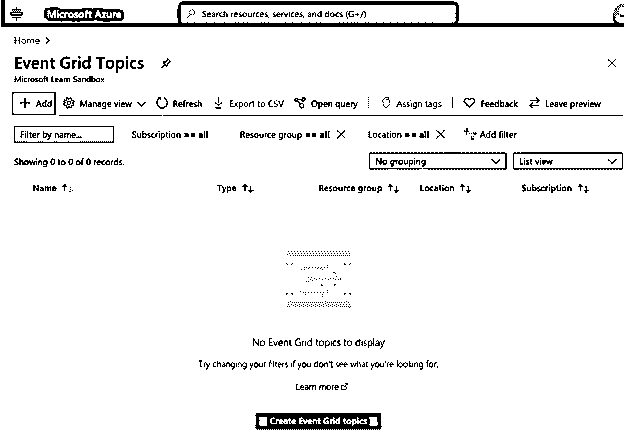

**第四步:**在创建主题页面，用户可以根据需要输入主题的详细信息:

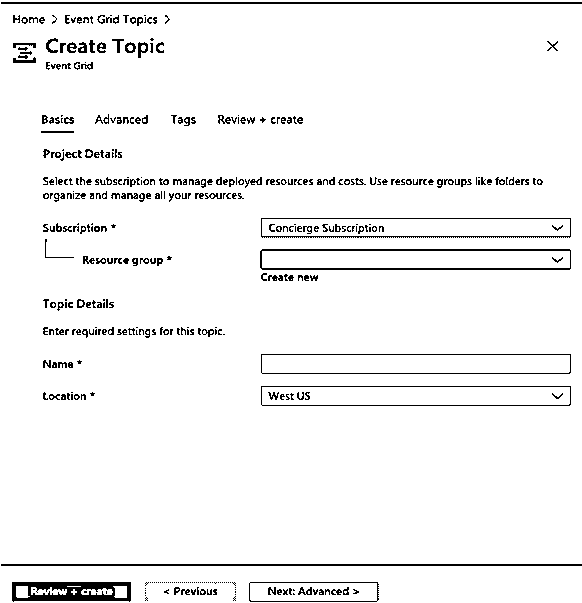

*   选择 Azure 订阅并根据需要创建新的资源组，或者从下拉列表中使用现有的资源组。
*   在**名称**字段中输入主题名称，该名称应该是唯一的，因为它代表 DNS。
*   从下拉列表中选择**位置**。

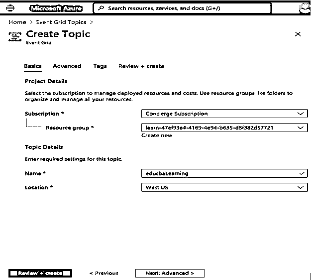

**步骤 5:** 点击**审核+创建**确认输入的详细信息，然后点击页面底部的创建按钮:

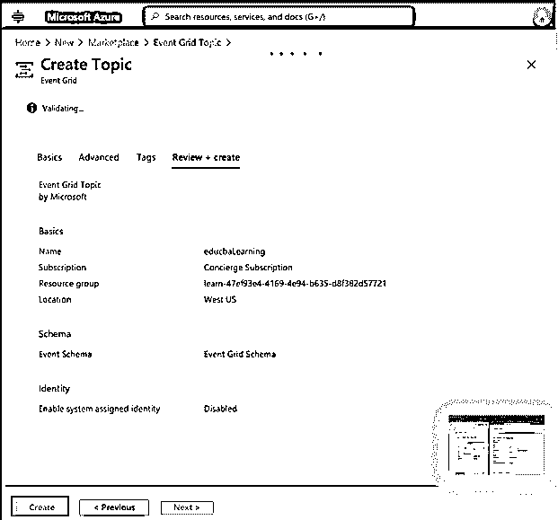

**步骤 6:** 将开始部署主题，一旦部署完成，主题将出现在事件网格主题列表中。

*   #### Create message endpoint

用户需要为自定义主题创建订阅，并为事件消息创建端点。我们使用预建的 web 应用程序来显示事件消息:

**步骤 7:** 点击下面的**部署到 Azure** 链接，并在页面上提供部署参数:

[部署到 Azure](https://portal.azure.com/#create/Microsoft.Template/uri/https%3A%2F%2Fraw.githubusercontent.com%2FAzure-Samples%2Fazure-event-grid-viewer%2Fmaster%2Fazuredeploy.json)

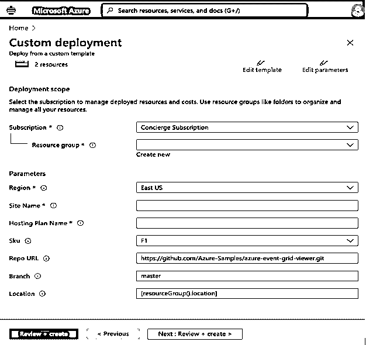

通过选择住房平面图、地点名称和区域输入详细信息:

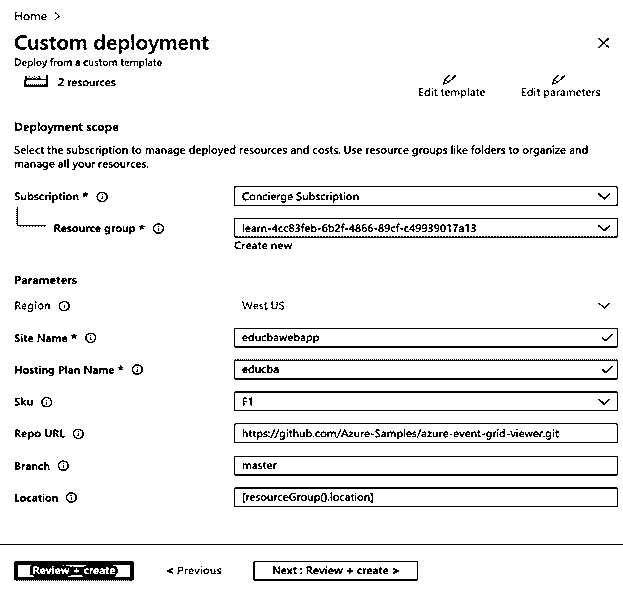

*   #### Create an event subscription

**步骤 8:** 在搜索字段中输入事件网格订阅以创建新订阅:

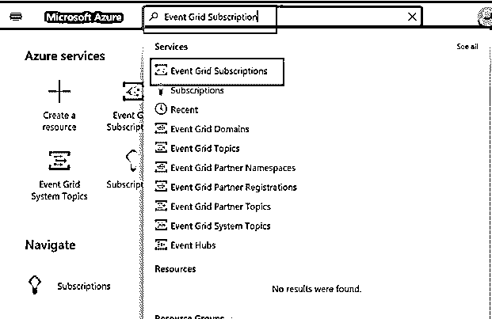

**第九步:**选择 **+活动订阅**添加新订阅:

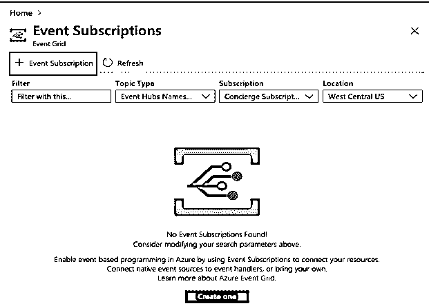

**步骤 10:** 在创建事件订阅中输入事件订阅详细信息:

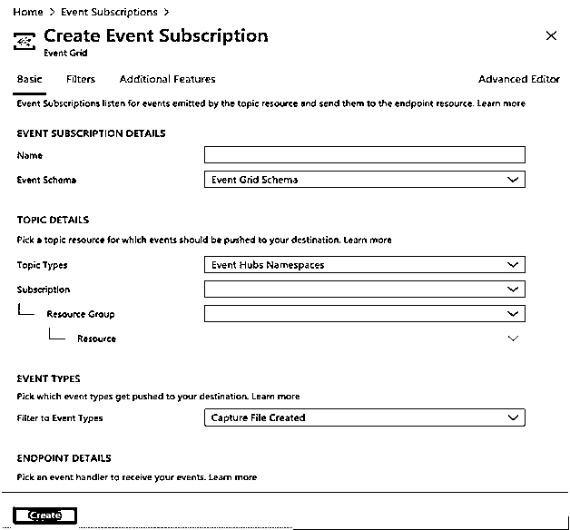

**第 11 步:**在创建活动订阅中输入详细信息:

*   名称:输入订户的唯一名称。
*   从下拉列表中选择事件模式作为事件网格模式。
*   在主题类型中，选择事件网格主题。
*   根据您的订阅选择订阅、资源组和资源。
*   选择上面创建的端点类型。

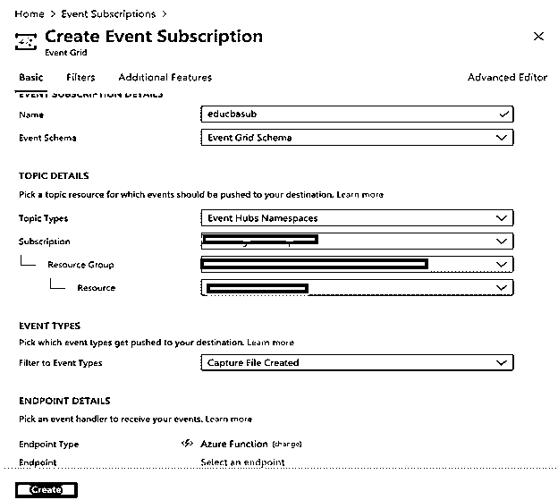

**步骤 12:** 在创建事件订阅页面的链接中点击**创建**按钮，开始部署:

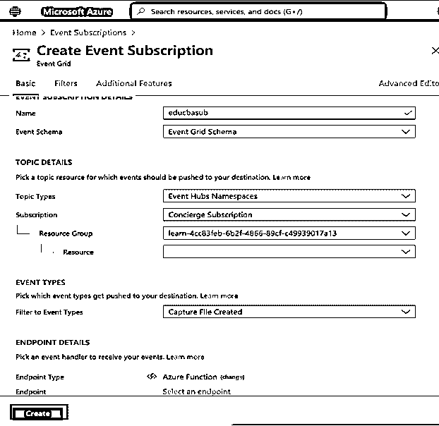

**步骤 13:** 它将开始部署以创建和订阅用户。

### 使用

*   Azure Event Grid 简单易用，因为用户可以将 Azure 资源中的事件指向并点击到任何事件处理程序或端点。
*   它支持许多内置事件，因此用户可以更快地启动和运行资源，并且延迟更低。
*   它具有高可靠性，因为事件网格 24 小时运行，并确保事件成功交付。
*   用户可以过滤事件类型和事件发布路径，以决定从事件处理程序中选择哪些事件。
*   用户只能为使用的资源付费，因为支持按事件付费。

### 结论

总之，Azure Grid Event 帮助用户轻松构建应用程序，用户还可以发布或订阅所需的消息。由于按次付费的定价模式，用户只需为他们正在使用的东西付费。

### 推荐文章

这是 Azure 事件网格的指南。在这里，我们讨论 Azure 事件网格的介绍，工作，以及创建 Azure 事件网格的步骤。您也可以浏览我们的其他相关文章，了解更多信息——

1.  [Azure ExpressRoute](https://www.educba.com/azure-expressroute/)
2.  [Azure 桌面储物](https://www.educba.com/azure-table-storage/)
3.  [Azure 负载均衡器](https://www.educba.com/azure-load-balancer/)
4.  [Azure 云服务](https://www.educba.com/azure-cloud-service/)

