# Azure 备份

> 原文：<https://www.educba.com/azure-backup/>

## Azure 备份简介

微软 Azure 为其用户提供基于云的服务，以安全地备份数据，并使用经济高效的解决方案恢复数据。这个 azure 服务叫做 Azure Backup。备份数据是一种简单且经济高效的解决方案，以便在出现任何人为错误时可以恢复数据，并提供免受勒索软件攻击的保护。该服务作为 Azure Recovery Services vault 的一部分提供。它易于使用和配置，因为 azure 提供了一键备份解决方案，可以通过启用数据恢复选项来使用。用户可以选择在本地或云上使用 Azure Backup。

### Azure 备份服务是如何工作的？

Microsoft Azure 客户端可以使用服务从计算机备份数据。以下是备份数据的方法:

<small>Hadoop、数据科学、统计学&其他</small>

#### 1.备份本地机器

Microsoft Azure 拥有 Microsoft Azure Recovery Services(MARS)代理，可帮助用户将数据从本地 Windows 计算机备份到 Azure backup。MARS 代理备份文件、文件夹和 windows 计算机的状态，并将它们存储在恢复库中。MARS 只能用于 Windows OS，不支持 Linux 机器。

将本地计算机数据备份到备份服务器，然后用户将备份服务器数据存储到恢复服务存储区。其中有两个可用的备份服务器，用于备份 Azure vault 上的文件和应用程序数据以及备份数据到磁盘或磁带。

*   系统中心数据保护管理器(DPM)
*   微软 Azure 备份服务器(MABS)

#### 2.备份 Azure 虚拟机

来自 Azure VM 的数据可以在 Azure Backup 上直接备份，因为它将备份扩展安装到 Azure VM。这个来自 Azure Backup 的备份扩展帮助 Azure 备份整个虚拟机。在 Azure VM 上运行 MARS 代理有助于用户备份 Azure VM 上的特定文件或文件夹。用户还可以在 Azure VM 上运行 MABS 的备份，然后可以在 Recovery Vault 上备份 MABS 的备份数据。

### Azure Backup 的组件

它有多个组件，反过来有助于将数据备份到 azure 中的恢复服务库。这些组件可以根据您想要备份的数据进行下载和部署。恢复服务库是 Azure 中的在线存储系统，保存文件、文件夹和备份策略的副本。用户可以根据地理冗余存储(GRS)或本地冗余存储(LRS)选择或过滤他们想要存储数据的位置。下面给出了不同的组件:

#### 1.Azure 备份代理

它有不同的代理来备份机器数据，并且根据数据的类型可以使用该代理。

*   **MARS 代理:** MARS 在本地 Windows 或 Azure VM 上运行，以备份文件、文件夹和系统状态。它不需要单独的备份服务器。然后，MARS 代理将数据存储到恢复库。它每天可以备份数据 3 次，并且不支持 Linux 机器。
*   **Azure VM 扩展:**它安装运行在 Azure VM 上的 Azure VM 扩展，并将 Azure VM 直接备份到 vault。

#### 2.系统中心 DPM

用户需要在机器上安装 DPM 系统。这是一个保护代理，有助于保护文件、文件夹、虚拟机、应用程序等。DPM/MABS 将数据备份到本地磁盘或服务器上，然后在 DPM 服务器上运行的 MARS 代理的帮助下，将数据从本地磁盘或服务器备份到保险存储。DPM 还支持本地和磁带磁盘存储。它支持在 Hyper-V 上备份 Linux 来宾虚拟机。

#### 3.微软 Azure 备份服务器(MABS)

用户需要在机器上安装 MABS 来使用类似于 DPM。它具有进行备份的充分灵活性，并且不需要 system center 许可证。我们不能使用 MABS 备份 oracle 数据，需要 Azure 订阅。尽管不支持磁带备份，但用户可以将数据存储到恢复服务保管库或本地磁盘。它有助于虚拟机(VM)的备份和恢复。

### 如何在 Azur 中执行备份操作？

**步骤 1:** 使用以下 URL 登录 Azure 门户:

[https://portal.azure.com/#home](https://portal.azure.com/#home)

**步骤 2:** 点击搜索，然后在服务恢复服务库下输入恢复服务。

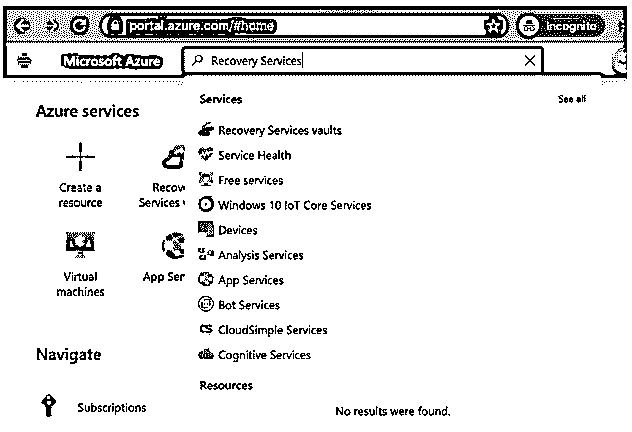

**步骤 3:** 从恢复服务库页面选择+添加，如下所示。

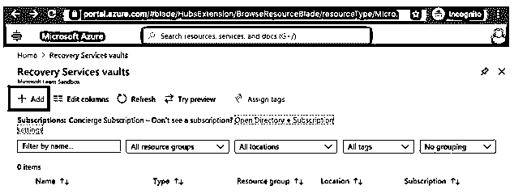

**步骤 4:** 在“创建恢复服务存储库”页面中，在框中输入存储库名称，该名称应该是唯一的，长度为 2 到 50 个字符。

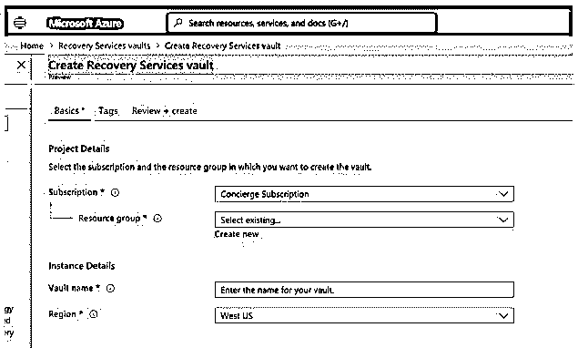

**步骤 5:** 输入保管库名称以及 Azure 订阅、资源组和地理区域，根据需要创建保管库，然后单击创建按钮。

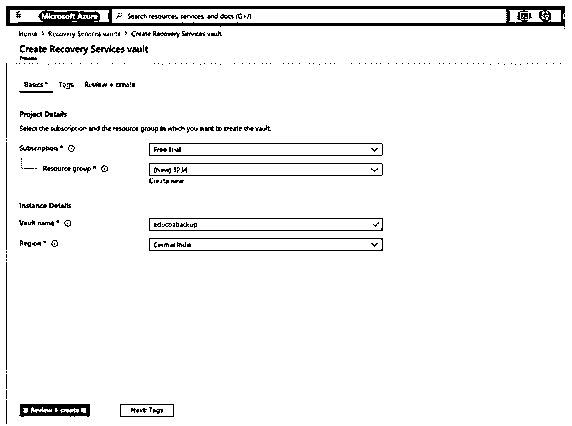

**步骤 6:** 创建存储库大约需要 5-10 分钟。监控菜单栏中的通知图标。

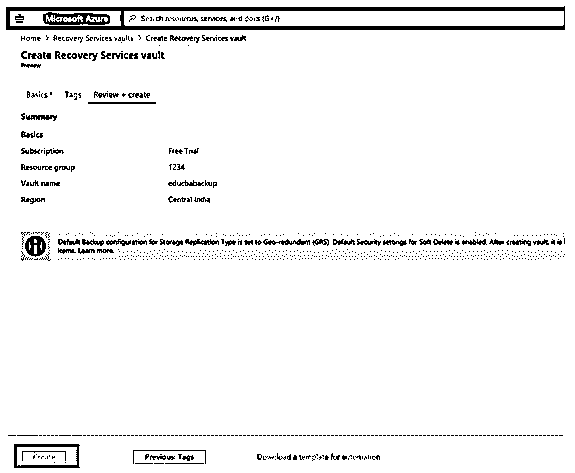

**第 7 步:**创建存储库后，它将出现在恢复服务存储库列表中。

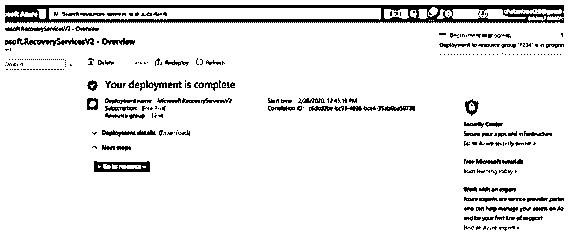

**步骤 8:** 这是最近创建的保险库的详细信息。

**第九步:**设置存储冗余。从设置部分选择属性。

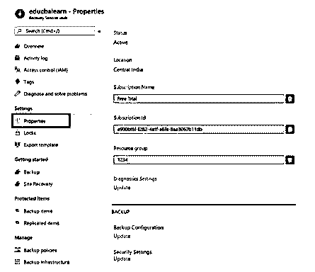

**步骤 10:** 现在，单击“Backup Configuration”下的“Update ”,这将显示“Storage replication type ”,根据要求选择“Local”或“geo-location ”,默认情况下它将是地理冗余的，然后单击“Save”。

**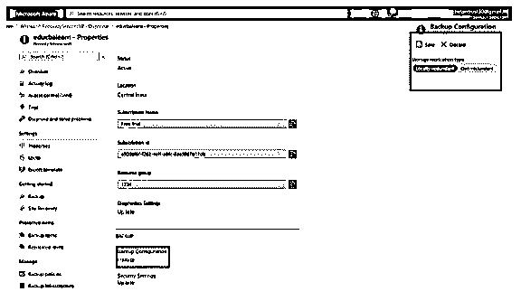

** 

**步骤 11:** 对数据或机器进行备份。从页面的概述部分选择+备份。

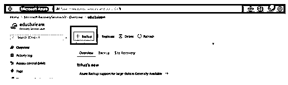

**步骤 12:** 在备份目标窗口中，您将看到以下选项:

*   您的工作负载在哪里运行？

在选择一个下拉列表的用户将提供 Azure，Azure 堆栈和基于要求的本地位置的选项，用户可以选择一个。

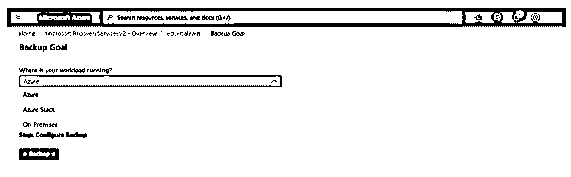

*   **您想要备份什么？**

另一个选项是选择要备份的文件或文件夹，用户可以从下拉列表中选择相同的文件或文件夹，如下所示:

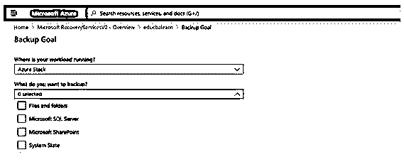

选择所需的备份和工作负载后，单击准备基础架构。

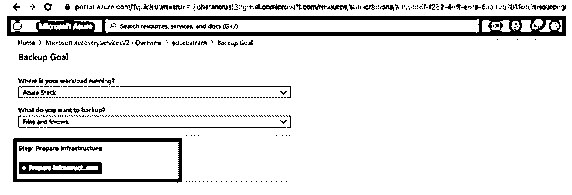

**第 13 步:**从“获取，开始”部分选择备份选项，如下所示。

**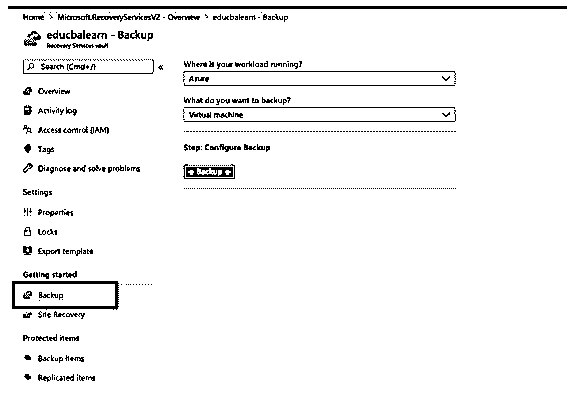

** 

**步骤 14:** 从配置备份窗格中选择备份按钮。

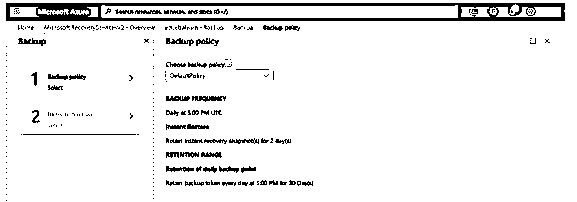

**步骤 15:** 在备份策略页面中，从下拉列表中选择备份策略，或根据此处的要求创建，作为备份策略的一部分，用户可以指定备份频率和时间来恢复数据。

**步骤 16:** 如果我们选择创建新策略，将显示以下页面。

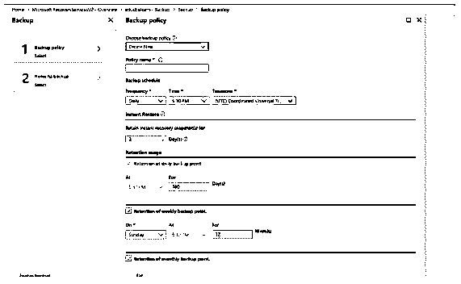

**第 17 步:**选择要备份的项目页面，给出需要备份的项目。

**第 18 步:**现在，单击“Enable”按钮，一旦选择了上述选项，该按钮将被激活，MARS 代理将按照计划的时间开始运行以进行备份。

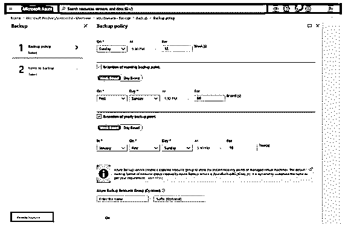

使用上述步骤，您的备份过程将通过 Azure 门户网站激活。

### 结论

总之，用户可以将数据从 Azure VM 或 Windows 或 Linux 备份到微软 Azure 云平台，该平台为数据提供保护并对数据进行备份。

### 推荐文章

这是 Azure 备份指南。这里我们讨论一下简介，组件，以及如何在 azure？您也可以看看以下文章，了解更多信息–

1.  [顶级云提供商](https://www.educba.com/top-cloud-providers/)
2.  [UNIX 管理员](https://www.educba.com/unix-administrator/)
3.  [可旋转拱顶指南](https://www.educba.com/ansible-vault/)
4.  [Azure 中的 CDN 指南](https://www.educba.com/cdn-in-azure/)
5.  [Azure SQL 数据库|如何创建？](https://www.educba.com/azure-sql-database/)

