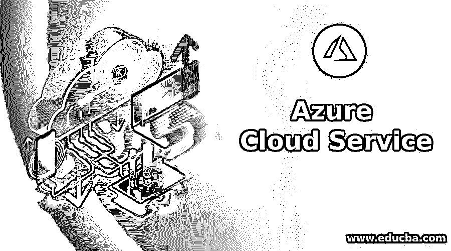
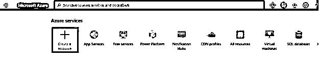
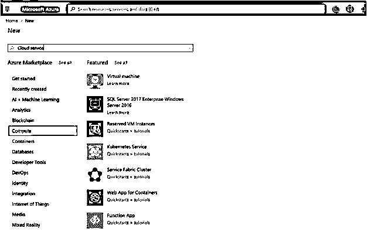
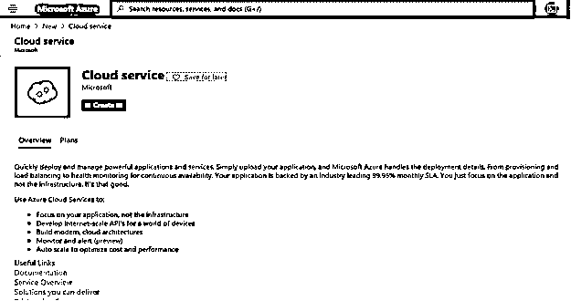
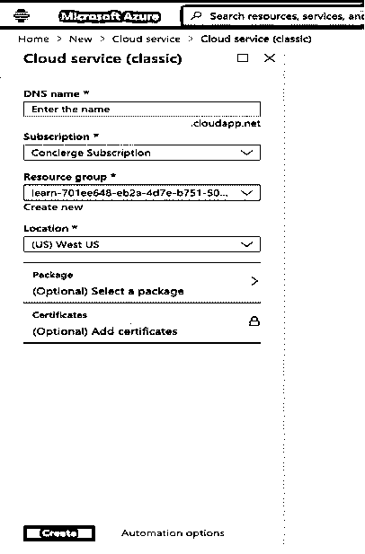
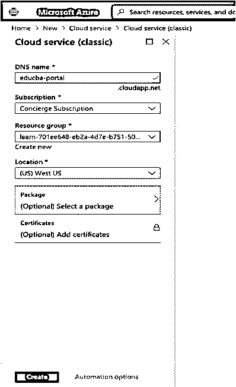
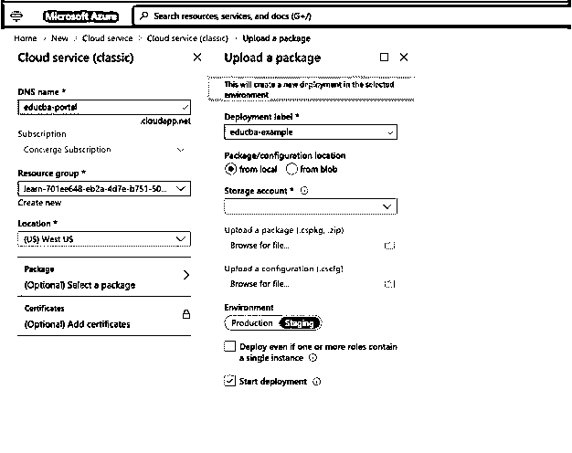
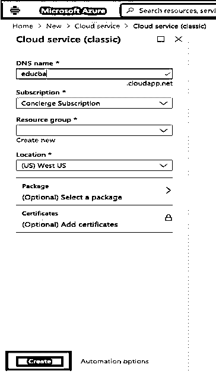

# Azure 云服务

> 原文：<https://www.educba.com/azure-cloud-service/>

## Azure 云服务简介

微软 Azure 以平台即服务(PaaS)的形式向用户提供云服务，提供的服务包括应用服务、Web 服务等。Azure 云服务使用云计算平台，通过使用按需付费服务和支持应用程序，通过提供可扩展性、可靠性和易于操作的门户，在互联网上为用户提供计算和管理服务。Azure 云服务微软数据中心存储数据，并向用户提供其他云资源，如 web 托管和服务管理。用户能够根据需求配置资源，以便拥有更多控制权，从而能够使用更新和创新的技术在当今的数字世界中前进。

### Azure 云服务是如何工作的？

*   Azure 云服务使用虚拟化技术，该技术用于将硬件和操作系统与计算机分离。虚拟化有一个称为虚拟机管理程序的抽象层，用于在虚拟机(VM)中再现计算机的功能和 CPU 能力。
*   虚拟机管理程序用于通过优化停止或故障硬件的容量来同时运行多个虚拟机。
*   虚拟机运行所有托管平台，如 Windows 或 Linux 操作系统。
*   因此，基本上 azure 使用虚拟化来创建虚拟机，并使用世界不同地区的数据中心大规模重复这一过程。
*   该数据中心有机架，每个机架有不同的服务器。该服务器有一个虚拟机管理程序，以便多个虚拟机可以在这些服务器上运行。为了连接世界各地的所有服务器，需要使用网络交换机。
*   数据中心的机架上运行一个软件；这个特殊的软件是一个连接到其他软件的结构控制器。这种使用结构控制器的软件连接称为 Orchestrator。
*   Orchestrator 管理 Azure 云上发生的一切。它还响应来自用户的任何请求。
*   用户可以通过 Orchestrator WebAPI 提出请求。为了调用这个 web APi，azure 为用户提供了不同的工具，如用户界面的 Azure 门户。

例如，当用户向 azure 请求创建机器或服务器时。Orchestrator 收集所需的一切，并选择最近和最好的机架。这个收集的包被发送到结构控制器。因此，结构控制器创建虚拟机或服务器，以便用户可以连接到它。Azure 帮助开发人员或 Azure 管理员开发、构建、部署和管理已部署的应用程序或服务。创建虚拟机后，用户可以根据需要托管不同的云服务。

<small>Hadoop、数据科学、统计学&其他</small>

根据托管方式，有两种不同类型的云服务角色:

1.  **Web 角色:** Azure 云服务通过 IIS 自动部署和托管您的应用程序。
2.  **工作者角色:** Azure 云服务不使用 IIS 进行托管或部署，而是将应用程序作为独立应用程序使用。

### Azure 云服务的组件

微软 Azure 为用户提供了丰富的组件集，作为 Azure 云服务的一部分，用于远程开发应用程序。在这里，我们将看到 azure 云服务中使用的所有组件，以及每个组件的简要描述

#### 1.计算

计算是 azure 提供的基本和主要服务之一。这提供了执行应用程序的接口。Azure 提供了多种选项来托管应用程序和服务。以下是一些计算服务:

*   Azure 虚拟机:托管在 Azure 中的 Linux 或 Windows 虚拟机
*   Azure Kubernetes 服务:管理运行在容器化服务上的虚拟机集群。
*   Azure 功能:基于事件的无服务器计算服务

#### 2.储存；储备

Azure 提供云存储服务，这种存储包括连接到虚拟机(VM)的外部磁盘，还具有其他存储格式，如保管库共享和数据库，这种存储系统和数据库可以根据需要增加或减少。云服务中使用的存储有:

*   Azure Blob 存储
*   Azure 队列存储
*   文件存储器
*   表格存储

#### 3.建立工作关系网

azure 云服务中的网络用于在本地基础设施和云服务之间建立连接。该网络连接可以是私有的，也可以是公共的。用户可以选择根据自己的需求来配置网络，以便提高入站和出站流量的效率，并且用户可以对流量进行更多的控制，从而实现具有优化性能的可扩展性。以下是一些网络示例:

*   Azure 虚拟网络
*   Azure 负载平衡器
*   Azure VPN 网关

#### 4.Web 应用程序托管

该组件帮助用户在虚拟机或服务器上运行 web 应用程序。这个 web 应用程序可以在使用 PHP、Python、Java 等不同语言的多个平台上开发。此外，azure 对 Azure marketplace 中的第三方产品有巨大的支持，可以在 Azure 上运行，如 SAP 或 SQL 数据库。它拥有构建和托管 web 应用程序的所有支持，为此使用的服务如下:

*   Azure 应用服务
*   Azure 通知中心
*   Azure API 管理

#### 5.人工智能

Azure cloud 有一个处理人工智能和机器学习分析的平台，用于开发智能人类行为和分析数据。它用于从来源收集不同的数据，并分析这些数据以构建预测模型和预测未来的行为或趋势。以下是 AI 下的一些服务。

*   Azure 机器学习服务
*   Azure 机器学习工作室

#### 6.物联网

在这个云服务中，从传感器和设备收集不同的物联网数据，并发送到物联网中心来管理物联网服务。用户可以开发应用和仪表盘，远程监控和控制您的所有应用服务和设备。以下是物联网提供的服务:

*   物联网中心
*   IoT hub
*   IoT Edge

#### 7.综合

用户经常需要连接或集成云中提供的不同服务。Azure 集成服务依赖于 4 种主要服务:消息传递(服务总线)、编排(逻辑应用)、事件和 API。为了开发业务流程，用户需要在虚拟机或服务器中集成所有这些主要服务。

#### 8.安全性

Microsoft Azure cloud 通过内置的安全智能服务来保护数据或应用程序，以帮助应对新的威胁，并通过监控应用程序的每个方面来快速响应。

### 如何创建 Azure 云服务

下面是创建 Azure 云服务的步骤:

**步骤 1:** 使用有效的用户名和密码登录 [Azure 门户](https://portal.azure.com/#home)。

**步骤 2:** 从主页中选择 Create a Resource 按钮。

**步骤 3:** 搜索 Marketplace 字段搜索云服务。

**第四步:**从云服务中选择创建按钮

**第五步:**在下面的页面输入云服务详情:

**步骤 6:** 输入 DNS 名称、订阅和资源组以及位置详细信息。

**第 7 步:**选择选择一个包选项，在左侧窗格中加载您的应用程序详细信息

**步骤 8:** 点击上传包中的浏览文件，上传应用程序*的代码。拉链，*。cspkg，*。cscfg 成 Azure。

**步骤 9:** 点击云服务页面的创建按钮。

现在将开始部署，一旦云服务创建成功。

### Azure 云服务的特性

1.  Azure 云服务提供可扩展性、可用性和成本效益。
2.  云存储是虚拟的，可以根据需求进行扩展或缩减。
3.  用户可以在一分钟内在高级虚拟机中构建和部署应用程序，并且可以从任何地方远程访问这些应用程序。
4.  Azure 云服务有一个共享个人文档的功能，这样用户就可以协作了。
5.  Azure 云服务有助于轻松计算大数据，因为它的计算能力和大数据也可以存储在 Azure 提供的 NoSql 数据库 HDinsight 中。
6.  Azure 云服务能够监控服务。它检测故障虚拟机或服务器，并通过在新机器上运行服务器来重新启动故障服务。

### 结论

在这篇文章中，我们看到了我们用户如何从 azure 云服务中提供的不同服务中受益，这些服务具有成本效益，有助于减少组织的增长。

### 推荐文章

这是 Azure 云服务指南。在这里，我们讨论 Azure 云服务的介绍以及工作原理、组件和特性。您也可以浏览我们的其他相关文章，了解更多信息——

1.  [Azure vs 谷歌云](https://www.educba.com/azure-vs-google-cloud/)
2.  [Azure 备份](https://www.educba.com/azure-backup/)
3.  [Azure 手机 App](https://www.educba.com/azure-mobile-app/)
4.  [Azure 中的表格](https://www.educba.com/tables-in-azure/)

