# 蓝色钥匙保险库

> 原文：<https://www.educba.com/azure-key-vault/>

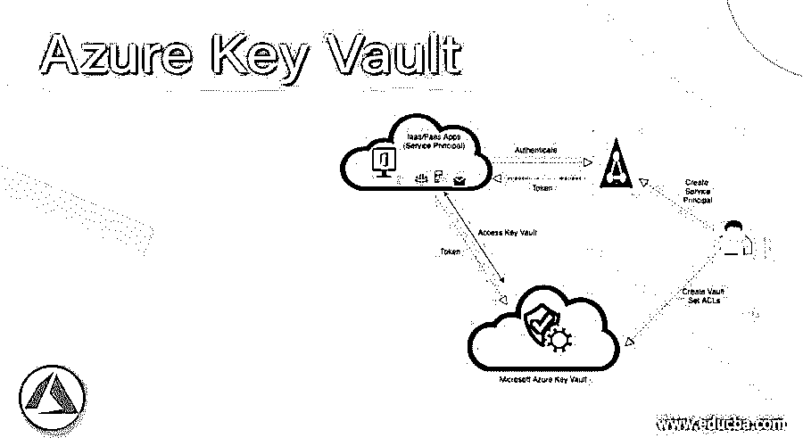

## 什么是微软 Azure Key Vault？

Microsoft Azure Key Vault 是一个基于云的服务，它安全地存储数据或机密，并且可以使用该数据和机密安全地进行访问。这个秘密数据可以是用户想要控制访问的任何东西，例如密码、TLS/SSL 证书或 API 密钥，或者加密密钥。密钥库服务将机密存储在容器中，密钥库使用两种类型的容器:

*   保险库:它支持存储软件、HSM 支持的密钥以及秘密和证书。
*   托管 HSM 池:该容器只支持 HSM 支持的密钥。

### 微软 Azure Key Vault 是如何工作的？

任何有权访问 Azure 订阅的人都可以创建 Azure Key Vault service，它可以由组织的安全管理员与其他服务一起实施和管理。

<small>Hadoop、数据科学、统计学&其他</small>

下图显示了 Azure Key Vault 的流程。

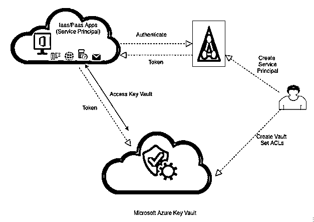

**保管库所有者:**保管库所有者拥有对密钥保管库的完全访问权，并控制保管库。

**保管库使用者:**保管库所有者可以授予保管库使用者访问权限，以便保管库使用者可以根据授予的访问权限执行各种操作。启用 vault 消费者访问后，消费者可以设计关键生命周期，并在需要时将敏感数据的访问权限授予其他人。根据审计日志，保管库所有者可以知道消费者在做什么，以及他们是否值得信任。

**Secrets:** 是一个字节序列，上限 10kB，可以赋给值。该值可以是证书或密码。消费者可以根据名称和授予的权限读取和存储值，并将这些数据作为键-值对存储在 HSM 中。

**密钥:**消费者可以使用密钥进行特定的密钥操作，如签名、加密、解密、验证等。密钥库处理所有这些操作，因为消费者不能读取值。密钥以两种格式存储

1.  软件密钥:这些很便宜，安全性也差。该密钥使用 Azure 虚拟机来处理操作，并用于开发/测试场景。
2.  **HSM 密钥:**这更安全，并且直接在 HSM 上执行操作，这些密钥很贵，用户需要使用顶级保险库。

**认证:** Azure key vault 高度安全，具有高级别的认证和授权，因为它集成了 **Azure Active Directory (AAD)。** AAD 用于授予**权限**给个人或应用程序访问金库。

每个帐户都将有一个唯一的帐户 ID，拥有 Azure 订阅和管理权限的用户可以登录到 Microsoft Azure 来创建一个保管库并存储机密数据。

### 如何在 Azure 中使用 key vault？

**先决条件:**

*   用户应该拥有有效的用户名和密码。
*   用户应该拥有 Azure 订阅才能创建 Azure 密钥库

**使用 Azure 门户的步骤:**

1.  **创建 Azure 密钥库:**

**步骤 1:** 使用以下 URL 登录 Azure 门户:

[https://portal.azure.com/learn.docs.microsoft.com](https://portal.azure.com/learn.docs.microsoft.com)

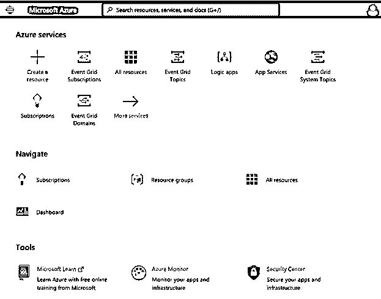

**步骤 2:** 从 Azure 门户主页选择**+创建资源**。

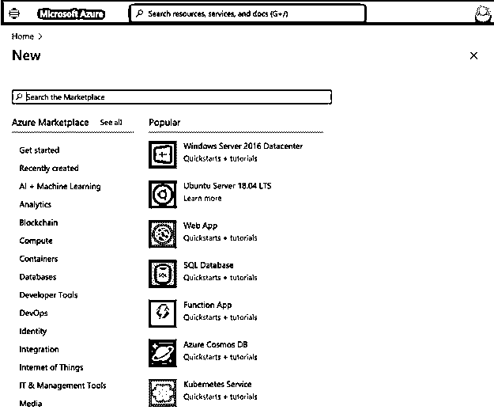

**第三步:**在 **Azure Marketplace** 的搜索栏中搜索 **Key Vault** ，点击进入打开 **Key Vault** 创建页面:

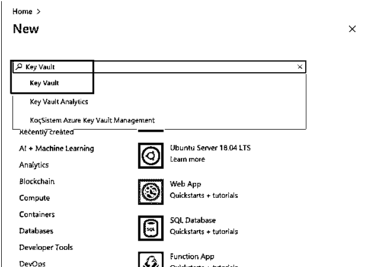

**第四步:**从**密钥库**页面选择**创建:**

**第五步:**在**上创建密钥库**用户需要输入项目详情:

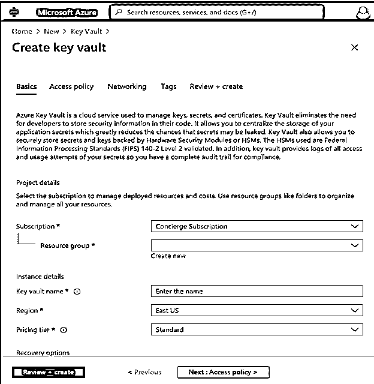

**第六步:**输入新堡垒的详细信息如下:

*   **订购**:从下拉列表中选择您订购的计划。
*   **资源** **组**:选择要创建堡垒的资源组。
*   **密钥存储库名称**:输入唯一的名称，存储库名称必须是字母数字，不能以数字开头。
*   **地区:**从下拉列表中选择地区/位置。
*   **定价层:**从下拉列表中选择定价层。

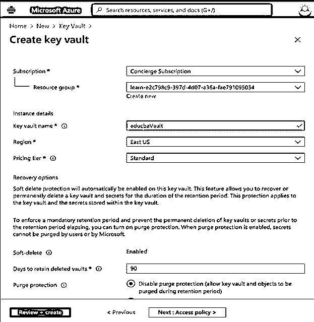

**第七步:**选择**审核+创建**，然后在页面中点击**创建**，部署工作区:

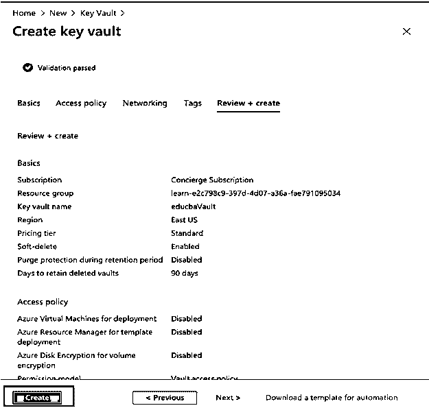

在页面上检查部署状态，直到完成

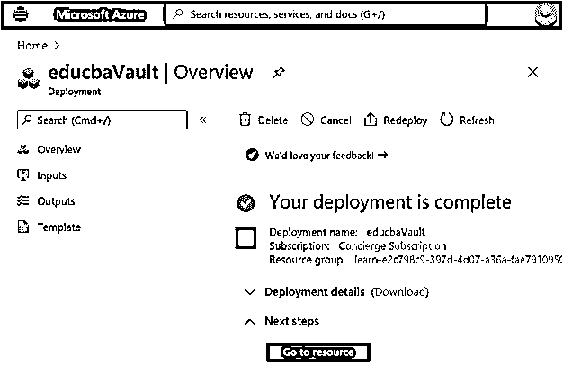

**1。添加一个秘密:**

**第一步:**在**蔚蓝门户**中，进入最近创建的**钥匙库**

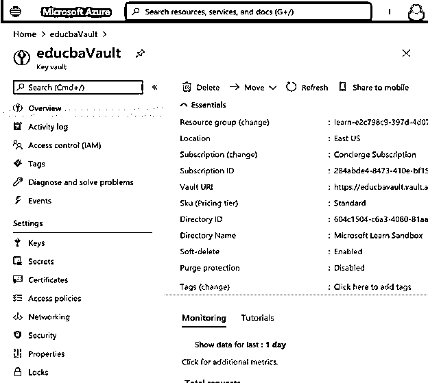

**第二步:**现在从左侧部分的**设置**中选择**秘笈**:

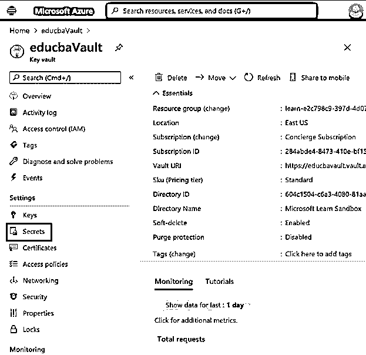

**第三步:**现在从秘密页面顶部选择**通用/导入**:

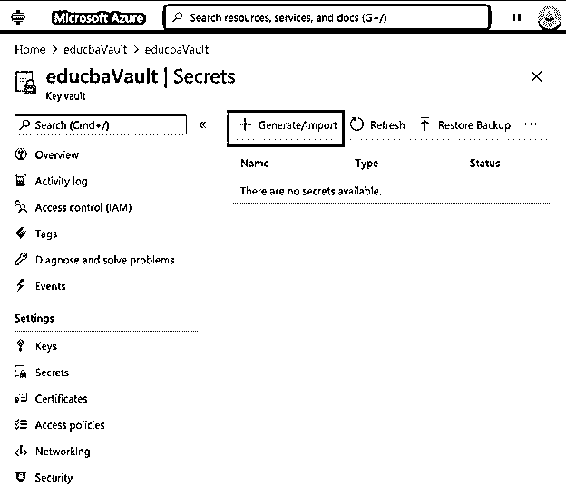

**第四步:** **创建秘密**页面打开，根据需要输入**名称**、**值、**和内容类型**激活**和**到期**日期填写表单:

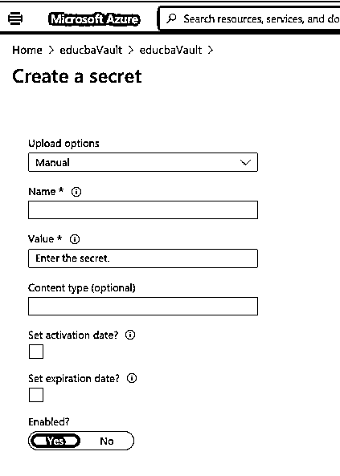

**步骤 5:** 现在点击页面底部的创建按钮:

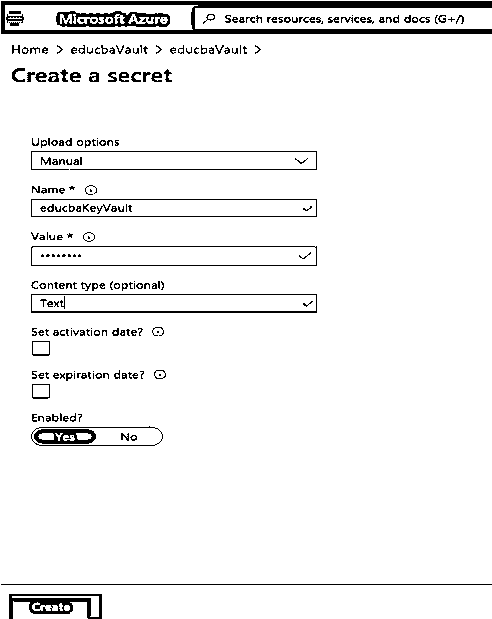

**步骤 6:** 验证新密码是否已添加到保险库中:

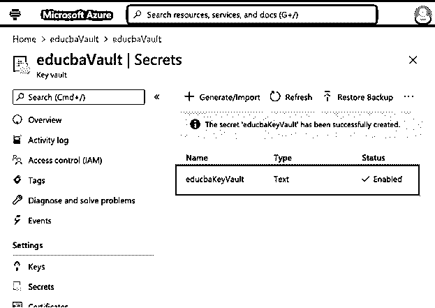

**2。展示秘密:**

**第一步:**从秘密列表中选择新添加的秘密:

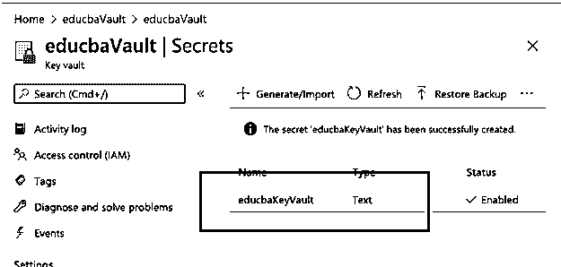

**步骤 2:** 从列表中选择当前版本的密码:

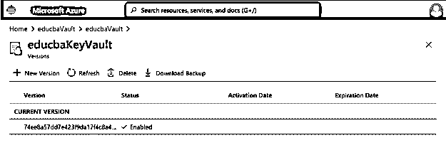

**第三步:**现在从页面中选择**显示秘密值:**

**

** 

**步骤 4:** 验证新添加的密码值是否正确显示在保险库中:

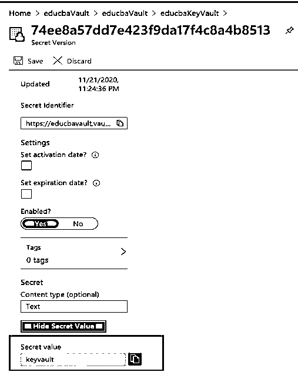

### Azure 密钥库的使用

*   它可以安全地存储并提供对密码、证书、令牌、API 密钥或其他秘密受控访问，因此具有秘密管理。
*   很容易创建和控制用于加密数据的加密密钥。
*   它支持管理和部署 TLS/SSL 层证书。
*   由于在 Azure Cloud 中，Key vault 可以很容易地与其他 Azure 服务集成，如 Azure App Service、Azure Disk Encryption 等。
*   它集中存储应用程序机密，因此允许用户控制分发。

### 结论

总之，用户可以使用 Azure Key Vault 服务来存储数据，也可以从其他 Azure 服务中受益，因为它很容易集成。一旦用户创建了密钥库，他/她就可以开始使用 Azure 来存储密钥及其值/秘密。

### 推荐文章

这是 Azure Key Vault 的指南。这里我们讨论一个什么是微软 Azure 密钥库？、工作、用途和使用步骤。您也可以浏览我们的其他相关文章，了解更多信息——

1.  [Azure 队列存储](https://www.educba.com/azure-queue-storage/)
2.  [Azure 事件网格](https://www.educba.com/azure-event-grid/)
3.  [Azure 桌面储物](https://www.educba.com/azure-table-storage/)
4.  [Azure 负载均衡器](https://www.educba.com/azure-load-balancer/)

