# Azure 负载平衡器

> 原文：<https://www.educba.com/azure-load-balancer/>

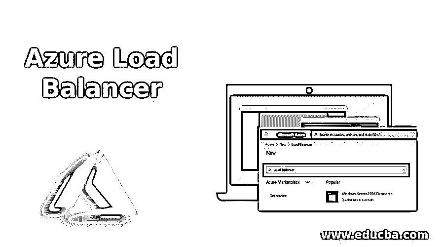

## Azure 负载平衡器简介

微软 Azure 提供负载平衡服务，将入站网络流量的负载分布在后端的不同机器或虚拟服务器上。负载平衡器有助于保持高可用性，并使硬件和软件能够抵御故障。Azure 在开放系统互联(OSI)模型中充当传输层。负载平衡器不会将流量导向故障机器。

Azure 负载平衡器中使用了两种类型的配置模式:

<small>Hadoop、数据科学、统计学&其他</small>

*   **外部—**公共负载平衡
*   **内部—**内部负载平衡

### Azure 负载平衡器的工作方式

Microsoft Azure 以两种模式为网络提供负载平衡，以便入站流量基于负载平衡的配置规则流动。负载平衡器有助于扩展我们的应用程序并创建高可用性服务。这里是 Azure 负载平衡器的两种工作模式:

#### 1.公共(外部)负载平衡器

公共负载平衡器提供从后端虚拟网络池到虚拟机(VM)的出站连接。对于这些出站连接，所有私有 IP 地址都被转换为公共 IP 地址，以便每个负载平衡器都被分配一个公共 IP 地址来接受来自互联网的请求。当客户端应用程序调用负载平衡器时，根据负载平衡器的配置，入站流量会在虚拟机之间进行分配。

#### 2.私有(内部)负载平衡器

如果我们在前端需要私有 IP，则使用私有负载平衡器。该负载平衡器使用私有 IP 地址进行呼叫，所有流量都被路由到虚拟网络内部，到达所请求的虚拟机。内部负载平衡器使用源 IP、源端口、目标 IP、目标端口和协议类型来平衡虚拟机中的互联网流量。它使用哈希函数来分配负载。如果源到目的地的 IP 连接丢失，则散列函数形成与单独端点的新连接。

下图显示了公共和私有负载平衡器

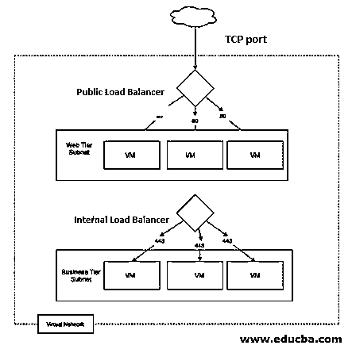

### 如何创建 Azure 负载均衡器？

1.使用有效的用户名和密码登录 Azure 门户:

2.从门户主页中选择创建资源。

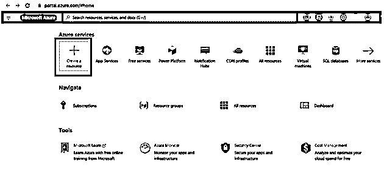

3.现在，在搜索框中从搜索市场搜索负载平衡器:

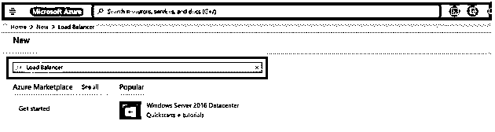

您将被重定向到负载平衡器页面，如下所示:

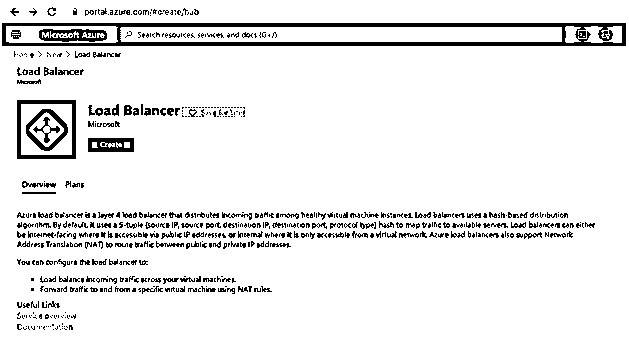

4.从负载平衡器屏幕中选择创建按钮:

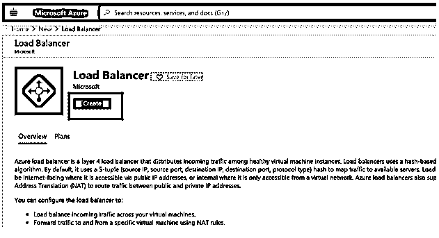

5.用户将被重定向到以下页面，询问配置详细信息:

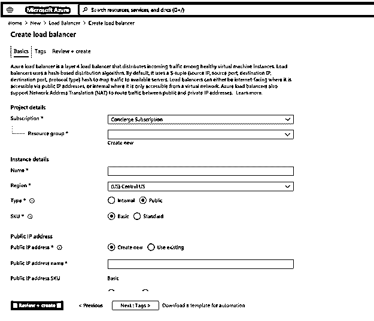

6.在“创建负载平衡器”页上输入以下信息:

在“基本”选项卡中输入信息:

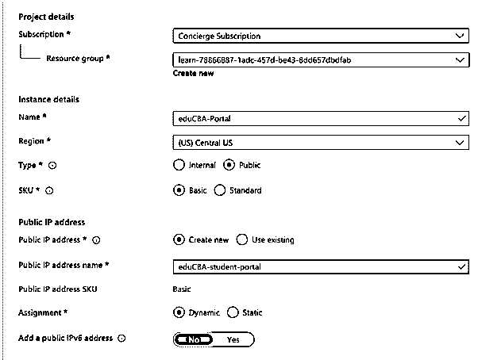

7.现在点击页面中的“查看+创建”按钮:

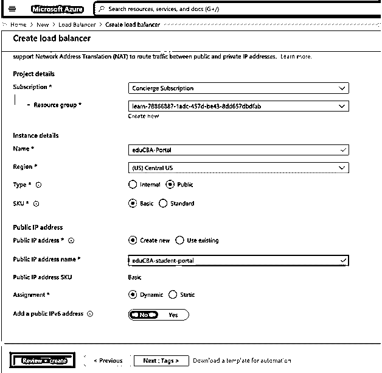

该页面将启动关于配置的运行验证，如果详细信息正确，将显示验证通过消息:

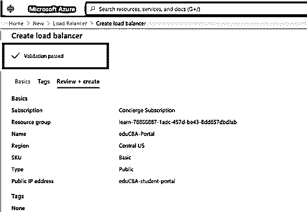

8.现在单击页面上的 Create 按钮，它将开始部署资源。

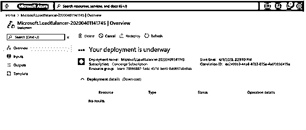

9.部署完成后，它将显示最近创建的负载平衡器:

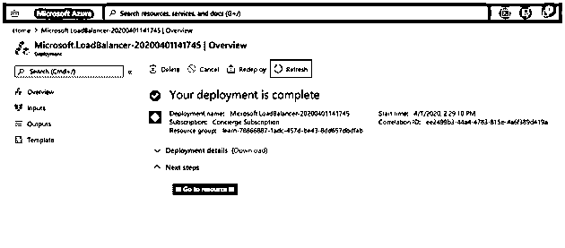

10.现在，从页面中选择“转至资源”,并从页面的右侧窗格中选择“后端池”:

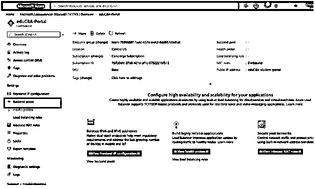

11.用户可以根据需要通过选择“add”按钮来添加后端池详细信息:

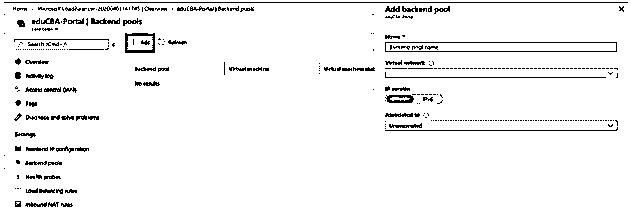

### Azure 负载平衡器的功能

下面是提到的特性:

1.  **负载均衡器:** Azure 负载均衡器为用户提供了基于角色配置负载均衡器的选项。基于内部或外部负载平衡器模式，互联网流量在 Azure 虚拟机上得到平衡。
2.  **可用性集:**负载均衡器在虚拟机和区域内以及跨虚拟机和区域分配 azure 的资源。
3.  **端口转发:**它提供了通过使用公共 IP 地址和端口将流量转发到任何特定虚拟服务器的功能。
4.  **应用程序不可知且透明:**此功能有助于用户根据 URL 或多站点托管来引导流量，因为负载均衡器不会直接与 TCP/IP 或 UDP 进行交互，而且在 HA(高可用性)端口的帮助下，TCP 和 UDP 会同时在所有端口上流动。
5.  **自动重新配置:**如果我们增加或减少后端池中的机器，负载平衡器可以自动重新配置。
6.  **运行状况探测器:**负载平衡器具有阻止流量流向故障机器的功能，这反过来有助于识别故障虚拟机，这是使用运行状况探测器完成的。用户可以配置健康探测器来检查后端服务器的健康状态
7.  **出站连接:**负载平衡器为虚拟网络内的 azure 虚拟机的公共或私有 IP 地址提供出站连接。

### 结论

微软 azure 提供数据负载平衡服务来维护虚拟机的高可用性和可扩展性，并提供系统的自动重新配置，以便用户在使用这些服务维护 Azure 时减少工作量。无论用户在互联网上做什么，我们都需要平衡负载，这是通过使用这些服务来完成的。在这里，我们还学习了如何创建 azure 负载平衡并基于角色配置它。

### 推荐文章

这是一个指南 Azure 负载平衡器。在这里，我们讨论如何创建一个 Azure 负载平衡器，以及它的工作原理和特性。您也可以阅读以下文章，了解更多信息——

1.  [Azure 备份](https://www.educba.com/azure-backup/)
2.  [Azure 服务](https://www.educba.com/azure-services/)
3.  [Azure 的替代品](https://www.educba.com/alternatives-to-azure/)
4.  [Azure 物联网边缘](https://www.educba.com/azure-iot-edge/)

