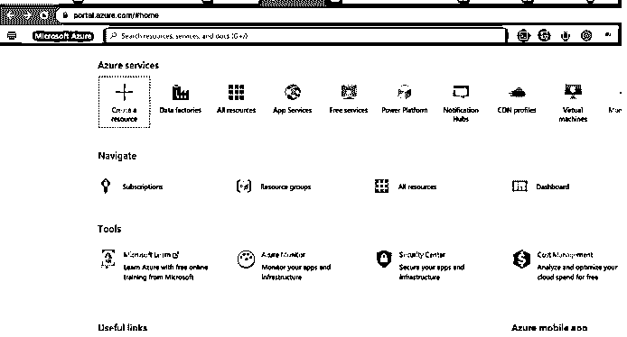
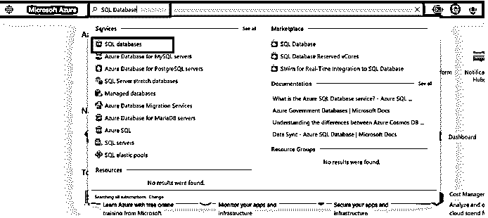
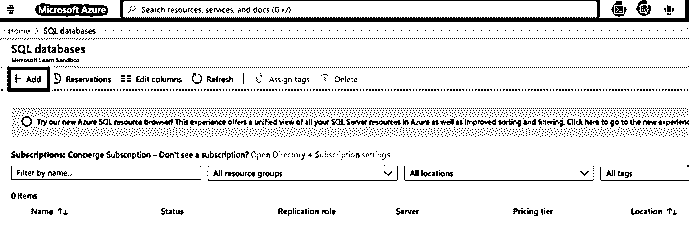
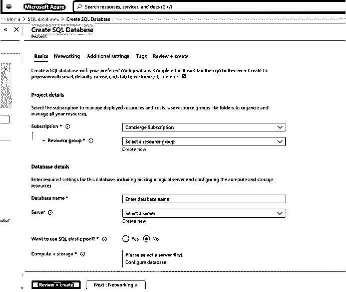
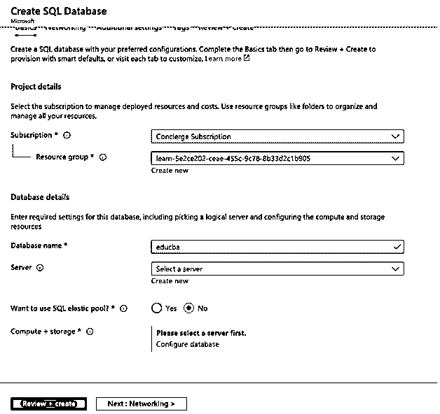
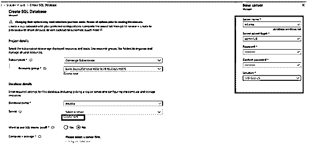
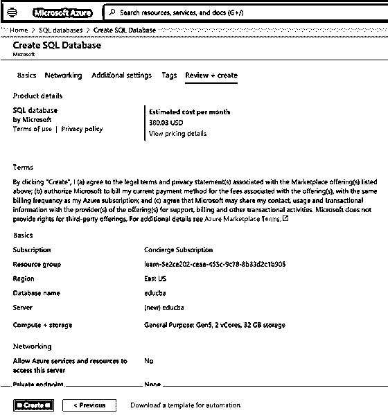
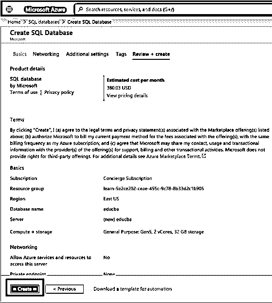

# Azure SQL 数据库

> 原文：<https://www.educba.com/azure-sql-database/>

## 什么是 Azure SQL 数据库？

微软 Azure SQL 数据库是一个基于云的数据存储系统，以前被称为 SQL Azure。它在单个基于云的平台上管理和维护其整个管理活动，如监控、更新、匹配和备份，因此它在 Microsoft Azure 中作为平台即服务(PaaS)提供。它总是启动和运行，因此它具有最新稳定版本的高可用性，并通过专注于数据库管理和优化活动提供了高性能。SQL 数据库引擎有助于处理和存储关系以及非关系数据。

### SQL 数据库是如何工作的？

Microsoft 中的 SQL 数据库与本地系统中的 SQL 数据库工作方式相同。它使用所有与关系数据或非关系数据(如 JSON、XML)相关的特性。SQL 具有微软提供的服务的一些优点，可以微调性能、可伸缩性、安全性，并且用户还可以将 SQL 集成到其他服务中。SQL 数据库可以通过以下三种方式在 Azure 中创建:

<small>Hadoop、数据科学、统计学&其他</small>

*   **Singleton Azure SQL 数据库:**它创建一个 SQL 数据库，并使用 SQL 数据库服务器来管理提供的所有服务。这里每个数据库都是单一的，有一些服务，并且是可移植的。
*   **弹性池或托管数据库服务器:**也称为托管 SQL 实例，因为该 SQL 数据库是托管 SQL Server 数据库引擎实例。它处理多个 SQL 数据库，这个 SQL 数据库可以根据需要进行扩展。弹性池具有成本效益，因为基于预算，用户可以优化数据库集的成本。
*   **数据库或逻辑数据库服务器:**要创建 Azure SQL 数据库，您需要有一个数据库服务器或逻辑服务器。逻辑服务器绑定多个、单个或一个数据库池的中央管理点，这个中央点是逻辑的。可以在与其资源组不同的区域中创建逻辑服务器。这些数据库可以具有相同的服务器名称、登录、防火墙设置，这也有助于性能调优。

#### Azure SQL 数据库服务层

它有三种基于层类型和应用程序的服务:

*   **通用/标准模式:**该服务层基于计算和存储服务的分离。它是一种架构服务，依靠高可用性和可靠性存储来复制数据库文件，即使 Azure 中发生基础设施故障，也不会丢失数据。
*   **业务关键/高级服务:**该服务层用于 OLTP 应用程序，具有高事务率和快速的输入输出操作响应。它使用多个副本，因此模型对失败具有弹性。
*   **超大规模服务:**该服务层是基于 vCore 的模型中的最新服务，具有高可扩展性。该模型提供的计算性能使用 azure 架构来扩展 SQL 的存储和计算资源。这里使用的资源远不止一般用途和业务关键型服务层。

### 如何在 Azure 中创建 SQL 数据库？

这里我们讨论如何在 azure 中创建 SQL 数据库？

**先决条件:**用户需要使用有效的电子邮件 id 和密码进行 Azure 订阅，因为创建 SQL 数据库可能需要资金。用户还可以使用 1 个月的免费访问来创建资源有限的 SQL 数据库。

#### 用步骤创建 SQL 数据库

*   使用有效的用户名和密码登录到 [Azure 门户网站](https://portal.azure.com/):

[https://portal.azure.com/#home](https://portal.azure.com/#home)

*   从 Azure 门户主页中，选择搜索栏并搜索 SQL 数据库:

*   现在，从 SQL 数据库页面选择+添加选项:

*   在“创建 SQL 数据库”页面上，用户可以根据需要在基本栏中输入详细信息:

*   输入所有必需的详细信息:

*   单击“新建”按钮创建新服务器，并输入所需的详细信息:

*   单击页面末尾的“查看+创建”按钮以验证详细信息，用户可以在这里检查成本以及使用的存储系统:

*   现在，在 Azure 中创建 SQL 数据库的最后一步是选择 create

*   部署完成后，页面上将显示如下消息:

**“您的部署已完成”**

### 结论

总之，Azure SQL 比传统的 SQL 数据库更快，具有内置的优化和调优能力。SQL 数据库使用其他 Azure 服务，用户在监控、维护和管理 Azure SQL 服务器上的工作量减少了。此外，根据可以使用存储系统的用户的需求，它是经济高效的。

### 推荐文章

这是一个 Azure SQL 数据库的指南。在这里，我们还将讨论简介及其在 azure 中的工作方式，以及如何在 Azure 中创建 SQL 数据库。您也可以看看以下文章，了解更多信息–

1.  [Azure vs 谷歌云](https://www.educba.com/azure-vs-google-cloud/)
2.  [分布式数据库系统](https://www.educba.com/distributed-database-system/)
3.  [Azure 中的表格](https://www.educba.com/tables-in-azure/)
4.  [Azure 服务](https://www.educba.com/azure-services/)

