# 蓝色堡垒

> 原文：<https://www.educba.com/azure-bastion/>

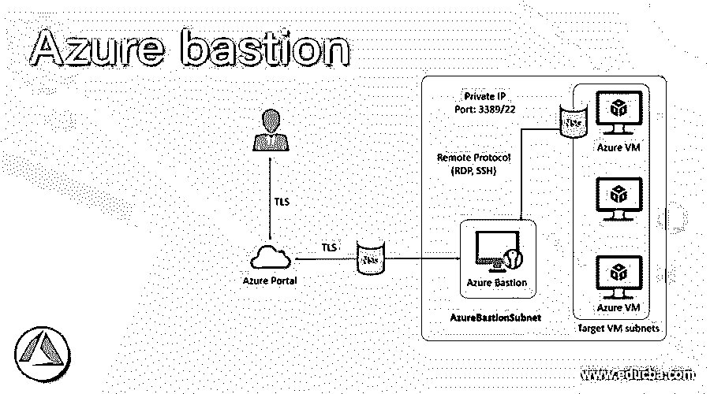

## Azure bastion 简介

微软 Azure Bastion 是一个全平台托管服务，用户可以部署在云上；该服务允许用户使用 Azure 门户或浏览器连接到虚拟机。Azure bastion 服务作为虚拟网络的一部分提供，它通过 TLS 提供从 Azure 门户到虚拟机的安全无缝的 RDP/SSH 连接。如果我们使用 Azure Bastion 进行连接，虚拟机不需要公共 IP 地址、代理或第三方软件。Azure bastion 通过提供对 RDP/SSH 的安全访问来隐藏 RDP/SSH 端口，从而保护虚拟机免受外界影响。

### Azure bastion 是如何工作的？

Microsoft Azure bastion 不依赖于订阅/帐户或虚拟机，因为它是根据虚拟网络部署的。当虚拟网络中提供 Azure bastion 时，虚拟网络中的虚拟机使用 RDP/SSH 进行连接。RDP 和 SSH 被用作连接 azure 中运行的工作负载的基本连接服务。在互联网上展示 RDP 或 SSH 端口是非常不安全的，这可以被视为一个重大威胁，而且由于协议漏洞，这种情况经常发生。为了防止系统受到这些威胁和漏洞，用户可以将堡垒主机或跳转服务器部署到外围网络的公共端。bastion 主机服务器的设计和配置主要是为了抵御任何攻击。该服务器还提供到网络内部的 RDP/SSH 连接，以及在堡垒后面使用的工作负载。

<small>Hadoop、数据科学、统计学&其他</small>

Azure bastion 在部署时遵循以下步骤，如下图所示:

*   Azure bastion 主机迁移到虚拟机中的虚拟网络。
*   [使用 HTML5](https://www.educba.com/what-is-html5/) 浏览器用户连接到 Azure 门户。
*   用户可以选择要连接到哪些虚拟机。
*   RDP/SSH 会话在浏览器中打开，只需在 Azure 门户中单击一下。
*   Azure VM 不使用任何公共 IP 进行连接。

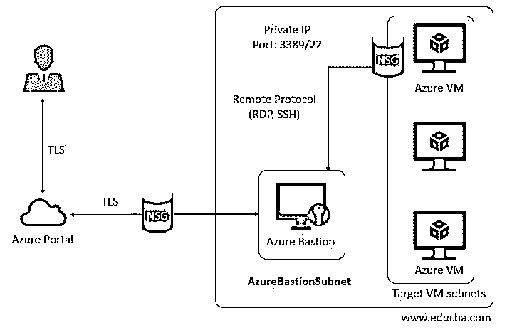

### 如何创建和使用 Azure Bastions？

**先决条件:**

在学习创建 Azure Boards 之前，用户必须拥有 Azure 订阅，这样他们才能使用有效的凭证登录 Azure 门户并创建 Azure Bastions。

**使用 Azure 门户的步骤:**

**创建堡垒主机:**

#### 第一步

使用以下 URL 登录 Azure 门户网站:

https://portal.azure.com/learn.docs.microsoft.com

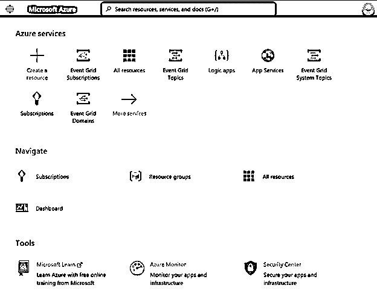

#### 第二步

从 Azure 门户主页，选择 **+** 创建资源。

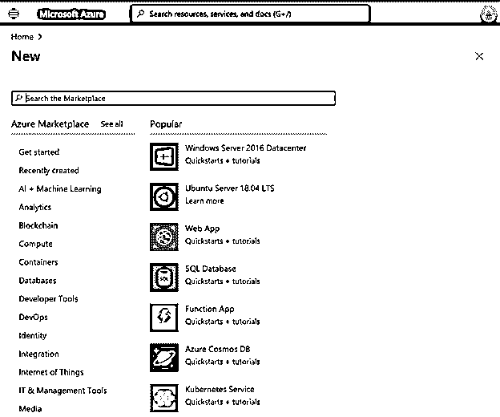

#### 第三步

在 Azure Marketplace 的搜索字段中，搜索 Bastion 并点击 enter 打开 Bastion 页面:

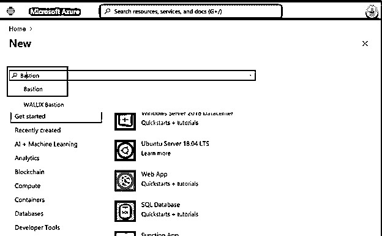

#### 第四步

从堡垒页面中，选择创建 **:**

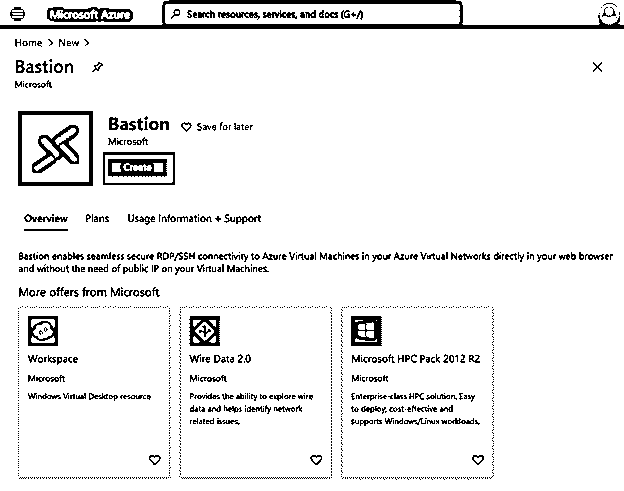

#### 第五步

在“创建堡垒”页面上，输入如下详细信息:

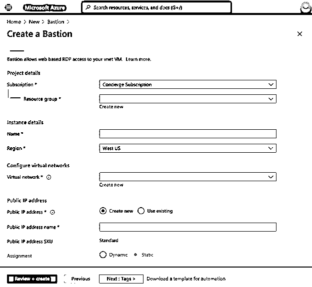

#### 第六步

输入新堡垒的详细信息，如下所示:

**订购**:从下拉列表中选择您订购的计划。

**资源** **组**:选择要创建堡垒的资源组。

**Name** :输入堡垒实例的唯一名称。

**虚拟网络:**选择在该位置创建的虚拟网络。

**公共 ip 地址:**从现有或新的地址中选择公共 IP 地址。

**公共 ip 地址名称:**输入公共 IP 地址的名称。

#### 第七步

从虚拟网络中选择新建以创建新的虚拟网络:

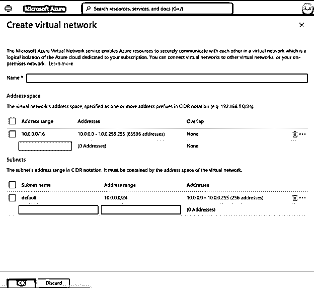

#### 第八步

在创建虚拟网络:

*   在子网部分，子网名称应始终以 AzureBastionSubnet 开头。

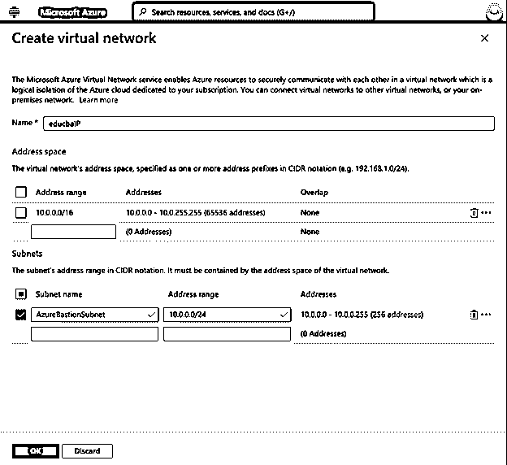

#### 第九步

指定所有详细信息并创建新的虚拟网络后，从页面中选择查看+创建以验证详细信息，然后单击创建:

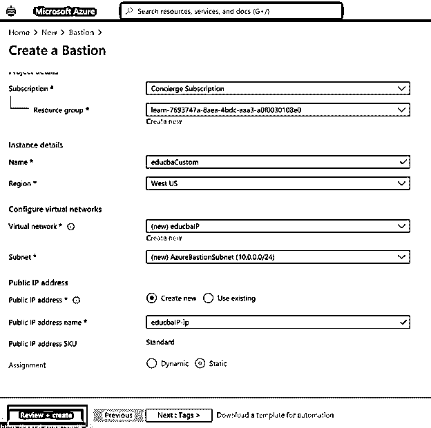

#### 步骤 10

部署完成后，用户可以看到部署正在进行的消息。

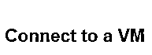

#### 步骤 11

从主页中，检查新创建的虚拟机并打开虚拟机:

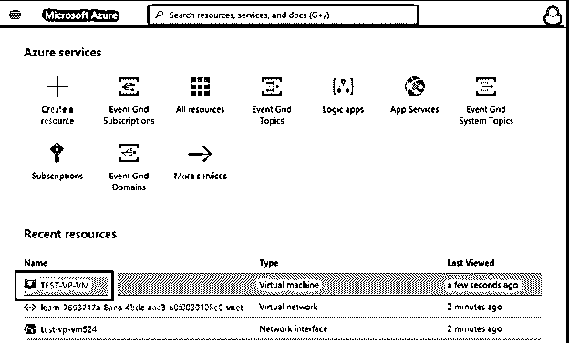

#### 第 12 步

从虚拟机页面中选择连接:

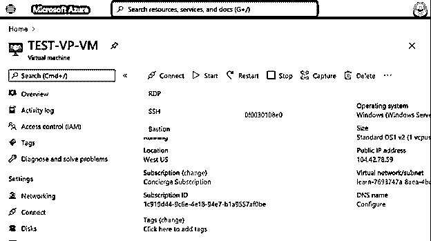

#### 步骤 13

从下拉列表中选择堡垒:

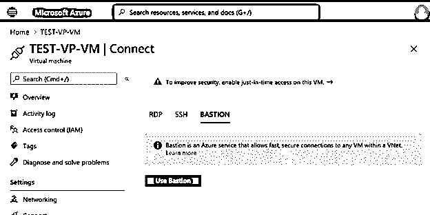

#### 第 14 步

从要求用户输入用于创建虚拟机的用户名和密码的页面中选择使用堡垒，然后单击连接:

#### 第 15 步

这将直接在 Azure 门户中打开一个虚拟机。

### Azure 板的用途

*   RDP 和 SSH 直接集成到 Azure 门户中，只需点击一下鼠标；用户可以获得无缝体验。
*   它使用基于 HTML5 的 web 客户端，这有助于在端口 443 上通过 TLS 获得 RDP/SSH 会话，这有助于安全地穿越公司防火墙。
*   Azure 虚拟机在使用 Bastion 时不需要公共 IP。
*   这是一个完整的平台管理服务，可以防止使用 bastion 的零日使用，并且它总是最新的。
*   用户不需要在 Azure bastion 上应用任何 NSG，因为 Azure bastion 通过私有 IP 连接到虚拟机。

### 结论

总之，Azure bastion 帮助用户通过私有 IP 连接到虚拟机，并由于 RDP/SSH 连接而提供内置安全性。由于 bastion 与其他 Azure 服务的无缝集成，用户只需点击一下鼠标就可以管理 Azure bastion。

### 推荐文章

这是蓝色堡垒的指南。在这里，我们讨论 Azure bastion 如何工作，如何创建和使用它，以及步骤。您也可以看看以下文章，了解更多信息–

1.  [Azure 桌面储物](https://www.educba.com/azure-table-storage/)
2.  [Azure 数据工厂](https://www.educba.com/azure-data-factory/)
3.  [Azure Blob 存储](https://www.educba.com/azure-blob-storage/)
4.  [Azure 数据库服务](https://www.educba.com/azure-database-services/)

