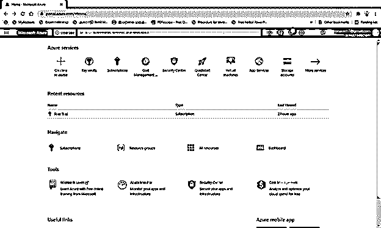
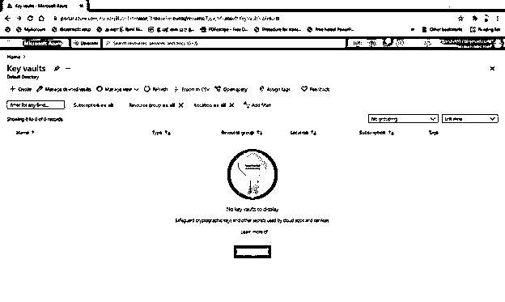
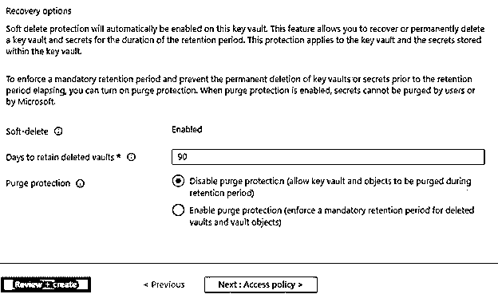
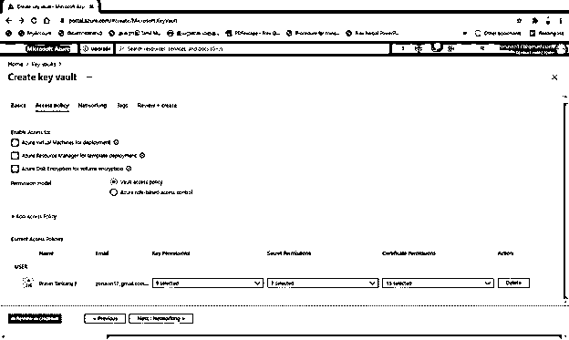
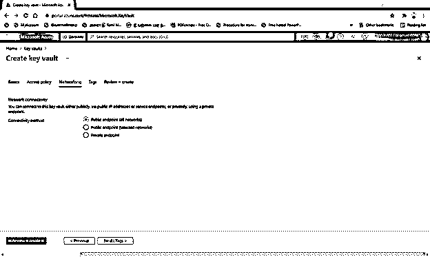
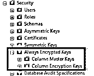
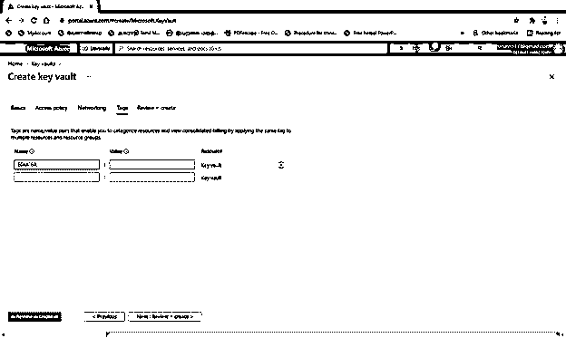
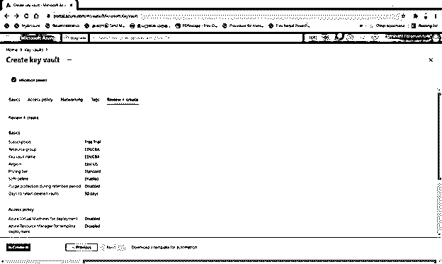
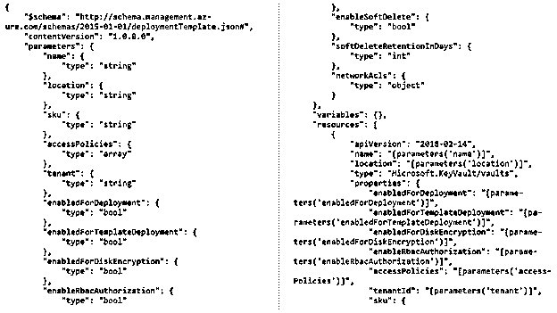
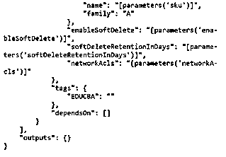

# Azure 存储加密

> 原文：<https://www.educba.com/azure-storage-encryption/>

## Azure 存储加密简介

许多公司都要求进行存储加密，因为它不需要任何编码过程，而且是一个简单的、随时可用的功能。但是它适用于队列、文件、表和 blob 存储。在 Azure dashboard、CLI、PowerShell、REST API 和。NET 客户端库，每个存储帐户可以选择启用或禁用安全加密。在 Microsoft 中，资源管理器帐户的高级和标准存储都是加密的。

### 如何在 azure 中进行存储加密？

当数据存在于云中时，使用服务器端加密技术对 azure 存储进行加密。数据传输的两端都遵循高级加密技术，它类似于 windows BitLocker 加密。Azure 中的存储加密可以通过两种方法完成。一种是使用基于密钥的认证方法，另一种是使用双重加密数据的基础设施加密。Azure 中的服务级加密(SSE)是通过客户管理的密钥或微软管理的密钥来完成的。

<small>Hadoop、数据科学、统计学&其他</small>

微软托管的密钥是通过 Azure key vault 实现的。以下是使用密钥库在 Microsoft Azure 中创建存储加密所涉及的步骤。

*   提供新的或现有的 Azure 密钥库。点击新选项，选择如图所示的安全和身份，然后选择密钥库。
*   在给定字段中输入名称、位置、资源组和订阅。然后创建密钥库。

*   由安全管理员创建新密钥。
*   选择密钥库后，我们必须配置密钥。因此，从门户中选择更多，并在安全和身份屏幕中选择密钥库。
*   在搜索栏中，键入 key vault，它会在服务菜单中显示服务列表。

*   在密钥库列表中，选择+按钮，通过给出密钥库的名称来管理已经加密的密钥。
*   从密钥列表中选择生成，输入密钥的名称，然后选择创建选项。
*   密钥库中的访问权限应该是解包、包装、签名、验证、列出、创建和获取。因此，在 SQL server 访问之前，应该确保密钥正确，并在适当的策略中配置访问策略。
*   返回到“密钥库概述”页面后，在导航列表中选择访问策略。
*   从列表中选择您之前提到的帐户。

*   选择密钥权限选项，检查打开、包装、获取、签名、创建、列出和验证。选择确定并保存设置以继续。

*   然后使用 DBA 生成主和列加密密钥。
*   通过建立 SQL server Management studio，确保与 SQL Server 的 internet 连接稳定。如果 Azure key vault 和 SQL server 都没有连接，我们必须用 SSMS 17.2 版本更新。

*   在数据库中，展开选项并启用始终加密选项。然后从展开安全性中展开加密密钥列。

数据库->总是加密->安全性->总是加密密钥->列主密钥->列加密密钥。

*   最后，在“主密钥”列中，选择“新建”向导并选择“总是加密密钥的文件夹”，然后在同一个向导中再次选择一个新的主密钥列。

*   为密钥创建一个名称，并在密钥库中将选项更改为密钥库。然后，可以通过选择登录选项来提供凭据。
*   验证身份后，身份验证成功，并选择所需的订阅、功能和密钥库。然后，应该使用“确定”按钮关闭对话框。

*   我们还可以通过选择生成一个密钥选项，从新的列主密钥在 azure key vault 中创建新的密钥。通过简单地展开列主关键字的文件夹，SQL 导航系统 SSMS 将显示最近创建的关键字。

数据库->总是加密->安全性->总是加密密钥->列主密钥

*   如果你选择了列加密密钥的文件夹并在列加密密钥中选择了新的列，同时，如果你选择了总是加密密钥的文件夹并选择了新的选项。那么这两个选项将显示相同的向导。

Azure 中的磁盘加密使用户能够提到 IaaS 和 OS 上需要加密的数据磁盘。DM-crypt 加密在 Linux 中被遵循，并且在 Windows 操作系统加密中被应用。

在 Linux 中，shell 中的数据分区不能加密。它适用于在 Linux 操作系统中上传到 azure 的特定部分的本地数据。使用表，可以对分区进行特定的访问。

在客户端加密中，应用程序对数据进行加密，并通过网络传输到存储帐户。

当数据到达主机时，应用程序再次对其进行解密。为了暗示这一点，Azure key vault 被启用，其中 Azure 中的 active directory 允许访问密钥来进行加密。因此，它设法解密金库，提取密钥，并应用于客户端加密。在 blobs 中，加密遵循 SSE 和 HTTPS 的组合，以满足安全策略的额外要求。在没有任何代码的情况下执行是解密和加密的最佳方法。

在数据传输时，HTTP 协议用于在开放的网络空间上提供安全的通信。

在 SaaS，查询参数暗示使用 HTTP 只能用 URL 操作。在文件共享中，在 Windows encrypt 上，对公共互联网上流动的数据执行 SMB 3.0。在 Linux 和 Apple 中，执行安全支持 SMB 3.0，以在传输中加密数据的机器上嵌入文件共享服务器。

### 结论

Azure key vault 保护 Azure 服务和应用程序中使用的加密代码。加密和配置密钥可以保存在 Azure 密钥库中。它不能直接控制 Active Directory 中的数据对象，但可以访问 AD 中的 Azure key vault，这意味着用户可以将存储密钥放在 Azure key vault 中，然后向相关组、应用程序或用户提供访问权限。

### 推荐文章

这是 Azure 存储加密指南。这里我们详细讨论如何在 azure 中执行存储加密。您也可以看看以下文章，了解更多信息–

1.  [天蓝色钥匙金库](https://www.educba.com/azure-key-vault/)
2.  [Azure 存储](https://www.educba.com/azure-storage/)
3.  蔚蓝宇宙数据库
4.  [Azure 中的 CDN](https://www.educba.com/cdn-in-azure/)

