# Azure 租户

> 原文：<https://www.educba.com/azure-tenant/>

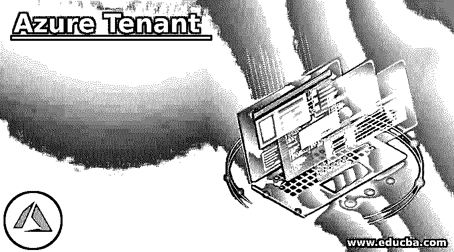

## Azure 租户简介

Microsoft Azure 云服务中的租户代表在 Azure Active Directory 中创建的组织。Azure Active Directory 将所有用户和应用组织到一个组中，这些组称为租户。App developer 接收租户作为 Azure Active Directory 的专用实例，以生成与微软云服务的关系。此租户 id 可用于登录 Azure、Microsoft 365 或 Microsoft Intune 的凭据，因为每个 Azure AD 租户都有唯一的身份和应用注册。

### Azure Tenant 是如何工作的？

Microsoft Azure 帐户具有全球唯一的身份，以提供对 Azure 订阅和服务的访问。Azure Ad 有多个身份验证协议来保护云中的服务。它是由组织管理的 azure active directory 服务的独立实例。

<small>Hadoop、数据科学、统计学&其他</small>

如下图所示，订阅可以有单个或多个信任关系。每个订阅都应该始终与至少一个租户相关联，这种租户和订阅的结构允许大型组织通过在其中包含的所有资源上设置某些安全策略和规则来管理多个订阅。每个 Azure active directory 租户都有一个帐户所有者，这只不过是一个使用唯一邮件 id 和账单地址开设的 Azure 帐户。应用程序开发人员或管理员可以根据需要向租户添加多个用户，也可以邀请其他活动目录的访客访问订阅中的资源。

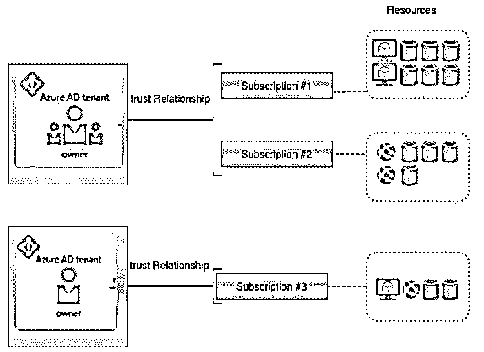

### 如何在 Azure 中创建和使用租户？

**先决条件:**

在学习创建之前，用户必须拥有 Azure 订阅，以便您可以使用有效凭据登录 Azure 门户并创建它。

**使用 Azure 门户的步骤:**

**步骤 1:** 使用有效凭证登录 Azure 门户:

打开 Azure 门户。

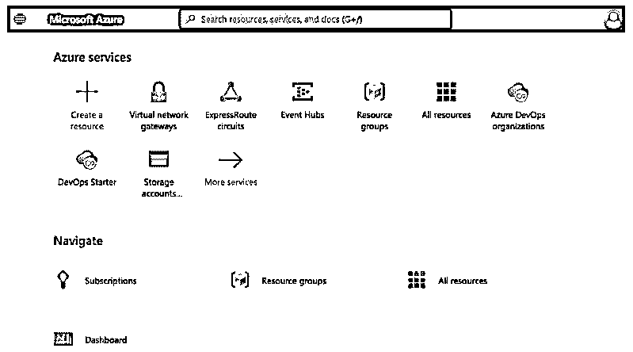

**步骤 2:** 从 Azure 门户选择创建资源链接，为租户创建新资源:

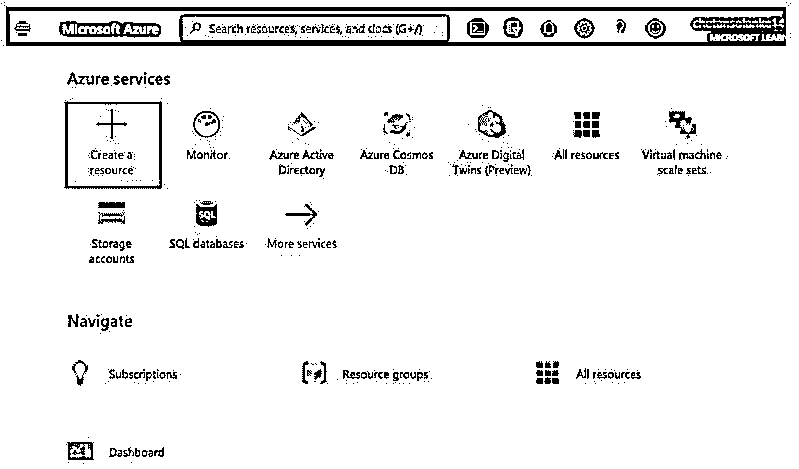

**第三步:**在搜索中，Marketplace 字段输入 Azure Active Directory:

**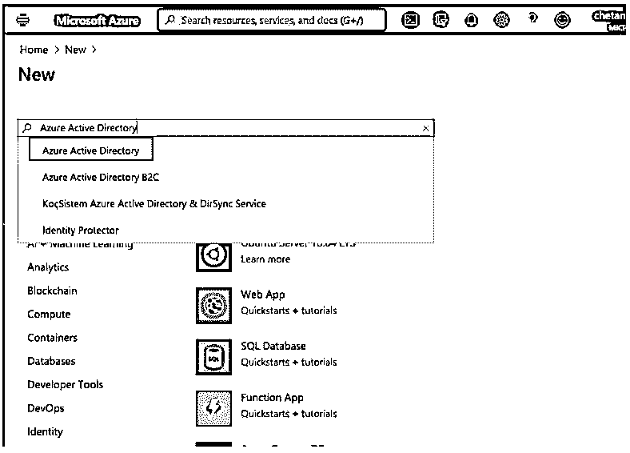

** 

**步骤 4:** 从 Azure Active Directory 中点击创建链接:

**

** 

**步骤 5:** 现在，将打开一个新页面，其中包含“创建租户:

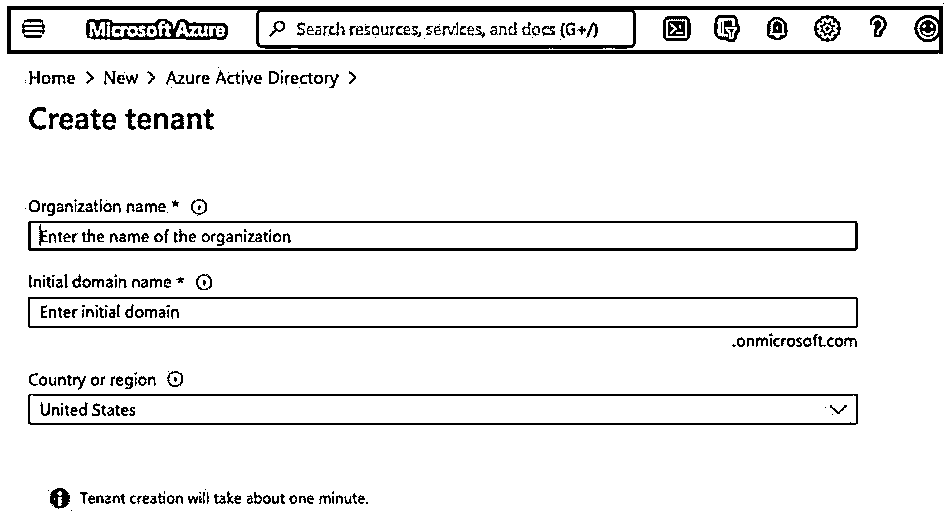

**第 6 步:**输入如下租户详细信息，然后选择“创建”按钮创建一个新租户:

*   **组织名称:**输入组织名称的目录名称。
*   **初始域名:**用户可以添加自定义域名，默认域名为 onmicrosoft.com。
*   **国家或地区:**用户可以根据所在位置选择地理区域。

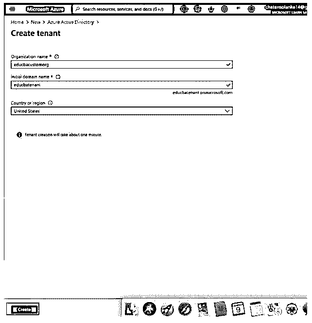

**第七步:**新建租户，弹出如下通知:

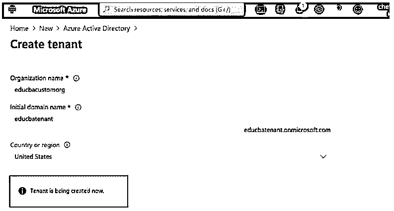

**步骤 8:** 选择创建的新租户，查看概览:

**创建租户:**

**步骤 9:** 用户可以通过选择+创建租户，在新租户中从两种类型的 Azure Active Directory 或 Azure Active Directory(B2C)创建租户:

**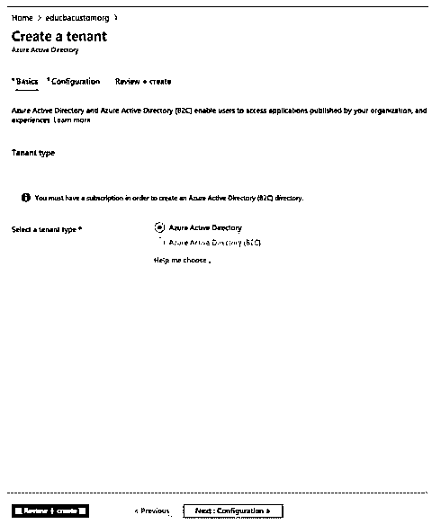

** 

**第十步:**选择租户类型后选择审核+创建；这将产生一个新的租户。

**清理资源:**

**步骤 11:** 确保您已登录到新租户目录，并单击删除租户以删除租户。

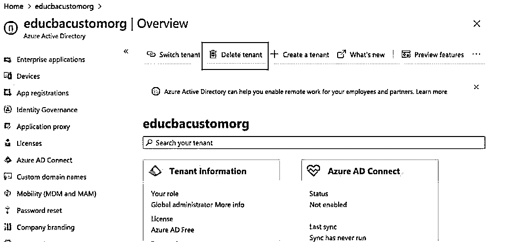

**Step 12:** To delete the newly created Tenant click on the Get permission to delete azure Resource and then delete.

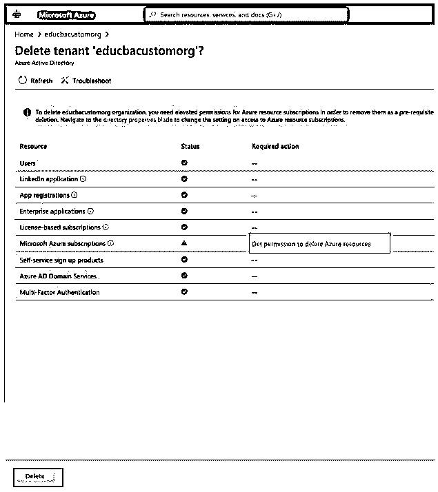

#### Azure 租户的使用

*   用户只需一个登录凭据即可登录 UW 用户的 Microsoft Cloud identity。
*   多租户用户可以在共享环境中和跨多个组织访问其他服务。
*   AD 租户具有基于 web 的身份验证标准，因此非常安全，因为它使用 OpenId 和 OAuth。
*   它提供的访问权限包括微软 Office 365、Dynamic 365 和 Azure Intune。
*   单个租户可以与多个订阅相关联。

### 结论

它帮助用户在 azure active directory 中构建组织，并且可以轻松创建，用户也可以根据需要创建单租户或多租户。此外，微软有一个按次付费的定价模式，因此用户只需为租户使用单个 id 的资源付费。

### 推荐文章

这是 Azure 租户指南。这里我们讨论一下入门，工作，如何在 azure 中创建和使用租户？和用途。您也可以看看以下文章，了解更多信息–

1.  [Azure 队列存储](https://www.educba.com/azure-queue-storage/)
2.  [Azure ExpressRoute](https://www.educba.com/azure-expressroute/)
3.  [Azure 负载均衡器](https://www.educba.com/azure-load-balancer/)
4.  [Azure 虚拟机](https://www.educba.com/azure-virtual-machines/)

