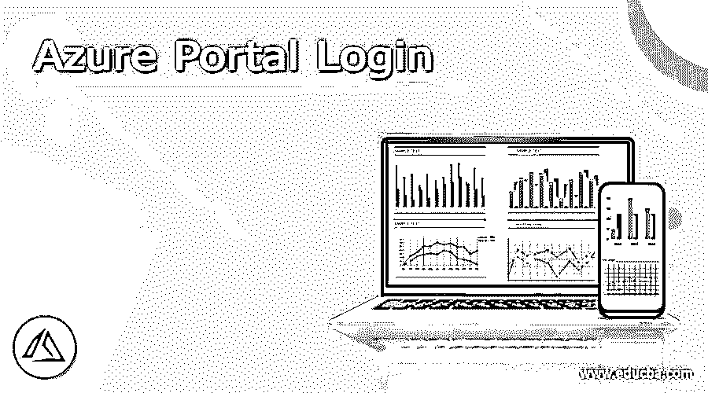
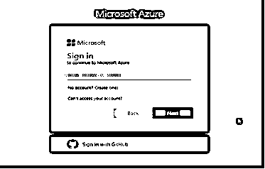
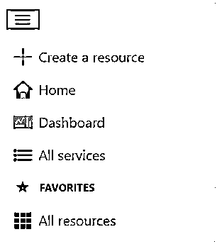
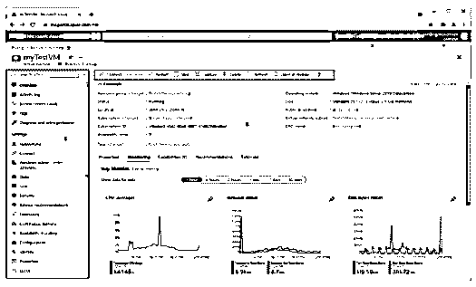
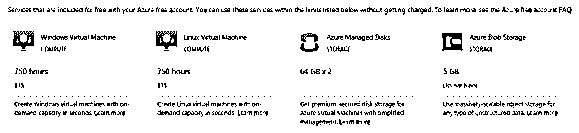
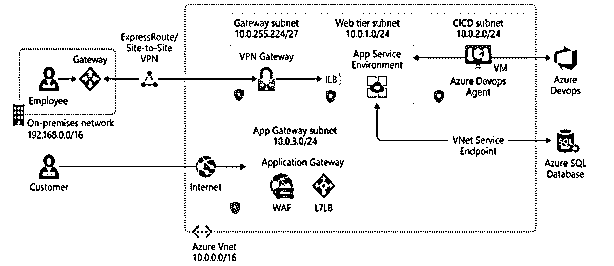

# Azure 门户登录

> 原文：<https://www.educba.com/azure-portal-login/>

## Azure 门户登录的定义

基本上，Azure portal 为用户提供不同种类的服务，并且管理所有的服务。通常微软提供的 azure 服务是一个 azure 客户端。这是一个可以随时随地访问的一体化门户，它在单一位置提供访问和管理功能。换句话说，我们可以说它是一个基本的 web 应用程序，在这个门户的帮助下，我们可以构建一个应用程序，可以管理应用程序，也可以通过使用单个控制台窗口来监控应用程序。首先，我们需要登录 Azure 门户，如果你不是注册用户，我们需要先注册。它提供 30 天的试用服务。

### 1.azure 登录简介

Azure 入口是一个电子的、集中的控制中心，它提供了一个订购在线仪器的选择。有了 Azure 入口，你可以利用图形用户界面处理你的 Azure 会员资格。您可以构建、监督和筛选从简单的 web 应用程序到复杂的云安排的一切。为资产的协调视角制作自定义仪表板。为理想的邂逅设计开放的选择。

<small>Hadoop、数据科学、统计学&其他</small>

Azure entry 旨在提供多功能性和不间断的可访问性。它存在于每个 Azure 数据中心。这种设计使得 Azure entryway 能够应对个人数据中心的失望，并通过靠近客户端来保持与网络间歇的战略距离。Azure 入口通道不断刷新，不需要个人时间进行支持练习。

### 2.先决条件 azure 登录

在登录之前，我们需要遵循如下相同的流程。

首先，我们需要通过使用 Azure AD 租户来连接 Azure AD。我们既可以使用免费试用，也可以使用官方门户网站。

之后，我们需要连接到广告服务器。Azure AD Connect worker 包含基本的个性信息。这是非常重要的监管准入该工人得到适当的。

我们必须有一个帐户才能登录。你应该有一个 Azure AD 全局管理员来代表你需要协调的 Azure AD 用户。此记录应该是日常计划帐户，不能是 Microsoft 帐户。如果您利用 DirSync 的快速设置或更新，您应该让企业管理员代表您的内部 Active Directory。万一你利用自定义设置设置方式，你有更多的选择。现在我们需要连接服务器。Azure AD Connect worker 需要一个针对内部网和 web 的 DNS 目标。DNS 工作器应该可以选择确定内部 Active Directory 和 Azure AD 端点的名称。天蓝 AD Connect 要求每个设计空间都有网络可用性。如果您的 intranet 上有防火墙，并且您需要打开 Azure AD Connect 工作人员和您的区域监管机构之间的端口，请参阅 Azure AD Connect 端口了解更多数据。我们还需要 PowerShell 和> net 框架。当我们完成这个过程，然后我们可以轻松地登录到 Azure 应用程序。

### 3.Windows 的 azure 登录步骤

出于登录目的，我们需要登录凭证。
下面的屏幕截图显示了登录页面的如下功能。

这里我们需要插入有效的用户名和密码来登录 Azure 门户。
成功登录后，显示 Azure 门户菜单。如下图截图所示。以下是所有来自官网的截图。

它显示了不同的选项，如上图所示。

**Azure 仪表盘:**

仪表板提供了对您最重要的会员资产的参与视角。我们已经给了你一个默认的仪表盘来启动你。您可以修改这个仪表板，将您经常使用的资产放在一个单独的视图中。你对默认设置的任何改进都会影响你的体验。尽管如此，您可以制作额外的仪表板供自己使用，或者分发您修改过的仪表板并提供给您的协会中的不同客户。

Azure 的入口菜单和页面标题是世界范围内一致存在的组件。这些勤奋的组件是与每一个单独的帮助或包含相关的 UI 的“外壳”,而标题允许全球范围的控件进入。资产的设置页面(这里和那里被称为“锐边”)同样可以具有资产菜单，以帮助您在突出显示之间移动。下面的截图显示了 Azure 门户的基本元素，如下所示。

Azure 向用户提供不同种类的免费服务，如下图所示。

通过使用 Azure portal 我们可以很容易地管理基于 web 的应用程序，这需要指定网络的网关；我们还需要指定子网掩码。在这种情况下，我们需要设置 Azure 环境，即 Azure tire 结构、azure DevOps 代理的类型等。这里我们还需要指定 Azure 服务的数据库；一切以用户需求为基础。所有组件都借助互联网进行通信。这些都是我们在下面的截图中展示的组件，这个截图是我们从 azure 的官网导入的。

### 如何让 azure 受益？

现在我们来看看 azure 的好处如下。

1.页眉。显示在每个入口页面的最高点，包含全球组件。
2。全球追捕。利用搜索栏快速查找特定的资源、帮助或文档。
3。全球控制。像每个世界范围的组件一样，这些元素贯穿整个网关，包括:云外壳、成员通道、警告、入口设置、帮助和支持，以及给我们发送批评。

### 结论

我们希望从这篇文章中你能学到更多关于 Azure 门户登录的知识。从上面的文章中，我们已经理解了 azure 门户登录的基本思想，我们也看到了 azure 门户登录的表示。从这篇文章中，我们了解了如何以及何时使用 Azure 门户登录。

### 推荐文章

这是 Azure 门户登录指南。这里我们讨论一下定义，介绍，以及如何让 azure 受益？以及详细的示例和输出。您也可以看看以下文章，了解更多信息–

1.  [Azure 通知中心](https://www.educba.com/azure-notification-hub/)
2.  [Azure 实例类型](https://www.educba.com/azure-instance-types/)
3.  [Azure 混合优势](https://www.educba.com/azure-hybrid-benefit/)
4.  [Azure 架构](https://www.educba.com/azure-architecture/)

