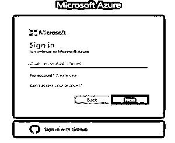
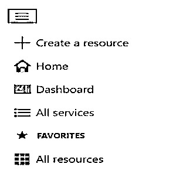
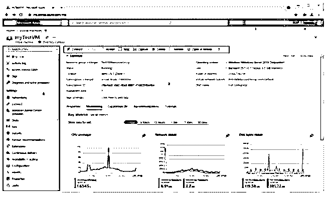
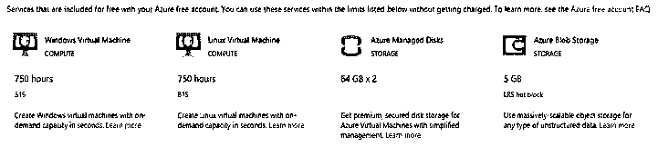
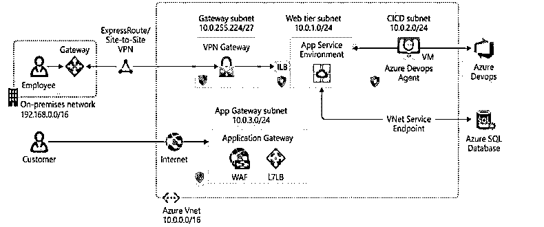

# Azure 登录

> 原文：<https://www.educba.com/azure-login/>

## Azure 登录简介

以下文章提供了 Azure 登录的概要。本质上，Azure entry 为客户端提供了各种类型的管理，它同样处理所有的管理。通常，微软为天蓝色客户提供紫蓝色支持。这是一个随时随地都可以进入的入口，它在一个孤立的地方提供访问和监督功能。在其他情况下，我们可以说它是并且可能是一个基础 web 应用程序，在此条目的帮助下，我们可以组装一个应用程序，可以处理该应用程序，也可以通过利用一个单独的控制中心窗口来筛选该应用程序。首先，我们需要登录 Azure entryway。如果您不是注册客户，我们需要先注册。它给出了 30 天的初步帮助。

Azure 通道是一个电子的、统一的控制社区，提供安排线路仪器的决定。通过 Azure 通道，您可以使用图形用户界面管理您的 Azure 注册。从清晰的网络应用到复杂的云游戏计划，你可以构建、指导和筛选一切。为资源的有组织的观点制作自定义仪表板。蔚蓝通道是为适应性和持续开放而设计的。它存在于每个 Azure 数据中心。这个计划使得 Azure 入口可以灵活地应对个人数据中心的不满，并通过接近客户来避免网络静默。蔚蓝色的门道不断地激发活力，并且不需要离家很近的时间来帮助锻炼。

<small>Hadoop、数据科学、统计学&其他</small>

### Azure 登录的先决条件

在登录之前，我们需要遵循如下类似的循环:

*   首先，我们需要通过使用 Azure AD occupant 来关联 Azure AD。我们可以利用免费的初赛，也可以利用官方的参赛资格。从这一点开始，我们需要与广告工作者建立联系。Azure AD connect worker 包含基本的角色数据。对这位专家的行政许可得到适当的批准是非常重要的。
*   我们应该有签到记录。你应该有一个 Azure AD 全局管理员来处理你需要安排的 Azure AD 居民。该记录应该是常规的时间表记录，不能是 Microsoft 帐户。如果您使用来自 DirSync 的快速设置或更新，您应该让企业管理员处理您的内部 Active Directory。如果你使用自定义设置基础的方式，你有更多的选择。
*   目前我们需要关联工人。Azure AD connect 专家需要一个针对内部网和 web 的 DNS 目标。DNS 专家应该有权决定您的内部 Active Directory 和 Azure AD 端点的名称。天蓝 AD Connect 要求每个规划空间的网络可访问性。如果您的 intranet 上有防火墙，并且您需要打开 Azure AD Connect workers 和您的区域控制器之间的端口，请参阅 Azure AD Connect 端口了解更多信息。我们还需要 PowerShell 和> net Framework。当我们完成这个循环的时候，我们就可以不需要太多的扩展就可以登录到 Azure 应用程序。

### azure Windows 分步登录

出于登录目的，我们需要登录凭证。

以下屏幕截图显示了登录页面的功能，如下所示:

这里我们需要插入有效的用户名和密码来登录 Azure 门户。

成功登录后，显示 Azure 门户菜单。如下图截图所示。以下是所有来自官网的截图。

它显示了不同的选项，如上图所示。

**Azure 仪表盘:**

仪表板提供了对您最重要的会员资产的参与视角。我们已经给了你一个默认的仪表盘来启动你。您可以修改这个仪表板，将您经常使用的资产放在一个单独的视图中。你对默认设置的任何改进都会影响你的体验。尽管如此，您可以制作额外的仪表板供自己使用，或者分发您修改过的仪表板并提供给您的协会中的不同客户。

Azure 的入口菜单和页面标题是世界范围内一致存在的组件。这些勤奋的组件是与每一个单独的帮助或包含相关的 UI 的“外壳”,而标题允许全球范围的控件进入。资产的设置页面(这里和那里被称为“锐边”)同样可以具有资产菜单，以帮助您在突出显示之间移动。

下面的截图显示了 Azure 门户的基本元素，如下所示:

Azure 向用户提供不同种类的免费服务，如下图所示:

通过使用 Azure portal 我们可以很容易地管理基于 web 的应用程序，这需要指定网络的网关；我们还需要指定子网掩码。在这种情况下，我们需要设置 Azure 环境，即 Azure tire 结构、azure DevOps 代理的类型等。这里我们还需要指定 Azure 服务的数据库；一切以用户需求为基础。所有组件都借助互联网进行通信。这些都是我们在下面的截图中展示的组件，这个截图是我们从 azure 的官网导入的。

### 如何让 Azure 受益？

目前，我们应该将它们视为 azure 的优势，如下所示:

*   你的记录。查看有关您的记录的数据、切换注册表、注销或使用替代记录登录。
*   Azure 入口菜单。这个世界范围的组件可以帮助您在管理之间进行探索。
*   资源菜单。许多管理包含一个资产菜单来帮助您处理帮助。您可能会看到这个组件被称为左表。在这里，您将看到符合您当前核心利益的订单。

### 结论

从上面的文章中，我们已经理解了 Azure 登录的基本思想，我们也看到了 Azure 登录的表示。从这篇文章中，我们看到了如何以及何时使用 Azure 登录。

### 推荐文章

这是 Azure 登录指南。在这里我们讨论介绍，先决条件，azure 登录 windows 的一步一步以及如何让 azure 受益？您也可以看看以下文章，了解更多信息–

1.  [Azure 通知中心](https://www.educba.com/azure-notification-hub/)
2.  [Azure 实例类型](https://www.educba.com/azure-instance-types/)
3.  [Azure 混合优势](https://www.educba.com/azure-hybrid-benefit/)
4.  [Azure 活动中心](https://www.educba.com/azure-event-hub/)

