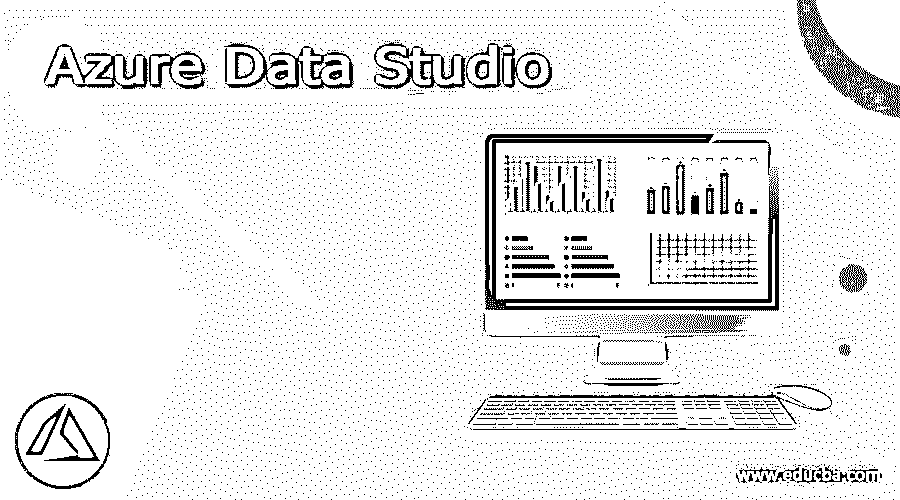
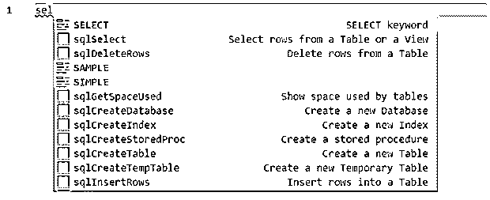
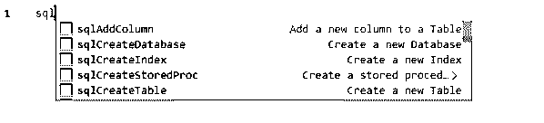
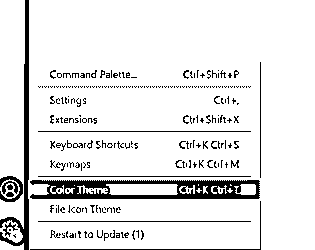
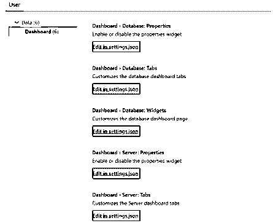
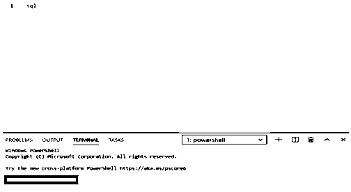

# Azure 数据工作室

> 原文：<https://www.educba.com/azure-data-studio/>

## Azure Data Studio 简介

一个可以在所有平台上工作的数据库工具，开发者可以在这些平台上管理 SQL Server 数据库或者基于云的 SQL 数据库或者基于 Azure 的 SQL 数据仓库系统，这个工具叫做 Azure Data Studio。我们可以在 Data Studio 中使用任何语言，以便不精通 SQL 的开发人员可以使用任何语言并运行脚本来获得所需的结果。免费提供，我们可以连接任何数据库和管理系统中的数据库。我们可以定制仪表板并使用内置图表，这样我们就可以可视化数据库中的查询结果集。

### 如何安装 Azure Data Studio？

1.在谷歌中搜索下载 Azure data studio 或前往 https://docs . Microsoft . com/en-us/SQL/Azure-data-studio/download-Azure-data-studio。

<small>Hadoop、数据科学、统计学&其他</small>

2.我们可以在网站上看到平台和下载文件。下载基于您的平台的文件以及安装程序(如果为相应的平台提供的话)。

3.如果系统中有 SQL Server Management Studio，它会自动可用。如果没有，请使用 windows 计算机中的用户安装程序或系统安装程序。此外，我们可以使用下载页面中的 zip 文件，在解压缩之后，我们可以通过。exe 文件。或者，我们可以在 CLI 中运行\ azuredatastudio-windows \ azuredatastudio . exe .并通过 zip 文件下载它。

4.macOS 安装是直接的，我们必须打开 zip 文件并将应用程序拖到应用程序文件夹中。这使得应用程序在系统中可用。在 Linux 安装中，下载。deb 文件，并将内容提取到系统中。通过在 Bash 命令行中运行来启动 data studio。如果我们使用的是。rpm 文件。如果我们使用 tar.gz 文件，通过在 Bash 命令行中给出路径，将内容提取到系统中，然后在同一个命令行中运行。我们还应该在系统中安装一些依赖项，以便无限制地运行应用程序。

### Azure Data Studio 的外壳特性

*   我们应该使用 Azure 登录，其中我们可能必须有 Azure 门户凭据以及订阅，或者至少从试用帐户开始。Dashboard 在 Data Studio 中可用，我们可以在其中定制我们选择的功能，或者我们可以使用可用的功能来进行数据分析。Data Studio 中提供了对象资源管理器和对象脚本，我们可以使用脚本来进行数据分析，也可以使用定制仪表板中的功能。我们有一个集成的终端，因此应用程序使我们熟悉可用的工具以及如何使用它们。
*   Data Studio 中可以使用扩展，这样我们就可以使用 Python 或 Scala 插件来代替 SQL，并对数据进行修改。这些扩展帮助开发人员选择他们自己选择的语言，并根据他们的需求使用它。此外，开发人员可以在 Data Studio 中创建项目，这样，如果同一个人处理多个项目，他们可以将表和代码存储在项目文件夹中，并同时处理多个项目。开发人员可以从工程窗格中选择表，并完全控制源代码。这使得开发人员可以根据需要随时修改代码，并为将来的需求做好准备。应用程序中还提供了任务窗格，这样开发人员就可以根据自己的需要确定任务的优先级并完成它们。

5.我们可以改变 Data Studio 中的主题，甚至他们有一个黑暗的主题，使其以用户为中心。Azure resource explorer 目前还不存在，但我们有 Azure resource Explorer 的预览版。预计他们将在未来的版本中尽快发布 ARM 模板版本。我们不必像 SQL Server Studio 那样生成脚本向导，而是可以生成代码并在脚本中使用它们。每个对象的表设计器和对象属性在应用程序中并不存在，开发人员应该以他们的方式找出它们。我们有一个图表查看器，我们可以将结果导出为任何格式，如 CSV、JSON 或 xlsx 到系统中。我们可以在 Azure Data Studio 中使用片段，并在需要时管理它们。

### Azure Data Studio 的功能

SQL 是易于使用的编码，可以与 IntelliSense 一起使用，以便在已知命令的查询编辑器中自动填充代码。

Data Studio 中提供了智能 SQL 片段，我们也可以根据自己的需求定制 SQL 片段。此功能使开发人员能够在他们的项目中使用定制代码，并在需要时在整个帐户中使用相同的代码。IntelliSense 的相同功能将使 Data Studio 向开发人员展示代码片段，并且不需要单独的设置。它还显示与每个查询相关的信息。

我们可以自定义控制面板，让用户轻松监控。可以检查性能，如果有任何瓶颈查询，我们可以从应用程序的仪表板中找出相同的问题。如果由于 Data Studio 同一页面中的其他几个查询而导致查询速度变慢，应用程序中还提供了几个小部件来加快查询速度。

我们可以连接各种服务器组，以便在环境中轻松传输数据。所有关于数据库和项目的信息都可以从服务器组中收集。也可以使用集成终端，以便使用 bash 或 ssh 命令。

### 结论

我们有 SQL Server Management Studio 来运行 SQL 查询和管理数据库。但是，Azure Data Studio 提供了使用任何语言甚至 power shell 来管理数据库和根据我们的需求编写代码的功能。我们也可以使用 Data Studio 来提高性能。

### 推荐文章

这是 Azure Data Studio 的指南。这里我们分别讨论一下入门，如何安装 Azure Data Studio，Azure Data Studio 的 Shell 特性。您也可以看看以下文章，了解更多信息–

1.  [Azure 通知中心](https://www.educba.com/azure-notification-hub/)
2.  [Azure 实例类型](https://www.educba.com/azure-instance-types/)
3.  [Azure 架构](https://www.educba.com/azure-architecture/)
4.  [Azure 混合优势](https://www.educba.com/azure-hybrid-benefit/)

