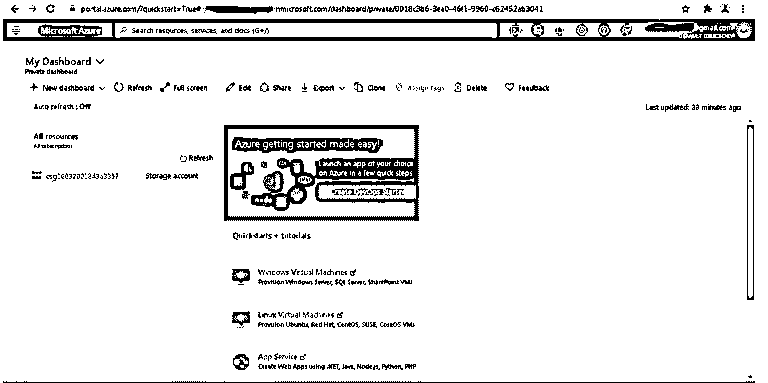
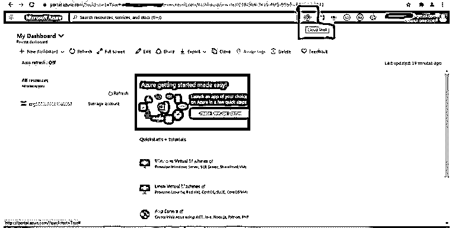
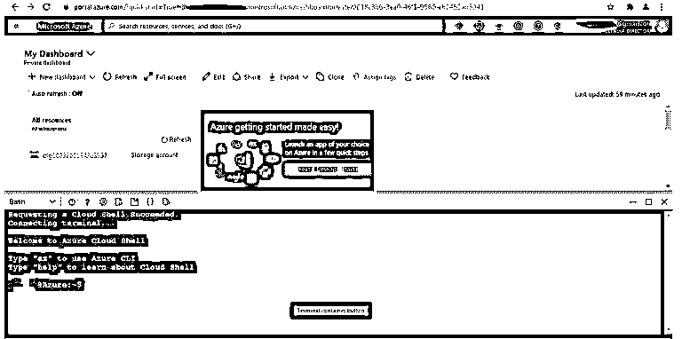
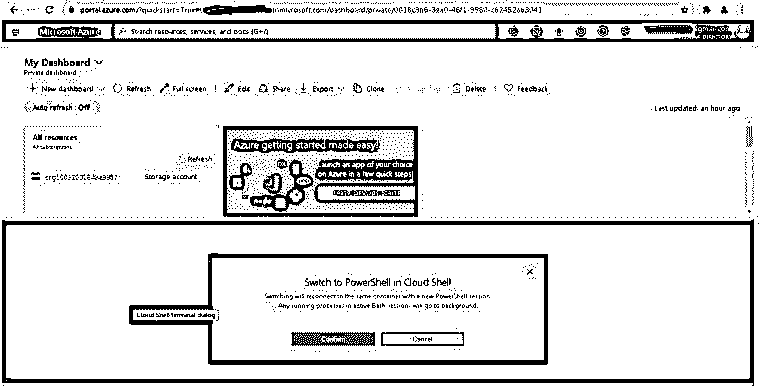
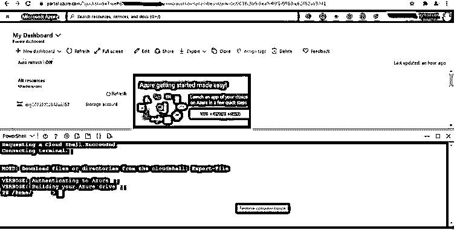
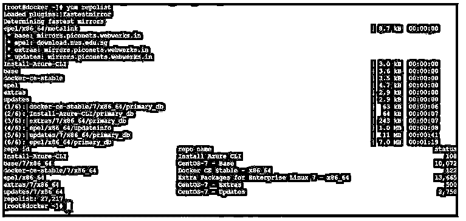
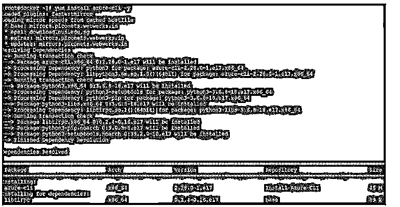
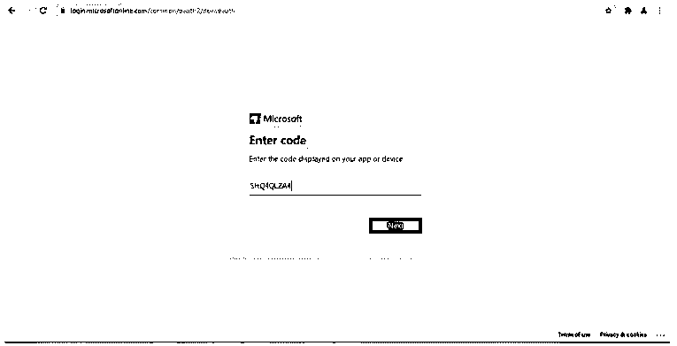
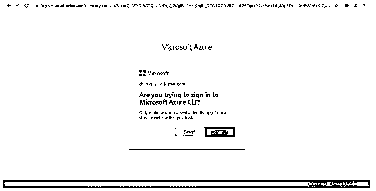
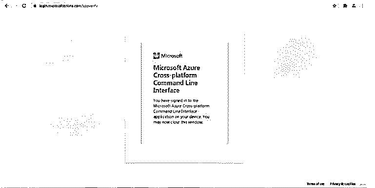

# Azure CLI

> 原文：<https://www.educba.com/azure-cli/>

## Azure CLI 简介

Azure 命令行界面有助于创建资源，帮助检查状态或监控资源，易于管理微软 Azure 云平台上的环境。没有任何特定服务的限制，即我们可以通过 Azure CLI 运行和管理任何 Azure 服务。设计的主要建议是支持自动化技术。这很容易操作。任何编程语言都没有限制。它兼容所有的编程语言。大多数情况下，Azure CLI 可以在 Linux 和 Windows 平台上运行。这将有助于快速使用它。由于这个原因，我们可以很容易地在 Azure 云平台上旋转 Azure 资源。它非常轻便，易于使用。它将提供对所有 Azure 服务的快速访问。

### Azure CLI 入门

正如我们所见，Azure CLI 对于访问 Azure 云平台服务非常有用。这将有助于管理或创建 Azure 平台上的资源。在初始阶段，我们只直接使用 Azure 门户的窗口。根据下面的截图，我们得到了 Azure 环境的初始仪表板窗口。如果我们需要从仪表板本身使用它，那么我们可以直接使用它。这里，不需要在各自的工作机器上安装单独的 Azure CLI 软件或客户端。这完全取决于环境或应用要求。

<small>Hadoop、数据科学、统计学&其他</small>

在 Azure 仪表盘上，我们看到了云壳窗口。云外壳仅提供浏览器级别的 CLI 功能。默认情况下，Azure cloud shell 提供 PowerShell 和 bash CLI 提示符。根据要求，我们需要选择外壳窗口。这也取决于应用或项目要求。在浏览器层面我们需要选择哪种类型的 shell 窗口？在某些情况下，我们已经看到选择 bash 或 PowerShell 窗口。这也将取决于开发人员或管理员。

一旦我们点击 Azure 云壳。第一次，它会问我们需要使用哪种类型的 shell 提示符。它将是 bash 或 PowerShell one。根据需求或应用程序的用途，我们需要为它选择最佳选项。为了更深入地了解它，我们需要选择 bash CLI 或 PowerShell CLI。根据下面的截图，我们选择了 bash CLI 窗口。现在，在同一个 bash CLI 窗口中，我们可以在 Azure 云环境中触发不同的命令或查询。

在某些情况下，我们选择了 bash CLI 窗口。但是将来，需求会发生变化，或者由于项目或应用需求，我们需要选择不同的 CLI 窗口，即 PowerShell CLI 窗口。为了处理这种情况，我们在 Azure cloud shell 上提供了。根据上面的截图，我们选择了 bash CLI。如果我们需要将其从 bash 更改为 PowerShell，那么我们需要单击“bash”下拉菜单并选择 PowerShell CLI 提示符。选择 PowerShell CLI 窗口会有所帮助。根据下面的屏幕截图，我们在浏览器级别选择了 PowerShell CLI 窗口。一旦我们从 bash CLI 窗口提示符切换到 PowerShell CLI 窗口提示符，切换将需要一些时间。根据下面的截图，我们可以看到相同的场景。

一旦我们成功切换到 PowerShell CLI 窗口。我们能够在 Azure 云平台上触发不同的查询或命令。一旦 bash CLI 窗口提示符切换到 PowerShell CLI 窗口提示符，我们就可以在 Azure dashboard 上看到下面的屏幕截图窗口。

### Azure CLI 工具

*   在市场上，有不同的方式来使用 Azure CLI。
*   但是强烈建议使用 office Azure CLI，因为它可以安全地通过适当的渠道进行通信。

### 如何安装 Azure CLI？

在不同的操作系统上安装 Azure CLI 有不同的方法，比如在 Linux 或 windows 上。但是根据需求或便利性，我们需要选择在哪个平台上部署或运行它。这里，我们使用的是 Linux 平台。我们可以使用 CentOS 7 操作系统，基于我们正在安装的同一操作系统。

**回购名称:**install _ Azure _ CLI . Repo
T3】回购路径:/etc/yum . repos . d/install _ Azure _ CLI . Repo

**回购文件内容:**

[Install-Azure-CLI] name=Install Azure CLI
baseurl=https://packages.microsoft.com/yumrepos/Azure-CLI
enabled=1
gpgcheck=1
gpgkey=https://packages.microsoft.com/keys/microsoft.asc

一旦回购文件将更新，我们将列出百胜回购。

然后我们需要安装 Azure-CLI 包。

**代码:**

`yum install Azure-CLI –y`

**输出:**

一旦软件包安装完毕，我们需要登录 Azure 云环境。

有一次，在它的帮助下，我们成功地登录了 Azure 账户。我们正在获取以下截图信息。

### Azure CLI 的功能

*   在它的帮助下，我们可以很容易地找到命令。
*   从工作的机器或环境中，我们也可以定义全局可用的参数。
*   我们可以在 Azure 云平台上定义常见或普通的任务或命令，如定义资源组，在不同的数据库上工作，如 SQL、Cosmos DB，创建虚拟机，使用存储帐户，使用密钥库，使用 web 应用程序。
*   在它的帮助下，我们将以交互方式工作。

### 结论

我们已经看到了“Azure CLI”的完整概念，以及适当的 Azure CLI 工具、解释和安装方法以及不同的输出。在 Azure 云环境中，我们可以从中触发不同的命令和查询。这将有助于管理 Azure 集群资源。在 Azure 云环境中管理不同的账户很容易。

### 推荐文章

这是 Azure CLI 的指南。这里我们分别讨论入门、Azure CLI 入门、工具、安装和特性。您也可以看看以下文章，了解更多信息–

1.  [Azure 队列存储](https://www.educba.com/azure-queue-storage/)
2.  [Azure ExpressRoute](https://www.educba.com/azure-expressroute/)
3.  [Azure 负载均衡器](https://www.educba.com/azure-load-balancer/)
4.  [Azure 虚拟机](https://www.educba.com/azure-virtual-machines/)

