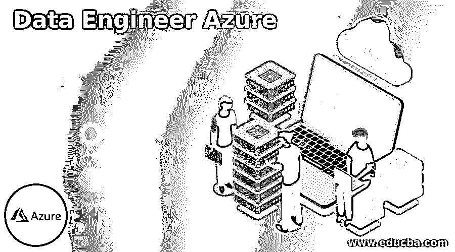

# 数据工程师 Azure

> 原文：<https://www.educba.com/data-engineer-azure/>

## 数据工程 Azure 简介

以下文章提供了数据工程师 Azure 的概要。如今，数据是超能力的最大来源。收集相关和适当的数据推动企业做出更好的决策。此外，正确使用数据有助于提高客户服务。这些关键任务由数据工程师执行，他负责构建、实施和支持微软 BI 解决方案，以满足标准客户和市场需求。他们意味着他们的技术，流程，应用，方法和工具的知识，以支持项目和客户实体。

### 什么是数据工程师 Azure？

*   Azure 数据工程师负责面向数据的实施任务，管理接收批处理和流数据，提供配置数据存储，转换数据以实现安全要求，暗示数据保留策略，发现性能障碍，解决瓶颈问题，还可以访问外部数据。最近一段时间，Azure 数据工程师的数量在逐渐增加。因此，了解成为一名有效的 Azure 数据工程师的先决条件是必不可少的。
*   对于各种类型的数据工程师来说，编码、编程语言、分析技能、数据库管理等基本技能是常见的。Azure 数据工程师的突出技能应该对数据格局的演变及其对数据工程师的影响有一个基本的了解。他应该知道云数据解决方案和内部部署之间的基本区别。他应该非常了解 Azure 服务。
*   Azure 数据工程师应具备数据仓库解决方案、ETL 工具、数据库系统(如 NoSQL 和 SQL)、机器学习、Python、Scala 和 Java 编程语言、数据 API 方面的技能，了解分布式系统的基本概念，应具备强大的数据结构和算法知识。

### 如何成为一名 Azure 数据工程师？

*   要成为一名符合 Azure 数据工程师助理角色的成功的 Microsoft Azure 数据工程师，他必须精通 Azure 基础知识，还应该准备好通过两个主要考试，以获得数据工程师的工作角色。令人惊讶的是，基于角色的认证也可以成为 Azure 平台中的数据工程师。
*   成为 Azure 数据工程师助理的两个主要考试是 DP-201 和 DP-200。为了通过认证，他应该在数据工程领域有一年的相关经验，并且他还应该在 Azure 方面有丰富的实践经验。
*   希望在 Azure data engineer associate 中提升和升级其职业生涯的 IT 专业人员可以为这些考试做好准备，并可以通过这些考试来实现自己的角色。但是这个角色的报酬是最大的，值得他的努力和辛勤工作。

### 获得认证 Azure 数据工程师

*   根据最近的调查，数据工程发展迅速。在这方面，微软认证为 IT 专业人士提供了更多的好处。它提供了认证、机会、数字徽章和加薪。微软认证受到组织和雇主的信任，它为 it 行业的专业人士制定了一个标准。
*   因为认证有助于招聘团队容易地判断专业人员，因为他已经成功地通过了认证，这只有通过专业技能和知识才是可能的。在追求认证后，四分之一的人在微软获得了 20%的加薪。
*   所以考虑到这一点，工资增长是去认证的重要原因。数字徽章可以从突出显示您的简历或 LinkedIn 个人资料的认证中获得，这些信息会吸引招聘资源的注意。认证打开了许多企业获得更好机会的大门，因为世界发展如此之快，最好保留一把钥匙，以显示我们在普通人中的分离。

### 备考的 3 个小技巧

1.  为了顺利通过认证，我们有一些帮助人们做好准备的方法。有两个考试 DP-200 和 DP-201。在 DP-200 中，涵盖了 Azure 数据解决方案实现下的所有主题，在 DP-201 中，涵盖了 Azure 数据解决方案的设计。但是，这两种考试不会被一种考试 DP-203 所取代，这种考试在印度要 4800 卢比，在美国要 165 美元。如果考试通过，他可以获得微软 Azure 数据工程师助理认证。这项考试要求的技能范围很广，大纲在微软网站上给出。它解释了不同的领域和分配的权重。
2.  通过认证的简单技巧是参加微软 Azure 数据工程师的培训，因为它得到了行业的认可，涵盖了所有必要的领域。参加模拟测试，参加多次模拟测试，以便在每个问题上变得更强。因为有时，模拟测试可以有效地为每个主题分配时间，它告诉我们在哪个部分我们应该训练有素。在此之前，你应该对每个主题都有一个很强的了解。YouTube 上有许多视频，不同的人解释不同的主题。所以选择一个好的导师，遵循他的渠道，就看你自己了。Azure 数据工厂视频和 Azure 教程可以帮助你理解 Azure 中的概念。
3.  EduCba 为您提供 Azure 数据工程领域的标准教程，并通过进行各种模拟测试和面对面辅导来帮助您通过考试。实施的培训计划由行业专业人士领导和设计。该团队涵盖了考试所需的所有重要主题，还可以帮助你在知名的数据工程公司获得良好的服务。

### 结论

有前途的 Azure 数据工程师应该具备理解数据结构和算法的必备能力。他要懂 SQL 才能理解底层数据库。他应该了解存储和处理工具，并熟练掌握 Scala、Python 和 Java，这是必须的。他应该了解 ETL、Hadoop 等大数据工具。除了所有的技术技能，他还应该有可靠的软技能来与企业互动，为公司和他自己的改善做出坚定的决定。

<small>Hadoop、数据科学、统计学&其他</small>

### 推荐文章

这是一个数据工程师 Azure 的指南。这里我们讨论入门，如何成为一名 azure 数据工程师？和 3 个备考技巧。您也可以看看以下文章，了解更多信息–

1.  [Azure 通知中心](https://www.educba.com/azure-notification-hub/)
2.  [Azure 实例类型](https://www.educba.com/azure-instance-types/)
3.  [Azure 混合优势](https://www.educba.com/azure-hybrid-benefit/)
4.  [Azure 活动中心](https://www.educba.com/azure-event-hub/)

