# 天蓝色管道

> 原文：<https://www.educba.com/azure-pipelines/>

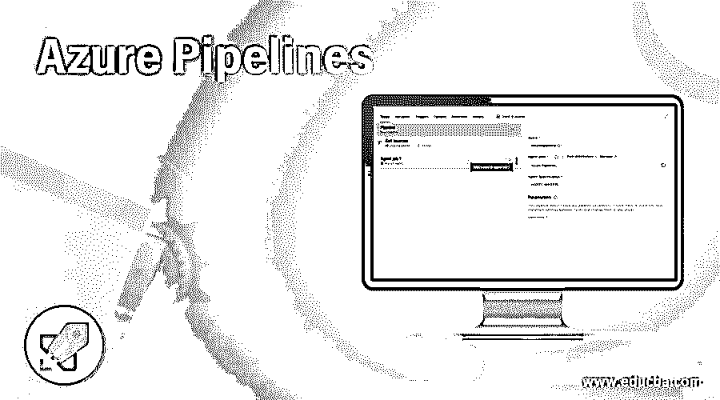

## Azure 管道简介

微软 Azure Pipelines 是一种基于云的服务，用于构建和测试应用程序代码，并使代码跨平台可供其他用户使用和根据需要进行修改。Azure Pipeline 支持多平台，因此可以用于任何语言。管道通过结合持续集成(CI)和持续交付(CD)来帮助开发人员持续构建、测试和部署应用程序代码。管道可以在 Azure DevOps 中使用，并有助于通过版本控制系统(如 github 或 bitbucket)存储不同版本的代码。

### 如何在 Azure 中创建和使用管道？

在学习创建管道之前，您必须有一个订阅，以便使用有效凭据登录 Azure 门户。

<small>Hadoop、数据科学、统计学&其他</small>

要创建管道，用户需要满足以下要求

1.  蓝色账户
2.  登录 Azure 门户网站。
3.  GitHub 帐户来创建代码库。
4.  Azure DevOps 组织帐户。

### 创建数据湖存储帐户

下面是下面提到的步骤

#### 第一步

使用有效凭据登录门户网站:

https://portal.azure.com/#home

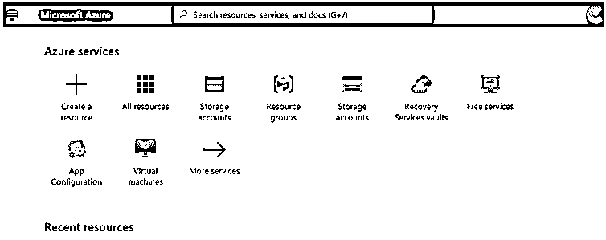

#### 第二步

在门户的搜索字段中，搜索 DevOps 并选择 Azure DevOps 组织:

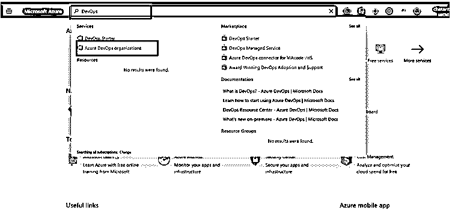

#### 第三步

转到 Azure DevOps 并输入管道的项目名称:

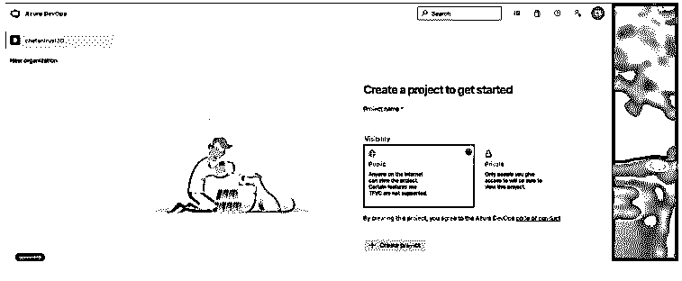

#### 第四步

根据需要选择可见性为公共或私有，然后单击“创建项目”按钮:

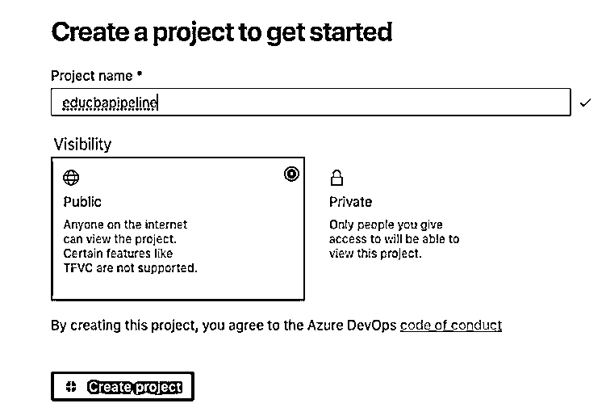

#### 第五步

从 Azure Devops 环境中选择管道:

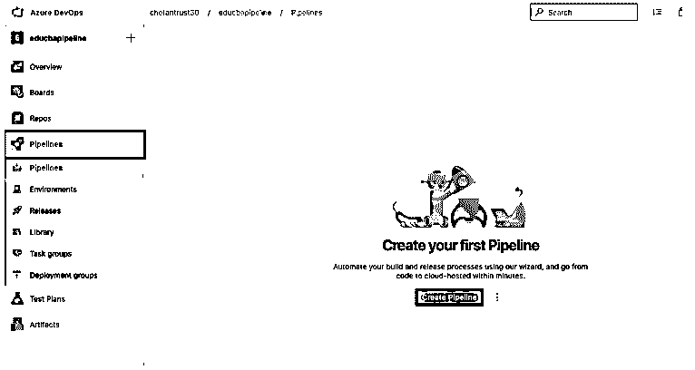

#### 第六步

从 Azure Devops 页面为新管道选择 Create Pipeline 选项，这将提供一个选项来配置版本控制系统，如 GitHub、Azure Repos Git、BitBucket Cloud 等。根据要求:

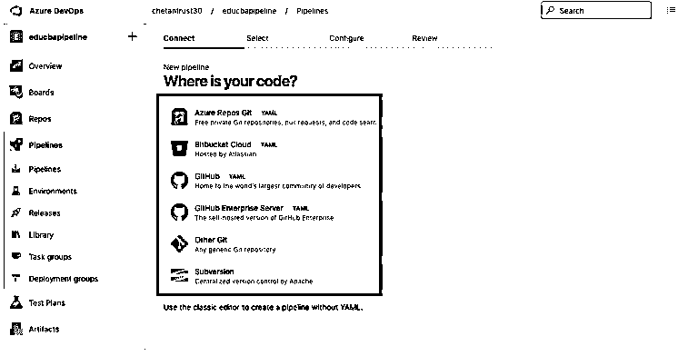

#### 第七步

要选择存储库的来源，请在页面中单击使用经典编辑器选项:

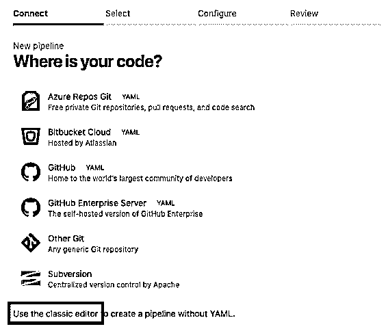

#### 第八步

从“选择您的存储库”页面选择 Azure Repos Gitto 以添加新的管道源，然后单击“继续”:

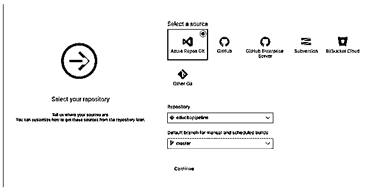

#### 第九步

用户可以配置编写代码的 YAML 文件，或者添加一个项目作为 Maven 项目；在这里，作为练习，我们将选择空工单。

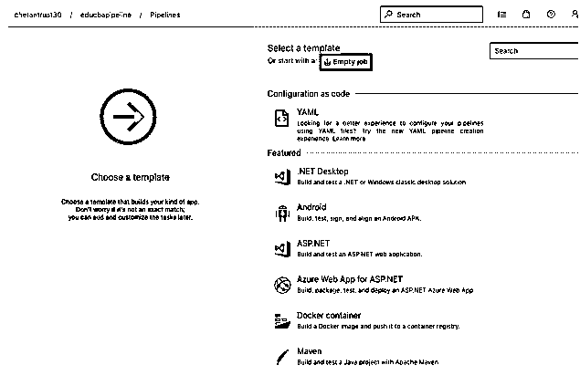

#### 步骤 10

在这个管道中，页面用户可以添加任务来构建活动；现在，单击将任务添加到代理作业 1:

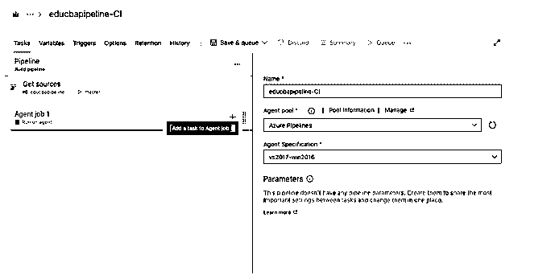

#### 步骤 11

与构建应用程序任务相关的所有任务将被填充如下:

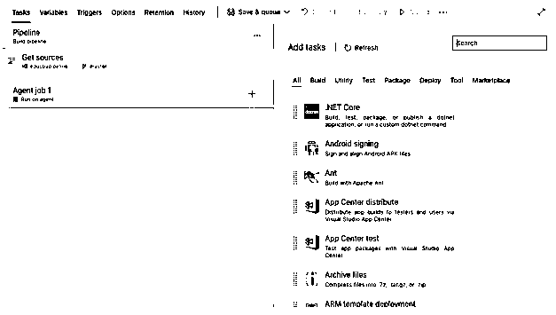

#### 第 12 步

在搜索框中键入 resource 并按 enter 键，从搜索结果中选择 ARM 模板部署，然后选择添加任务:

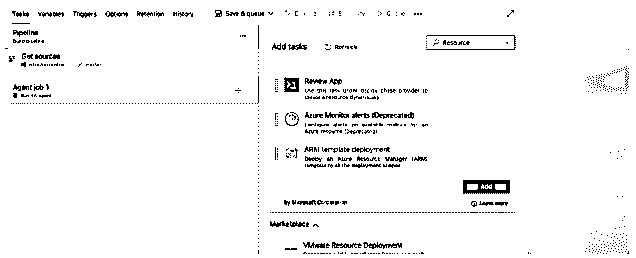

#### 步骤 13

选择后，任务用户需要配置任务设置:

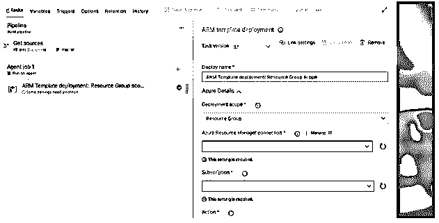

#### 第 14 步

选择订阅、资源管理器连接以及要为任务执行的操作。

#### 第 15 步

用户还可以对新添加的任务执行以下操作:

选择任务，双击，用户可以选择:

*   删除任务
*   克隆任务
*   启用任务
*   禁用任务

#### 步骤 16

现在，选中任务左侧窗格前面的模板选项，从代码报告中选择应用程序/项目的特定模板:

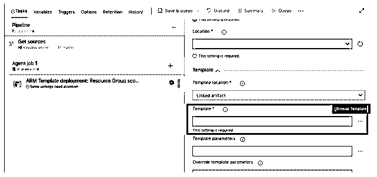

所有代码路径都将在此处填充；目前，我们没有部署任何应用程序或代码:

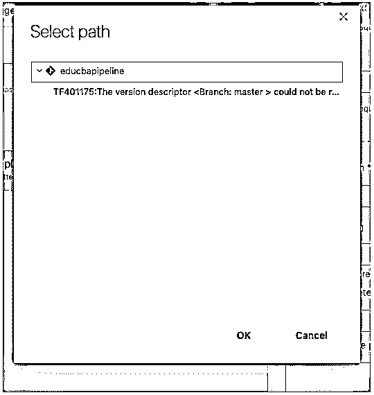

#### 第 17 步

一旦添加了有效的任务细节,“保存和队列”按钮将被激活，用户可以单击该按钮将任务添加到管道中，任务到 Azure 的部署将开始。

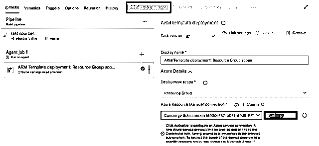

#### 步骤 18

所有的管道细节和代码报告都将在 Azure DevOps 仪表板中填充，用户还可以向其他用户发送邀请，以在任务或管道中进行更改:

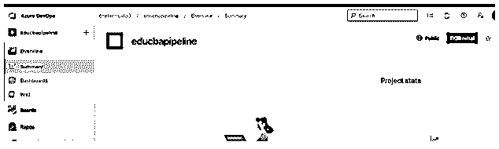

### Azure 管道的使用

实现 Azure pipeline 使用 CI/CD(持续集成和持续开发)流程，这样就可以确保代码质量的一致性。

1.  Azure 管道可以和任何语言一起工作，比如 Java、Python、.网等。此外，它是独立于平台的，因此管道可以在任何平台上运行。
2.  Azure Pipeline 帮助构建和部署代码到任何目标，这个目标资源可以是容器、注册表、Azure 服务或虚拟机(VM)。因此用户可以将代码部署到多个环境/目标。
3.  管道使用 GitHub、Bitbucket Cloud 或任何其他版本控制系统来配置 DevOps，以便可以轻松地持续测试和交付代码中的小变化。
4.  azure pipeline 可以构建在任何操作系统上，如 Windows、Mac 或 Linux 机器。
5.  它支持任何开源项目。

### 结论

微软 Azure Pipelines 是一个 Azure 云服务，帮助在云或任何其他系统上轻松开发和部署项目。它支持多种语言和平台，因此可以用于 web 开发和 ETL 开发。这是一个帮助开发人员和测试人员在 DevOps 环境中并肩工作的工具。

### 推荐文章

这是 Azure 管道指南。在这里，我们将一步一步地讨论如何在 Azure 中创建和使用管道。您也可以看看以下文章，了解更多信息–

1.  [Azure 功能](https://www.educba.com/azure-functions/)
2.  [Azure Blob 存储](https://www.educba.com/azure-blob-storage/)
3.  [Azure 虚拟机](https://www.educba.com/azure-virtual-machines/)
4.  [Azure 云服务](https://www.educba.com/azure-cloud-service/)

