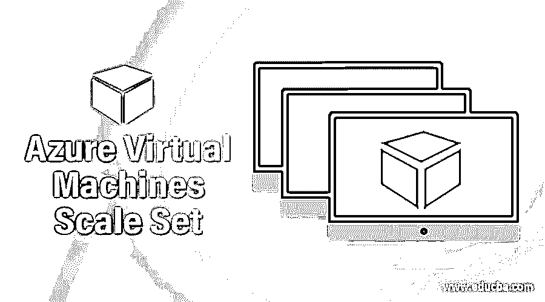
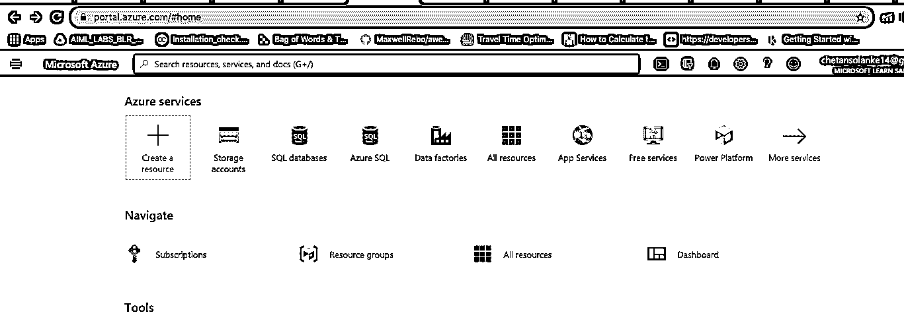
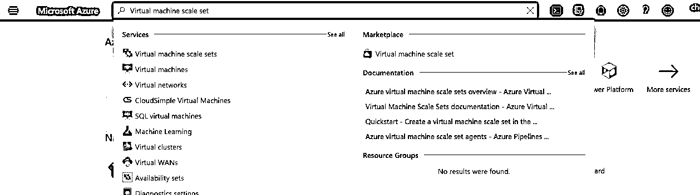
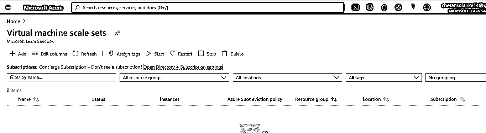
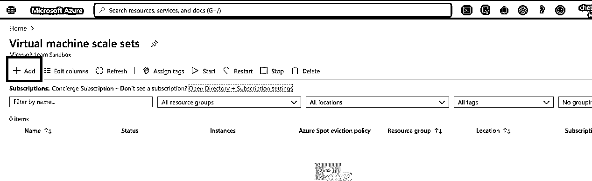
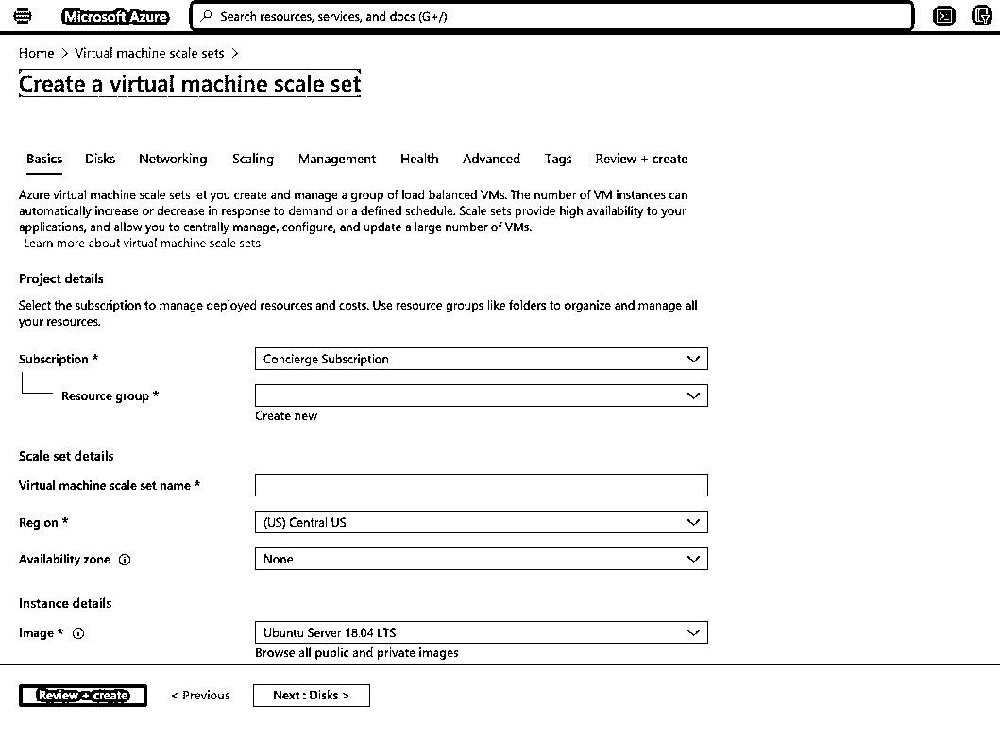
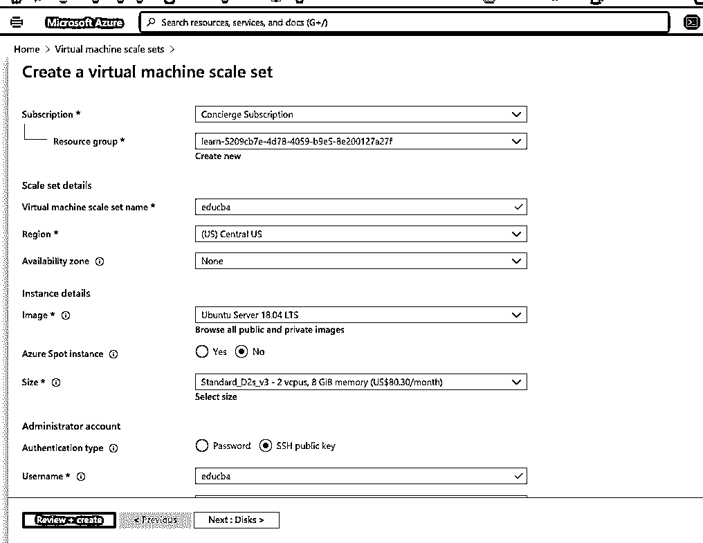

# Azure 虚拟机规模集

> 原文：<https://www.educba.com/azure-virtual-machines-scale-set/>

## Azure 虚拟机规模集简介

Microsoft azure 中的虚拟机规模集服务用于创建相似且负载平衡的虚拟机(VM)集。这是一个完全托管的平台，能够根据需求或计划增加或减少虚拟机实例的数量。Scale set 具有高可用性，因为它是 azure 云服务。Azure VM scale set 有助于在大数据、计算和容器工作负载领域为组织开发大规模服务。

### Azure 虚拟机自动扩展

Azure 虚拟机(VM)规模集能够根据 Microsoft Azure 中服务的负载增加或减少 VM 实例的数量。这一自动化过程反过来减少了应用程序的监控和管理开销。在这里，用户可以配置或安排事件，根据特定规则在固定时间添加或删除虚拟机实例。在 Azure VM 中，自动扩展用户能够指定 VM 实例的最大和最小数量，并且使用最大和最小实例，VM 使用创建 VM 的规则在这两个负载之间自动扩展。只要满足规则条件，Azure 就会触发自动缩放操作，VM 就会被添加或删除。

<small>Hadoop、数据科学、统计学&其他</small>

这些自动缩放规则有两种类型:

1.  **基于指标的自动扩展:**它主要测量应用程序负载或使用情况，然后执行虚拟机实例的自动扩展。比如，当 CPU 使用率达到 70%以上时，执行某个操作。
2.  **基于时间的自动扩展:**这是一种基于计划的自动扩展，当应用程序看到任何特定的时间模式或被安排在某个时间间隔时触发。比如在早上 9 点触发某个事件。

### 缩放类型

微软 Azure 是现收现付的服务；因此，为了使扩展更具成本效益，Azure 设计了虚拟机实例的规模集，用户可以根据需求增加或减少实例的数量。Azure 虚拟机规模集有以下两种类型:

#### 1.水平缩放

这是根据应用程序的负载在规模集中添加或删除一个或多个虚拟机的过程。这种缩放以水平方式发生。当用户在一段时间间隔内需要某个虚拟机，而这段时间内应用程序的负载较大，然后在这段时间后移除虚拟机时，会使用这种扩展。这里，执行自动缩放的规则主要是基于指标的，因为添加或删除机器取决于应用程序的需求。

#### 2.垂直缩放

它是添加机器资源的过程，如 CPU 能力、RAM、磁盘空间等。根据应用程序的负载来设置比例。在垂直扩展中，添加资源主要是为了增加机器的容量。为了执行垂直扩展，大多数情况下，系统需要重启或重新启动添加了资源的特定机器，这可能会暂时影响虚拟机扩展集的性能。当 CPU 性能下降，用户需要提高特定比例集的性能时，使用这种比例；此时，CPU 资源被添加到特定的虚拟机规模集，以增加机器的大小。

### Azure 虚拟机比例因子

Azure 虚拟机扩展是基于指标自动完成的，这有助于增加或减少应用程序中虚拟机实例的数量。以下是一些有助于扩展和衡量的常见因素:

**1。虚拟机的计算指标:**这是一个默认指标，取决于安装的操作系统，是 Linux 还是 Windows。对于 windows，指标取决于 CPU、内存、磁盘空间以及 Linux CPU、内存和网络接口。

**2。应用服务指标:**也可以基于 web 服务器指标进行自动扩展。web 服务器或应用程序服务指标使用 HttpQueueLength 作为其指标之一。

**3。存储总线指标:**该扩展指标有助于根据存储队列长度扩展虚拟机。存储队列就是存储中的消息数量，它有一个阈值，即每个实例的消息数量。

### 如何扩展 Azure 虚拟机？

以下是扩展 Azure 虚拟机的步骤

#### 先决条件

用户需要使用有效的电子邮件 id 和密码进行 Azure 订阅，因为创建 Azure VM 规模集可能需要资金。但是，用户也可以使用 Azure 免费访问 1 个月，以有限的资源创建 API 应用程序。

#### 创建 SQL 数据库的步骤

1.使用有效的用户名和密码登录 Azure 门户:

https://portal.azure.com/#home

2.从 Azure 门户菜单页面中选择搜索字段，并输入虚拟机规模集:

3.现在，从列表中选择虚拟机规模集，以打开虚拟机规模集创建页面:

4.从页面中选择+添加以添加新的虚拟机规模集:

5.创建一个虚拟机规模设置页面，将打开该页面以输入虚拟机详细信息:

6.输入秤台详细信息。

*   从下拉列表中选择存储帐户的订阅。
*   输入虚拟机规模集名称，因为名称必须是唯一的。
*   从下拉列表中根据用户区域选择区域。
*   从下拉列表中选择可用性区域。
*   从下拉列表中选择虚拟机映像，如 Ubuntu、Oracle、Windows 等。
*   根据要求输入管理员帐户详细信息作为密码和 SSH 密钥。

7.现在，选择 Review+Create 按钮来查看和验证比例集实例。

8.从“创建虚拟机规模集”页面中选择“创建”按钮，以创建新的规模集。如果详细信息有效，将开始部署。

9.部署完成后，页面上将显示如下消息:

“您的部署已完成”。

### 结论

总之，Azure 虚拟机规模集是一个自动扩展过程，可以根据需要执行虚拟机实例的水平或垂直扩展。在 azure 中这是一个简单的过程，因为监控和管理是由 Azure 完成的，这减少了应用程序的开销。此外，Azure 虚拟机规模集具有经济高效的设计，因为用户可以删除不需要的虚拟机或资源，并在需要时添加它们，以便他们可以在需要时付费并节省资金。

### 推荐文章

这是 Azure 虚拟机规模集指南。在这里，我们讨论了扩展的类型以及如何扩展 Azure 虚拟机和步骤。您也可以看看以下文章，了解更多信息–

1.  蔚蓝宇宙数据库
2.  [Azure 数据工厂](https://www.educba.com/azure-data-factory/)
3.  [Azure Blob 存储](https://www.educba.com/azure-blob-storage/)
4.  [Azure 中的表格](https://www.educba.com/tables-in-azure/)

