# 蓝色突触

> 原文：<https://www.educba.com/azure-synapse/>

## Azure Synapse 简介

Azure Synapse 是一个整合的平台，它结合了从数据集成、数据仓库、工具和服务分析、重要数据相关组件的自动扩展、可视化和维护仪表板开始的所有功能。Azure synapse 为最终用户提供适当的订购、维护和可访问的使用功能。通过在一个地方收集所有重要的商业见解，所有的决策能力和工具都被用于诊断分析。分析功能利用了与其他一些第三方供应商或插件或服务的集成，如 Databricks、Stream Analytics、apache-spark 等等。

### 什么是 Azure Synapse？

*   Azure Synapse 是一个公共平台，用于将所有主要服务与数据仓库和分析集中在一个地方。
*   它为所有大数据开发人员和分析师提供了使用一些条款和条件查询数据的权限，这些条款和条件可以为所有服务器提供查询。
*   这个保护伞适合执行所有的先决条件和利用许多服务的其他活动。
*   Azure Synapse 依赖于许多与数据仓库相关的因素，如延迟、资源处理等。
*   任何现代技术或数据仓库都可以很好地支持所有最新版本的 Azure Synapse。
*   它有许多标准技术、支持和最佳实践，支持 SQL 查询池作为集成时使用的数据库的一部分，目的是适当地加载数据和存放数据表。
*   通过管理各自的键及其值，在操作和分区过程中应用过滤器。
*   有一种分布式复制模式，其中数据通过对所有表进行分组和连接来安排格式。
*   有一个数据库和其他存储库的 Synapse 池，需要在它们之间进行同步，以便卷可以通过其所有查询和操作进行查询。
*   它在仪表板上以有效的方式为其映射和可视化提供所有资源，在仪表板上可以正确地排列和存储存储在卷中的数据。
*   它还增强了业务和许多新功能集成需求和用例，尤其是在 ML AI 驱动的行业中。

### Azure Synapse 是如何工作的？

微软 Azure Synapse 分析服务在微软 Azure 平台中使用，并作为软件即服务(SaaS)使用。这项服务将数据仓库与大数据分析捆绑在一起，服务只在有需求时运行；Synapse 由以下组件组成:

<small>Hadoop、数据科学、统计学&其他</small>

1.  SQL 分析，对 SQL 集群和按需 SQL 进行完整的传统 SQL 分析。
2.  完全集成的阿帕奇火花。
3.  多个数据源连接器。

Azure Data Lake Storage Gen2 是 Azure Synapse 中作为数据模型的数据仓库。它用于管理、监控和元数据管理部分的数据和分析解决方案。为了登录数据湖，Azure 提供了活动目录集成，这提供了数据安全和保护。此外，synapse 支持多种语言，如 SQL、Python、R .NET 等。，可用于不同的数据分析工作负载。

Synapse Analytics Studio 将所有语言、数据集成以及对 SQL 和 Spark 的支持结合在一个工作室中，这有助于将人工智能、机器学习、物联网或商业智能集成到一个统一的平台中。

T-SQL 和 Spark 工作:Azure Synapse 使用传统的 SQL 引擎(T-SQL)进行批处理和交互处理，使用 Spark 引擎进行大数据或流处理。根据用户需求，Apache Spark 可以与 Python、Scala 或 R 一起使用。Synapse 与 Azure Databricks 直接集成，Azure data bricks 是一种基于人工智能或数据分析的火花，允许自动扩展和共享工作空间。Synapse 和 Azure Databricks 用于数据湖存储；因此，两者都可以用于分析相同的数据。

### 如何在 Azure 中创建和使用 synapse？

在学习创建 Azure Synapse 之前，用户必须拥有 Azure 订阅，才能使用有效的凭据登录 Azure 门户。

#### 第一步

使用有效凭据登录 Azure 门户:

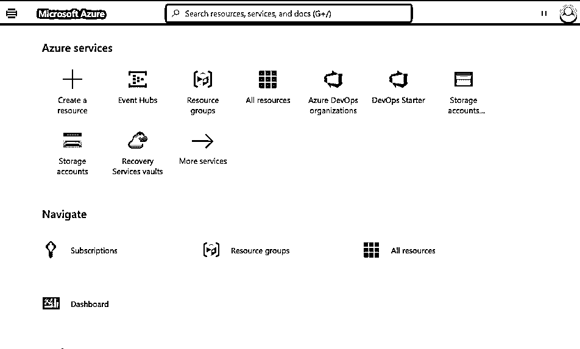

#### 第二步

点击 **+** 创建一个资源来创建一个新资源**。**

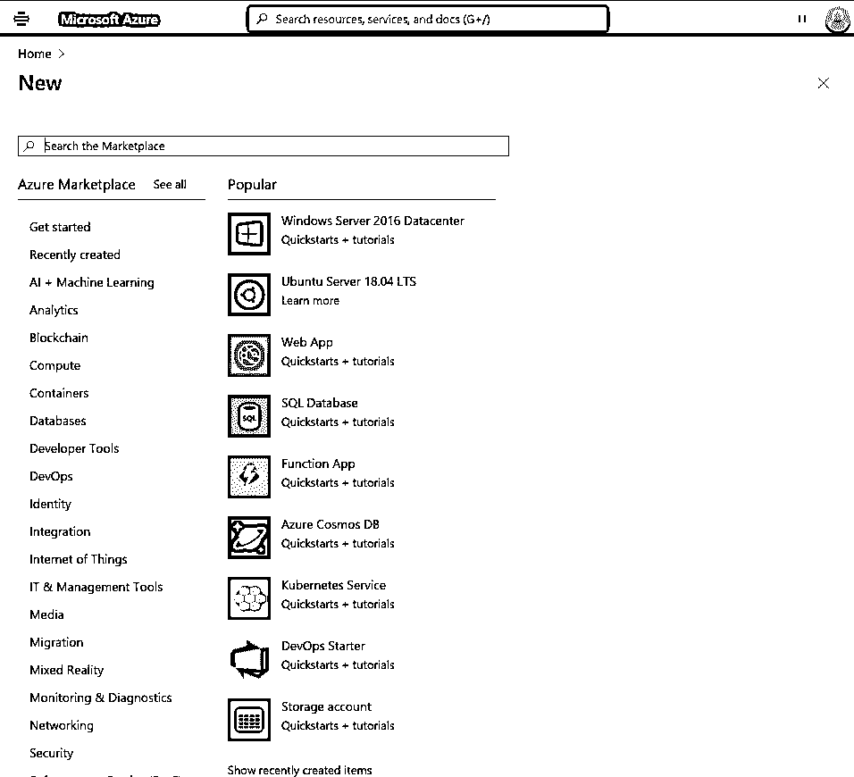

#### 第三步

单击数据库，并从右侧窗格窗口中选择创建 Azure Synapse Analytics。

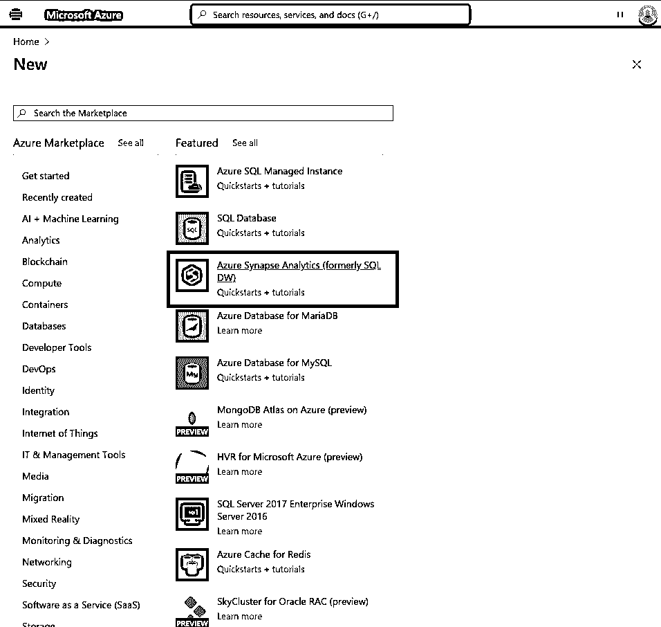

#### 第四步

从 Azure Synapse 分析页面，输入数据库详细信息:

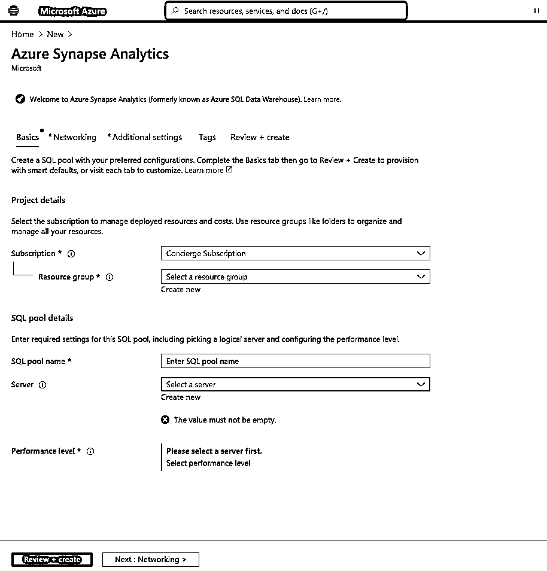

#### 第五步

输入 synapse 的配置设置:

*   **订阅选项卡:**输入或选择要计费的订阅名称，并选择剩余的 SQL 池详细信息和服务器名称。
*   输入资源组中的唯一名称，并根据需要输入 SQL 池名称:

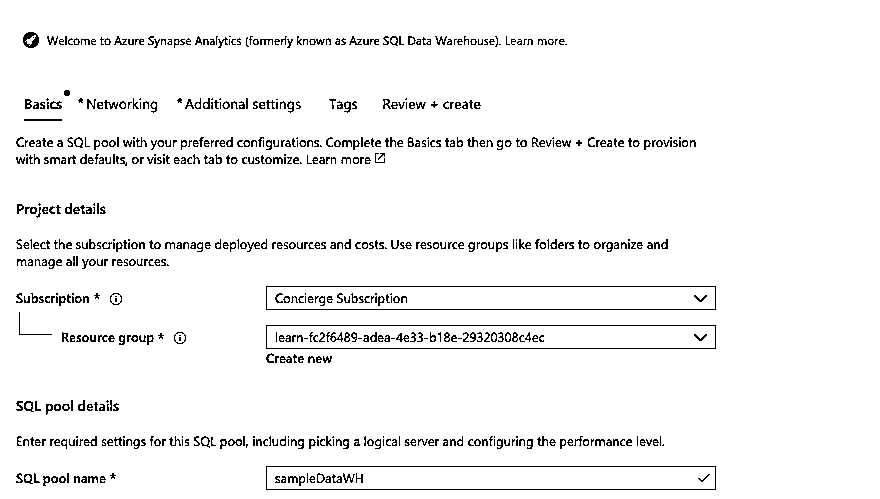

*   **附加设置:**在下面的选项卡中选择数据源和排序规则。

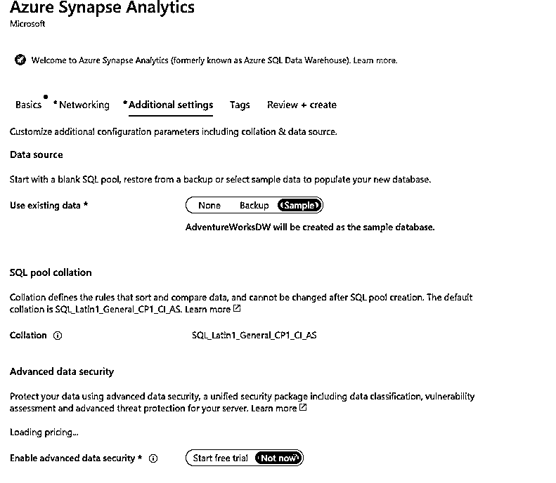

*   为分析 Synapse 创建新服务器，输入服务器详细信息，然后单击确定。:

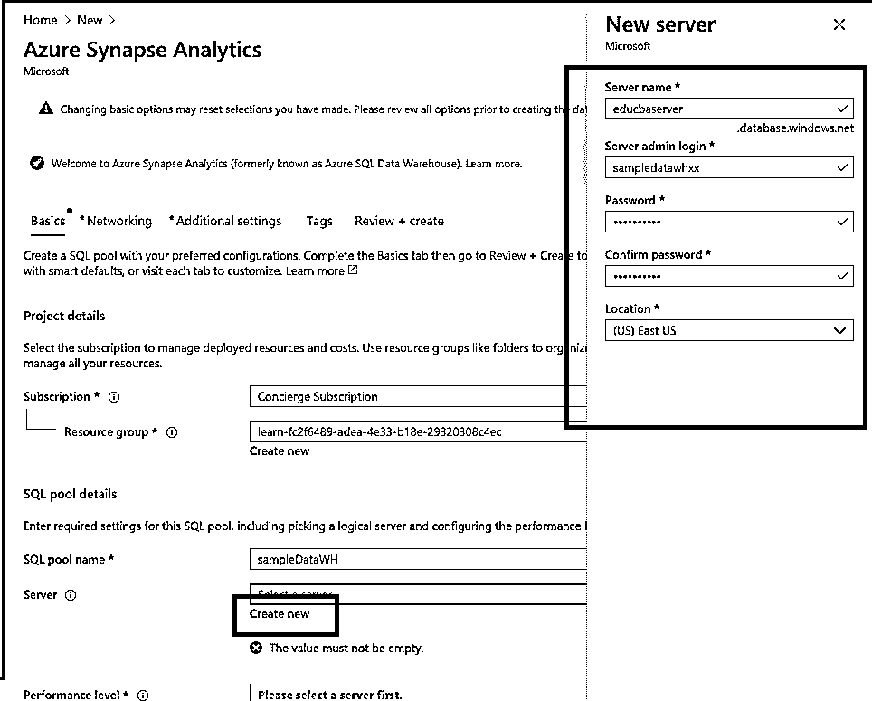

#### 第六步

现在，单击“审查+创建”来验证详细信息:

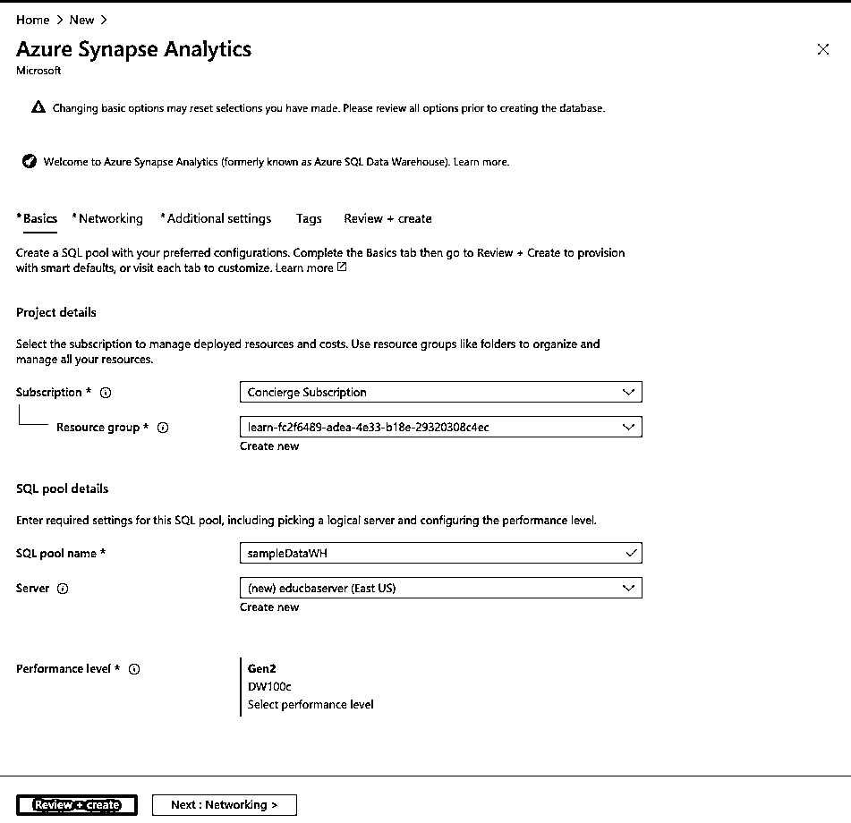

#### 第七步

现在，单击 Create 按钮开始创建 synapse:

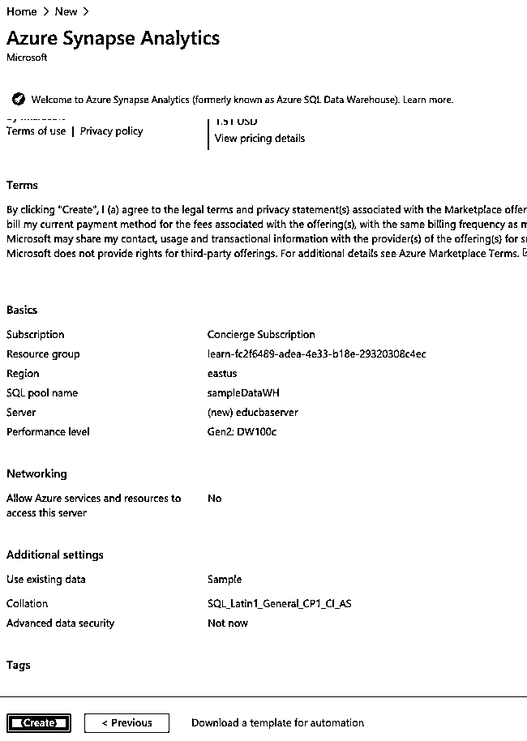

#### 第八步

部署将开始，资源将被填充到部署详细信息下的资源列表中:

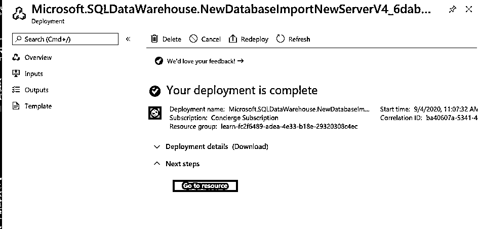

#### 第九步

现在，单击“转到资源”:

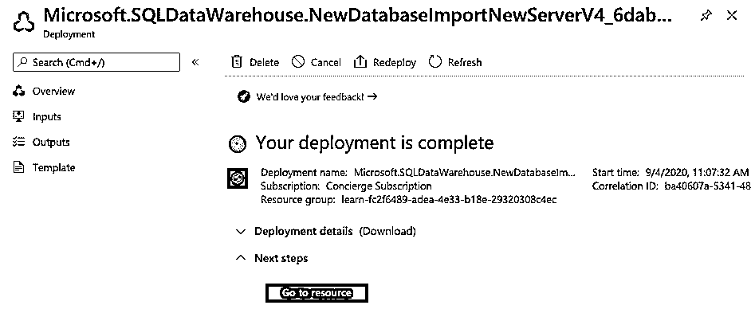

#### 步骤 10

用户可以通过点击 **+** 新建还原点来添加新的恢复数据点

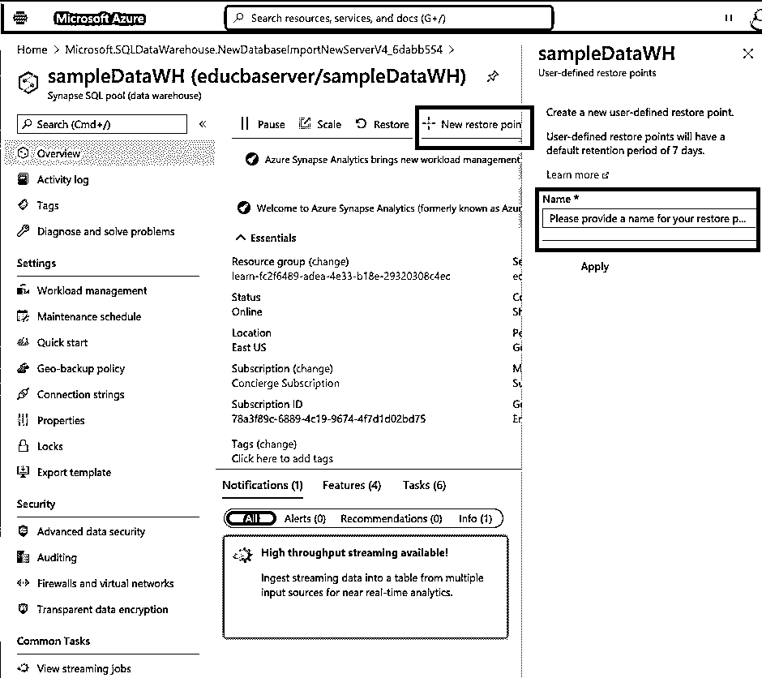

#### 步骤 11

用户可以暂停数据仓库。如果不使用，请点击暂停:

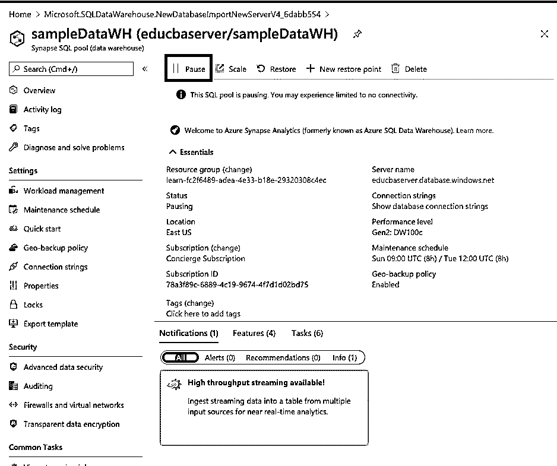

### Azure synapse 的用途

*   它作为 T-SQL 和 Spark 很有帮助，因为它使用传统的 SQL 引擎和 Spark 引擎配置，用户可以执行批处理或大数据处理。
*   Azure synapse 具有自动可伸缩性，它通过增加或减少计算能力来管理 SQL 或 Spark 集群。
*   我们可以暂停正在运行的数据仓库(如果它不在使用中),并在工作时恢复计算能力。
*   它支持多种语言来执行数据分析，如 SQL、Python、R 或。网。
*   它支持使用 SQL server 数据工具的持续改进和持续集成，允许开发人员使用版本控制进行开发和部署。

### Azure synapse 分析

Azure Synapse analytics 利用许多服务，如统一分析平台，其中所有数据都通过数据仓库和分析在组合环境中进行集成和探索。

在分析时，它会对 superpower SQL 引擎执行查询，作为涉及数据仓库的 SQL 池的一部分。

它提供了无限的扩展选项，可用于专用 SQL 池和无服务器 SQL 池。

它确实提供了一个包含大数据、物化视图和一组结果缓存的无服务器 apache-spark 池。

有强大的洞察力需要在商业智能上执行，具有流分析、Azure 机器学习算法和 Azure 认知集成服务。

通过 synapse studio 提供统一的服务体验，包括数据集成、代码统一和监控管理。

在数据仓库和动态中屏蔽数据存在特定的安全漏洞。

某些行级和列级安全性用于管理和合并安全性。

使用 azure synapse link 有许多功能，这一点一目了然。

它确实涉及可以智能管理的工作负载。

它具有实时流分析方法和与 BI 性能分析加速器的认知服务集成。

有时，使用 azursynapsese 进行分析有很多优势，因为它提供了很多交互，并整合了用于改进和增强的工具和技术。

Azure synapse 总体上对管理资源、数据仓库和许多其他功能有一个认知前景。

它有许多工作空间，但现在提供了一个自己管理和安排的工作空间。

### Azure Synapse 功能

Azure Synapse 提供了许多功能，如下所示，并与它提供的许多其他服务一起使用:

*   它提供了集中式数据管理，提供了大量处理和管理大量数据的能力和经验，称为高效处理大量卷的工作负载。
*   当谈到以有效和增强的方式管理数据湖和数据仓库时，它提供了 Azure Synapseworks 的一些统一外观。
*   它有时为工作负载提供隔离功能，允许设施在级别和方式上隔离和区分工作负载。在异构工作负载的情况下，它通过简单的区分提供了更高的灵活性。
*   它提供了 HTAP 实现的特性。它使用 synapse link 和混合事务分析处理，主要与实时流和实时数据同步的所有活动相关，并集成到数据库的基础架构中。
*   来自数据库的最新数据可以以低成本和易于维护的云-原生架构结合来使用。
*   它提供兼容的解决方案来与开放数据计划集成，这意味着它希望数据集成和解决方案与诸如 Microsoft Office、住所客户体验等技术的兼容性。
*   它确实利用了一些功能来整合其他微软技术，如与 Azure active directory、Azure data lake、Azure Blob storage、power BI 和机器学习的集成。
*   数据科学家和分析师通过在很短的时间内构建一些有创意、功能强大的仪表板，认识到了 BI 的强大功能。
*   它有实用和增强的用户界面，涉及较少的编码，用户界面非常友好，可以跟踪整个事件和商业 E2E，并进行适当的分析。
*   内置安全范例，azur synapsese 将其作为主要组件之一提供，通过对所有资产和用于分析的敏感数据的安全性、真实性、加密和威胁检测控制，为数据保留提供安全性

### 结论

总之，Azure synapse 是传统数据仓库和大数据技术的结合，这反过来帮助用户在单个 Azure Synapse Studio 中使用旧的和新的方法，客户可以在新功能的帮助下继续使用旧的数据仓库并实现新功能。

### 推荐文章

这是 Azure Synapse 的指南。这里我们讨论 Azure Synapse 是如何工作的，以及如何创建 Synapse。您也可以看看以下文章，了解更多信息–

1.  [Azure 云服务](https://www.educba.com/azure-cloud-service/)
2.  蔚蓝宇宙数据库
3.  [Azure 手机 App](https://www.educba.com/azure-mobile-app/)
4.  [Azure 中的表格](https://www.educba.com/tables-in-azure/)

