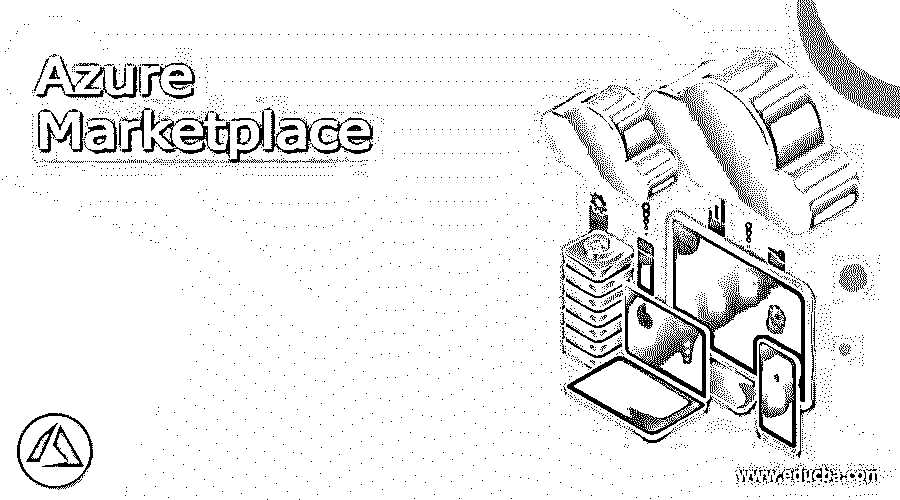

# Azure 市场

> 原文：<https://www.educba.com/azure-marketplace/>

## Azure 市场的定义

Microsoft Azure 中的 Marketplace 类似于在线商店，提供在 Microsoft Azure 的公共云上开发的多种应用程序和服务。它由 SAP、CoreOS、Veeam 和 Microsoft 等软件供应商提供。它由微软 Azure 的 Marketplace 直接从技术合作伙伴处销售。该市场使用户能够实现由所有者批准并遵守企业政策的报价。本文讨论了市场简介、市场实现、市场特性和服务。

### 市场步骤

实施市场的迭代方法有助于扩展学习能力，最大限度地降低成本，并确保平台应该强大，以设定成功的想法。构建在线市场的内容是一个过程，应该通过认知规划进行验证和实施，以取得成功。

<small>Hadoop、数据科学、统计学&其他</small>

*   选择一个强大和最好的市场，并在启动之前进行验证
*   为市场选择商业模式和定价水平。
*   构建最小可行的平台
*   开发初始供应
*   将市场部署给消费者。
*   定期跟踪关键指标，并根据这些指标推动业务增长。

市场设置大致分为三类。一个是计划和实施，下一个是技术部分的讨论和验证，最后一步是启动和发展你的业务，并定期跟踪它，努力实现成功。

**解决方案模板:**

用于实现 MarkLogic 的 azure 术语被定义为解决方案模板。它是作为一个基础设施作为一个代码来构建的。MarkLogic 向消费者提供预建的模板，以便在 Azure 上快速部署，Azure 解决方案的模板库中根据用户的要求提供可定制的模式。

### Azure 市场类别

Azure marketplace 的类别最符合需求的命题。开发人员和 IT 专业人员在寻求行业 saas 应用的业务用户的应用来源中有类别，微软 365 的插件和动态 365 的插件。区块链包括工具、多节点分类帐、单节点分类帐和应用加速器。协作术语包括会议管理、语音和视频会议、任务、项目管理、人员联系。计算机应用程序具有高速缓存、操作系统和应用程序基础结构。法律计费、健康、安全、审计、税务、隐私和数据治理属于法规遵从性和法律类别。容器包括容器图像、容器应用和容器的基本原理。数据库包括关系数据库、NoSQL 数据库、数据湖、数据仓库和区块链数据库。开发者工具包括开发者服务和脚本。财务选项包括信用收集、风险管理、报告、分析、资产管理和会计。地图、天气和新闻属于地理定位。人力资源运营。人才管理、人才获取、劳动力分析、劳动力规划属于人力资源类别。消息传递过程伴随着集成、业务应用、管理解决方案。物联网包括物联网核心服务、物联网边缘模块、物联网连接、数据分析、数据可视化和物联网解决方案。远程监控、互联产品、预测性维护、智能供应链、安保、安全、移动性、车辆、小型基础设施和资源。营销包括社交媒体、电子邮件营销、事件管理、资源管理、分析、研究分析、自动化和活动管理。供应链包括需求预测、质量管理、服务管理、资产和生产管理、信息管理、采购、计划、连接和仓库管理。直播和点播流、内容保护和媒体服务属于媒体。文档管理、电子邮件管理、语言翻译、游戏化、搜索和参考属于生产力。销售包括 CRM、电子商务、销售支持、电话销售、报价、配置、定价和业务数据丰富。网络包括负载平衡器、防火墙、连接和设备管理器。存储包括文件共享、备份、恢复和企业混合存储，以及数据生命周期管理。web 数据包括 web 应用、启动器、Web 应用框架、CMS 和博客。

**定制服务:**

自定义视觉是 Azure 认知服务的一部分，它有一个特定的计算机视觉图像分析领域。它用于开发无摩擦的用户体验，优化工业化流程，加快数字营销的活动，并且它不需要任何机器学习方面的专业知识来获得准确性，没有任何复杂性。计算机视觉模型可以通过标记和上传少量图像来制作。当添加任何图像时，模型测试通过反馈回路持续增加精度。为了增强开发，定制模型被建立。

**Azure marketplace ARM 模板:**

Azure Resource Manager 是作为代码的基础设施的原始平台，它允许用户管理部署，保护 Azure 资源并将组放入容器中，然后一起管理资产。ARM 的模板用于定义 JSON 文件的对象、名称、类型和属性，以确保源代码控制和其他代码文件的管理。它提供了以代码形式部署基础设施的能力。

用声明性模板而不是脚本来指导基础设施。然后在整个开发生命周期中再次部署它，并确保资源放在一致的位置。它可以用多个资源之间的依赖关系来定义，因此如果它们没有以正确的顺序组织，它可以被分类。意味着对每个服务的访问控制，因为 Azure 是基于角色的，它最初集成到管理平台中。然后给资源加上标签，用订阅策略对它们进行逻辑组织。与企业讨论，澄清计费、查看成本、共享同一标签下的资源组。

### 结论

Azure Marketplace 的分析是大数据、预测分析、数据分析、数据洞察、人工智能机器学习、可视化、报告、高级分析以及流式和实时分析。机器学习和 AI 共同构成了认知服务、Bot 服务、ML 服务、数据标记、自动化 ML、数据准备、ML 操作以及机器人流程上的自动化。因此，本文解释了最近蓬勃发展的 Azure Marketplace 的基础知识，并根据需求对其进行了有效利用。

### 推荐文章

这是 Azure Marketplace 的指南。这里我们分别讨论定义、市场步骤、类别、ARM 模板。您也可以看看以下文章，了解更多信息–

1.  [蔚蓝堡垒](https://www.educba.com/azure-bastion/)
2.  [Azure 存储加密](https://www.educba.com/azure-storage-encryption/)
3.  [Azure 通知中心](https://www.educba.com/azure-notification-hub/)
4.  [Azure 实例类型](https://www.educba.com/azure-instance-types/)

