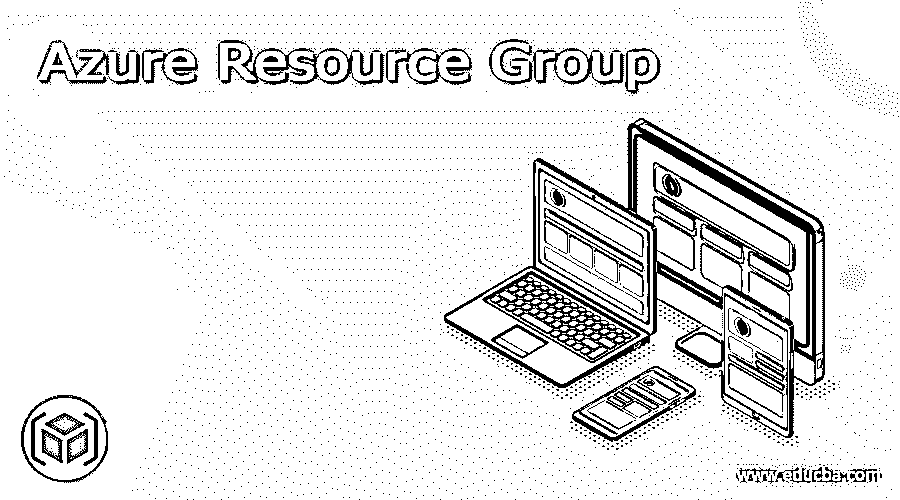
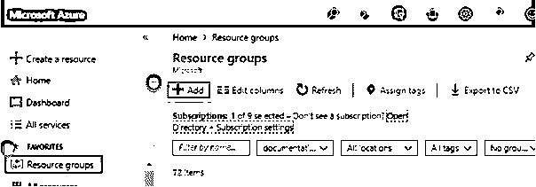
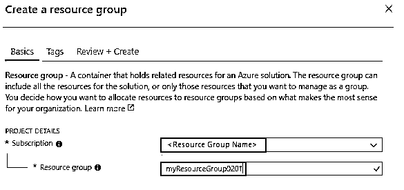
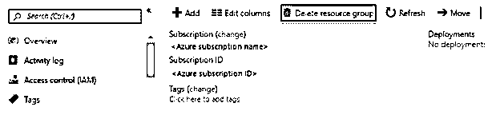
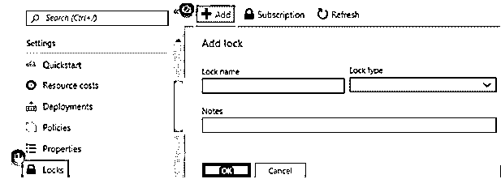

# Azure 资源组

> 原文：<https://www.educba.com/azure-resource-group/>

## Azure 资源组的定义

资源组是一个定义良好的容器，由 Azure 的所有相关资源组成。它可以包括所有可用的资源，或者只包括用户希望作为一个组工作的资源。它是存储帐户、虚拟机、web 应用程序、数据库服务器和相关数据库的一组逻辑集合。用户可以选择对特定应用程序的相关资源进行分组，或者将它们划分为生产、开发、测试和培训等部分。本文简要介绍了 Azure 资源组。

### 什么是 Azure 资源组？

资源组保存关于可用资源的元信息。在这里，用户可以指定资源组的位置和保存元数据的位置。由于合规性问题，用户必须给出检查数据是否保存在安全的特定区域的理由。Azure 资源组管理模型有四个部分，帮助用户将他们的资源组织成组。它们是资源、资源组、订阅和管理组。

<small>Hadoop、数据科学、统计学&其他</small>

管理组由容器组成，这些容器帮助用户管理具有多个订阅的人员的策略、访问和遵从性。

在订阅组中，为关注的用户帐户开发用户帐户和相关用户。
资源组是实施和管理数据库、存储帐户和 web 应用程序的逻辑位置
资源是帮助用户创建虚拟机、SQL 数据库和存储区域的 azure 实例。

### 如何创建 Azure 资源组？

有两个重要资源组用于分组。第一部分专门针对业务线，下一部分关注基础架构即服务。通过为特定的应用程序创建资源组来存储数据，该组中的资源可以扩展到多个区域。创建 Azure 资源组的不同方法是 Azure CLI、Azure portal、Azure PowerShell 脚本和 ARM 模板。

要创建 Azure 资源组，需要以下先决条件。比如 Edge 或者其他 web 浏览器，稳定的网络连接，Azure 云账户。

1.登录 Azure 门户网站

2.从左侧面板中选择资源组

3.进入“资源组”页面，在页面开始处选择“添加”

4.在资源组的新页面上，填写所有必需的详细信息，然后选择“查看并创建一个选项”

5.验证过程开始，通过后，选择“创建”按钮。几分钟后，控制台中就会为用户创建新的资源。

6.创建资源组后，用户会收到控制台页面上通知图标上的消息通知。用户可以在通知窗格中验证他的资源组。

7.因此，Azure 资源组在 Azure cloud 上成功创建。

### 如何删除和锁定资源组？

要删除资源组，请按照下列步骤操作。

*   在 Azure 门户中，选择需要删除的资源组。
*   然后在删除资源组上选择。
*   要确认它，用户可以通过键入资源组的名称进行验证。

要锁定资源组，请执行以下步骤:

如果用户是管理员，他可以锁定资源组、订阅或资源，以避免其他用户的意外修改。无论用户可能拥有什么样的访问权限，该锁都会否决。用户可以通过选择 ReadOnly 选项或 CanNotDelete 选项来定义他的锁。所以一旦这些锁给了，它就只做只读的步骤。

通过使用 CanNotDelete，被授权访问特定区域的用户可以读取和编辑资源，但无权删除它。

只读帮助用户查看资源，他不能编辑、更新或删除资源。它限制所有授权用户否决 reader 选项所赋予的权限。

用户可以应用管理锁对所有角色和用户进行限制。但是要删除或创建管理锁，他应该有权限联系微软授权。

### 关键 Azure 资源组

构建 Azure 资源组时要考虑的事项如下:

可以在 Azure 资源组中输入或删除资源。但是每个资源都应该是 Azure 资源组的成员，所以如果用户被删除了资源组上的资源，管理员可以添加新的资源。

但是并不是每个资源都可以移动到其他资源组。

资源应该包含在不同的 Azure group 区域中。集团应提供保存所有元数据的位置，根据合规政策，这是强制性的。

提供对各种资源组的访问，以管理对资源的访问。因此，当删除任何资源组时，该组下的所有资源也会被删除。

管理员可以在每个资源组中部署大约 800 个资源类型的实例，但也有一些例外。

### 基于角色的访问控制

Azure RBAC 扩展为 Azure 基于角色的访问控制，可以灵活地添加、管理和向用户提供不同级别的权限。

通过单个或多个角色提供对各种 Azure 资源的访问。例如，用户可以管理 Azure 应用程序和 SQL 服务。因此，可以为他添加读者、所有者、管理者和贡献者角色。

通过提供对订阅级别的访问，用户可以在特定订阅中创建 VM，或者使用户能够开发 Azure 应用服务和逻辑服务，这些服务具有读取、贡献或所有者角色。

管理员可以提供对不同部分的不同访问，如订阅、资源、资源组和管理组。

### 结论

因此，这些是 Azure 中资源组的基本属性，它是根据用户需求应用的。用户可以提供对任何应用程序的访问以访问特定的资源，并且他可以执行范围、用户和组之间的许多关系。

### 推荐文章

这是 Azure 资源组的指南。这里我们讨论定义，什么是 Azure 资源组，如何创建 Azure 资源组？.您也可以看看以下文章，了解更多信息–

1.  [蔚蓝色的木板](https://www.educba.com/azure-boards/)
2.  [Azure 门户登录](https://www.educba.com/azure-portal-login/)
3.  [蔚蓝堡垒](https://www.educba.com/azure-bastion/)
4.  [Azure 存储加密](https://www.educba.com/azure-storage-encryption/)

