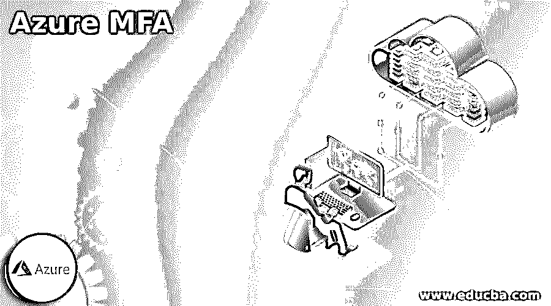

# 天蓝色 MFA

> 原文：<https://www.educba.com/azure-mfa/>

## Azure MFA 简介

Azure MFA 是一种多因素身份验证方法，操作员在登录过程中会被触发一种不同形式的身份验证，如在手机上输入代码，甚至进行指纹扫描。

Azure MFA 的运行需要以下两种或多种身份验证技术:

<small>Hadoop、数据科学、统计学&其他</small>

*   已知的东西，通常是密码。
*   拥有的东西，如硬件钥匙或不易复制的类似手机的可信设备。
*   一些真实的东西，如生物指纹识别或面部扫描。

这个 Azure MFA 还进一步帮助保护密码重置。

### Azure MFA 步骤

为了改变终端操作员对 Azure AD 多因素身份验证的理解，用户可以设置选项，例如帐户锁定阈值或通知或欺诈警报。不幸的是，很少有设置在 Azure AD (Azure Active Directory)的 Azure 门户中公开，很少有设置在独特的 Azure AD MFA 门户中公开。

以管理员角色登录 Azure 门户后，MFA 用户可以使用以下步骤和设置:

*   **帐户锁定:**如果连续发生太多次拒绝身份验证的尝试，则帐户会被暂时锁定，无法使用 Azure AD MFA。此功能仅适用于插入 PIN 以验证 MFA 服务器的操作员。
*   **阻止/解除阻止操作员:**有助于阻止特定操作员接收 Azure MFA 请求，这些请求在 90 天内有效，甚至可以手动解除阻止。当任何尝试操作完成时，被阻止的用户无权拒绝访问。
*   **欺诈警报:**组织允许操作员报告任何欺诈验证请求的设置。
*   **通知:**方便来自服务器的事件通知。
*   **誓言令牌:**在以云为中心的 Azure MFA 环境中实现，用于管理运营商的誓言令牌。
*   **电话呼叫设置:**为云和内部环境安排与电话呼叫和问候相关的设置。
*   **Providers:** 显示您可能与相应帐户相关的任何主流身份验证提供商。自 2018 年 9 月 1 日起，不得组建任何新的认证提供者。

### 设置 Azure MFA

如果你正在设置 Azure MFA，你需要学习以下内容:

假设我们想通过活动目录联合服务来保护 Azure AD 资产。在这种情况下，身份验证的第一个要素通过 AD FS 在内部执行，第二个要素通过偶像化声明在内部执行。Azure MFA 服务器不必连接到任何 AD FS 联合服务器上；然而，用于 AD FS 的 MFA 适配器应该连接在执行 AD FS 的 Windows Server 2012 R2 上。也可以在不同的计算机上连接服务器，直到它是维护版本，并在 AD FS 联合服务器上不同地连接 AD FS 适配器。

MFA AD FS 适配器的设置向导在 Active Directory 中开发一个名为 PhoneFactor Admins 的安全群集，然后将联合身份验证服务的 AD FS 服务帐户补充到该群集。因此，建议在您的域监管机构上确认 PhoneFactor Admins 群集确实已形成，并且 AD FS 服务帐户是此群集的关联帐户。如果需要，您甚至可以补充域监管器上 PhoneFactor Admins 集群可用的 AD FS 服务帐户。

对于部署，您的首次展示计划必须包含一个由您的支持能力范围内的部署影响跟踪的试点设置。通过将您的条件接收策略与一个较小的试点运营商集群相关联来开始您的推广。计算出试点操作符、使用的过程和注册操作的结果后，您可以向策略中添加更多的集群，或者向主要集群中添加更多的操作符。

您应该遵循以下步骤:

*   满足必要的先决条件。
*   组织选定的认证程序。
*   设计条件接收策略。
*   安排会话生存期设置。
*   表单 Azure AD MFA 注册策略。

### 最佳实践 Azure MFA

Azure MFA 被定义为一种安全执行，它需要的不仅仅是来自用于验证操作员身份的自治身份类别的单一身份验证过程。相反，它的目标是当任何因素被合作或可能被破解时，使非法人员进入网络资产变得更加复杂；攻击者仍然拥有至少一个额外的屏障，用于在有效地突入目标之前进行渗透。因此，可以说这是一个保留对用户信息和微软 Azure 云中可用应用程序的访问的过程。因此，它加强了运营商认证技术，包括各种验证可能性，如文本消息、电话或移动应用程序通知。

Azure 身份管理甚至访问控制安全性所遵循的一些最佳实践如下所述:

*   将身份作为主要的安全因素。
*   集中身份管理。
*   实现居住者的互联。
*   只允许一次登录。
*   打开条件接收选项。
*   日常加强安全的建议。
*   允许密码管理。
*   为操作员管理多因素验证。
*   练习基于角色的访问控制。
*   机密账户的次级披露。
*   管理资产所在的位置。
*   使用 Azure AD 进行存储验证。
*   office 365 的集成。
*   Azure MFA 许可证。
*   允许 AD 运营商使用 azure MFA。
*   为 MFA 设置的客户帐户。
*   NPS 服务器创建。
*   多因素认证供应商。
*   企业移动套件或 Azure AD premium。
*   用户门户、控制台和同步引擎。
*   Web 服务 SDK 和集成组件。
*   移动应用程序 web 服务。
*   管理门户。
*   云服务。

### 结论

Azure MFA 有利于保护任何组织，相比之下，由于具有无缝和强大的身份验证技术的身份丢失或被盗，可能会发生违规。您可以保护一个应用程序，包括仅一个步骤。应用和服务不需要修改就能实现。验证触发是 Azure MFA 登录事件的一部分，它自发地请求甚至在需要时实践 MFA 质询。

### 推荐文章

这是一个 Azure MFA 的指南。这里我们讨论 azure MFA 的介绍、步骤、设置和最佳实践，以便更好地理解。您也可以看看以下文章，了解更多信息–

1.  [Azure 通知中心](https://www.educba.com/azure-notification-hub/)
2.  [Azure 实例类型](https://www.educba.com/azure-instance-types/)
3.  [Azure 混合优势](https://www.educba.com/azure-hybrid-benefit/)
4.  [Azure 活动中心](https://www.educba.com/azure-event-hub/)

