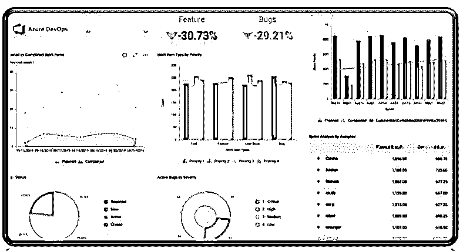

# Azure 中断

> 原文：<https://www.educba.com/azure-outage/>

## Azure 中断简介

首先，众所周知，微软 Azure 是一种云计算服务，通过微软管理的数据中心来计算、测试、组织和完成应用程序和服务。而软件总是会有漏洞，所以没有可用的云平台可以提供无中断。微软一直在努力防止任何风险或问题在未来发生，并提供透明的快速恢复。在过去的几个小时里，微软 Azure 已经收到了许多报告，提出了一些问题。一般来说，当报告的数量代表比固定的基线更大的值时，中断被识别。10 月 13 日，客户不得不面对 Azure 使用 Windows 虚拟机加服务的全球中断，这些服务依赖于微软提供的服务，包括一些其他服务。

### 什么用于提供停机？

*   Azure 服务健康通知管理员 Azure 服务事件以及相应的计划维护；管理员可以采取措施减少停机时间。
*   甚至可以设计可定制的云警报，并实施其个性化的仪表板来分析健康问题的发生，观察对云资产的影响，接受监督和维护，并分发事实和更新，包括事件根本原因评估。
*   人们可以通过从微软下载授权报告、关注移动设备上的实时事件以及任何具有牢固链接的问题管理系统来获得 Azure Health status。
*   Azure service health dashboard 帮助您找出 Azure 云服务的任何中断，并指导您使用适当的解决方案和保护来应对任何警报或攻击。
*   微软投资超过 10 亿美元用于提高网络安全云研发的安全性。近 3500 名安全专家致力于保护用户的数据和隐私。
*   与任何其他云提供商相比，Azure 拥有最多的认证。因此，现在使用 Azure 门户创建您的 Azure 帐户，并通过完整的指导和计划的文档资料浏览它。

### 未来停电的类型

在过去的几个月里，Microsoft Azure 经历了两种中断，并努力在未来避免这些中断。

<small>Hadoop、数据科学、统计学&其他</small>

#### 1.Azure AD(活动目录)中断–2021 年 3 月

*   我们可能会认为云是一种神奇的纸浆，它同时拥有移动应用程序、电子邮件访问和用户对业务基础架构的验证，而不会破坏计算。但 3 月 15 日 Azure 的中断控制了第二大云计算平台上的普遍中断。结果，它阻碍了 Azure 服务和团队、Dynamics 365、Office、Xbox Live 等等。
*   大约 14 小时的中断发生在执行安全密钥轮换时，这更好地维护了 Azure Active Directory 用户的安全。同一天，微软正在进行一场关于云提供商的艰难的数据迁移。因此，它标记了一个名为“do not rotate”的特殊键，该键需要保持一段时间才能完成迁移。然而，这个“不要旋转”的标记没有被自发旋转过程注意到；例如，新的密钥扩展了 Azure 服务，消费者无法登录。

#### 2.Azure DNS 中断–2021 年 4 月

*   4 月 1 日监测到一次小的中断，当时 Azure DNS 开始实践一个可获得性问题，该问题在为几个客户通过不同区域检索和组织 Azure 服务时产生了故障。
*   这被认为是世界上最轻微的愚人节玩笑；然而，它真正是由 Azure DNS 服务器遭受针对 Azure 上引入的一组域的 DNS 查询流而触发的。不幸的是，事件的结构保护了 DNS 服务中的代码缺陷，这导致了服务的过度和可访问性的降低。
*   与微软协商，这些 DNS 服务习惯性地自我恢复，恢复期“超过了{微软}的设计目标。”此外，微软智能其以前的功能，恢复代码缺陷，并加强自发的限制和陌生流量的调节。

### Azure DNS 中断状态

*   就在 3 月份 Azure AD 中断发生后大约 2 周，微软在 2021 年 4 月 1 日，周四晚上将近 21:30 UTC，实施了一次无装饰的 DNS 中断。这是微软正式开始的中断。然而，明确的和正式的开始可能经常是不同的。
*   虽然 DNS 和服务器在近 10 分钟前发现了错误，但这是 DNS 故障的正常现象。你需要从这次服务中断中吸取教训，DNS 故障可能会造成伤害。当 web 状态页面不工作或者甚至是备用页面不工作时，就会出现问题。在很短的时间内，在微软，有人开始收到图片，这是一个静态页面，上面有一条关于要走的路的消息，然后他们修改了状态页面，并同时发布了它。
*   此外，该企业将 Twitter 与状态源集成在一起，提供了关于该问题的表面信息和一条消息，表明微软正在关注该问题或中断的发生，并将尽快更新。
*   据调查，微软 Azure DNS 宕机的初步根本原因尚不清楚，但微软 DNS 服务器注意到 4 月 2 日 DNS 流量出现峰值。因此，微软对 DNS 服务中断造成的影响表示歉意，该团队正在继续调查，以找到此次 DNS 服务中断的根本原因。

### 自定义仪表板

*   Azure 的定制仪表板有利于接收关于 Azure 服务中断或问题的个性化警报和指导。
*   仪表板提供云警报的配置选项，以通知用户关于正在进行的或即将到来的服务问题；此外，还可共享事实，更新包含事故根本原因的查询，甚至提供支持和维护。
*   Azure 的可定制和可配置的仪表板为管理员和团队提供了可跟踪的功能，用于共享信息、观察进度和发展，以及增强您的工作流程。此外，每个团队都可以修改他们的仪表板，以审查正在进行的过程。
*   这个仪表板是一个协作的招牌类型，提供与项目团队筛选图表和小部件相关的实时数字。
*   配置仪表板后，您可以访问快速链接以及其他功能。

### 结论–Azure 宕机

Azure 提供 SaaS(软件即服务)、PaaS(平台即服务)和 IaaS(基础设施即服务)，还支持各种编程语言、框架和工具，包括特定于微软的第三方软件和系统。Azure 宕机是意料之外的事情，给客户带来了问题，但微软和团队正在应用额外的保护措施，以防止后端安全开发流程系统(即 SDP)在未来面临一类风险。

### 推荐文章

这是 Azure 宕机指南。这里我们讨论引言；什么用于提供停机？和类型以便更好地理解。您也可以看看以下文章，了解更多信息–

1.  [Azure 通知中心](https://www.educba.com/azure-notification-hub/)
2.  [Azure 实例类型](https://www.educba.com/azure-instance-types/)
3.  [Azure 混合优势](https://www.educba.com/azure-hybrid-benefit/)
4.  [Azure 活动中心](https://www.educba.com/azure-event-hub/)

