# 微软 Azure 物联网边缘

> 原文：<https://www.educba.com/microsoft-azure-iot-edge/>

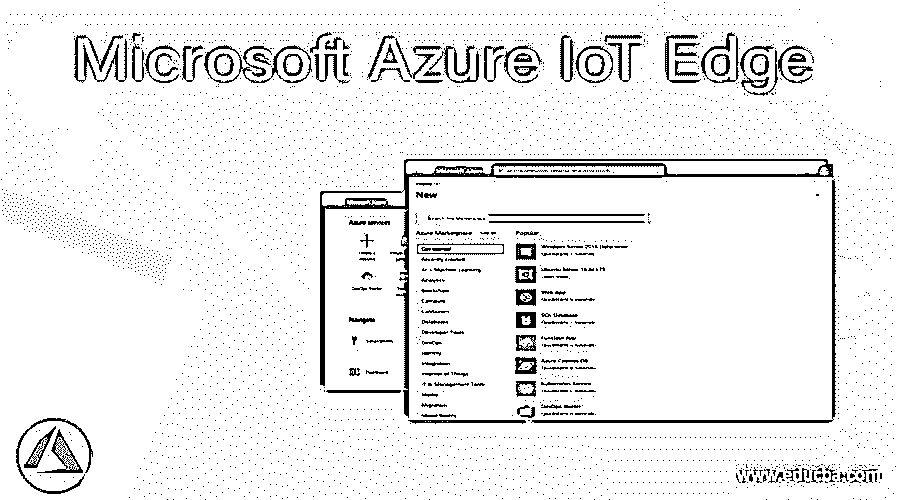

## 什么是微软 Azure IoT Edge？

Azure IoT Edge 是一种云服务，结合了云服务和运行在设备上的运行时。设备上的所有工作流都由物联网边缘使用的运行时管理和启动。在 Azure IoT edge workflow 中，一组容器按照特定的顺序端到端地链接在一起，形成一个管道。物联网中心用于管理 Azure 物联网边缘，物联网边缘使用户能够在边缘设备上运行基于云服务开发的工作负载。物联网边缘中的工作负载只不过是使用 docker 兼容容器部署的模块，这些模块是人工智能应用程序、第三方服务或 Azure 服务。

### Azure IoT Edge 是如何工作的？

微软 Azure 物联网边缘包括三个组件，即物联网边缘模块、物联网边缘运行时和物联网边缘云接口。我们将逐一学习，简要如下:

<small>Hadoop、数据科学、统计学&其他</small>

1.  **物联网边缘模块**:这些模块是执行实现单元，这些模块是 docker 兼容容器。物联网边缘模块在边缘设备上运行业务逻辑，也运行 Azure 服务、第三方服务或代码。这些模块也可以运行在物联网边缘设备上，并在本地设备中执行。此外，用户可以为数据处理创建管道，模块也可以在需要时离线运行。
2.  **物联网边缘运行时:**用于管理运行时，并与部署在设备中的模块进行通信。它还通过向云发送模块健康报告来确保模块始终启动和运行。
3.  **物联网边缘云接口:**用于远程管理和监控物联网边缘设备。如果应用程序在不同设备上以特定类型大规模运行，用户还可以创建和配置工作负载。然后，用户可以将工作负载部署到特定设备，并保持其运行，以集中监控工作负载。

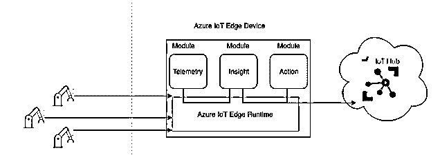

**Image ref:**[https://docs . Microsoft . com/en-GB/learn/modules/introduction-IOT-edge/media/IOT-edge-components . png](https://docs.microsoft.com/en-gb/learn/modules/introduction-iot-edge/media/iot-edge-components.png)

### 如何在 Azure 中创建和使用 IoT Edge？

**先决条件:**

在学习创建 Azure IoT Edge 之前，用户必须拥有 Azure 订阅，以便您可以使用有效的凭据登录 Azure 门户并创建 Azure IoT Edge。

**使用 Azure 门户的步骤:**

**步骤 1:** 使用有效凭证登录 Azure 门户。

[打开 Azure 门户](https://portal.azure.com/#home)

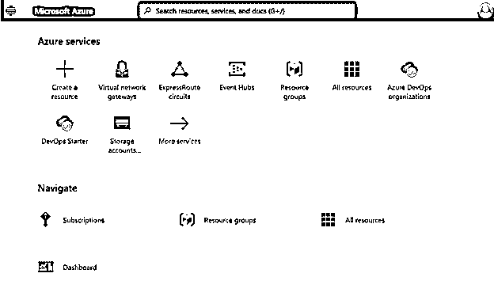

**步骤 2:** 从 Azure 门户选择**创建资源**链接:

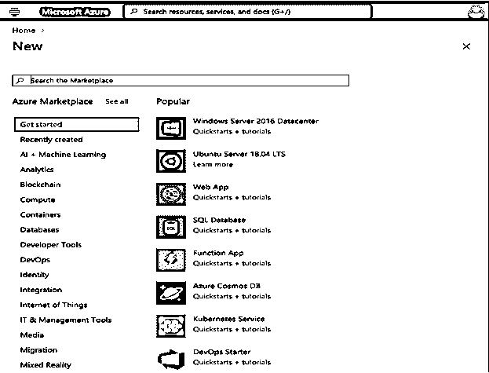

**步骤 3:** 在**搜索市场**字段输入**物联网中心:**

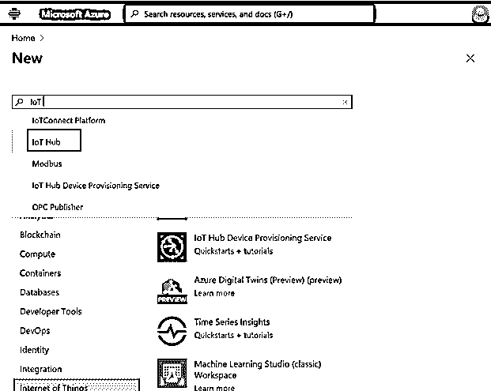

**步骤 4:** 从 Azure Active Directory 中点击**创建**链接:

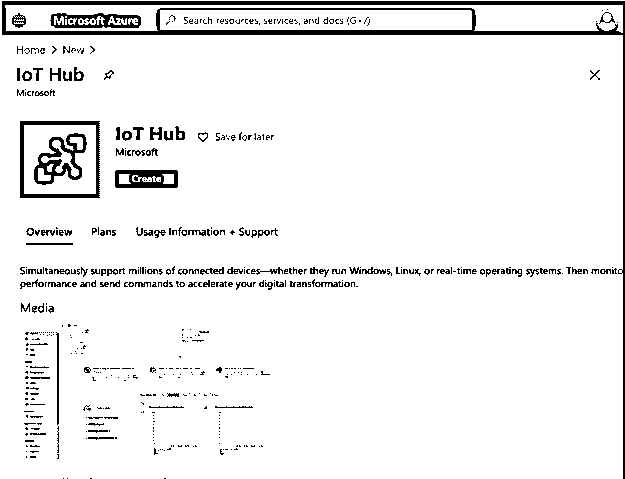

**第五步:**现在将打开一个新页面，显示**物联网中心**:

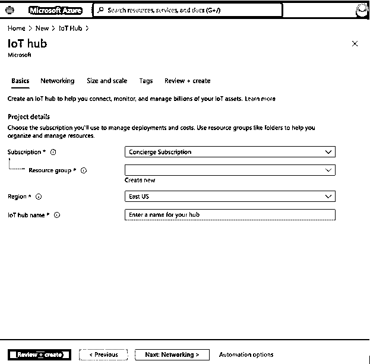

**第六步:**进入如下**物联网中心**详情，选择**创建**按钮，为物联网边缘设备创建一个新的物联网中心:

*   **订阅:**用户订阅了具体的订阅，从下拉列表中选择相同。
*   **资源组:**用户可以选择订阅的资源组或者已经存在的资源组名称。
*   **地区:**用户可以根据位置选择地理区域。
*   **物联网中心名称:**输入您的物联网中心名称。

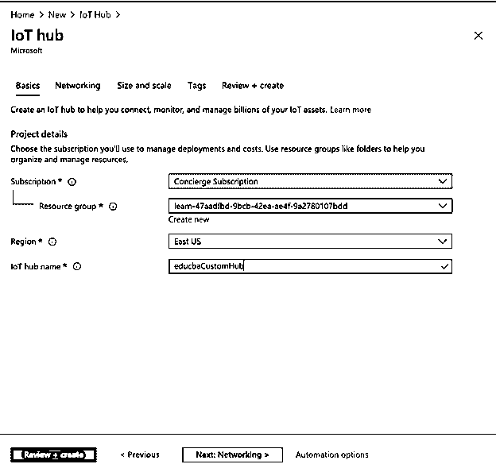

**步骤 7:** 现在选择**下一步:联网>T3】然后选择**下一步:规模和规模**并从定价和规模层中选择**自由层****

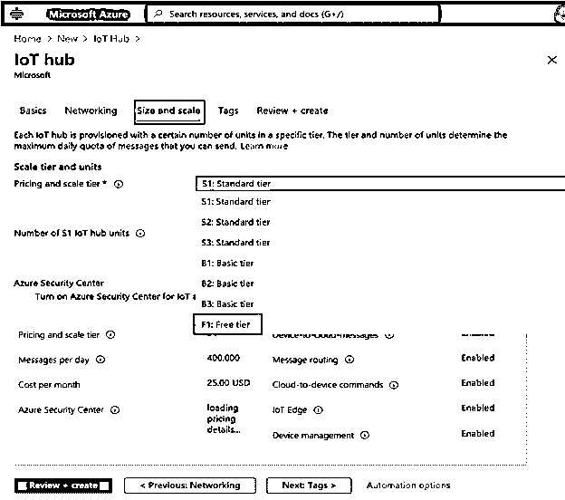

**步骤 8:** 在物联网中心页面点击**审核+创建**按钮，验证输入的详细信息，并点击**创建**按钮:

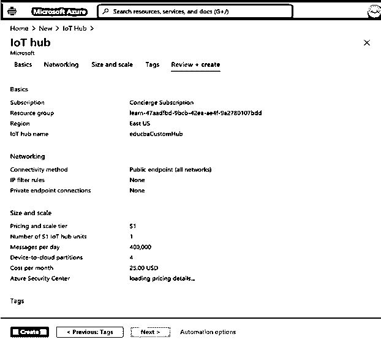

**步骤 9:** 将开始部署新创建的物联网中心:

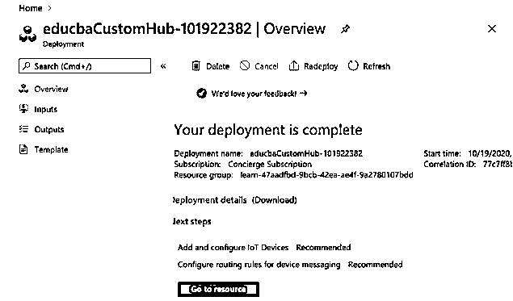

**步骤 10:** 点击**转到资源**打开新建物联网中心摘要:

**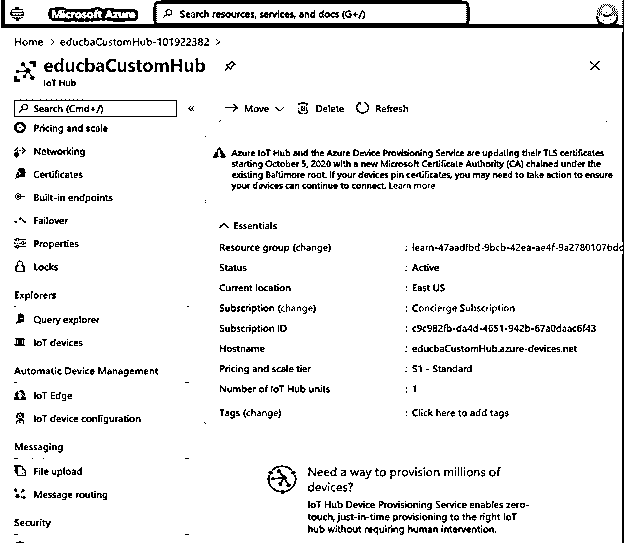

** 

**步骤 11:** 从**自动设备管理**部分选择**物联网边缘**，允许用户管理连接到物联网集线器的物联网边缘设备:

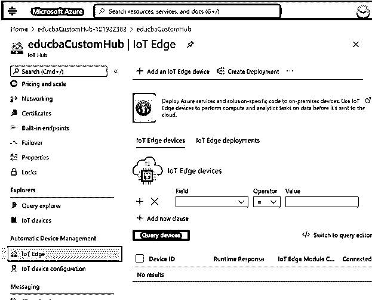

**添加新的物联网边缘设备:**

**步骤 12:** 现在从物联网边缘页面选择+ **添加物联网边缘设备**，会打开一个**创建设备**页面:

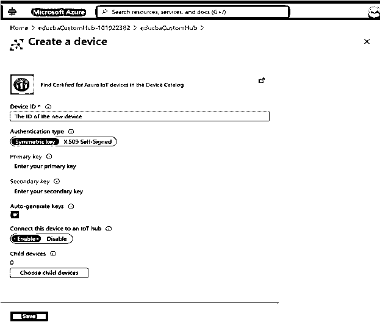

**步骤 13:** 现在在此页面输入用于设备认证和访问控制的设备 ID，点击**保存**:

*   **设备 ID:** 字段采用唯一的 ID 用于设备认证和访问控制。
*   **认证类型:**用户可以选择对称密钥或 X.509 自签名。
*   **自动生成密钥:**选中此框。

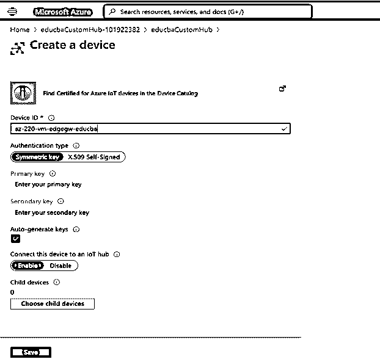

**步骤 14:** 新创建的设备被添加到物联网边缘设备列表，并点击新创建的设备 id:

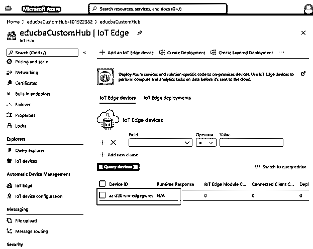

**步骤 15:** 用户可以看到新创建设备的摘要

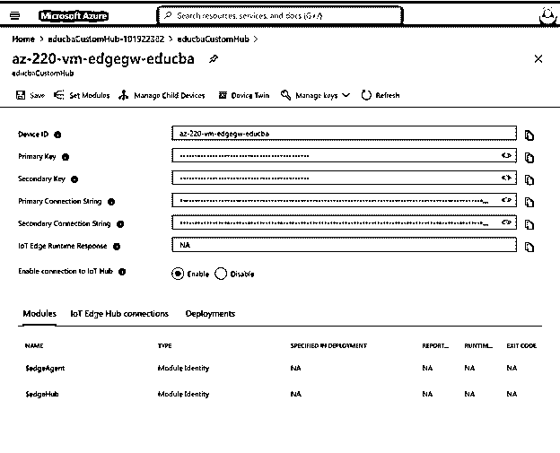

**第 16 步:**从页面中选择**设置模块**，对模块进行配置:

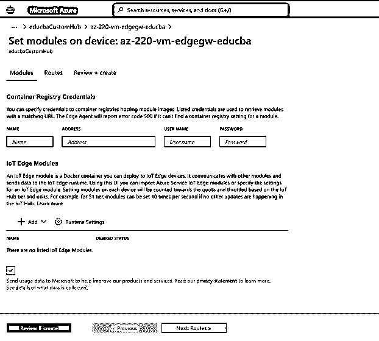

**步骤 17:** 从物联网边缘模块中选择**+添加**，从物联网边缘模块、市场模块或 Azure 流分析模块中添加新模块。

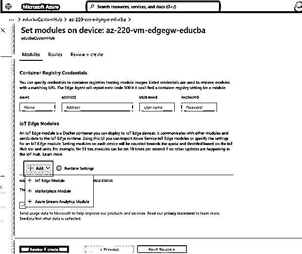

**第 18 步:**现在从页面中选择 Review+Create:

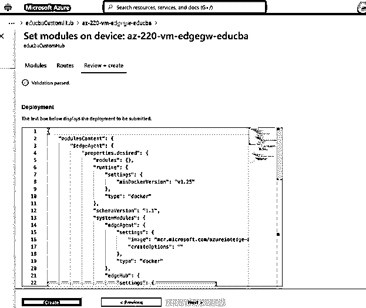

**步骤 19:** 点击**创建**选项，添加一个新模块。

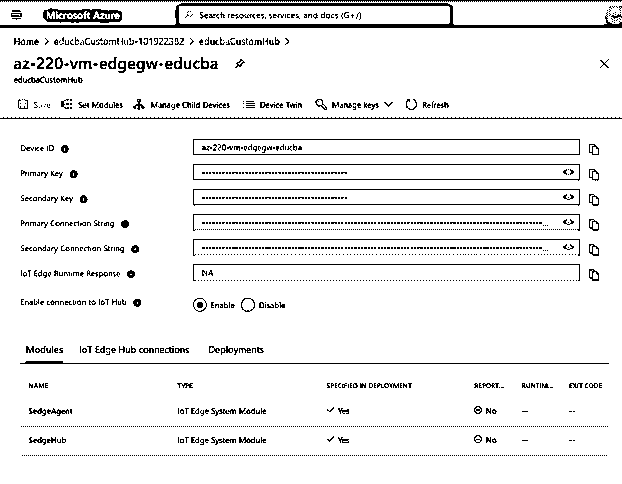

**步骤 20:** 不使用时，用户可以删除新创建的物联网设备:

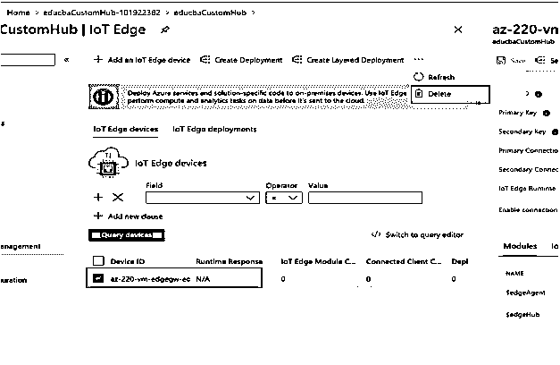

**第二十一步:**点击**是**删除物品:

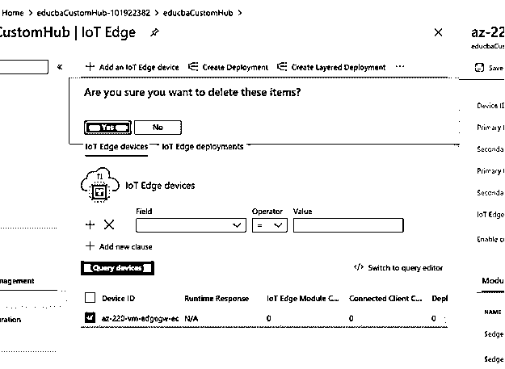

### 微软 Azure 物联网边缘的使用

*   为了远程管理边缘设备，物联网边缘提供了云接口和运行时模块。
*   物联网边缘允许用户部署 docker 兼容容器，以在边缘设备上运行代码或服务。
*   它支持多种语言，如 C、C#、Python、Java 和 node.js。
*   Azure 物联网边缘设备可以在离线或间歇模式下高效运行。
*   它具有边缘部署的安全性，因为它有一个物联网中心来确保设备可以相互通信，并且通过集成 azure 安全中心来提供安全性。

### 结论

总之，Azure Edge 物联网设备可以帮助用户在 Azure 物联网边缘服务中建立端到端的管道，并且可以轻松创建，用户也可以有一个云界面来远程管理和监控一切。微软 Azure 有一个按次付费的定价模式，因此用户只需为边缘设备使用的资源付费。

### 推荐文章

这是微软 Azure IoT Edge 的指南。在这里我们讨论微软 Azure 物联网边缘的介绍，如何创建和使用微软 Azure 物联网边缘？.您也可以浏览我们的其他相关文章，了解更多信息——

1.  [Azure 队列存储](https://www.educba.com/azure-queue-storage/)
2.  [Azure 事件网格](https://www.educba.com/azure-event-grid/)
3.  [Azure ExpressRoute](https://www.educba.com/azure-expressroute/)
4.  [Azure 队列存储](https://www.educba.com/azure-queue-storage/)

