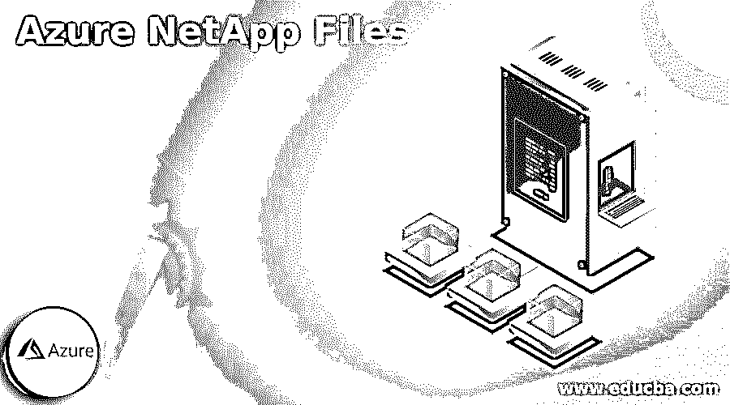
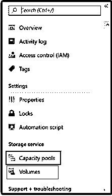

# Azure NetApp 文件

> 原文：<https://www.educba.com/azure-netapp-files/>

## Azure NetApp 文件简介

*   Azure NetApp Files 被广泛实施为底层共享文件存储服务，适用于多种场景，如数据库、SAP HANA、兼容 POSIX 的 Linux 和 Windows 应用程序的迁移(lift & shift)、企业 web 应用程序和 HPC(高性能计算)。
*   在云中，执行性能密集型和延迟敏感型文件工作负载可能非常困难。因此，NetApp Files 为存储专业人员和企业业务线(LOB)创造了一种轻松的环境，可以跟踪和缓解基于文件的复合应用程序，而无需对代码进行任何修改。
*   这种 Azure NetApp 文件方法包括三个名为标准的性能层；Premium & Ultra，只需轻轻点击即可获得支持。因此，它可以让你选择一个与工作需求相关的层级，同时也可以提高费用。

### 创建 Azure NetApp 文件帐户

当我们创建 Netapp 文件帐户时，它允许配置容量池并相应地创建卷。以下是创建帐户的步骤:

1.  应首先登录 Azure portal。
2.  借助以下流程，用户可以访问 Netapp 文件刀片:
    1.  然后，在 Azure 门户搜索框中，搜索 **NetApp 文件**。
    2.  然后在导航中，点击**所有服务**。之后，过滤到 NetApp 文件。甚至你可以点击 Azure NetApp Files blade 旁边的星形图标，使其成为“收藏夹”
3.  现在，通过单击 **+ Add，**，您可以创建一个新的 NetApp 帐户，新的 NetApp 帐户窗口将在该窗口中显示。
4.  提供账户所需的信息，如:
    *   为订阅提供不同的帐户名。
    *   然后，从主要订阅中选择一个订阅。
    *   您可以实现当前的资源组，也可以设计一个新的资源组。
    *   最后，请选择需要定位客户及其相关子资源的位置/地区。
5.  之后，您只需单击“Create”按钮，帐户就会创建并显示在 NetApp Files blade 中。但是，如果用户没有 NetApp 文件服务的权限，则在创建新帐户时，主要会出现部署失败消息的错误。

### Azure NetApp 文件快照如何工作？

Azure NetApp 文件快照提供了可扩展性、稳定性和快速可恢复性方面的知识，但对性能没有任何影响。因此，它为包含独特文件恢复、跨区域复制、卷恢复和克隆以及长期维护的数据安全解决方案奠定了基础。

<small>Hadoop、数据科学、统计学&其他</small>

您可以查看创建和维护快照的各种方法:

*   **通过以下方式按需**(手动):
    1.  Azure REST API、Azure 门户、PowerShell 或 Azure CLI 工具
    2.  剧本

*   **自动化**通过以下方式:
    1.  通过 Azure CLI、Azure 门户、PowerShell 或 REST API 工具的快照策略
    2.  应用程序一致性快照工具，如 AzAcSnap。

我们可以通过以下方式删除在线快照:

因为快照会消耗存储容量，但通常不会无限期保存。对于保留和可恢复性、数据安全性，可能在许多时间点创建的许多快照通常会在线保持一段确定的时间，具体取决于 RTO、RPO 甚至保留 SLA 要求。然而，旧的快照通常不需要保存在存储服务上，并且可以被移除以释放空间。

管理部门可以随时删除任何快照，但本质上不能按照创建的指令进行操作。当删除任何快照时，从该快照到主要数据块的整个点也将被删除。例如，假设数据块不包含任何额外的指针，即，通过其他快照或活动卷。在这种情况下，数据块将被恢复到卷开放空间以供将来实施。

**注意:**快照删除操作一旦执行就无法撤消。为此，为了保留目的和数据安全，可以保留卷的离线副本，即存储的快照。

### Azure NetApp 文件备份

*   Azure NetApp Files backup 通过为长期恢复、默认和归档提供完全有序的备份解决方案，扩展了 NetApp 文件的数据保护功能。该服务形成的备份保存在 Azure 存储中，这是卷快照服务的自我管理，用于短期恢复或模拟。
*   该服务进行的备份可以恢复到该区域内新的 Azure NetApp 文件卷。在这种情况下，NetApp 文件备份配置与基于策略的备份或计划备份以及按需或手动备份相结合。

### 使用 Azure NetApp 文件的优势

*   微软服务是完全托管的，比以往任何时候都更快、更稳定地将业务、工作流和应用程序带到云中。
*   NetApp 文件旨在实现简单性、合规性和高性能。
*   它提高了基础设施的可接受性，实现了卓越的性能、一致的需求和安全性，并增强了您的服务。
*   同时支持多种协议，保证数据安全。
*   深度集成功能与领先认证的无缝体验。

### Azure Netapp 文件基础

*   您需要在 Cloud Manager 中为 NetApp 文件创建一个工作环境，以便创建和管理 NetApp 帐户、卷、容量池和快照。
*   如果 Azure NetApp 文件尚未设置，则需要按照以下完整步骤进行创建。但是，假设 NetAPP 已经在云管理器之外进行了配置。在这种情况下，用户将必须设置一个 Azure AD 应用程序，将应用程序移交给一个角色，并形成 NetApp 文件工作环境。

### 示例配置

为了快速开始，我们需要首先设置以下内容:

*   注册 Azure NetApp 资源提供商
*   登录 Azure 门户网站并在搜索框中搜索 NetApp 文件后，创建一个 Azure NetApp 帐户。

*   此外，从 NetApp 文件管理刀片形成容量池，并选择 NetApp 帐户。
*   对于 NetApp 文件，从 NetApp 文件管理刀片创建 NFS 卷，并选择 NetApp 帐户。

### 结论

*   Azure NetApp 文件相应地将企业级存储和数据管理提取到 Azure。人们可以轻松地将整个 Linux 和 Windows 基于文件的应用程序、高性能应用程序和业务敏感型应用程序转移到云中。
*   最初，用户可以获得非常可靠、稳固和持久的文件存储，用于云中的任何应用程序，而不会遇到任何复杂的问题，比如说，重新构建。

### 推荐文章

这是 Azure NetApp 文件指南。在这里，我们讨论 Azure NetApp 文件快照的工作原理，以及示例和优势。您也可以看看以下文章，了解更多信息–

1.  [蔚蓝租户](https://www.educba.com/azure-tenant/)
2.  [蔚蓝堡垒](https://www.educba.com/azure-bastion/)
3.  [Azure 存储加密](https://www.educba.com/azure-storage-encryption/)
4.  [Azure 存储](https://www.educba.com/azure-storage/)

