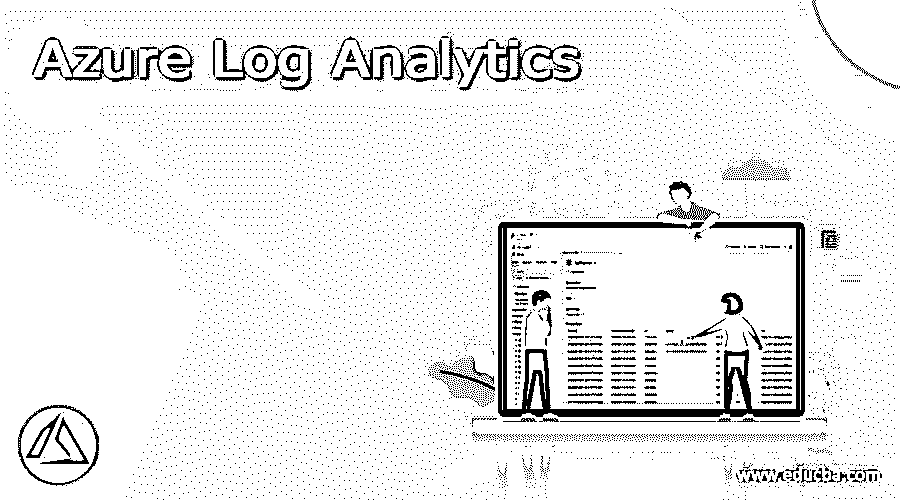
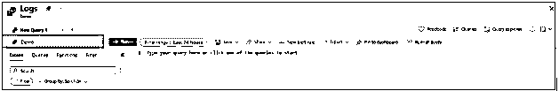
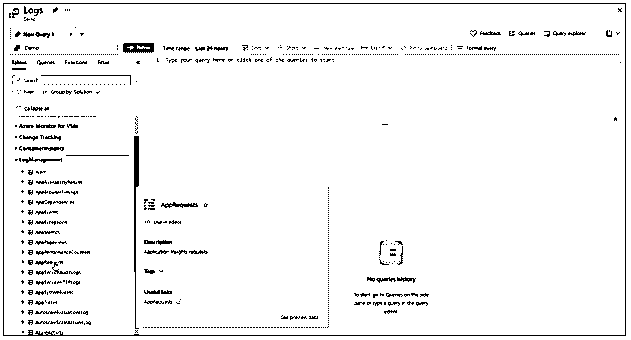
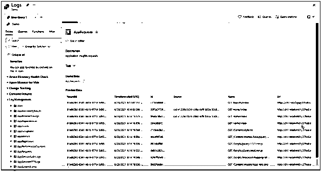
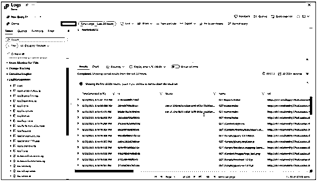
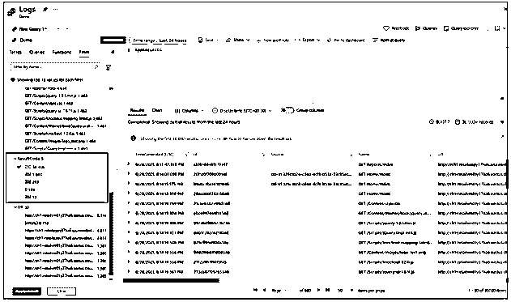
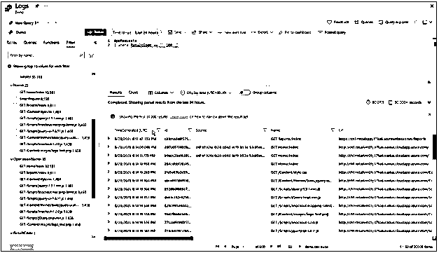
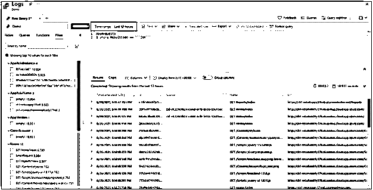
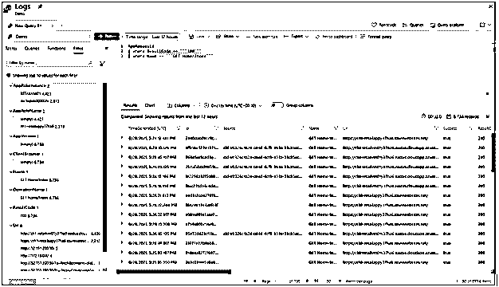
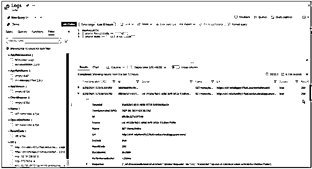

# Azure 日志分析

> 原文：<https://www.educba.com/azure-log-analytics/>

## 什么是 Azure Log Analytics？

*   在 Azure portal 中，Azure Log Analytics 可作为一种工具，用于编辑和运行来自 Azure Monitor 日志组成的数据的命令查询，并通过控制分析引擎进一步交互评估其结果。然后，人们可以应用这些查询来维护其他 Azure Monitor 功能，包括工作簿和日志查询警报。我们可以从日志选项中获得 Azure Monitor 菜单上的日志分析服务，甚至可以从 Azure 门户中可用的最大附加服务中获得。
*   Azure 的服务日志分析被实现来观察云和本地设置，以支持它们的可访问性、性能和一些其他功能。作为该服务的一部分，目前存在普遍的交互式查询能力，允许用户要求对数据记录明确的渐进问题。尽管为执行这些查询提供了一个包含性的 IDE，但有时以编程方式获取记录是必要的。

### 如何创建 Azure 日志分析？

为了创建 Azure 日志分析，我们需要遵循以下步骤:

#### 1.运行日志分析:

在 Azure dashboard 中，从订阅中的 Azure Monitor 菜单打开日志分析演示环境选项，或者选择日志。这将把主要范围配置为日志分析的工作区，因此编写的查询可以从该工作区的整个数据记录中进行选择。你可以在屏幕的左上角看到，范围选项。但是在演示环境中，范围选项是不可用的；您只能查看运行自己的环境的范围选项。

<small>Hadoop、数据科学、统计学&其他</small>

#### 2.观察表数据信息:

在屏幕的左侧，您可以查看 Tables 选项卡选项，在这里您可以检查现有范围中存在的表。默认情况下，这些表是由解决方案组装的，但是用户可以对它们进行过滤或改变它们的分组。展开解决方案日志管理，定位 AppRequests 表。要观察表格的方案，您需要展开它，或者可以将鼠标悬停在它的名称上，显示关于它的其他事实。

要访问记录每个表格及其列的表格参考，请选择有用链接下面的链接选项。您可以使用预览数据选项快速浏览表中的最新记录，以确保编写对数据的查询。

#### 3.编写查询:

使用 AppRequests 表，开始编写一个简单的查询。要将其添加到查询窗口中，只需双击其名称或直接在窗口中键入即可。此外，还可以获得 IntelliSense，它可以帮助使用 KQL 命令完成现有范围内的表名。在编写了一个简单的查询来检索表的完整记录之后，只需选择 Run 选项或者输入 shift + enter，将光标放在查询文本中的任意位置，就可以执行该查询。结果可以在屏幕的右下角看到。

#### 4.过滤查询结果:

为了减少输出数据记录的数量，我们可以添加一个查询过滤器。为此，选择左侧窗格中的 Filter 选项卡，该选项卡显示可应用于过滤查询结果中的结果的列。

对于记录的编号，在结果代码下面选择 100，然后选择应用和运行选项。您可以在查询中添加 WHERE 语句来创建条件，并在结果中返回较少的记录。

#### 5.时间范围:

在 Log Analytics 工作区中，所有表都包含一个名为 TimeGenerated 的列，用于定义记录的创建时间。所有查询都包含一个时间范围，该时间范围将具有时间生成值的记录结果限制在该特定范围内。时间范围可以在查询中配置，也可以通过屏幕顶部的选择器选项来完成。默认时间限制为 24 小时，以显示最多 30000 条记录的查询记录，可从时间范围下拉列表中更改该值，并通过运行选项再次运行。

#### 6.多重查询的条件:

我们可以通过使用其他过滤条件来减少结果，因为在一个查询中，我们可以包括任意数量的过滤器，以便它可以准确地瞄准预期的记录结果。在名称下，选择获取主页/索引，然后选择应用和运行选项。

#### 7.分析结果:

日志分析还提供了处理结果类型的功能，以帮助编写和运行查询。首先展开一个数据记录，以观察其所有列的现有值。

#### 8.使用图表操作:

如果不创建查询，可以选择一个示例查询，该查询实现可以在图表中查看的数字数据记录。在左侧窗格中，选择包含示例查询的查询，用户可以使用日志分析工作区将示例查询添加到查询窗口中。

### Azure 日志分析工具

*   Azure Log Analytics Tool 是一项可由 Azure portal 访问的服务，使用该工具通过一种被称为 KQL (Kusto 查询语言)的讽刺性语言编写日志查询，我们可以编辑并运行查询。
*   这使得用户可以编写简单的查询程序，而不必公开使用查询语言。
*   日志分析是 Azure 门户中的一个主要工具，用于修改日志查询并交互式地研究它们的结果。
*   即使它计划在 Azure Monitor 中的不同位置应用日志查询，那么您通常会在 Log Analytics 中编写并检查它，但在将其复制到最终位置之前。

### Azure 日志分析范围

Azure Log Analytics 允许消费者和管理员设置和实现各种范围来消费和查询日志。在 Azure portal 中，当日志查询在 Log Analytics 中运行时，查询检查的数据记录集由所选的范围和时间范围决定。

**查询范围:**

它说明了查询估计的记录。通常，这将包含单个 Application Insights 应用程序或日志分析工作区中的完整记录。Azure Analytics 允许您为特定的受监控 Azure 资源配置一个范围，这允许资源所有者只关注他们的记录，即使该资源已写入多个工作区。范围由用户用于启动日志分析的程序控制，而在少数情况下，范围也可以在日志分析窗口中更改。

**时间范围:**

它指示根据数据记录的设计时间为查询计算的记录集。这由应用程序或工作区中每个记录上的时间生成列来表示。

### 结论

*   基本上，Azure Monitor Logs 是作为 Azure Monitor 的一个特性引入的，它将日志和性能数据进行组装和系统化，这些数据是从被检查的资源中提供的，并关联到一个单独的工作区中。
*   在这里，实现了 Azure Log Analytics，它能够迅速分析数十亿条数据记录，通过经典的查询语言识别数据的关键设计，从而重新获得一组记录，并在仪表板中可视化它们生成的结果。

### 推荐文章

这是 Azure 日志分析指南。这里我们讨论什么是 azure 日志分析，如何创建 Azure 日志分析，以及工具。您也可以看看以下文章，了解更多信息–

1.  [Azure CLI](https://www.educba.com/azure-cli/)
2.  [蔚蓝网络守望者](https://www.educba.com/azure-network-watcher/)
3.  [Azure 数据工作室](https://www.educba.com/azure-data-studio/)
4.  [蔚蓝租户](https://www.educba.com/azure-tenant/)

