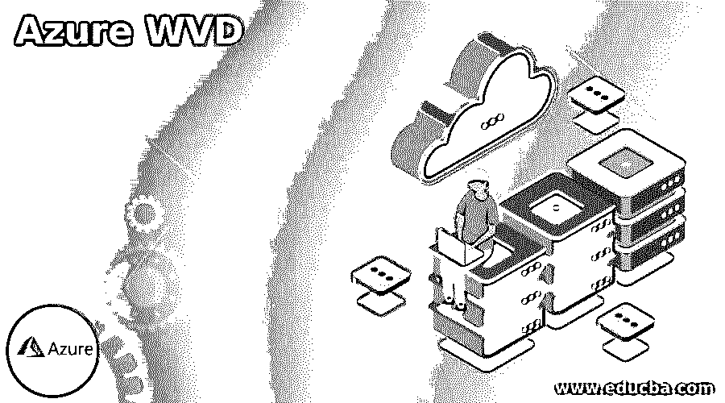

# 蔚蓝 WVD

> 原文：<https://www.educba.com/azure-wvd/>

## 蔚蓝 WVD 简介

下面的文章提供了一个关于 Azure WVD 的概述。我们已经知道许多公司正在迁移到虚拟桌面。在有更多远程员工的地方，它们变得越来越受欢迎。隐藏的观点是大自然的工作方式正在迅速演变。适应这些变化的公司逐渐增多，主要原因是削减成本，这可能是通过实施 Azure 虚拟桌面(也称为 Windows 虚拟桌面)实现的。它为整个团队访问他们设备上的应用程序和信息提供了一种安全而简单的方法。因此，它节省了资源和时间，反过来，提高了员工的效率。

### 什么是蔚蓝 WVD？

Windows 虚拟桌面由 Azure 提供，用于虚拟化 Windows 操作系统，并提供部署在 Azure 云中的虚拟化应用程序和桌面。主要针对企业而不是个人用户。它于 2018 年 9 月首次实施，并于 2019 年 3 月向公众提供。它可以在 HTML 5 网络浏览器、Android、macOS 和 iOS 中使用

<small>Hadoop、数据科学、统计学&其他</small>

### 如何与 azure WVD 合作？

用户通过远程桌面网关服务从兼容设备建立与 Windows 虚拟桌面的连接。

当它使用 Azure active directory 时会产生一个访问令牌，该目录由 Windows 虚拟桌面面板管理。

已执行会话主机上的 Windows 虚拟桌面代理在控制面板中建立反向连接。

一旦网关建立了连接，active directory 的域就会为客户端生成身份验证。只有受信任的设备可以保存凭证以供快速访问。

### WVD 使用场景

对于许多公司来说，Azure 专家讨论的重点是使用虚拟桌面的最佳管理系统。

员工可以远程连接到他的工作。

安全管理很简单。当任何兼职人员或承包商必须访问这些信息时，他们的安全性就成了一个主要问题。在这里，Azure WVD 为用户提供对应用程序和数据的安全和可控的访问铺平了道路。如果防火墙很强，全职员工可以出于办公目的访问他的 PC。所以它保护了所有公司信息的安全。

### Azure wvd 配置文件管理

配置文件管理是一组配置数据和设置，包括文件、文件夹和注册表设置，解释了如何与桌面环境通信。一些设置，如任务栏，布局，图标，背景等。，可由用户配置和定制。IT 部门很少将用户环境管理解决方案、组策略、脚本等工具设置为默认配置。但是现在，操作系统的 profile 设置是特定的；它没有超出自己的操作系统限制的执行能力。例如，Windows 7 的配置文件不能在 Windows 8 中使用。有两种基本的配置文件设置，如漫游配置文件和本地配置文件。

本地配置文件:在这里，用户的配置文件保存在网络服务器中，而不是在本地桌面 PC 中进行处理。通过活动目录的配置，管理员将漫游配置文件与用户的帐户相关联。当用户使用其凭据登录时，该窗口会将用户的配置文件从网络复制到本地 pc。Windows 环境有一个本地活动的默认配置文件。它包含与用户操作环境相关的所有信息。因此，当用户升级 Windows 时，他也会立即升级他的个人资料。但是，如果用户登录到另一台机器，则该过程从头开始。现在还有用户体验的失败。

漫游配置文件:漫游配置文件是一个常见的，但即使它有一些挑战。用户体验太慢，管理员容易眼睛浮肿和失眠打嗝。

### Azure WVD 组件

组件管理有两部分，微软管理一部分，企业管理另一部分。

微软托管服务如下:

*   web 访问服务使用户能够通过 web 浏览器管理远程应用程序和虚拟桌面。管理员可以通过 Azure 的 Active Directory 中的 MFA(多因素身份验证)来保护 web 访问。
*   网关服务建立远程连接，以关联 WVD 应用程序和来自任何网络连接组件的远程用户，这些组件可以执行 WVD 客户端。然后，客户端连接网关，网关从虚拟机和连接的网关构建连接。
*   代理服务控制虚拟桌面和用户与远程应用程序的连接。然后，它提供现有会话和负载平衡活动的重新连接。
*   远程桌面上的诊断跟踪用户活动或管理操作，以找到任何故障组件。

企业管理的组件如下:

*   Azure 虚拟网络允许 Azure 的资源私下与互联网上的其他组件进行交互。
*   Azure 的 active directory 支持多因素身份验证、条件访问等安全特性。
*   windows 主机池是在支持 Windows 桌面的应用程序上执行的虚拟桌面会话主机的集合，具有多会话环境的功能。

### 蔚蓝的 WVD 优势

Azure 虚拟桌面不会为安装物理机浪费资源。它使得在需要时实施虚拟 PC 成为可能，并且如果需要，可以在以后删除或修改它。因此，为了满足工作人员的需求，用户可以添加多个虚拟机。

用户可以根据业务环境向不同的用户组部署不同的虚拟桌面。用户能够访问工作所需部分的信息和应用程序。他们看不到任何不相关的数据，因此计算能力可以交给他们，因为每个用户都有强大的供应。

### 结论

当团队出差到客户现场或办公室时，可以连接到虚拟桌面。但是他必须小心保护办公设备、公司应用程序和数据。除此之外，当在 WVD 联网时，它提供了与办公室工作相同的用户体验。

### 推荐文章

这是蓝色 WVD 的指南。这里我们讨论组件管理的两个部分，微软管理一部分，企业管理另一部分。您也可以看看以下文章，了解更多信息–

1.  [Azure 登录](https://www.educba.com/azure-login/)
2.  [Azure 架构](https://www.educba.com/azure-architecture/)
3.  [天蓝色钥匙金库](https://www.educba.com/azure-key-vault/)
4.  [Azure 队列存储](https://www.educba.com/azure-queue-storage/)

