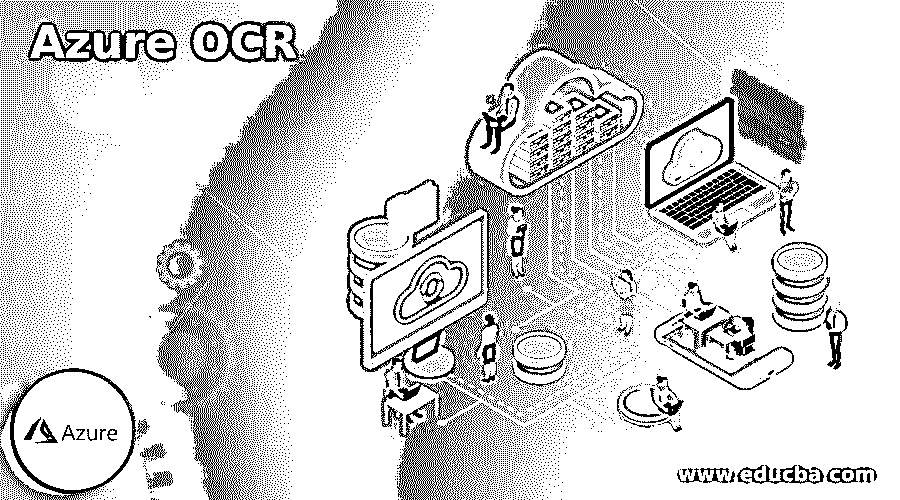

# Azure OCR

> 原文：<https://www.educba.com/azure-ocr/>

## Azure OCR 简介

*   以下文章提供了 Azure OCR 的概述。通常，OCR，也称为光学字符识别，允许用户从街道符号和产品的快照等图像中，以及从诸如账单、发票、文章、财务报告等文档中删除已发布或手写的文本。
*   微软 Azure 的 OCR 技术提供挖掘各种语言的印刷打字稿、多种语言的手写文本、来自图像的货币符号、数字以及多页 PDF 手册。
*   用于印刷文本的 OCR 包含针对英语、德语、法语、葡萄牙语、意大利语、中文、西班牙语、俄语、日语以及朝鲜语(预览版)和西里尔语和拉丁语的规定，并提供最新的预览更新。
*   而 OCR 为手写文本提供英语，并预览法语，意大利语，德语，西班牙语，中文和葡萄牙语的语言支持。

### 使用 Azure OCR API

*   Azure 的认知服务被称为计算机视觉，被定义为一种人工智能服务，它可以检查图像和视频中的内容。在 Azure OCR 中，你会发现 Azure Cognitive Services 是一个计算机视觉 API。
*   我们可以评估亚马逊网络服务、谷歌云平台和微软 Azure 这三种云服务提供的 OCR 算法的准确性，这三种云服务是 OCR 提供商中最受欢迎的。
*   光学字符识别对于机器视觉熟练程度至关重要。OCR 允许用户从提供的图像中识别和提取文本信息；因此，它可以被进一步处理或存储。因此，这非常有利于处理文本的扫描/照片，用于处理发票、标牌和扫描表单时的插图。
*   微软计算机视觉 API 据说是一套包容性的计算机视觉工具，涵盖了创建智能图片缩略图、识别图片中的人物以及通过人工智能标记图片内容等多种技能。

**精度:**

Azure OCR API 提供了两种名为来自图像 URL 的 OCR 和来自图像文件的 OCR 的 OCR 端点。在这里，两个端点的操作类似，但改变了源。脚本识别功能良好，并且产生被分类到脚本的各部分中的脚本。每一节都包括行，每一行都包括组成精确文本的单词。这种分离适合于理解图像中内容的排列；然而，如果你只是想把文本作为一个大的字符串，并且不关心定位，那么它将需要额外的代码。

<small>Hadoop、数据科学、统计学&其他</small>

**价格:**

如果你使用微软 API 的免费层，你将每月收到 5000 个请求。API 包括 3 个付费计划:

*   19.90 美元:每月 15000 次请求
*   74.90 美元:每月 70000 次请求
*   199.90 美元:每月 20 万次请求。

### 使用 Azure OCR 的好处

借助 Azure OCR API，我们可以获得以下好处:

1.  能够对几乎任何图像、文件甚至 PDF 执行 OCR。
2.  旋风般的快速
3.  能够阅读二维码和条形码。
4.  无比精确
5.  能够将 pdf 和图像转换成可搜索的文档。
6.  没有 SaaS 先决条件也可以就近运行
7.  微软认知服务 Azure OCR 的特殊替代品。

### 特色 Azure OCR

当今的组织正在实施 OCR(光学字符识别)和文档人工智能技术，以将其庞大的图片和文档宝库快速转化为可操作的见解。因此，这些见解为 RPA(机器人过程自动化)、行业特定的解决方案和知识提供了动力。然而，要大规模地成功执行这些场景，存在着各种挑战，例如大量的全球和语言、大量的数据文档文件以及数据隐私和机密性风险。因此，微软的计算机视觉的 Azure OCR 和 API 技术作为认知服务云 API plus 和 Docker 容器而流行。最终用户在云平台和网络内部的各种场景中使用它来帮助自动处理图片和文档文件，这些文件可以在全球 73 种语言中提取。

一些特征如下:

*   计算机视觉 API 发布了丰富的功能集，包括 OCR，用于对源自图像的打印文本进行分类。
*   Azure OCR 打印脚本提取，有 73 种语言版本。
*   手写文本提取可用英语。
*   文本轮廓和单词具有位置和置信度。
*   OCR 不需要语言证书。
*   提供混合语言、混合模式，包括手写和打印。

### 云视觉与 Azure OCR

几年来，Azure OCR 和计算机视觉需求很大。

**云视觉**

Google Cloud Vision 包含 OCR 服务，该服务还包含用于从文档中提取文本的 OCR 引擎。vision API 能够从提供的图像中识别和提取文本。此外，您将发现两个支持 OCR(光学字符识别)的光泽功能，描述如下:

*   **TEXT_RECOGNITION** 从任何提供的图像中识别并提取文本信息。例如，pic 可能包含街道或交通符号。JSON 包含完整的字符串和不同的单词以及它们相关的边界框。
*   **DOCUMENT _ TEXT _ RECOGNITION**类似地从任何特定图像中识别文本信息，但是这里针对文档和紧凑文本的响应得到了改进。JSON 包含块、段落、页面、单词以及分段数据。

由于手写和发布的文本优雅的范围，当前的 OCR 方法集成了深度学习以提高更大的精确度。例如，深度学习涉及大量数据来训练模型；像谷歌这样的企业通过拥有自己的 OCR 设施，在产生令人鼓舞的结果方面取得了优势。例如，Google Cloud Vision OCR 是 Google Cloud Vision API 的一部分，用于从图像中挖掘文本信息。

**Azure OCR**

微软 Azure 基于云提供的 OCR API 为开发人员提供了读取图像和返回结构化内容的高级算法。OCR 是一种将手写/出版的文本转换成机器加密的打字稿的技术。它一直是计算机视觉中的主要研究领域，因为它在许多领域都有应用，例如银行实现 OCR 等同报表，政府也将 OCR 应用于调查响应的集合。

### 结论

*   OCR 是 Azure 的技术功能，由计算机视觉提供，它从具有脚本样式和各种语言的文档和图像中引入丰富的文本提取方法。
*   用于从特定文件中提取文本的 OCR 工具支持的文件格式包括。gif，。jpeg，。jpg，。bmp，。png，. tiff。

### 推荐文章

这是一个 Azure OCR 的指南。这里我们讨论使用 Azure OCR API 以及使用 OCR 的好处和一些特性。你也可以看看下面的文章来了解更多-

1.  [Azure 登录](https://www.educba.com/azure-login/)
2.  [Azure 门户登录](https://www.educba.com/azure-portal-login/)
3.  [Azure 活动中心](https://www.educba.com/azure-event-hub/)
4.  [天蓝色钥匙金库](https://www.educba.com/azure-key-vault/)

