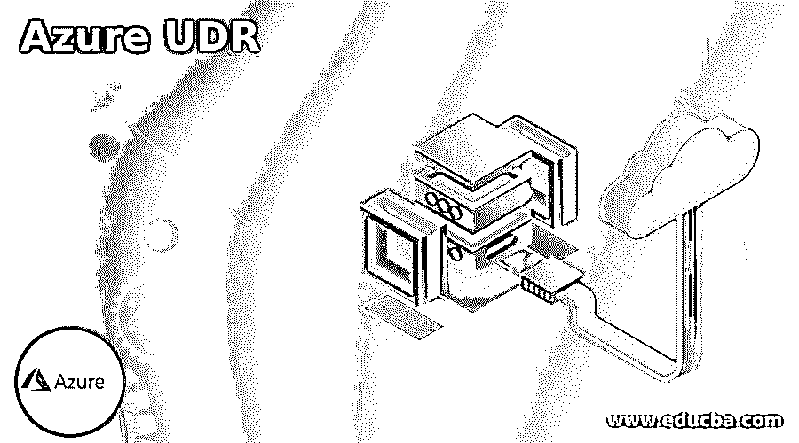

# Azure UDR

> 原文：<https://www.educba.com/azure-udr/>

## Azure UDR 简介

*   Azure UDR(用户定义路由)或路由表让我们设计网络路由；因此，我们的 CloudGen Firewall VM 可以调节子网之间以及通往互联网的流量。应该触发 IP 转发，以允许网络接口接收和转发流量。
*   假设 UDR 路由表中存在多种路由类型，则用户定义的路由会优先于默认类型的系统路由。当许多路由等于目的地时，实现进一步的不同路由。
*   在 Azure 路由中，不断退出的默认系统路由将允许后续操作:
*   互联网流量
*   虚拟网络内部的流量
*   通过 Azure VPN 网关与各种虚拟网络相关的流量
*   从现有虚拟网络到通过 Azure VPN 网关关联的网络的流量

### 如何配置 Azure UDR？

我们需要跟踪在网络资源组中配置 Azure UDR 的后续阶段:

1.  在开始设计 Azure UDR 之前，必须安装 Barracuda CloudGen 防火墙。
2.  最初，必须登录到 Azure 门户网站的链接为:https://portal.azure.com/
3.  之后，当用户登录到门户时，点击 New
4.  单击新列后，您需要在搜索框中手动选择并键入路由表，然后单击 Enter 进行搜索。
5.  现在，在“一切”列中，选择“路由表”选项。
6.  然后点击
7.  之后，在列路由表中，您需要配置以下设置:

*   **名称:**插入您要创建的路由表的名称。
*   **订阅:**您需要选择 Azure 订阅。
*   **资源组:**您可以单击选项“选择现有”来使用以前存在的资源组，或者插入不同的资源组名称来创建新的资源组。
*   **位置:**选择 Azure 数据中心，以便您可以将虚拟机部署到您希望的位置。但是必须注意，路由表应该与虚拟网络和虚拟机位于同一位置。

8.  然后点击
9.  现在，您可以通过以下步骤添加路由，以使用被标识为网关的防火墙虚拟机:

*   打开路由表时，转到列设置并单击
*   在路由栏中，通过点击 **+** 添加**，**从该栏中添加一条路由并进行配置，提供所需的名称、地址前缀、下一跳类型、下一跳地址，然后点击。
*   您也可以创建其他路线。

10.  在这里，您只能将一个路由表与各自的子网相关联或分配给它们，如下所示:

*   在同一个 Azure 门户中打开路由表，转到列设置并单击
*   在子网列中，通过单击添加子网
*   在关联子网列中，单击虚拟网络选项。
*   在资源列中选择虚拟网络选项。
*   再次在“关联子网”列中，单击选项
*   在“选择子网”列中，选择子网。
*   然后单击 OK，您也可以继续添加其他子网。

11.  在接下来的步骤中，我们需要为网络接口启用防火墙虚拟机的 IP 转发，这些网络接口的目标 IP 地址不会等同于其自己的私有 IP 地址。

*   在 Azure 的门户中，打开防火墙虚拟机所涉及的网络接口，从栏中单击选项。
*   现在，单击设置栏中的 IP 地址可以启用 IP 转发选项。
*   然后点击保存

12.  因此，最后，Barracuda CloudGen 防火墙虚拟机现在能够将后端虚拟机的可用流量转发到互联网。

### 创建用户 Azure UDR

Azure 自发地在 Azure 子网、内部网络和虚拟网络之间路由流量。但是在改变任何 Azure 的默认类型路由时，我们必须需要创建一个路由表。此外，需要设置一个 Azure 帐户，拥有一个有效的订阅，甚至是免费的。在创建 Azure UDR 之前，您必须完成以下任务之一:

<small>Hadoop、数据科学、统计学&其他</small>

*   用户使用 Azure 帐户登录 Azure 门户。
*   要么从系统执行 PowerShell，要么执行 Azure 云 Shell 中的命令。
*   此外，它可以从计算机或 Azure Cloud Shell 执行 Azure CLI(命令行界面)。

现在，按照下面的后续步骤，由网络资源组中的用户创建 Azure 路由表或 UDR:

*   在 Azure 门户页面上，从菜单或主页中选择创建资源。
*   在搜索框中，键入路由表，然后选择它，这将使您转到相应的页面，然后您可以创建路由表。
*   为此，用户需要输入名称、订阅选项、选择资源组、选择位置、禁用虚拟网络网关路由传播(如果您设计将 UDR 关联到虚拟网络中的子网，并且不需要循环内部路由来呈现子网中的网络接口)。
*   最后，选择创建来创建用户定义的新路由表。

### Azure UDR 问题

Azure UDR 有一些限制或问题，如下所述:

*   大量流行的网络接口没有被提供给高访问性集群。
*   单个子网中的大量网络接口不会为单个防火墙虚拟机调配。
*   在任何人开始创建 Azure UDR 之前，必须在系统上部署一个 Barracuda CloudGen 防火墙。

### 使用 Azure 防火墙

*   Azure 防火墙服务是一种智能的云原生网络防火墙安全，为在 Azure 中执行的云工作负载提供一流的威胁防御。
*   它完全是有状态的，防火墙即服务具有内置的强大可访问性和无限的云可扩展性，可提供南北和东西两种流量检查。
*   Azure Firewall 有两种 SKU，即标准版和高级版。
*   为了管理众多订阅周围的 Azure 防火墙，我们可以应用 Azure 防火墙管理器进行集中处理，它在两种环境中维护防火墙，无论是 VNet 还是虚拟 wan，即安全虚拟集线器，以帮助简化到防火墙的路由流量。
*   为了控制来自 Azure 子网的任何出站网络访问，我们需要一个 Azure 防火墙来配置应用程序规则和网络规则。

### 结论

*   在 Azure 中，每个子网都可以与一个 UDR 表相关联，该表用于描述在现有子网中发起的流量是如何路由的。
*   如果没有描述 udr，Azure 将应用默认路由让流量从一个子网流向另一个子网。因此，我们需要在 Azure 中创建 udr，以通过适当的防火墙设备来确认更好的通信。

### 推荐文章

这是 Azure UDR 的指南。这里我们讨论在网络资源组中配置 Azure UDR 的后续阶段。你也可以看看下面的文章来了解更多-

1.  [Azure 登录](https://www.educba.com/azure-login/)
2.  [蔚蓝色的木板](https://www.educba.com/azure-boards/)
3.  [蔚蓝堡垒](https://www.educba.com/azure-bastion/)
4.  [Azure 事件网格](https://www.educba.com/azure-event-grid/)

