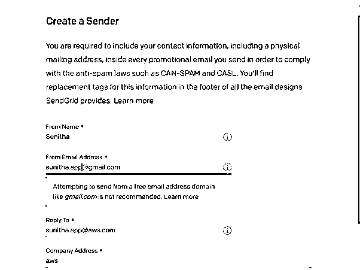
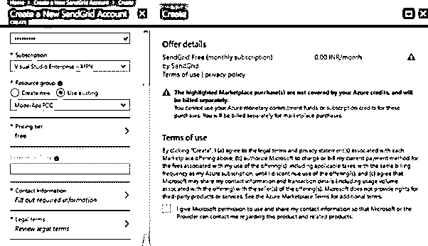
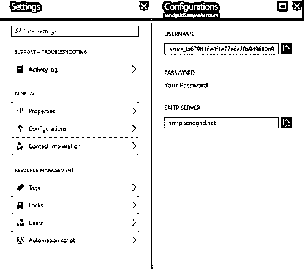
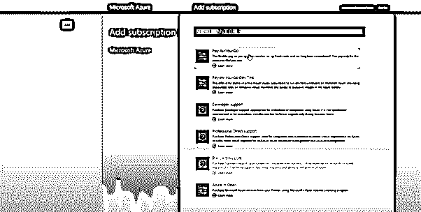
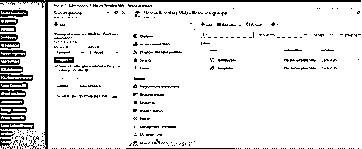
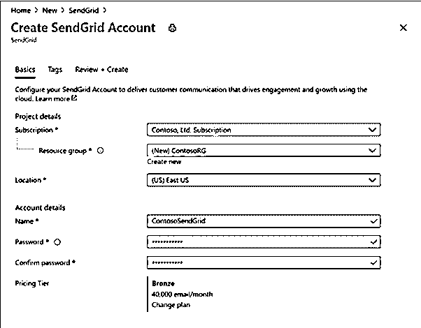
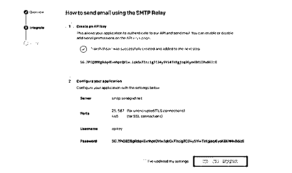
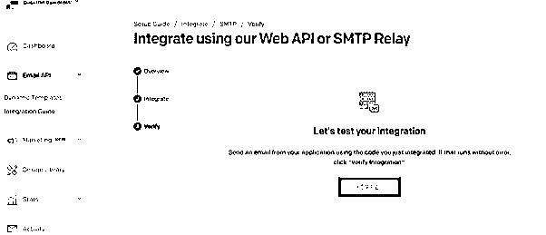

# Azure 电子邮件

> 原文：<https://www.educba.com/azure-email/>

## Azure 电子邮件简介

第三方解决方案，如 SendGrid，在 Azure 上提供电子邮件服务，这些服务可以集成到解决方案中，以满足各种用例。例如，如果我们需要一个低成本、低维护的解决方案，并且订阅了 Azure，我们可以在 Microsoft Azure 上使用 SendGrid 电子邮件交付服务。

### 什么是 azure 电子邮件？

从电子邮件的角度来看，微软将所有 Azure IPs 列入黑名单；因此，从 Azure 通过 SMTP 发送电子邮件而不经过中继并不能保证邮件会在另一端被接收到。结果，我们可以看到，无论是入站还是出站，我们的电子邮件流量都没有到达任何地方。一般来说，Azure 的电子邮件发送依赖于第三方 SMTP 中继服务。最流行和推荐的选项是 SendGrid。关于如何结合 Azure 和 SendGrid 来发布电子邮件，有大量的例子和文档。同时，我们可以选择使用另一种兼容 SMTP 中继的解决方案:弹性电子邮件、Mailjet、SocketLabs。

<small>Hadoop、数据科学、统计学&其他</small>

### 如何发送 Azure 电子邮件？

SendGrid 可以说是从 Azure 发送电子邮件最常用的电子邮件服务。因为它们曾经是 Azure 用户每月 25，000 封电子邮件的免费计划，SendGrid 和 Azure 变得非常受欢迎。虽然 Azure 界面中不再提供免费计划，但微软验证了每天限制 100 封电子邮件的免费会员资格仍然可用。

以下是 SendGrid 最流行的一些特性和功能:

*   自动发送收据
*   管理电子邮件分发的分发列表
*   获取实时数据
*   客户询问被转发。
*   处理收到的电子邮件

两个 Azure 服务提供相似的功能:

1.  队列存储是一种云消息服务，允许 Azure 应用程序组件相互通信。
2.  用于集成应用程序、服务和设备的强大消息传递系统是服务总线。服务总线还可以通过使用相关的服务总线中继连接到远程托管的应用程序和服务。

从架构到 ISP 推广和监控，再到过滤服务和实时分析，SendGrid 处理所有的技术规范。因此，它是世界上最大的基于云的电子邮件服务提供商。

SendGrid 的电子邮件服务可以以多种方式使用。但是，这完全取决于你的要求和目标。在 Azure 中，以下是如何设置和使用 SendGrid:

开始之前，请确保您的 Azure 订阅中有一个有效的 SendGrid 帐户。

按照下面的说明创建一个 SendGrid 帐户，并获取使用 SendGrid 发送电子邮件所需的详细信息。

1.登录您的 Azure 帐户。

2.查找服务“SendGrid 电子邮件传递”

下一步是转到单个发件人验证页面，查找更新的发件人地址。

要验证发件人，请找到发送到发件人地址的电子邮件，如下图所示。然后，在“验证单个发件人”按钮上，确认发件人的身份。

通过 SendGrid 发送电子邮件需要满足以下要求

1.  SendGrid 的 SMTP 服务器 ip 是 smtp.sendgrid.net。
2.  SMTP 安全用户名将始终是 apikey。
3.  使用我们在 SendGrid 中创建的 API 键的值作为您的密码。
4.  避免使用端口 25。或者，使用端口 587。
5.  只有 SendGrid 授权的发件人地址可以用作电子邮件的收件人。

`$sendGridApiKey = 'SG...........P258'
$SendGridEmail = @{
From = 'suniths@lzex.ml'
To = 'sharon@gmail.com'
Subject = 'Hello message from Azure'
Body = 'A formal mail from the account'
SmtpServer = 'smtp.sendgrid.net'
Port = 587
UseSSL = $true
Credential = New-Object PSCredential 'apikey', (ConvertTo-SecureString $sendGridApiKey -AsPlainText -Force)
}
Send-MailMessage @SendGridEmail`

检查我们发送的短信的收件人邮箱，以确认电子邮件的可送达性。最终效果看起来像这样。可以看出，该消息是从发件人的地址通过 sendgrid.net 发出的。

### 创建 Azure 订阅

我们可以利用一系列免费和商业的 Azure 服务，为拥有 Azure 账户的任何产品和用户构建下一代架构。与 Azure 账户绑定的 Azure 服务的逻辑单元称为 Azure 订阅。计费是在逐个订阅的基础上进行的。azure 使用的记录方式和帐户管理员都是由 azure 帐户决定的。在 Azure 帐户中心，用户可以创建帐户和订阅。

这是我们在 Azure 中出于组织和技术目的将事物相互分离的方式。(也是单一计费订阅)。并且还可以集中许多功能。

**Azure 电子邮件开发者服务菜单(截图)**

SendGrid 是一种基于云的电子邮件服务，提供可靠的业务电子邮件交付、可伸缩性和实时统计，以及通过可定制的 API 进行轻松集成。

**报名表**

在代码中生成 SendGrid 电子邮件调用时，我们只需向服务提交一个 API 密钥，而不是电子邮件地址和密码。

从新的 Azure 界面上的开发者服务选项中，选择 SendGrid Email Delivery。

### 云电子邮件服务

CloudMail 是一款复杂的 Windows mail 协作服务器，使组织能够使用公司最重要的电子邮件客户端(包括 Microsoft Outlook for Windows 和 Mac)以及各种移动设备与客户、员工和合作伙伴联系。基于云的电子邮件技术是一个云平台，包括一体化的电子邮件安全、归档和可用性解决方案。任何使用相同域的商业托管解决方案都附带了 CloudMail 电子邮件服务。它也可以作为一个独立的产品，每个域名每月 5 美元。

CloudMail 附带无限数量的电子邮件地址。

10 GB 磁盘容量(每 GB 0.50 美元可获得更多空间)

POP 和 IMAP 连接，以及 web 界面

当我们使用基于云的电子邮件时，我们会将对您数据的控制权交给第三方，由其异地管理。这意味着供应商处理数据存储和备份，如果公司缺乏必要的内部技能来维护这些数据，这是有利的。如果内部服务器出现故障，人们仍可以通过互联网发送电子邮件并与其他同事交流。当电子邮件通过云发送和接收时，它们比通过内部电子邮件服务器发送和接收时更加可靠和可用。

### 结论

大多数 Azure 用户将需要从基于 Azure 的应用程序发送电子邮件的能力。因此，我们看到了如何使用 Azure 及其电子邮件服务的截图。

### 推荐文章

这是一个 Azure 电子邮件的指南。在这里，我们讨论如何发送 Azure 电子邮件以及 SendGrid 的一些最流行的特性和功能。你也可以看看下面的文章来了解更多-

1.  [Azure 登录](https://www.educba.com/azure-login/)
2.  [Azure 门户登录](https://www.educba.com/azure-portal-login/)
3.  [Azure 架构](https://www.educba.com/azure-architecture/)
4.  [天蓝色钥匙金库](https://www.educba.com/azure-key-vault/)

