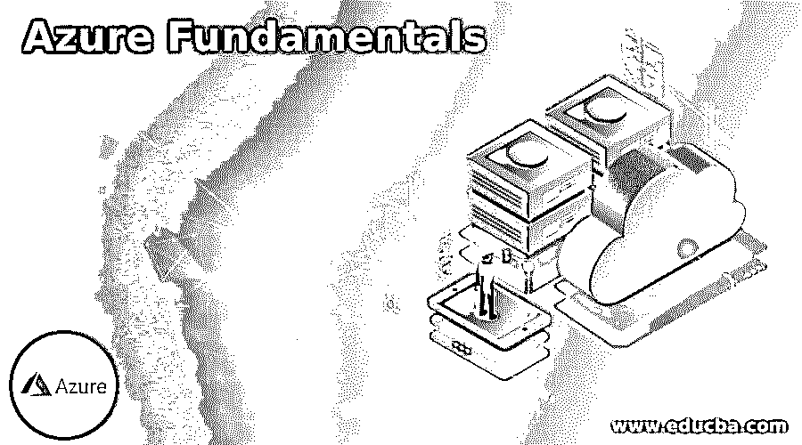

# Azure 基础知识

> 原文：<https://www.educba.com/azure-fundamentals/>

## Azure 基础知识简介

以下文章提供了 Azure 基础知识的概要。微软提供的公共云平台被称为 Azure，用于创建和测试应用程序，以便在相同的环境中进行部署和管理。它于 2010 年 2 月发布，具有广泛的应用，包括计算、分析、服务器、虚拟机、SQL 数据库和网络领域。虚拟化技术帮助 Azure 管理所有服务，包括平台即服务、基础设施即服务和软件即服务。此外，Azure 是一个可靠的平台，用户可以从内部云转移到公共云，使任何应用程序都可以在云平台上工作。

### 各种 Azure 基础知识

下面给出了各种 Azure 基础:

<small>Hadoop、数据科学、统计学&其他</small>

*   在 Azure 中，我们可以运行任何服务，从简单的应用程序到控制整个计算机系统执行操作的虚拟机。任何像存储、创建数据库或管理整个账户这样的云应用都可以在 Azure 的帮助下完成。此外，它还提供了一系列新的应用，如人工智能和物联网。这种灵活性使 Azure 在用户中令人满意，因为它运行我们的基础设施并维护所有应用程序，甚至可能比我们更好。Azure 中无穷无尽的资源使得任何用户都可以选择相同的资源并在其上工作。
*   如果我们有一个应用程序，我们可以在 Azure 中运行它，并在 AI 的帮助下管理它。它可以通过人工智能与用户进行交互，并通过视觉、听觉和语音操作进行交流。此外，如果积累了大量数据，我们可以将它们存储在 Azure 数据库中，并在需要时使用它们。如果数据不经常使用，我们可以将其归档存储并降低同样的成本。
*   所有应用程序都列在 Azure 门户中，无需命令行界面即可使用。可以创建和管理自定义仪表板，以便用户可以搜索并使用需要它们的应用程序。任何应用程序都可以通过 Azure 门户访问，这有助于用户管理数据库和控制人工智能操作。Azure 门户会一直更新，数据中心的维护不会影响门户。我们可以创建管道，并在不同的环境中进行测试，即使数据中心因维护而关闭。
*   Azure 提供了一个 Azure marketplace，在这里可以找到 Azure 的所有应用。任何提供新软件的合作伙伴或独立供应商都会在市场上发布他们的应用程序，供 Azure 用户试用。如果需要，我们可以购买应用程序，并在 Azure 中提供相同的内容。Azure 的这种灵活性使得它对任何软件供应商都是开放的。市场被认为是微软合作伙伴和新供应商发布其软件并向公众提供的一个启动区域。
*   Azure 的计算服务提供 Azure 虚拟机、服务器、批处理服务、Kubernetes、各种容器和实例。虚拟网络和 VPN 有助于计算上述资源并将其用于各种应用。Azure 有一个负载平衡器来管理负载，还有一个高流量管理器来将负载分配给位于不同区域的各种服务器。安全性由具有高可用性和高可伸缩性的 Azure 防火墙来维护。网络监视器用于监控通过 Azure 和 DNS 运行的网络，以向系统提供 DNS 响应。
*   存储是通过 blob、文件、表和队列提供的。Blobs 是存储任何形式的数据的容器，无论是结构化的还是非结构化的。表用键值对存储数据，队列存储以消息格式存储文件。文件存储是结构化存储的一种形式，其中文件被分类并存储以备将来使用。Azure 数据库有各种类型，如 Cosmos DB、SQL DB、MariaDB、Synapse Analytics 和数据库迁移服务。这有助于用户在各种 SQL 数据库中进行选择，并根据他们的需求来使用它。
*   数据量有时非常大，单靠门户和管道无法管理。在这个场景中，我们有 Azure Databricks，它使用一种编程语言来管理数据并将其存储在任何容器中。这是通过使用 HDInsight 创建 Hadoop 集群并在 Azure Databricks 和 Azure data lake 存储之间创建连接来实现的。
*   云计算让用户的生活变得非常容易，如果我们将人工智能纳入云计算，想想有数据的生活会多么舒适。Azure 在 Azure 门户网站中提供人工智能和机器学习，我们可以使用不同的管道来争论数据，并使用 Azure Machine Learning Studio 或与机器学习相关的 Azure Databricks 来分析相同的数据。此外，我们还有知识图谱、搜索引擎、自然语言处理、视觉和听觉来管理和分析 Azure 门户中的数据。
*   使用 azure DevOps 可以轻松部署管道、机器学习工具、Azure 数据块或 SQL 查询。这是一个不同的页面，由 Azure portal 提供支持，帮助通过 git 存储库将对象从一个环境移动到另一个环境。如果我们需要测试应用程序，我们可以在 Linux 环境中的 DevTest labs 中进行，或者在系统中创建按需窗口。
*   创建 Azure 帐户需要 Azure 订阅，12 个月免费提供。试用版将持续 1 个月，届时我们可以测试所有可用的选项，并检查我们是否需要订阅 Azure。1 个月后，根据我们的使用情况，Azure 会扣款。这是另一种灵活性，根据我们在 Azure 门户中使用的工具来收费。使用免费版本时，我们应该小心删除我们创建的所有资源组和虚拟机。连续运行会扣现金。

### 结论–Azure 基础知识

Azure 不能用几句话来解释，但也不能用一本书的一个版本来总结。不同的更新都是在 Azure 门户中完成的，这使得用户的生活更加轻松。这种灵活性和选项类型使用户选择 Azure 而不是其他云选项。

### 推荐文章

这是 Azure 基础知识指南。为了更好地理解，我们在这里讨论简介和各种 azure 基础知识。您也可以看看以下文章，了解更多信息–

1.  [Azure API App](https://www.educba.com/azure-api-app/)
2.  [天蓝色钥匙金库](https://www.educba.com/azure-key-vault/)
3.  [Azure 数据块](https://www.educba.com/azure-databricks/)
4.  [Azure 存储](https://www.educba.com/azure-storage/)

