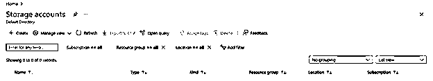
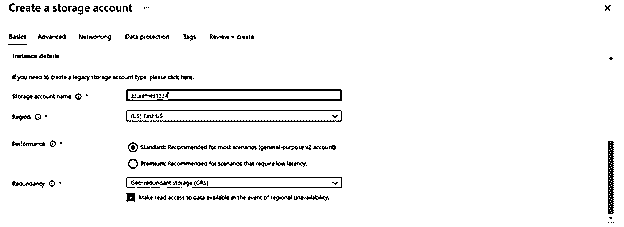
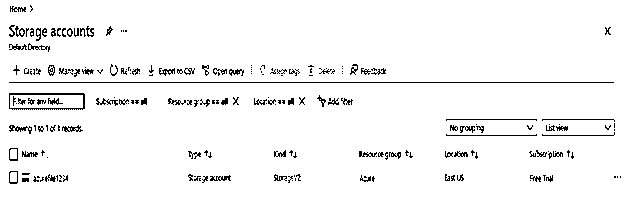
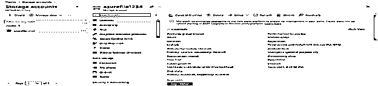
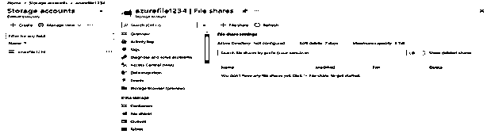
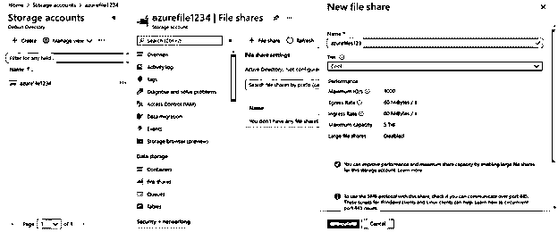
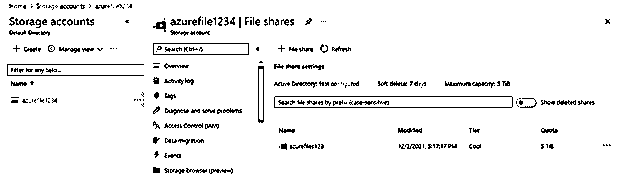

# Azure 文件

> 原文：<https://www.educba.com/azure-files/>

## Azure 文件简介

Azure 文件提供完全托管的云文件共享，可以使用行业标准的服务器消息块或网络文件系统协议来访问。Azure 文件共享的云和本地安装可以同时安装。Linux、Windows 和 MacOS 的客户端可以连接到服务器消息块 Azure 文件共享。运行 Linux 或 Mac 的客户端可以访问网络文件系统文件共享。此外，使用 azure 文件同步，服务器消息块 Azure 文件共享可以缓存在 Windows 服务器上，以便在使用数据的地方附近快速访问。

### 什么是 azure 文件？

*   使用行业标准的 SMB 和 NFS 协议，利用完全受控且可访问的基于云的文件共享。
*   云和本地 Linux、Windows 和 MacOS 部署都可以同时挂载 Azure 文件共享。
*   Azure 文件分别提供基于硬盘和基于固态硬盘技术的常规和高级文件共享。
*   Windows Server 管理员可以通过在 Azure 管理仪表板中设置文件共享来访问 Azure 云中的服务器消息块协议文件。
*   azure 文件服务使基于 Azure 的应用能够通过传统的文件系统 API(如 WriteFile 和 ReadFile)在虚拟机之间共享文件。
*   Windows Server 管理员可以在四种不同的情况下使用 Azure 文件服务。
*   当安装程序、工具和实用程序时，azure 文件服务可以用作共享资源，允许测试机器和开发使用单个文件共享。
*   应用程序可以将配置文件留在 Azure 文件服务中，这可以是一个中心位置。当应用程序分布在多个虚拟机上时，这是非常有利的，因为它们仍然可以从单个源读取设置文件。

### 如何创建 Azure 文件？

下面显示的是创建文件的步骤如下。

<small>Hadoop、数据科学、统计学&其他</small>

*   **创建存储帐户—**

创建 azure 文件的先决条件是创建存储帐户；在此步骤中，我们将创建一个存储帐户。

*   **检查存储账户是否已创建—**

在此步骤中，我们将检查我们创建的存储帐户。例如，在下面的快照中，我们可以看到存储帐户名称为 azurefile1234。

*   **开立存储账户-**

在这一步中，我们将打开名为 azurefile1234 的存储帐户。

*   **打开文件共享—**

在此步骤中，我们将从 azurefile1234 存储帐户打开文件共享。

*   **创建文件共享—**

在这一步中，我们将创建新的文件共享。我们给新创建的文件共享命名为 azurefiles123。

*   **检查创建的 azure 文件—**

在这一步中，我们创建的文件如下。

### 为什么有用的 Azure 文件和共享

*   传统的本地文件服务器被文件所取代或补充。MacOS、Windows 和 Linux 只是可以从任何地方挂载 Azure 文件共享的流行操作系统中的几个。
*   服务器消息块 azure 文件共享也可以复制到 Windows 服务器、本地或云中，使用 Azure 文件同步来提高性能和数据的分布式缓存。
*   服务器消息块 azure 文件共享可以继续与本地托管的 active directory 进行交互，以便通过最近发布的文件 active directory 身份验证进行访问控制。
*   Azure Files 使依赖文件共享将文件应用程序或用户数据存储到云中的应用程序变得简单。
*   “传统的”提升和转移场景(其中应用程序及其数据都被移动到 Azure)以及“混合的”提升和转移场景(其中应用程序数据被移动到文件，而应用程序保留在本地)都受文件支持。

### Azure 文件服务器很容易

*   每个人都可以访问。因为 Azure 文件共享支持行业标准的服务器消息块和网络文件系统协议，所以您可以简单地用 Azure 文件共享替换您的本地文件共享，而不用担心应用程序兼容性问题。
*   对于需要文件共享的应用程序来说，在众多计算机、应用程序和实例之间共享文件系统的能力是一个显著的优势。
*   Azure 文件共享可以建立在文件上。这意味着我们不必担心服务器操作系统的重要安全补丁或硬盘更换。
*   像崩溃转储和日志一样，应用程序监控文件可以存储在 Azure 文件服务共享上。
*   Azure 文件服务可以创建共享，而无需建立和使用另一个旨在托管文件共享工作负载的虚拟机。当试图将依赖于服务器消息块的程序迁移到云中时，这尤其有用。

### Azure files 云文件共享。

*   多个工作站、应用程序和实例都可以共享文件系统。这允许我们授予分散的访问权限，同时仍然确保所有用户对相同的资产具有相同的访问权限。
*   服务器消息块、REST API 和客户端库都是用户可以选择的。此外，为了提高弹性和可用性，存储通过自动本地数据复制来分散。
*   对于灾难恢复，您还可以跨可用性区域复制数据。PowerShell cmdlets、Azure CLI 或内置 UI 可用于配置和管理文件。
*   我们的文件共享可以根据需要自动扩展到 5 PiB。如果需要，我们可以添加额外的存储帐户。
*   使用服务器消息块 0 和 HTTPS 连接保护静态和传输中的数据。Active directory 控件也可用于限制文件访问。

### 利益

*   分布式应用程序的一个常见设计是将配置文件保存在一个中心位置，该位置可以被程序的几个实例访问。
*   人们可以通过在本地挂载服务器消息块共享来访问它，应用程序实例可以通过文件 REST API 加载它们的配置。
*   Azure Files 设计为随时可用。当我们使用文件取代本地文件共享时，我们将不必担心停电或网络问题。
*   文件系统 I/O API 允许基于 Azure 的应用程序访问共享中的数据。因此，开发人员可以使用他们现有的代码和能力转移现有的应用程序。
*   除了系统 IO APIs 之外，我们还可以利用 azure 存储客户端库和 azure storage REST API。

### 结论

Azure 文件分别提供基于硬盘和基于固态硬盘技术的常规和高级文件共享。此外，azure 文件提供完全托管的云文件共享，可以使用行业标准的服务器消息块或网络文件系统协议来访问。

### 推荐文章

这是一个 Azure 文件指南。这里我们详细讨论如何创建 Azure 文件以及好处和云文件共享。您也可以看看以下文章，了解更多信息–

1.  [Azure 数据工作室](https://www.educba.com/azure-data-studio/)
2.  [Azure 实例类型](https://www.educba.com/azure-instance-types/)
3.  [Azure 队列存储](https://www.educba.com/azure-queue-storage/)
4.  [Azure 通知中心](https://www.educba.com/azure-notification-hub/)

