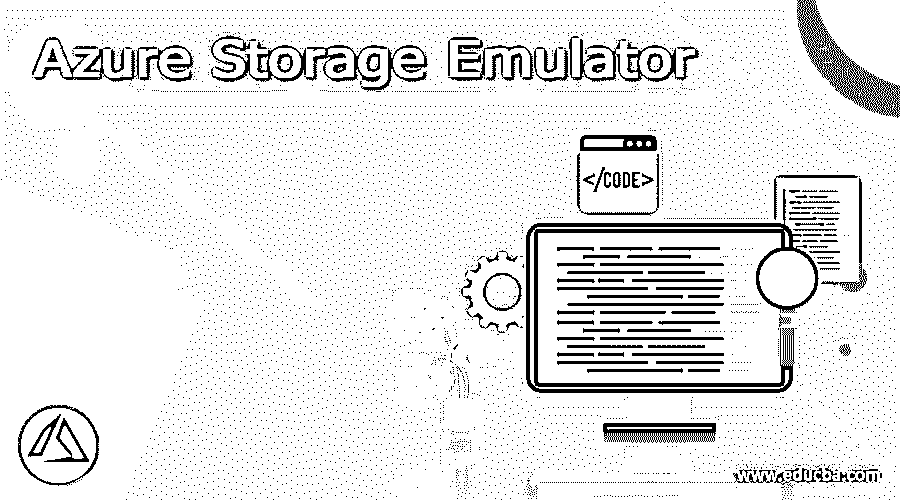

# Azure 存储模拟器

> 原文：<https://www.educba.com/azure-storage-emulator/>

### 什么是 Azure 存储模拟器？

*   微软的 Azure 存储模拟器是一种模仿 Azure 队列、表和 Blob 服务的技术，用于确定本地改进。使用存储模拟器，人们可以在本地检查存储服务旁边的应用程序，但无法进行订阅或维持任何成本。如果您对应用程序在模拟器中的运行方式感到满意，那么就转向实现云中流行的存储帐户。
*   然而，目前，这种存储模拟器受到谴责，因此微软建议用户使用本地开发的存储实现 Azurite 模拟器，因为 Azurite 优于存储模拟器。因此，为了维护存储 API 的现代版本，这个 Azurite 将保持更新。

### 使用 Azure 存储模拟器

*   存储模拟器可作为 Microsoft Azure SDK 的一部分进行访问。您也可以通过独立安装程序或直接下载来配置存储模拟器，但是您应该拥有系统的管理权限。目前，存储模拟器只能在 OS Windows 上运行，但是，要在 OS Linux 上使用模拟，我们需要安装 Azurite 模拟器。
*   存储模拟器实现了本地 Microsoft SQL Server 2012 Express local db 实例，用于模拟存储服务。您可以选择设置存储模拟器来访问 SQL server 的本地实例，以替代 LocalDB 实例。
*   存储模拟器通过 Windows 确认与 SQL Server 或 LocalDB 关联。存储服务和存储模拟器在功能方面存在一些差异。
*   现在，为了启动和初始化此存储模拟器，我们首先需要选择“Start”选项，或者我们也可以输入 Windows 键，同样，您应该键入名称“storage emulator ”,然后从应用程序列表中选择显示的模拟器。
*   模拟器开始后，您将看到一个命令提示符窗口。控制台窗口可用于启动或暂停存储模拟器。在这里，从命令提示符下，甚至可以获得状态，清除数据，并初始化模拟器。如果计算机上正在执行另一个存储模拟器，则存储模拟器无法正常启动。当存储模拟器运行时，您可以在 windows 任务栏通知区域中查看图标。

### Azure 存储模拟器工具

*   存储模拟器拥有命令行工具取向。从 3.0 版开始，当存储模拟器启动时，将显示一个控制台窗口。我们需要实现控制台窗口中可用的命令行来启动和停止存储模拟器。
*   这个命令行工具有助于通过使用 query 命令获取状态，还可以执行在命令行中键入的其他操作。
*   请注意，如果系统上配置了 Microsoft Compute Emulator，则在启动存储模拟器时，您会看到系统托盘图标出现。通过右键单击图标，我们可以显示一个菜单，该菜单以图形化方式开始和结束存储模拟器。
*   对于用于存储模拟器操作的命令行工具，我们有以下简单的语法和选项列表:
    AzureStorageEmulator.exe[开始][状态][停止][初始化][清除][帮助]

**描述:**

启动:用于启动模拟器。
状态:用于发布存储模拟器的状态。
停止:用于停止仿真器。
清除:用于删除服务中存在的数据信息，如 blob、表、队列和所有选项，在命令行中指示。
初始化:执行一次性初始化以配置存储模拟器。
帮助:我们需要在命令提示符下编写脚本/帮助，以显示存储模拟器操作的选项列表。

<small>Hadoop、数据科学、统计学&其他</small>

### 运行 Azure 存储模拟器

*   存储模拟器由特定版本的 OData 库决定。替换由具有可用的附加版本的存储仿真器实现的 OData DLLs 是未经确认的，甚至可能导致不可预测的行为。但是由存储服务提供的任何 OData 版本都可以用于向存储模拟器发出请求。
*   存储模拟器使用 Windows 验证来连接 LocalDB 或 SQL server。您可以选择安装模拟器来访问本地 Microsoft SQL Server 实例或 LocalDB 实例。

我们将通过以下初始化步骤运行 Azure Storage Emulator:

1.你可以通过这里的链接下载模拟器。
2。启动安装程序并初始化存储模拟器。
3。之后，您可以选择开始按钮或输入 Windows 键。
4。然后键入名称存储模拟器。
5。这里，从显示的应用程序列表中选择模拟器。

*   启动存储模拟器时，会显示一个命令提示符窗口。此控制台窗口可用于启动和结束存储模拟器。如果系统上安装了另一个名为 Azurite 的模拟器，则存储模拟器可能无法正常工作。
*   当存储模拟器在系统上运行时，您将看到 Windows 任务栏通知区域中出现一个图标。在关闭存储仿真程序的命令提示符窗口时，仿真程序不会关闭，它仍会运行。现在，如果我们想再次打开存储模拟器的控制台窗口，您可以像启动存储模拟器一样成功完成前面的步骤。
*   在初次运行存储模拟器时，就为用户准备好了本地存储环境。这个准备过程在 LocalDB 中设计了一个数据库，并为每个本地存储服务保留了 HTTP 端口。
*   这里，存储模拟器默认配置为系统路径为 c:\ Program Files(x86)\ Microsoft SDKS \ Azure \ Storage Emulator。
*   用户可以实现 Microsoft Azure 存储资源管理器来使用本地存储模拟器资源。

### 如何清除 Azure 存储模拟器

*   存储模拟器提供无限制的本地开发。它提供了清除数据、接收状态以及在 Azure 中从命令提示符准备模拟器的选项。还可以将(SSMS)微软 SQL Server management studio 实现到一些存储客户端库，例如 Xamarin 库。
*   控制台窗口中的命令行工具选项可用于启动和结束仿真器及其相关操作。此外，我们还可以从命令行执行状态查询和其他操作。因此，我们可以从命令 shell 中应用 clear 命令来执行和清除在命令行上标识的所有服务中找到的数据记录。所使用的语法命令可以写成:AzureStorageEmulator.exe 清除[blob][表][队列][全部]。
*   这里，在 clear 命令之后添加的选项定义如下:blob 将清除 blob 中的数据，table 将删除 table 中的数据，queue 将删除 queue 中的数据，最后，如果我们使用 all，它将清除所有服务中存在的全部数据。

### 结论

Azure Storage Emulator 只提供了一个固定帐户和一个明确的身份验证密钥。这个模拟器不能作为支持大量并发客户端的可扩展存储设备。模拟器最多只能支持 2GB 的 blob 大小。而在一个版本的仿真器中开发的数据在应用不同的版本时可能不被确认是可获得的。

### 推荐文章

这是一个 Azure 存储模拟器指南。这里我们讨论什么是 Azure 存储模拟器，如何使用它的工具，以及如何清除 Azure 存储模拟器。您也可以看看以下文章，了解更多信息–

1.  [Azure CLI](https://www.educba.com/azure-cli/)
2.  [蔚蓝网络守望者](https://www.educba.com/azure-network-watcher/)
3.  [Azure 数据工作室](https://www.educba.com/azure-data-studio/)
4.  [蔚蓝租户](https://www.educba.com/azure-tenant/)

