# 蓝纹高速缓存

> 原文：<https://www.educba.com/azure-cache-redis/>

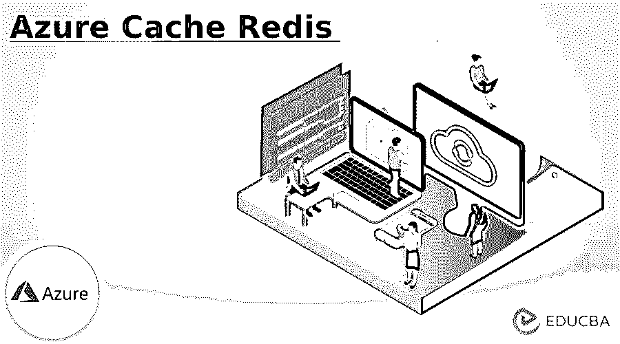


## 《蓝色高速缓存简介》

Azure cache redis 是提高与价格层支持的数据类型相关的应用程序性能的功能之一，以便它可以提供基于应用程序软件的内存数据存储。主要是用后端计算数据的可扩展性和存储量来存储使用 Redis 在缓存中工作的海量数据。

### 关键要点

*   它是一种用于存储和检索数据的数据机制。
*   它有一个高性能的缓存服务，提供内存中的数据存储。
*   完全托管的服务适用于执行托管、监控和管理服务等操作。
*   它具有单节点和多节点的集群配置。
*   它有定价层体系结构。

### 什么是蓝色 cache redis？

内存中的数据结构，可以在 Redis 软件上存储数据，以便在应用程序的前端和后端进行访问。它还能够根据在服务器内存上频繁访问的用户请求，在应用程序上加载大量卷。Redis 将有助于在服务器内存中执行低延迟、高吞吐量的数据存储和数据访问。现代应用程序的低延迟将在开源和商业产品中提供 Redis 缓存作为托管服务，同样的缓存也将用于 Redis 应用程序。

<small>Hadoop、数据科学、统计学&其他</small>

### 如何使用 Azure Cache Redis？

要使用 Azure 门户并在登录后创建缓存，我们可以创建资源。这将有助于创建新页面，并选择选项，如 Redis 的 Azure 缓存中的数据库。有两种不同的方法可以在 azure 门户和标准 redis 客户端的 azure Azure Redis 控制台上使用 redis-cli 界面执行 Redis 缓存。通过使用 Azure 门户上的 Azure Redis 控制台，Redis 客户端将成为云缓存服务的类型，为 Azure 用户提供低延迟的吞吐量输出和微软安全缓存——完全由专门为基于云的应用程序设计的分布式内存缓存服务管理。

azure 用户主要可以从 redis 缓存开始，创建一个需要 DNS 规范的 Azure 门户，Azure 订阅和其他 Redis 数据库缓存技术将以各种方式使用。关注位置、资源组设置配置，加速分布式 azure 托管的 web 应用程序上的任务。它可以被高性能数据类型接受和支持，因此它属于可伸缩性，推到列表，支持数据事务，创建 redis 键需要花费大量时间。它接受有限的生存时间和更多的 redis 数据库缓存削减故障转移机制。用作 Get 和 Set 命令的 redis 缓存的正常运行时间和可用性、更多内存、带宽计算 CPU 利用率的性能指标。

### 创建蓝色高速缓存 Redis

我们知道，缓存是一种机制，可以频繁地访问数据存储，为后续类型的用户请求检索数据。

下面是在 redis 中创建 azure 缓存的步骤。

1.导航到 Azure 门户并登录。在这里，我们已经使用 Microsoft 帐户登录了 azure 门户。

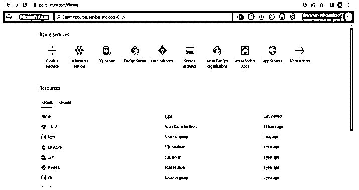


2.然后选择“创建资源”图标。

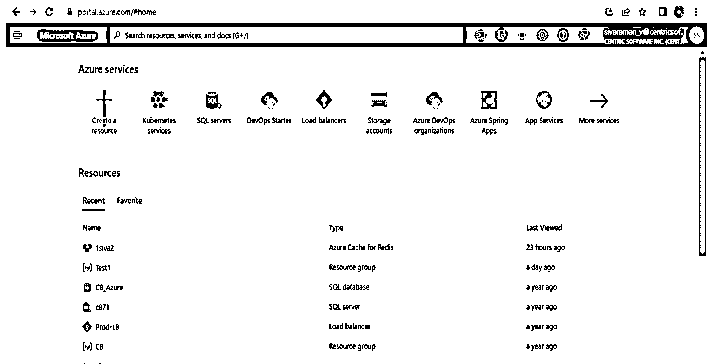


3.选择 Redis 的数据库图标和 azure 缓存。

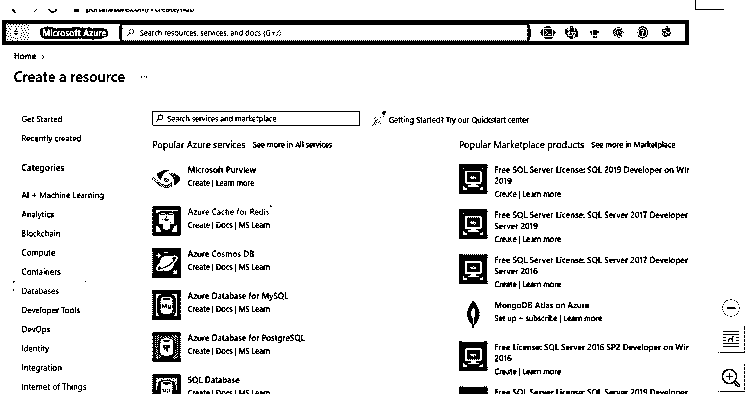


4.[https://portal.azure.com/#create/Microsoft.Cache](https://portal.azure.com/#create/Microsoft.Cache)

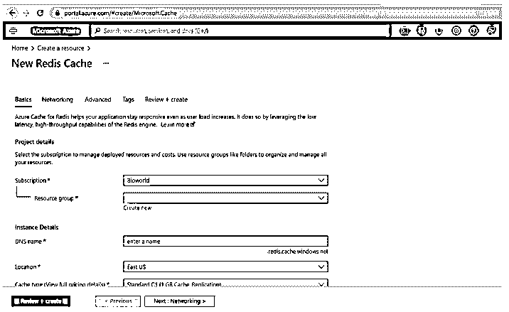


5.输入上述表单所需的详细信息，如填写基本详细信息，如在资源组上新建。

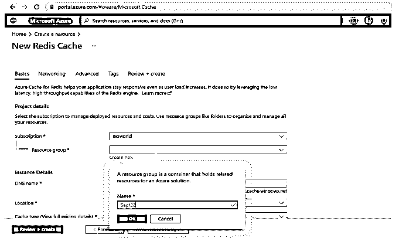


6.输入 DNS 名称和位置(您的选择)。这里我们使用下面的设置，并选择下一步:网络按钮。

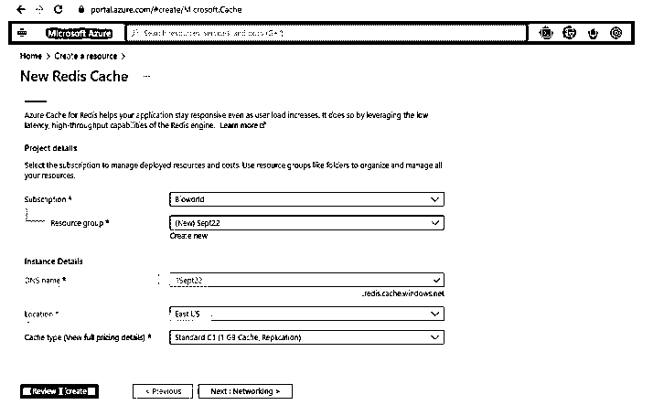


7.选择一种连接方法，如这里的公共端点。

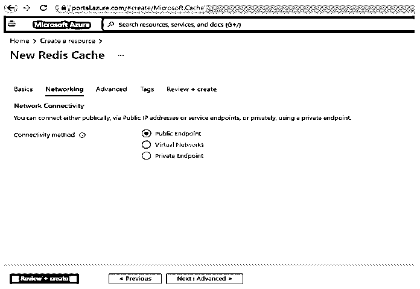


8.选择高级选项卡并选择 Redis 版本，然后单击下一步:标记按钮。

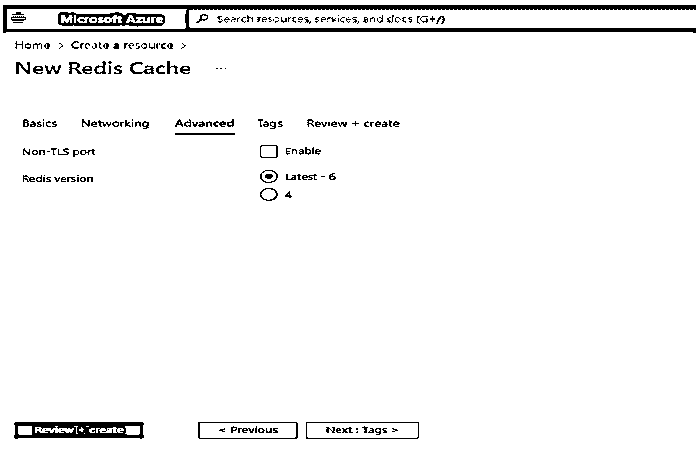


9.标签选项卡对于创建 Redis 缓存是可选的。最后，Review + create 选项选择 create 按钮来创建 redis 缓存。

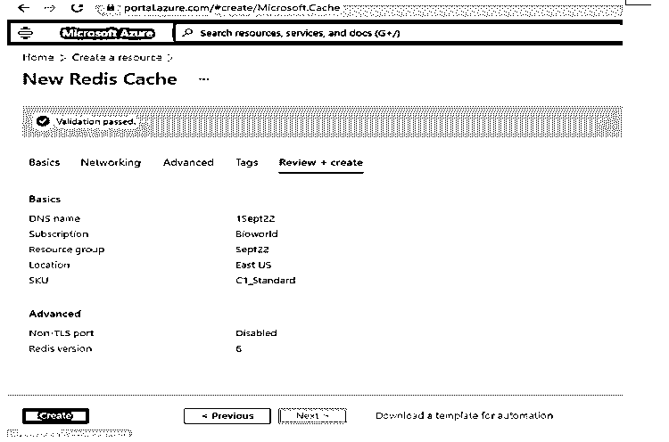


10.部署详细信息显示为“概述”选项卡。

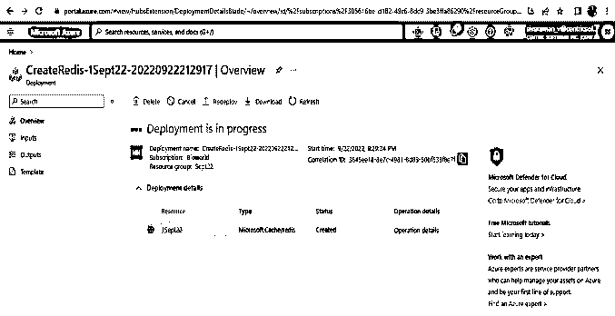


11.Redis 数据库持久性是可用于根据频率配置捕获缓存数据的选项之一。我们还可以使用快照来监控数据恢复。

### 创建控制台应用 Azure Cache Redis

在前面的概念中设置 Redis 缓存之后。我们需要使用 Redis 缓存创建应用程序。

1.在设置上复制特定 azure cache Redis 上的访问密钥，请复制主键。

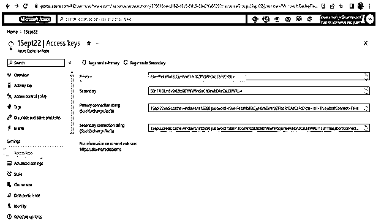


2.然后在属性选项卡上复制主机。

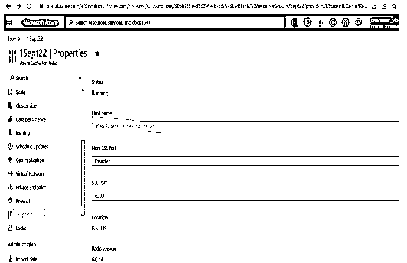


3.请为 Linux 和 Windows 命令提示符设置环境变量。

**Linux:**

**代码:**

```
export REDISCACHEHOSTNAME=1Sept22.redis.cache.windows.net
export REDISCACHEKEY=r3wHPekahkxlELCjyHSmDimrUZlRcdRrOAzCaPcCYzU=
```

**视窗:**

**代码:**

```
set REDISCACHEHOSTNAME=1Sept22.redis.cache.windows.net
set REDISCACHEKEY=r3wHPekahkxlELCjyHSmDimrUZlRcdRrOAzCaPcCYzU=
```

4.这里我们已经设置了环境变量，并编写了下面的代码来创建应用程序。

**代码:**

```
package org.redisson.redisson;
import redis.clients.jedis.Jedis;
public class second 
{
    public static void main( String[] args )
    {
        String chstname = System.getenv("1Sept22.redis.cache.windows.net");
        String cackey = System.getenv("r3wHPekahkxlELCjyHSmDimrUZlRcdRrOAzCaPcCYzU=");
        Jedis je = new Jedis(chstname, 6379, 1800);
        System.out.println( "\nCache Command  : Welcome" );
        System.out.println( "Cache Response : " + je.ping());
        System.out.println( "\nCache Command  : GET Message" );
        System.out.println( "Cache Response : " + je.get("First Example"));
        System.out.println( "\nCache Command  : SET Message" );
        System.out.println( "Cache Response : " + je.set("Good Evening", "Have a Nice Day"));
        System.out.println( "\nCache Command  : GET Message" );
        System.out.println( "Cache Response : " + je.get("Thanks for your Response"));
        System.out.println( "\nCache Command  : CLIENT LIST" );
        System.out.println( "Cache Response : " + je.clientList());
        je.close();
    }
}
```

在执行上述代码之前，请启动 Redis 服务器。

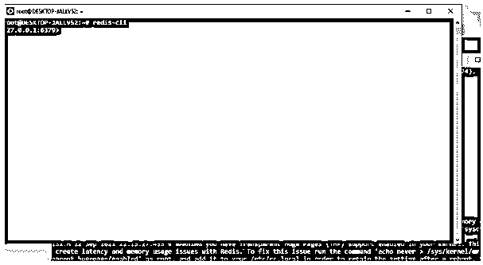


**输出:**

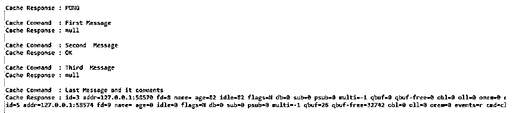


这里的 ping()、get()、set()和 clinetList()是检索数据库列表的默认方法。

### 特征

下面是提到的特征:

*   它拥有托管、监控和管理 redis 服务器的全托管服务。
*   高性能加载数据的巨大吞吐量。
*   它有一个集群配置，用于跨机器共享资源实例。
*   数据持久性功能是进行数据备份和快照。
*   数据在世界范围内被复制和同步。

### 定价

它具有分层功能，因此请遵循以下类型:

*   **基本:**这种类型的特性充当单个节点中的 redis 缓存，用于开发和测试非关键类型的数据加载。它没有 SLA。
*   **标准:**它是下一级价格层，与 SLA 一起提供，以提供数据复制。它会在两个不同的节点之间自动复制。
*   **Premium:** 与基本和标准价格等级相比，它拥有所有类型的功能。因此，与以前的定价层相比，它提供了更好的性能和可扩展性。在生产故障时备份和恢复数据库，以支持全球多个节点。

### 常见问题解答

下面是提到的常见问题:

#### Q1。Redis Azure cache 是什么？

**答案:**

存储和检索数据是高性能执行数据的机制之一。输入输出操作的开源实现。

#### Q2。Azure cache Redis 的数据类型有哪些？

**答案:**

*   线
*   列表
*   混杂
*   设置

#### Q3。定义缓存失效。

**答案:**

更新或擦除缓存项的过程称为缓存失效。随后的请求会从缓存中获取最新的数据。

### 结论

它的基本原理主要展示在真实用户中，可以用于如何配置 Azure portal 中的 redis 缓存。它具有连接控制台应用程序来读写缓存数据的过程，并且还支持从缓存中读取数据，而不是直接从数据源中读取数据。

### 推荐文章

这是 Azure Cache Redis 的指南。在这里，我们讨论介绍，创建控制台应用 azure cache redis，功能，定价和常见问题。您也可以看看以下文章，了解更多信息–

1.  [Azure 存储模拟器](https://www.educba.com/azure-storage-emulator/)
2.  [Azure 文件](https://www.educba.com/azure-files/)
3.  [Azure 基础知识](https://www.educba.com/azure-fundamentals/)
4.  [Azure 资源管理器](https://www.educba.com/azure-resource-manager/)


