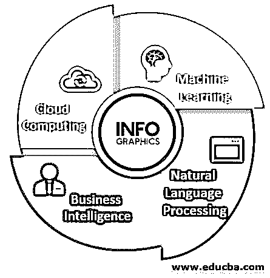
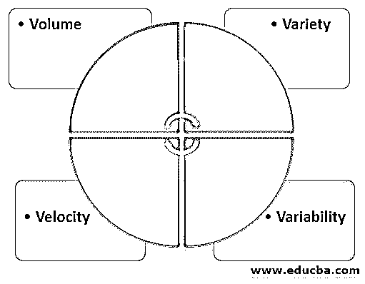
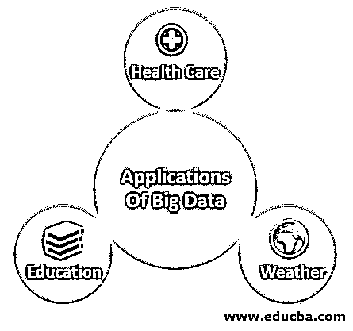

# 大数据简介

> 原文：<https://www.educba.com/introduction-to-big-data/>

## 什么是大数据？

以下文章提供了大数据简介的概要。传统的数据处理无法处理庞大而复杂的数据。因此，我们使用大数据来分析、提取信息，并更好地理解数据。我们考虑大数据的数量、速度、多样性、准确性和价值。大数据的一个例子是通过社交媒体生成的人的数据。大数据有助于分析数据中的模式，以便可以轻松理解人和企业的行为。这有助于提高处理效率，从而提高客户满意度。大数据涉及的数据可以是结构化的也可以是非结构化的，可以是自然的也可以是经过处理的，也可以是与时间相关的。

### 大数据的主要组成部分

大数据的主要组成部分如下:

<small>Hadoop、数据科学、统计学&其他</small>

#### 1.机器学习

它是让计算机自己学习东西的科学。在机器学习中，计算机被期望使用算法和统计模型来执行特定的任务，而无需任何明确的指令。机器学习应用程序根据过去的经验提供结果。例如，这些天，有一些移动应用程序会给你一个你的财务、账单的摘要，会提醒你你的账单支付，还会给你一些储蓄计划的建议。这些功能都是通过阅读你的邮件和短信来完成的。

#### 2.自然语言处理

它是计算机理解人类所说的语言的能力。如今，人们能联想到的最明显的例子是谷歌主页和亚马逊 Alexa。两者都使用了 NLP 等技术，给我们一种虚拟助理的体验。NLP 无处不在，我们甚至都没有意识到。当写邮件时，如果出现任何错误，它会自动纠正自己，现在它会自动给出完成邮件的建议，并且当我们试图发送一封没有在邮件正文中引用附件的电子邮件时，它会自动恐吓我们，这是在后端运行的自然语言处理应用程序的一部分。

#### 3.商业智能

商业智能(BI)是一种技术驱动的方法或过程，通过分析数据并以某种方式呈现数据来获得洞察力，最终用户(通常是高层管理人员)如经理和公司领导可以从中获得一些可操作的洞察力，并据此做出明智的商业决策。

#### 4.云计算

如果我们从名称上看，它应该是在云上完成的计算；嗯，这是真的，只是这里我们不是在谈论真正的云，这里的云是互联网的参考。因此，我们可以将云计算定义为计算服务的交付——服务器、存储、数据库、网络、软件、分析、智能，以及互联网(“云”)，以提供更快的创新、灵活的资源和规模经济。

### 大数据的特征

大数据的特征如下:

*   **体积:**为了确定数据的价值，需要考虑大小，大小起着至关重要的作用。此外，为了确定特定类型的数据是否属于大数据简介类别，这取决于数据量。
*   **多样性:**多样性是指根据数据的性质(结构化和非结构化)不同的数据类型。以前，大多数应用程序考虑的唯一数据源是行和列的形式，通常来自电子表格和数据库。但是现在，数据以我们能够想象的每一种形式出现，比如电子邮件、照片、视频、音频等等。
*   **速度:**速度，顾名思义，就是数据产生的速度。从一个来源来看，数据生成和处理的速度决定了数据的潜力。
*   **可变性:**数据可能是可变的，这意味着它可能是不一致的，而不是流动的，这会干扰或阻碍以有效的方式处理和管理数据。

### 大数据的应用

大数据分析的使用方式如下:

*   **医疗保健:**如今，我们拥有可穿戴设备和传感器，可以实时更新患者的健康状况。
*   **教育:**学生的进步可以通过大数据分析进行适当的分析来跟踪和改进。
*   **天气:**已经部署在全球各地的天气传感器和卫星收集大量数据，并使用这些数据来监控天气和环境状况，还预测或预报未来几天的天气状况。

### 大数据的优势和劣势

下面给出了如下优点和缺点:

| **优势** | **缺点** |
| 更好的决策 | **数据质量:**数据质量需要良好，并经过安排以进行大数据分析。 |
| 提高生产率 | **硬件需求:**购买和维护大数据环境所需的存储空间、与分析系统之间传输数据的网络带宽都非常昂贵。 |
| 降低成本 | **网络安全风险:**存储敏感的大量数据会使公司成为网络攻击者更具吸引力的目标，他们可以利用这些数据来勒索赎金或实现其他不法目的。 |
| 改善客户服务 | **与遗留系统集成的障碍:**许多经营已久的老企业将数据存储在不同架构和环境的不同应用程序和系统中。这给集成过时数据源和移动数据带来了问题，进一步增加了处理大数据的时间和费用。 |

### 推荐文章

这是介绍大数据的指南。在这里，我们讨论了什么是大数据，以及大数据的主要组成部分、特征、优势和劣势。您也可以阅读以下文章，了解更多信息——

1.  [大数据分析软件](https://www.educba.com/big-data-analytics-software/)
2.  [数据科学家 vs 大数据](https://www.educba.com/data-scientist-vs-big-data/)
3.  [大数据分析工作](https://www.educba.com/big-data-analytics-jobs/)
4.  [银行业大数据完整指南](https://www.educba.com/big-data-in-banking/)

