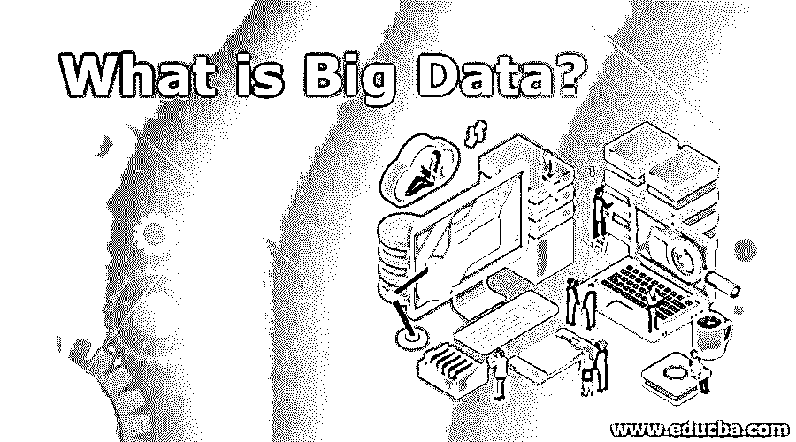

# 什么是大数据？

> 原文：<https://www.educba.com/what-is-big-data/>

## 大数据简介

用于分析过去以便进行未来预测的大量数据被称为大数据。其中的主要概念是体积、速度和多样性，因此任何数据都很容易处理。结构化和非结构化数据都要处理，这是使用传统的数据处理方法做不到的。它从数据流中提供任何人所需的信息。这用于研究、分析、医疗领域、教育以及处理大量数据的地方。它是从社交媒体、机器数据和交易数据演变而来的。

### 理解 V 的含义

下面给出了所提到的理解:

<small>Hadoop、数据科学、统计学&其他</small>

#### 1.卷

处理大量数据是一个常见的问题。它利用 Hadoop、Apache Spark 和 HDFS 等其他技术轻松执行任务。

#### 2.速度

组织高速收集数据以处理即时结果。它可以处理这种情况，以提供无缝的处理和结果。股票交易和天气预报就是一些实时的例子。

#### 3.多样化

*   **结构化:**具有预设格式的数据集，来源于关系数据库。例如，带有预定义事物模式的雇员的工资表。
*   **非结构化:**这些是没有适当格式或排列的随机数据。因此，它们需要更多的处理时间。例子包括谷歌搜索、社交媒体调查、视频流。
*   **半结构化:**是结构化和非结构化数据的结合。他们有一个适当的结构，但缺乏所需的定义。

### 工作是如何变得更容易的？

在此出现之前，对现有数据进行了线性和逐行分析。后来随着计算机的引入，Excel 电子表格使生活变得简单了。用户需要将不同的记录制成表格，并进行必要的研究，以得出有意义的报告。这在许多不同的方面改变了游戏规则。可以处理和分析高达万亿字节的大量数据集。应用了复杂的查询和算法。生成的报告具有更好的结果，几乎没有失败。所有这些都在几分钟到几小时内完成，取决于输入数据的大小。

### 顶级公司

它广泛应用于制造业、医疗保健、能源、保险、体育等领域。下面列出了一些顶级公司:

*   国际商用机器公司
*   微软公司(全球知名的 PC 软件主要厂商)
*   亚马孙
*   惠普企业
*   Teradata

### 成分

有各种第三方工具，如下所列，可用于对来自源的数据执行分析。它们既可以独立运行，也可以与其他组件协作运行。

*   Hadoop
*   HDFS
*   Sqoop
*   mapreduce
*   阿帕奇火花/风暴
*   谷歌大查询
*   亚马逊 Kinesis

### 用例

*   管理层可以做出更好的决策。
*   认识客户需求的趋势并保持相关性。
*   低风险结果。
*   决策验证。
*   目标受众已经确定。

### 工作

在 Hadoop、Spark 等第三方工具的帮助下，我们可以将大型数据集加载到外部存储上。基于人工编写的查询来处理数据。商业智能团队利用这些报告来了解预测模式并纠正以前的错误。此外，可以将数据可视化，以做出有用的决策。

### 优势

*   可以完全理解业务目标。
*   学习数字背后的意义。
*   分析以前失败的根本原因。
*   使用易于理解的语言洞察未来结果。
*   有助于做出完美的决定。

### 先决条件

使用它的工具没有先决条件。Java 或 Python 等编程语言的基础知识会有所帮助。理解数据库如何工作和原始查询就足够了。还有其他高级语言，如 Spark、Pig 等，也很容易学习和使用。用户应该在使用这些来获得期望的输出的方式上是技术上合理的。

### 为什么用？

它用于改进应用程序和服务，以提供更好的结果。可以得到各种有成本效益的解决方案。随着环境的快速变化，了解客户需求至关重要。

### 范围

数据永远不会过时，而且随着尖端技术的发展，数据正在呈指数级增长。这一领域对专业人员的需求很大。它的发展潜力巨大。通过正确使用这些技术，分析师成为公司的决策者。

### 需要

如今，数据以不同的形式出现。由于实施成本和缺乏专业人员，许多分析解决方案在过去是不可能实现的。有了它，我们能够在一段时间内对机器数据执行复杂的算法。这些有许多实时用例，如欺诈检测、在全球平台上锁定受众、网络广告等。

### 目标受众

利用其组件实现以下目标的组织:

*   预测客户的未来趋势和行为模式。
*   以有用的方式分析、理解和展示数据。
*   跟上竞争对手并在市场中保持相关性。
*   做出强有力的决定。

### 结论–什么是大数据？

随着需求的增长和竞争的加剧，对于专业人员来说，保持更新是至关重要的。通过有效地利用个人和组织，可以在几个方面获益。分析师对行业有了更好的了解，并将这种了解传达给员工。可以根据报告做出决定，而不是依靠猜测和直觉。

### 推荐文章

这是什么是大数据的指南？在这里，我们讨论了工作，所需的技能，范围，职业发展，优势，以及实施这项技术的顶级公司。您也可以浏览我们推荐的其他文章，了解更多信息——

1.  [云计算简介](https://www.educba.com/introduction-to-cloud-computing/)
2.  [IOT 简介](https://www.educba.com/introduction-to-iot/)
3.  [什么是机器学习？](https://www.educba.com/what-is-machine-learning/)
4.  [什么是 Shell 脚本？](https://www.educba.com/what-is-shell-scripting/)

