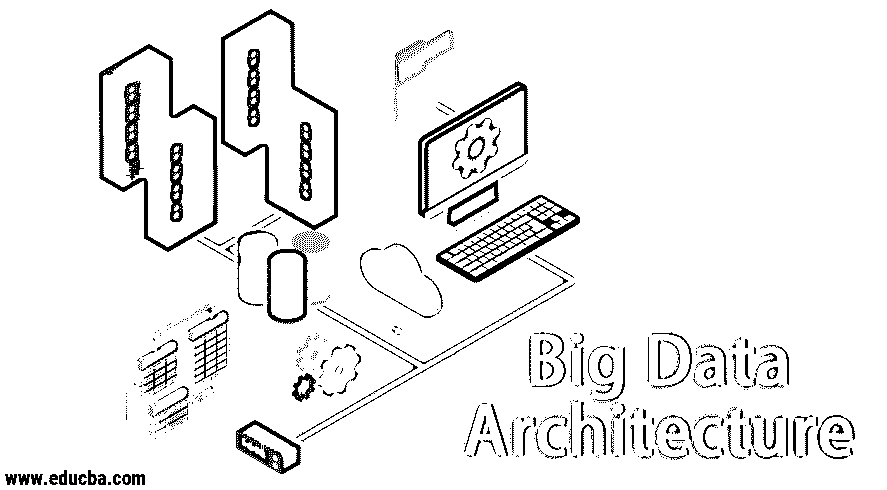
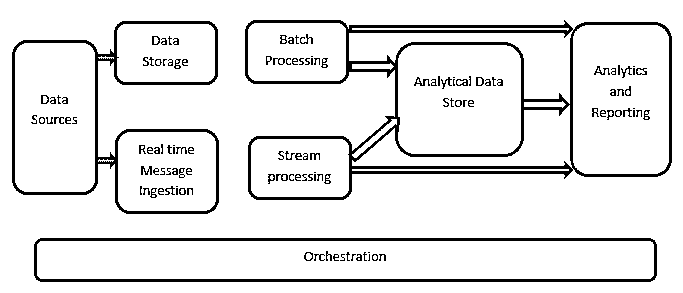

# 大数据架构

> 原文：<https://www.educba.com/big-data-architecture/>

## 大数据架构简介

在管理海量数据和对海量数据进行复杂操作时，需要使用大数据工具和技术。当我们说使用大数据工具和技术时，我们实际上是指我们要求利用大数据生态系统及其领域中的各种软件和程序。没有为每个用例提供的通用解决方案，因此必须根据特定公司的业务需求，以有效的方式精心制作。因此，需要利用不同的大数据架构，因为各种技术的结合将导致最终用例的实现。通过建立一个固定的架构，可以确保为所要求的用例提供一个可行的解决方案。

### 什么是大数据架构？

*   这种体系结构的设计方式使得它能够处理摄取过程、数据处理和数据分析，这对于处理传统的数据库管理系统来说太大或太复杂了。
*   不同的组织对其组织有不同的阈值，一些组织有几百 GB 的阈值，而另一些组织甚至有几 TB 的阈值也不够好。
*   由于这一事件的发生，如果您看一下商品系统和商品存储，就会发现存储的价值和成本已经大大降低。有大量不同的数据需要不同的方法来满足。
*   它们中的一些是在特定时间到来的批处理相关数据，因此需要以类似的方式调度作业，而其他一些属于流类，其中必须构建实时流管道来满足所有要求。大数据架构解决了所有这些挑战。

### 大数据架构解释

<small>Hadoop、数据科学、统计学&其他</small>

大数据系统涉及不止一种工作负载类型，大致分为以下几类:

1.  当基于大数据的数据源处于静止状态时，就会涉及到批处理。
2.  动态大数据处理，实现实时处理。
3.  探索交互式大数据工具和技术。
4.  机器学习和预测分析。

#### 1.数据源

数据源涉及所有那些构建数据提取管道的黄金来源，因此这可以说是大数据管道的起点。

**示例包括:**
(i)应用程序的数据存储，例如类似关系数据库的应用程序

(ii)由多个应用程序生成的文件，主要是静态文件系统的一部分，如基于 web 的服务器文件生成日志。

(iii) [物联网设备](https://www.educba.com/what-is-iot/)和其他基于实时的数据源。

#### 2.数据存储

这包括为批量构建操作而管理的数据，以及存储在文件存储中的数据，这些文件存储实际上是分布式的，并且能够保存大量不同格式的备份大文件。它被称为数据湖。这通常构成了我们的 Hadoop 存储(如 HDFS、微软 Azure、AWS、GCP 存储)与 blob 容器一起提供的部分。

#### 3.成批处理

所有数据被分成不同的类别或块，这些类别或块利用了用于过滤和聚集的长期运行的作业，并且还准备了用于分析的已处理状态的数据。这些作业通常利用源，处理它们并将处理后的文件的输出提供给新文件。批处理以各种方式完成，通过使用 Hive 作业或基于 U-SQL 的作业，或者通过使用 Sqoop 或 Pig 以及通常用 Java 或 Scala 或 Python 等任何其他语言编写的自定义映射缩减器作业。

#### 4.基于实时的消息接收

与批处理相反，这包括所有那些实时流系统，它们满足以固定模式顺序生成数据的需要。这通常是一个简单的数据集市或存储，负责将所有传入的消息放入数据处理所必需的文件夹中。但是，大多数解决方案需要基于消息的接收存储，该存储充当消息缓冲区，还支持基于规模的处理，提供相对可靠的交付以及其他消息队列语义。这些选项包括 Apache Kafka、Apache Flume、Azure 的活动中心等。

#### 5.流处理

实时消息接收和流处理之间略有不同。前者考虑了最初收集的摄取数据，然后将其用作一种发布-订阅类型的工具。另一方面，流处理用于处理发生在窗口或流中的所有流数据，然后将数据写入输出接收器。这包括阿帕奇 Spark，阿帕奇 Flink，Storm 等。

#### 6.基于分析的数据存储

这是用于分析目的的数据存储，因此，已经处理过的数据将被查询，并通过使用与 BI 解决方案相对应的分析工具进行分析。数据也可以在 HBase 等 NoSQL 数据仓库技术的帮助下呈现，或者可以在数据存储中提供元数据抽象的 [hive 数据库](https://www.educba.com/hive-database/)的任何交互使用。工具有 Hive，Spark SQL，Hbase 等。

#### 7.报告和分析

必须根据已处理的数据生成洞察，这可以通过报告和分析工具有效地完成，这些工具利用其嵌入式技术和解决方案来生成对业务有帮助的有用图表、分析和洞察。工具包括 Cognos，Hyperion 等。

#### 8.管弦乐编曲

基于大数据的解决方案包括与数据相关的操作，这些操作本质上是重复的，并且封装在工作流中，这些工作流可以转换源数据，还可以跨源和汇移动数据，加载到存储中并推入分析单元。例子包括 Sqoop、oozie、数据工厂等。

### 结论

在本帖中，我们了解了在公司或组织中实施这些技术所必需的大数据架构。希望你喜欢我们的文章。

### 推荐文章

这是大数据架构的指南。这里我们讨论了什么是大数据？我们还通过框图展示了大数据的体系结构。您也可以浏览我们推荐的其他文章，了解更多信息——

1.  [大数据技术](https://www.educba.com/big-data-technologies/)
2.  [大数据分析](https://www.educba.com/big-data-analytics/)
3.  [大数据职业](https://www.educba.com/careers-in-big-data/)
4.  [大数据面试问题](https://www.educba.com/big-data-interview-questions/)
5.  [大数据编程语言|前五名](https://www.educba.com/big-data-programming-languages/)

