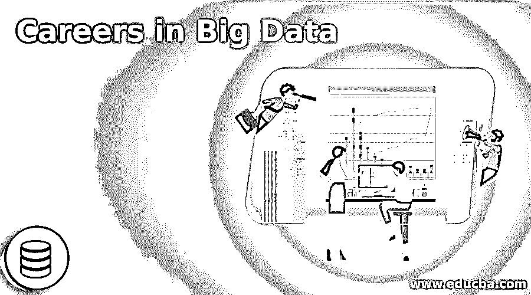

# 大数据职业

> 原文：<https://www.educba.com/careers-in-big-data/>

## 大数据职业概述

大数据是指数据量非常大，性质非常复杂的数据集，因为我们传统的数据存储和数据处理系统不足以满足他们的要求。通过分析客户的需求和反馈，数据在提升业务方面发挥着关键作用，随着客户群的日益增长，数据也在不断增长，公司需要分析数据来为客户提供更好的服务，并在当今快速变化的世界中保持竞争力。如今，各公司都在竞相使用多种工具和技术，最大限度地利用从各种数据源生成的有用数据，这也增加了对专业人员处理、分析、存储和传输数据的需求。电子、零售、保险、金融、公共部门等行业对大数据专业人员的需求呈指数级增长。在本文中，我们将看到大数据选项中的各种可用职业。

### 大数据职业发展教育

**证书:**如果我们谈论课程，那么一个人必须至少拥有计算机相关领域的文凭，让你对计算机体系结构、操作系统、网络等有一个基本的了解。，然后您可以选择由全球不同机构提供的专业在线/离线大数据认证。

<small>Hadoop、数据科学、统计学&其他</small>

**毕业:**如果你是一名毕业生，并且特别希望在大数据领域发展，那么在毕业阶段，你必须选择计算机工程，这将让你对编程语言和算法以及如何和何时使用它们有更深入的理解。要成为一名优秀的大数据专家，必须具备良好的逻辑、分析和解决问题的技能，以应对各种现实世界中与数据相关的挑战

**硕士**:大数据硕士将推进大数据领域的职业发展，增加你的大数据知识，最终获得一份高薪工作。

### 大数据角色中的职业道路

**数据分析师:**数据分析师的作用是利用各种大数据工具对数据进行处理。分析师主要处理结构化、非结构化和半结构化数据，为了处理这些数据，分析师与 hive、pig、NoSQL 数据库等工具以及 Hadoop、spark 等框架进行交互。他们的主要责任是从数据中挖掘出隐藏的潜在信息，以帮助公司做出明智的决策来增加收入。要成为一名数据分析师，你必须有很好的解决问题和算术技能。分析师做的工作是研究过去的趋势，生成模式，制作报告等。

**程序员:**程序员的角色是编写代码，对可用的数据集执行重复的、有条件的动作。为了写出好的高效的代码，一个人应该对各种编程语言有很好的了解，并且拥有良好的分析、数学、逻辑和统计技能。大数据程序员在日常生活中最常用的语言是 Shell 脚本、Java、Python、R 等。程序员编码处理的数据要么存储在平面文件中，要么存储在数据库中，因此程序员还应该对文件系统和数据库有很好的理解。

**管理员:**管理员的角色是负责管理大数据生态系统中的数据和大数据相关工具的基础架构。他们的角色还包括管理所有节点及其网络配置。管理员确保基础架构的高可用性时间，以支持大数据操作。安装各种工具和管理集群的硬件也由管理员负责。作为一名管理员，必须对文件系统、操作系统、计算机硬件和网络有很好的理解。

**解决方案架构师:**大数据解决方案架构师的角色是分析现实世界中的问题，并利用他们的专业知识制定适当的策略来解决问题，并利用大数据框架的力量来实施该策略。解决方案架构师决定使用哪种工具/编程语言来实现解决方案。作为解决方案架构师，您必须具备良好的解决问题的技能，以及对框架和工具、其许可成本以及可用于处理大数据的替代开源工具的深入了解。

### 工作职位或应用领域

几乎每个领域都需要大数据来释放客户驱动型经济的能力。大数据几乎在每个行业都有其深厚的根基，让我们来看几个例子。

**银行业:**银行业是世界上的主要行业之一，在许多方面使用大数据，例如

*   使用大数据银行检测实时未授权交易并阻止它们。
*   在大数据系统中存储数百万客户和商家的信息。
*   通过分析客户过去的支出数据来研究客户的支出模式，并提供客户感兴趣的优惠，这基本上称为营销活动。

### 大数据中的医疗保健

*   它是患者的数据，由各种电子医疗设备生成，如电子健康记录(EHR)、可穿戴传感器等。这有助于医生诊断疾病并提供更好的治疗。
*   它分析患者在各种在线论坛上提供的药物评论，以了解药物的有效性及其副作用。
*   大数据领域的职业，维护与患者相关的数据，如治疗、手术、药物、恢复时间等。如果治疗结果是肯定的，那么给有同样痛苦的病人以同样的治疗。

### 零售业

*   大数据职业通过分析竞争对手制造的市场上已有的类似产品的价格，帮助决定新推出产品的价格。
*   分析数据以收集产品需求、评论和客户反馈的信息，帮助行业改进有缺陷的产品。

了解客户的实时需求，并提供有助于增加业务和节省客户时间的实时建议。大数据行业几乎遍及我们周围的每个行业和服务提供商，如铁路、运输、教育机构、能源、电信、政府等。类似的用例。

### 薪资(美国数据，而非印度具体数据)

全球对大数据专业人员有巨大的需求，这是一个专业人员数量少于需求的行业，这导致它成为高薪工作之一。根据**www.glassdoor.com**，美国各机构提供的薪资如下:

摩根大通——9.3 万美元——10 万美元

认知技术解决方案–9.2 万美元–9.8 万美元

CSAA 保险集团-13.3 万美元-14.4 万美元

zip recruiter——8.1 万美元——8.9 万美元

上述薪资数据是基于这些组织的员工进行分析的。不可否认的事实是，一个人的工资直接取决于学位(学士/硕士)、在该领域的经验、对技术的掌握等因素。此外，除非能够很好地掌握工具和技术来理解和解决现实世界的大数据挑战，否则很难找到一份好的大数据工作。

### 结论

据《福布斯》报道，IBM 预测，到 2020 年，对大数据专业人员的需求将增长 28%。《福布斯》的另一项调查表明，58%的人正在适应大数据分析。大数据行业正处于繁荣期，对专业人士的需求也在快速增长。

*   这是抓住成为大数据浪潮一部分的黄金机会的好时机。
*   大数据分析职业已经成为许多组织的首要项目，并且该职业也不仅仅局限于一种类型的组织，并且独立于行业领域。
*   在目前的情况下，大数据专业人员因拥有合适的技能而获得巨额薪酬。大数据有无限的增长机会和空间。如果一个人喜欢玩数据和数学，那么这可能是成就事业的最佳选择之一。

### 推荐文章

这是大数据领域的职业指南。在这里，我们讨论了大数据中的简介、教育、职业道路，以及大数据中的工资和职业前景。您也可以阅读以下文章，了解更多信息——

1.  [提升你的职业前景](https://www.educba.com/boost-your-career-prospects/)
2.  [在职业生涯中积极主动的有效方法](https://www.educba.com/how-to-be-proactive-in-your-career/)
3.  [做职业规划的 8 个步骤](https://www.educba.com/career-planning-strategies/)
4.  9 个常见的职业误区

