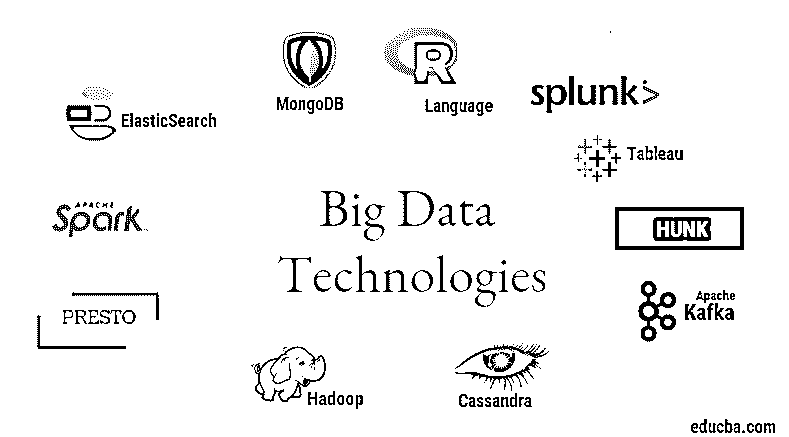

# 大数据技术

> 原文：<https://www.educba.com/big-data-technologies/>

## 大数据技术简介

大数据技术和 Hadoop 听起来像是一个大热门词汇。随着来自每个行业和领域的数据和信息领域的巨大增长，建立和引入一种有效的技术来满足负责数据生成的客户和大行业的所有需求和要求变得非常重要。早期，数据是由普通的编程语言和简单的结构化查询语言处理的，但现在这些系统和工具似乎在大数据的情况下做不了什么。

大数据技术被定义为一种技术和软件工具，旨在从传统系统难以处理的大量极其复杂的结构和大型数据集中分析、处理和提取信息。大数据技术用于处理实时和批量相关数据。机器学习已经成为日常生活和每个行业的一个非常重要的组成部分，因此通过大数据管理数据变得非常重要。

<small>Hadoop、数据科学、统计学&其他</small>

### 大数据技术的类型

在开始列举技术之前，让我们先看看所有这些技术的大致分类。

它们主要可以分为 4 个领域。

1.  数据存储
2.  分析学
3.  数据挖掘技术
4.  形象化

**让我们先来看看存储领域的所有技术。**

**1\. Hadoop**: When it comes to big data, Hadoop is the first technology that comes into play. This is based on map-reduce architecture and helps in the processing of batch-related jobs and process batch information. It was designed to store and process the data in a distributed data processing environment along with commodity hardware and a simple programming execution model. It can be used to store and analyze the data present in various different machines with high storage, speed, and low costs. This forms one of the main core components of big data technology which was developed by the Apache software foundation in the year 2011 and is written in Java.

**2\. MongoDB**: Another very essential and core component of big data technology in terms of storage is the MongoDB NoSQL database. It is a NoSQL database which means that the relational properties and other RDBMS-related properties do not apply to it. It is different from traditional RDBMS databases which make use of structured query language. It makes use of schema documents and the structure of data storage is also different and therefore they are helpful in holding a large amount of data. It is a cross-platform document-oriented design and database program that makes use of JSON like documents along with schema. This becomes a very useful use-case of [operational data stores](https://www.educba.com/operational-data-stores/) in the majority of financial institutions and thereby working to replace the traditional mainframes. MongoDB handles flexibility and also a wide variety of data types at high volumes and among distributed architectures.

**3\. Hunk**: It is useful in accessing data through remote Hadoop clusters by making use of virtual indexes and also makes use of Splunk search processing language which can be used for the analysis of data. The hunk can be used to report and visualize huge amounts of data from the Hadoop and NoSQL databases and sources. It was developed by team Splunk in the year 2013 which was written in Java.

**4\. Cassandra**: Cassandra forms a top choice among the list of [popular NoSQL databases](https://www.educba.com/what-is-nosql-database/) which is a free and an open-source database, which is distributed and has a wide columnar storage and can efficiently handle data on large commodity clusters i.e. it is used to provide high availability along with no single failure point. Among the list of main features includes the ones like distributed nature, scalability, fault-tolerant mechanism, MapReduce support, tunable consistency, query language property, supports multi-data center replication, and eventual consistency.

**接下来让我们谈谈大数据技术的不同领域，即数据挖掘。**

**5\. Presto**: It is a popular open-source and a SQL-based distributed query Engine which is used for running interactive queries against the data sources of every scale and the size ranges from Gigabytes to Petabytes. With its help, we can query data in Cassandra, Hive, proprietary data stores, and relational database storage systems. This is a java based query engine that was developed by the Apache foundation in the year 2013\. A few sets of companies that are making good use of the Presto tool are Netflix, Airbnb, Checkr, Repro, and Facebook.

**6\. ElasticSearch**: This is a very important tool today when it comes to searching. This forms an essential component of the ELK stack i.e. the elastic search, Logstash, and Kibana. ElasticSearch is a Lucene library-based search engine which is similar to Solr and is used to provide a purely distributed, full-text search engine which is multi-tenant capable. It has a list of schema-free JSON documents and an HTTP web interface. It is written in the language JAVA and is developed by Elastic company in the company 2012\. The names of a few companies which make use of elasticsearch are: LinkedIn, StackOverflow, Netflix, Facebook, Google, Accenture, etc.

**现在，让我们了解一下作为数据分析一部分的所有大数据技术:**

**7\. Apache Kafka**: Known for its publish-subscribe or pub-sub as it is popularly known as, is a direct messaging, asynchronous messaging broker system that is used to ingest and perform data processing on real-time streaming data. It also provides a provision of the retention period and the data can be channelized by means of a producer-consumer mechanism. It is one of the most popular streaming platforms which is very similar to the enterprise messaging system or a messaging queue. Kafka has launched many enhancements to date and one major kind is that of Kafka confluent which provides an additional level of properties to Kafka such as Schema registry, Ktables, KSql, etc. It was developed by the Apache Software community in the year of 2011 and is written in Java. The companies which are making use of this technology include Twitter, Spotify, Netflix, Linkedin, Yahoo, etc.

**8\. Splunk**: Splunk is used to capture, correlate and index real-time streaming data from a searchable repository from where it can generate reports, graphs, dashboards, alerts and data visualizations. It is also used for security, compliance and application management and also for web analytics, generating business insights and business analysis. It was developed by Splunk in Python, XML, Ajax.

**9\. Apache Spark**: Now comes the most critical and the most awaited technology in the domain of Big data technologies i.e. Apache Spark. It is possibly among the ones which are topmost in demand today and makes use of Java, Scala or Python for its processing. This is used to process and handle the real-time streaming data by making use of Spark Streaming which uses batching and windowing operations to make that happen. Spark SQL is used to create data frames, datasets on top of RDDs and thereby providing a good flavor of transformations and actions which form an integral component of Apache Spark Core. Other components such as Spark Mllib, R and graphX are also useful in the case of analysis and doing [machine learning and data science](https://www.educba.com/data-science-vs-machine-learning/). The in-memory computing technique is what makes it different from other tools and components and supports a wide variety of applications. It was developed by the Apache Software foundation in Java language primarily.

**10\. R language**: [R is a programming language](https://www.educba.com/r-programming-language/) and a free software environment which is used for statistical computing and also for graphics in one of the most important languages in R. This is one among the most popular language among data scientists, data miners and data practitioners for developing statistical software and majorly in data analytics.

现在让我们讨论与数据可视化相关的技术。

**11\. Tableau:** It is the fastest and powerful growing [data visualization tool](https://www.educba.com/data-visualization-tools/) that is used in the business intelligence domain. Data analysis is a very fast machine that is possible with the help of Tableau and visualizations are created in the form of Worksheets and dashboards. It is developed by the tableau company in the year 2013 and is written in Python, C++, Java and C. Companies which are making use of Tableau are: QlikQ, Oracle Hyperion, Cognos, etc.

**12\. Plotly**: Plotly is mainly used for making Graphs and associated components faster and more efficient. It has a more rich set of libraries and APIs such as MATLAB, Python, R, Arduino, Julia, etc. This can be [used interactively in Jupyter notebook](https://www.educba.com/install-jupyter-notebook/) and Pycharm and can be used to style interactive Graphs. It was first developed in 2012 and written in javascript. The few companies which are using Plotly are paladins, bitbank, etc.

### 推荐文章

这是大数据技术指南。在这里，我们讨论了大数据技术的简介和类型。您也可以浏览我们推荐的其他文章，了解更多信息——

1.  [什么是 Splunk 工具？](https://www.educba.com/what-is-splunk-tool/)
2.  [R vs Python](https://www.educba.com/r-vs-python/)
3.  [什么是 Matlab？](https://www.educba.com/what-is-matlab/)
4.  [什么是 MongoDB？](https://www.educba.com/what-is-mongodb/)

