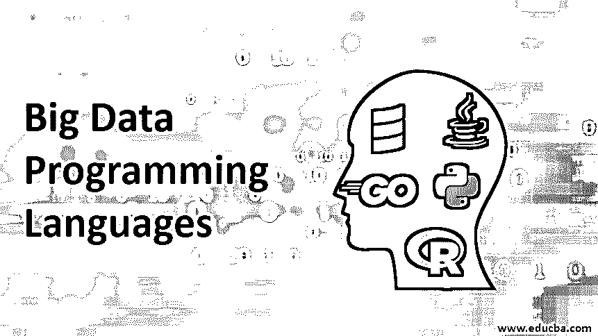

# 大数据编程语言

> 原文：<https://www.educba.com/big-data-programming-languages/>

## 大数据编程语言简介

处理大数据分析和操作的专业人员面临一个重大挑战，即选择用于此目的的编程语言。这些分析师不仅要理解问题和设计架构，而且语言在程序架构的执行和实现中起着非常重要的作用。

### 五大大数据编程语言

让我们看看最流行的编程语言的功能，这些语言已被证明对大数据的分析非常有效，讨论关于数据仓库和必要的数据挖掘工具和结构的利弊，这些工具和结构可以通过这些编程语言提供。

<small>Hadoop、数据科学、统计学&其他</small>

#### 1.斯卡拉

*   Scala 是处理大数据分析的专业人士中非常受欢迎的语言选择，因为它具有快速和强大的功能。这是因为编程语言被设计成服务于函数式编程范例和面向对象编程之间的交叉。
*   scalar 的强大之处可以通过以下事实得到证明:用于处理大数据的两个最流行的框架，即 Apache Spark 和 Apache Kafka，已经被用于 Scala 的主要框架所使用。
*   steel 是首选程序的另一个主要原因是，它工作在基于 Java 的生态系统上，为大数据服务，这增加了它的多功能性和它可以使用的语言范围。
*   相反，它相对来说没有 Java 那么冗长。(例如，你需要用 Scala 编写第 15 课的代码，相当于 Java 的 100 行代码)
*   我们可以观察到 Scala 的一个缺点是它有一个非常陡峭的学习曲线，这使得初学者很难有效地使用它。

#### 2.大蟒

*   Python 已经成为最通用的编程语言之一，可以在非常广泛的范围内使用，也包括大数据编程。
*   各种数据分析库如 SciPy、Numpy 或 Panda 操纵和清理大数据相关的框架都是基于 Python 的。
*   像 TensorFlow 和 Scikit Learn 这样的深度学习/机器学习的流行框架都是在 Python 的基础上制作的。
*   python 最突出的缺点之一就是如果交付水平比当代语言慢。
*   另一方面，python 的最佳特性是可以毫不费力地与 Hadoop 和 spark 等现有大数据框架集成，并且无需太多故障排除即可实现预测分析性能。

#### 3.英语字母表中第十八个字母

*   r 是建立在数据模型基础上的统计学语言，是用于定量准确的数据分析的最有效的语言之一。
*   编程语言附带了一个巨大的 CRAN 包库或全面的 R 档案网络，有助于使用工具库完成处理大数据的任务。
*   与 python 类似，该语言与 Spark 和 Hadoop 无缝集成，具有更好的统计性和准确性。
*   这种语言的主要缺点是它在大数据分析方面的用途不通用，这意味着使用这种语言编写的法庭不能直接用于生产，而是必须翻译成其他编程语言，这使得它成为一项耗时且乏味的任务。

#### 4.Java 语言(一种计算机语言，尤用于创建网站)

*   尽管 Java 是一种古老的编程语言，但它被证明是最传统的用于大数据分析和相关生态系统的执行框架之一，直到今天仍被许多企业使用。
*   使用 Java 的主要好处是它与当代编程语言相比的稳定性和易用性，因为它在产品/服务交付本质上是生产就绪的。
*   这种语言已经过试验和测试，有一个工具和库池，可以用来执行各种操作和监控大数据应用程序，大数据软件开发人员发现 Java 是一种非常容易接近的语言。
*   编程语言的最大缺点是冗长。类似的功能可以在 Python 中使用 15 到 20 行代码完成，相当于 Java 中的 10 行代码。
*   JAVA 8 带来的 Lambda 函数更新在一定程度上降低了速度。

#### 5.走

Go 是用于大数据基础设施和相关功能的编程语言的最新版本，谷歌的一群工程师试图开发一种没有 C++那么麻烦的语言。

*   Go 为 Docker 和 Kubernetes 等一系列大数据基础设施和处理工具提供支持。
*   与内容审查相比，它最容易在应用程序开发中学习归纳，这使它成为崭露头角的大数据开发人员的最佳选择之一。
*   与当代编程语言相比，使用基于 ago 的系统与其他编程语言进行交互相对容易。
*   此外，由于其与 Google 的关联，企业一直在研究利用编程语言来开发数据分析系统。

用于大数据分析并具有自己有用特性的其他主要语言是 MATLAB、Julia 和 SAS，各种开发人员都使用这些语言。

### 结论

大数据分析是一个非常广阔的领域，涵盖多种功能，人们必须了解自己希望用庞大的数据集执行何种任务。如果研究主要是统计性的，程序员必须确定他所从事的研究的核心价值；r 就是答案。但是如果他想使用预测建模，那么 Python 似乎是一个更好的选择。

最重要的事实是要很好地适应正在进行的开发(包括正在设计的新编程语言),并且轻松地使用所有这些语言来充分利用它们的优点。此外，不断的技能升级和提高解决问题的能力以及增强对大数据复杂性的态度是开发人员拥有的最佳工具。

### 推荐文章

这是一本大数据编程语言指南。在这里，我们讨论最流行的编程语言，这些语言已被证明对大数据的分析非常有效。您也可以浏览我们的其他相关文章，了解更多信息——

1.  [什么是大数据](https://www.educba.com/what-is-big-data/)
2.  [大数据分析工具](https://www.educba.com/big-data-analytics-tools/)
3.  [大数据分析软件](https://www.educba.com/big-data-analytics-software/)
4.  [什么是大数据和 Hadoop](https://www.educba.com/what-is-big-data-and-hadoop/)

