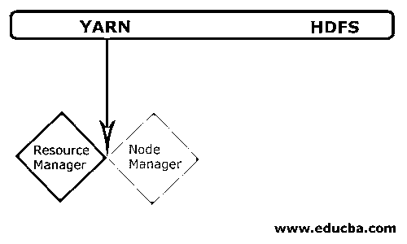
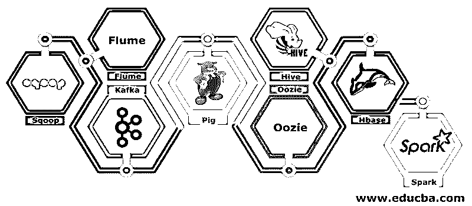

# 什么是大数据和 Hadoop

> 原文：<https://www.educba.com/what-is-big-data-and-hadoop/>

## 大数据和 Hadoop 简介

数据每天都在呈指数级增长，随着这种数据的增长，需要利用这些数据。就像在过去，我们曾经有软驱来存储数据，数据传输也很慢，但现在，这些都是不够的，云存储被用来作为我们有万亿字节的数据。在当今世界，社交媒体对数据增长的贡献最大。它由人的行为、心态和其他几个方面组成。据说每分钟有 300 个小时的视频被上传到 YouTube 上，超过 2000 万张照片被上传到脸书和许多其他地方。此外，上传的数据没有合适的结构，这是处理这些数据的最大挑战。

随着大量数据的高速生成，传统的 RDBMS 系统无法应对如此快速的增长。此外，它们也不能处理非结构化数据。处理如此大量快速增长的异构数据并以高处理速度处理这些数据变得非常困难。因此，需要一种能够有效处理大型数据集的系统。因此，为了解决这个问题，Hadoop 应运而生。HDFS 是 Hadoop 的一个组件，它通过使用分布式存储来解决大型数据集的存储问题，而 YARN 是解决处理问题的一个组件，它极大地缩短了处理时间。

<small>Hadoop、数据科学、统计学&其他</small>

Hadoop 是一个开源软件框架，使用分布式大型商用硬件集群来存储和处理大数据集。它是由 Doug Cutting 和 Michael J. Cafarella 开发的，由 Apache 授权。它是用 Java 编写的，是基于 Google 在 MapReduce 系统上写的论文开发的，它应用了函数式编程的概念。它可靠、经济、灵活且可扩展。

### Hadoop 的核心组件

核心组件如下

#### HDFS

HDFS 或 Hadoop 分布式文件系统有命名节点和数据节点。Namenode 是运行主守护进程的主节点，它管理数据节点并跟踪所有操作。Datanodes 是实际存储数据的从属节点。

#### 故事

纱线由两种主要成分组成:

**1。ResourceManager:** 它运行在主节点上，管理所有资源，调度所有应用。它有调度程序&应用程序管理器。

**2。NodeManager:** 它运行在每个从节点上，负责管理容器和监控资源利用率。

### Hadoop 的几个组件

有几个组件，像猪，蜂巢，sqoop，水槽，看象人，oozie，动物园管理员，HBase 等。

*   **Sqoop–**它用于从 RDBMS 向 Hadoop 导入和导出数据，反之亦然。
*   **Flume****–**用于将实时数据拉入 Hadoop。
*   **Kafka—**这是一个用于路由实时数据的消息系统。
*   **猪****–**它被用作数据处理的脚本语言。
*   **Hive****–**它是一个建立在 HDFS 上的数据仓库框架，这样熟悉 SQL 的用户可以执行查询来获取数据。这些查询被称为 HiveQL。
*   **oo zie****–**它用于安排工作流在指定的事件或时间运行。
*   **h base****–**它是作为 Apache Hadoop 的一部分提供的 no SQL 数据库。
*   **Spark—**用于执行内存中处理，比 Hadoop map-reduce 快很多。

### Hadoop 提供商

有很多公司提供 Hadoop 发行版。

以下是几个最好的供应商:

1.  Cloudera
2.  霍顿工厂
3.  MapR

学习 Hadoop 有几个先决条件。Java 和脚本语言的经验是必要的。尽管它已经拥有自己的高级编程语言，如 pig 和 hive，可以生成后端代码以供进一步处理，但它仍然可以用任何编程语言创建自己的 map-reduce 程序，如 Ruby、Python、Perl，甚至 C 编程。

大数据和 Hadoop 在今天的市场上需求量很大。这将在未来几天增加更多。许多组织已经迁移到 Hadoop，那些尚未迁移的组织也将很快迁移。最近有一份报告指出，大公司已经开始投资大数据分析。大数据营销预测始终处于上升趋势，完全不是昙花一现的状态。除此之外，与其他技术相比，Hadoop 和大数据领域的工作报酬总是很高。

### 顶级大数据和 Hadoop 公司

以下是雇佣人数最多的几家顶级公司:

*   商务化人际关系网
*   美国 Yahoo 公司(提供互联网的信息检索服务)
*   亚马孙
*   苏格兰皇家银行
*   英国航空
*   Expedia
*   沃尔玛

有很多公司在使用大数据应用程序。这些是:

#### 诺基亚（总部设在芬兰）

它为应用程序使用 Cloudera 和 [Hadoop 组件](https://www.educba.com/hadoop-components/)，如 HDFS、HBase、Sqoop、Scribe。它有效地利用用户数据来理解和改善用户体验。它使用数据处理和复杂分析来构建具有预测交通和分层高程模型的地图。

#### 斯堪的纳维亚航空公司

它与 Hadoop 合作，通过提供一个提供视觉和交互体验的环境来帮助数据科学家获得更好的洞察力，从而帮助探索新的趋势。分析程序从数据中提取有意义的见解，内存技术有助于更快地访问数据。

还有许多其他公司使用大数据平台进行各种分析。这些是航空业黑匣子的飞行数据分析，股票市场的不同分析，等等。

### Hadoop 的优势

以下是 Hadoop 的一些优势:

*   **可扩展–**与传统的 RDBMS 不同，它是一个高度可扩展的平台，因为它可以在并行运行的商用硬件上的分布式集群中存储大型数据集。
*   **经济高效–**RDBMS 存储数据的成本太高，这在 Hadoop 中得到了缓解。
*   **快速灵活**–它提供了通过分布式文件系统快速访问数据的能力。它还提供从半结构化和非结构化数据中获取业务洞察力。
*   **容错**–无论何时任何数据被发送到一个节点，相同的数据被复制到其他节点，这些节点可以在第一个节点出现任何故障时被访问。

### 结论–什么是大数据和 Hadoop

数据在持续增长，因此总会有对大数据和 Hadoop 的需求，以便从这些数据中挖掘出意义。出于这个原因，拥有 Hadoop 技能的专业人士在未来的日子里总是会找到大量的机会，并且可以成为促进业务和职业发展的组织的重要资产。

### 推荐文章

这是关于什么是大数据和 Hadoop 的指南。在这里，我们讨论了大数据和 Hadoop 的基本概念和组件。您也可以阅读以下文章，了解更多信息——

1.  [大数据分析示例](https://www.educba.com/big-data-analytics-examples/)
2.  [Hadoop 的用途](https://www.educba.com/uses-of-hadoop/)
3.  [数据可视化指南](https://www.educba.com/what-is-data-visualization/)
4.  [什么是大数据分析？](https://www.educba.com/what-is-big-data-analytics/)

