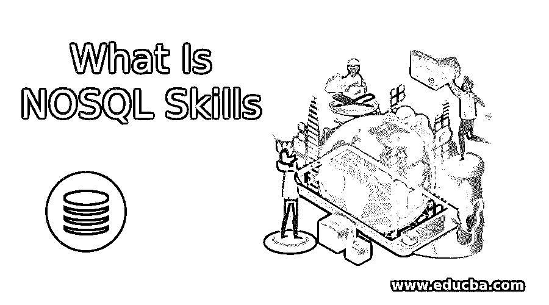

# 什么是 NOSQL 技能？

> 原文：<https://www.educba.com/what-is-nosql/>

## 什么是 NoSQL 技能？

**什么是 NoSQL 技能—**数据无处不在，几乎影响着生活的方方面面。零售商知道什么产品在卖，谁在买。民意测验问题测试人们对各种事物的看法，从消费品到对政党的看法。大数据已经彻底改变了医疗保健行业，因为它可以帮助医生跟踪患者的生活细节，同时发明新的药物。今天，社交媒体正在跟踪全球许多消费者的意见，而传感器能够跟踪天气的微小变化。这意味着，如果可以收集任何主题的数据，就已经在做了。因为数据几乎影响着生活的每一个领域，这个领域的职业选择非常有利可图，非常受欢迎。

### 在大数据行业生存需要哪些重要的 NoSQL 技能？

大数据分析几乎涵盖了经济的所有领域，现在正是抓住机会利用大数据分析推进公司目标的时候。全球主要的咨询和研究公司正在意识到大数据分析可以推动公司的未来，这就是为什么有团队被指定以全面的方式从事该行业的工作。然而，精通大数据分析、能够帮助企业理解海量数据并从中产生有意义的见解的人才严重短缺。因此，获得关于大数据分析的观点对于专业人员来说极其重要，以下是个人可以更好地做好准备的一些方法。

<small>Hadoop、数据科学、统计学&其他</small>

1.  **如果你想进入大数据分析领域，以适当的方式学习交易的工具是很重要的:**一些涉及数据分析的工具包括 SQL、R、SPSS 和 SAS。从你能接触到的工具开始。有时，使用多种工具是很好的，这样您可以更好地理解数据分析。学习不仅仅需要了解所有复杂的细节，而且至少要形成关于工具基本功能的基本知识。从那里，你可以继续前进，并获得一个工具的熟练程度。最好先掌握一种工具，然后再学习其他工具，因为这将有助于您以更好的方式执行任务。

 

2.  **了解数据分析工具的诀窍:**如果你想了解交易的诀窍，了解工具是非常重要的。在这种情况下，可能有两种可能的选择。首先是通过另一个有经验的人的经验和知识来学习。第二种方法是通过市场上的专业课程。虽然自助教程可能无法帮助个人获得深入的数据分析知识，但了解模型是必不可少的。这是因为 SAS 中正在运行的 proc 或 SPSS 中的模型的输出往往会处理大量的统计数据。知道哪些统计数据要查，哪些要忽略是至关重要的，只有优秀的、经验丰富的分析专家才能有效地做出选择。

今天的大数据包含了许多流行词汇、首字母缩写词和术语。在这些术语中，有一个非常引人注目，那就是 NoSQL。这一点尤其正确，因为如今品牌正试图定期处理大量数据。越来越多的公司试图快速采用大数据，以便在竞争中领先。现在，各公司都在努力以如此快的速度采用大数据，因此需要全面了解这些技术的部署。其中一项技术是 NoSQL，对于希望进入大数据领域并在该领域就业的专业人士来说，这是必不可少的。由于这是一个利润丰厚的行业，了解管理它的技术的最重要方面对于脱颖而出非常重要。简而言之，如果有一件事可以帮助你在技能方面取得进步，那就是正确理解 NoSQL 技能，这是整个大数据行业的基础。

### 什么是 NoSQL 技能和 NoSQL 数据库类型它们在大数据中的重要性？

什么是 NoSQL 数据库是目前品牌可以大量管理数据和数据库的主要方式之一？这就是为什么 NoSQL 正获得越来越多的关注，因为它可以有效地处理大量的数据。凭借广泛而全面的架构和技术，NoSQL 可以帮助品牌解决与大数据相关的性能和可扩展性问题。关系数据库无法以有效的方式解决这些问题，因为如今的品牌拥有大量非结构化的原始数据，这些数据存储在云中的多个服务器上。由于这些数据规模庞大，他们需要能够以有效的方式处理这些海量数据的技术。到目前为止，到底什么是 NoSQL 有一个具体的定义，但有一些特征可以有效地定义它。这些包括 NoSQL 技能不得使用关系模型，在集群上运行良好，是开源的，为 21 世纪的网络资产而构建，并且必须是无模式的。

其中一个重要的部分是四种类型的数据库。哪些 NoSQL 数据库是简单的数据存储，为客户提供 API 的视角？在这个数据库中，客户端可以输入键值，获取键值，甚至从数据存储中删除整个键值。NoSQL 数据库的关键值提供主键访问，从而使品牌表现更好，并确保更好的可扩展性。一些流行的键值 NoSQL 数据库包括 Memcached、Riak、Redis 和 Couchbase。第二个被称为文档数据库，这是一个令人惊讶的方式，品牌可以用一种简单而容易的方式存储和操作文档。公司的文档可以以多种格式存储，如 XML、BSON、JSON，也可以从数据库中检索。这些文档中的大多数彼此非常相似。使用分层数据结构，这些文档是自描述的，由标量值、集合和映射组成。

市场上流行的一些 NoSQL 数据库包括 RavenDB、OrientDB、CouchDB、MongoDB 等。什么是 NoSQL 数据库被称为列家庭商店，其中有许多行与行键相关联的列？该系统允许品牌创建彼此相关的数据集，因此也可以一起访问。一些最流行的列族数据库是 Cassandra，其次是 HBase、Hypertable 和 Amazon DynamoDB 等。第四类 NoSQL 数据库类型数据库是图形数据库，其允许实体或节点的存储，并且还允许相同实体之间的关系。一些最流行的图形数据库形式包括 Noe4J、Infinite graph 和 OrientDB 等。

### 如何选择合适的 NoSQL 格式？

如上所述，有四种不同的 NoSQL 格式，选择正确的格式似乎是一件棘手的事情。如果品牌想要投资上述四种形式中的一种，可以考虑一些指导原则。键值数据库在下面的场景中非常有用。键值数据库是存储用户配置文件、会话信息、购物车信息和消费者偏好等在线细节的理想选择。如果品牌需要处理与数据相关的查询，并找到相关数据之间的关系，最好不要管这个系统。文档数据库非常适合公司需要管理内容管理系统、web 分析、博客平台、电子商务平台和实时分析的情况。

如果品牌需要处理包含多个查询的复杂 NOSQL 事务的数据，这个系统就没什么用了。另一方面，column family 数据库非常适合希望监控其博客平台、需要内容管理系统、维护计数器以及其他功能的公司。在新构建的、需要改变数据查询模式的情况下，最好避免使用这种系统。最后，图形数据库非常适合与空间数据、社交网络、金钱路由信息和推荐搜索引擎相关功能等数据相关的问题空间。

#### 什么是 NoSQL 数据库的知识在当前非常重要。

因此，什么是 NoSQL 数据库是大数据最重要的方面之一，这方面的知识有助于专业人士将职业生涯提升到一个新的水平。这是任何数据分析师技能组合中最重要的组成部分之一。它们之所以重要的一些原因包括:a .关于这些技能的知识将有助于提高数据分析师的生产力，因为他们将拥有满足应用程序需求所需的技能 b .什么是 NOSQL 数据库可以提高数据的性能，因为它可以有效地组合大型数据集，同时减少延迟并提高整体输出 c. NoSQL 专家在当今市场上需求量很大，因为公司迫切需要他们。这种高需求正确地反映在这些个人的工资上，在所有类别和公司中，这是最高和最有利可图的。如今，成为 NoSQL 专家是信息技术领域最抢手的工作之一，这一点正日益成为现实。

 

另一项正在席卷大数据行业的技术是 Hadoop。可以很容易地说，大数据具有极其有利可图和受分析师欢迎的两个方面。如果其中一个是 Hadoop，另一个是什么是 NOSQL，毫无疑问。如今，世界上有如此多的可用数据，各个公司都非常需要能够以胜任的方式管理 NoSQL 技能以及文档和文件的专业人士。这就是为什么这些专业人士需要熟练地以快速有效的方式处理这些任务，而不增加他们品牌运作的任何额外压力。

根据 Payscale 的数据，在 NoSQL，一名专业技术人员的工资接近 10 万美元，而且很有可能在未来还会增加。在所有为 NoSQL 专家提供机会的行业中，医疗保健行业为他们的专业人员支付的薪酬是最好的。其次是软件开发业和信息技术服务业，以及 IT 咨询业。

### 什么是需要 NoSQL 数据库类型技能的主要职业？

许多行业需要擅长以熟练的方式处理数据的专业人员。几乎没有任何领域不需要对什么是 NoSQL 及其相关领域有深入了解的人。需要它们的一些领域包括:

*   **数据库管理员:**数据库管理员是一个高素质的个人，其主要任务是使用专门的、技术性很强的软件来全面地存储和组织数据。他们的职责包括容量规划、安装、配置、迁移、性能监控、备份和数据恢复。一个好的数据库管理员应该能够使用许多数据库平台，包括 Oracle、MongoDB 和 Cassandra 等等。不言而喻，经验越多，享受的工资就越多！
*   数据架构师:数据架构师是另一个工作机会，等待着对 NoSQL 数据库类型技术有深入了解的人。他们的职责包括创建数据模型、分析数据、数据仓库和数据迁移。
*   软件/应用程序开发员:软件/应用程序开发员是一份非常引人注目的工作，在业内非常抢手。这些专业人士一方面负责创建游戏和文字处理程序等应用程序，另一方面也喜欢大量的自由职业工作。对于这份工作来说，编程技能真的很重要。
*   **数据科学家:**另一份在大数据行业相当受欢迎的工作，数据科学家需要具备广泛的数据驱动技能。数据科学采用来自许多领域的技术和理论，包括统计学、数学、模式识别、数据挖掘等。根据《哈佛商业评论》和《福布斯》,数据科学家的工作是“21 世纪最性感的工作”,这意味着他们的需求在未来也会继续增长。

总之，投资 NoSQL 技能是专业人士在大数据行业推进职业发展的最佳方式之一。这个领域拥有大量令人羡慕的机会，必将在全球企业和品牌的运作中扮演重要角色。

### 推荐文章

这是什么是 NOSQL 技能的指南？.在这里，我们讨论了基本概念、如何选择正确的格式、在大数据行业生存所需的技能。您可以阅读以下文章了解更多信息——

1.  [节点 JS vs Java](https://www.educba.com/java-vs-node-js/)
2.  [大数据面试问题](https://www.educba.com/big-data-interview-questions/)
3.  [大数据职业](https://www.educba.com/careers-in-big-data/)
4.  [大数据 vs 数据科学](https://www.educba.com/big-data-vs-data-science/)

