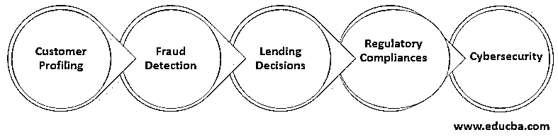

# 银行业的大数据

> 原文：<https://www.educba.com/big-data-in-banking/>

## 银行业大数据简介

银行业是保持经济、国家和组织运转的燃料。它每秒钟还会生成天文数字的数据。每笔交易都会留下痕迹，并产生被认为是静态的数据，这些数据只对审计员进行会计和审计有用。然而，随着[大数据技术在医疗保健等其他](https://www.educba.com/big-data-technologies/)领域的出现，开始显示其真正的潜力，我们开始在这些系统中使用这些“无价值”和“陈旧”的数据，并开始真正看到可以用于许多目的的财务洞察力的潜力。因此，银行业的大数据具有未开发的潜力，我们将尝试找出其工作方式的影响和优势以及可以探索的可能性。

2008 年，由于美国次贷危机，世界经济陷入混乱，这也证明了两件事。

<small>Hadoop、数据科学、统计学&其他</small>

*   世界是如何联系在一起的，一场始于一个国家的危机如何能够迅速对世界所有主要经济体产生负面影响，并摧毁世界银行和金融市场。
*   我们多么迫切地需要一种技术来帮助我们识别不良/次级贷款、银行在贷款方面立场的结构性转变、客户特征分析等等。

大数据和商业智能技术有助于这一努力，并促使银行和金融机构在 2008 年挑战现状，并开始在银行业出现大数据。银行在其所有流程中使用大数据和 BI 技术，如 Hadoop 和[RDBMS](https://www.educba.com/what-is-rdbms/)，彻底改变了银行业的面貌。从数字化所有银行流程到将发展中经济体从现金密集型交易转变为数字交易，大数据已经帮助塑造了世界各地的组织和机构。

### 大数据在银行业的应用

银行业使用大数据的一些领域:

#### 1.客户特征分析

大数据有助于银行机构分析客户，使他们能够根据个人客户在银行的银行历史和交易模式来满足个人客户的需求。这使他们能够为客户定制计划和解决方案。这极大地推动了客户体验，有助于银行脱颖而出，留住客户。银行还可以根据不同客户的资料向他们推荐不同的产品。

#### 2.欺诈检测

通过分析数据，在统计计算的帮助下，银行甚至可以在欺诈发生之前就发现它。利用独特的欺诈检测算法来跟踪和计算支出和其他行为模式，人们可以识别和判断一个人是否处于财务破产的边缘，并可能被引诱去欺诈银行机构。各种银行机构，如零售银行、投资银行、NBFCs、私募股权公司和其他机构，都有专门的[风险管理部门](https://www.educba.com/risk-management-process/)，该部门严重依赖大数据和商业智能工具。

#### 3.贷款决策

银行业最关键的决策之一是放贷。选择一个信誉良好、财务状况良好的客户来偿还债务是至关重要的。此外，传统上，银行过去依赖信用评级机构来评估客户的信誉，这不能说明全部情况，因为它只考虑某个理由，而忽略了其他理由。

通过获得大数据分析的新见解，银行可以考虑其他因素，如消费习惯、交易性质和数量等，以决定是否向客户贷款。这拓宽了银行家和金融机构的视野，使他们能够掌握更多的数据和知识，并根据客户的风险状况做出适当的决策。

#### 4.法规合规性

借助大数据分析和 BI 工具，保存记录和遵守法规变得极其有效和高效。从各种税收到与中央银行保持记录，他们可以有效地管理和跟踪所有这些监管程序。

使用传统系统时，要确保合规性到位并得到相应的处理非常费力，但是使用 BI 工具时，这变得非常容易，因为所有信息都以一种前所未有的方式简明地放在一起，使决策者更容易合规。此外，当被正确编程时，它们本身可以管理这种遵从性，从而减少人为干预的错误、欺诈的风险。

#### 5.网络安全

网络攻击和在线金融欺诈、盗用极其普遍，即使是世界上最好的组织也面临这个问题。我们已经看到许多大型组织，尤其是银行机构受到这样的网络攻击，不仅是钱，还有客户的其他信息被盗。

在大数据和人工智能工具的帮助下，银行可以建立强大的内部控制系统，因为有时这些活动可以由组织内部的人执行，通过先进的算法，他们可以跟踪客户行为。此外，在需要时，在出现金融恐怖主义时，他们可以与政府机构积极合作，分享从 BI 工具和大数据分析中获得的见解，以应对此类风险。

银行业的大数据已经并将在未来几年发挥巨大作用，让我们的银行系统变得更加稳健和强大，这样的例子不胜枚举。2008 年银行业危机后，世界上大多数大型银行机构都是从数据科学团队开始的，但往往外包出去，因为他们不知道大数据的真正潜力以及它如何帮助他们。然而，所有主要机构现在都有自己的内部团队，他们使用大数据分析和 BI 工具不断开发和实施新流程。

### 推荐文章

这是银行业大数据指南。在这里，我们将讨论银行业大数据的介绍，以及大数据在银行业的使用，包括客户特征分析、欺诈检测等。您也可以阅读以下文章，了解更多信息——

1.  数据挖掘如何让工作变得如此简单？
2.  [不同的数据挖掘方法](https://www.educba.com/data-mining-methods/)
3.  [大数据分析的关键特征](https://www.educba.com/big-data-analytics-examples/)
4.  [甲骨文数据库架构](https://www.educba.com/what-is-oracle-database/)

